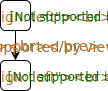
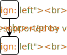
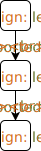
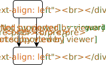
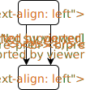

# 3BB4 Concurrency

## Table of Contents
- [Basic Statements](#basic-statements)
- [Basic Statements](#basic-statements)

## Sequential Programming

### Basic Statements

we use __algorithmic notation__ compared to programming languages because:
* __simplier__: abstracts from the specifics of languages
* __expressive__: features not commonly in other languages will be introduced.

Programs consist of 
* _variables_ to hold value
* _expressions_, when evaluated, have a result,
* _statements_, when executed, have an effect on variables

The basic statements are _assignment_, _sequential composition_, _conditional_, and _repetition_. We introduce them in texual form and visualize with _state diagrams_.

#### Assignment

evaluates an expression and assigns the output to a variable.

* `x` is a variable
* `E` is an expression

` x := E `
&emsp;&emsp;

**_multiple assignments_**: two or more variables are modified

* `x` and `y` are distinct variables
* `E` and `F` are distinct expressions

` x, y := E, F `
&emsp;&emsp;

#### Statement

* `S` and `T` are statements

__Sequentional composition__ `S` is executed first then `T`:

* `S` and `T` are statements

` S ; T `
&emsp;&emsp;

__conditional statement__ evaluates a Boolean expression and executes depending on the result.

* `S` and `T` are statements
* `B` is a Boolean expression

` if B then S else T `
&emsp;&emsp;

` if B then S `
&emsp;&emsp;

