# 3DB3 Databases

## Introduction

### Database
A collection of data organized to be easily accessible, managed and updated.

### Database Management System
- software that helps in processing and organizing data
- advantage: data independence, efficient data access, data integrity, security

### Data Model
- collection of concepts that provide abstraction
- entities model classes of concrete or abstract objects of interest
- semantic data models include ER model
- relational model
    - relation represents interdependencies
    - schema is a description: student(sid: string)
    - has integrity constraints to be satisfied

### 3 Levels of Abstraction
- conceptual/global view - DDL
- physical/internal view - storage
- external/user view

### Data Independence
- logical DI - change conceptual model without affecting external
- physical DI - change physical model without affecting conceptual/external

-------------------------

## ER Model

### Entity

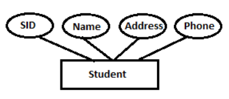

### Keys
- key: _minimal set of attributes whose values uniquely define entity in set_
- candidate key: _possible primary primary keys, is a key_
- primary key
- super key: _not minimal but still uniquely identiying, all keys are superkeys as well_
- foreign key: _when primary key in a table appears in another table as non-primary_
partial key: _when attribute discriminates between entities in set, eg weak entity 'Child' of 'Employee' will have partial key of 'empid'

### Relationship
- N-ary, involving N entities
- formally defined {(e<sub>1</sub> ...e<sub>n</sub> |e<sub>1</sub> ∈ E<sub>1</sub> ... e<sub>n</sub> ∈ E<sub>n</sub>)}
- have desriptive attributes
- instance of relationship is a snapshot @ some instant in time

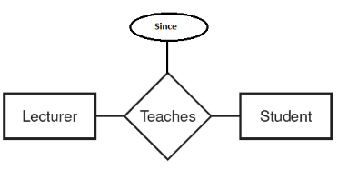

#### Types of Relationships
- one to one (at most 1)
    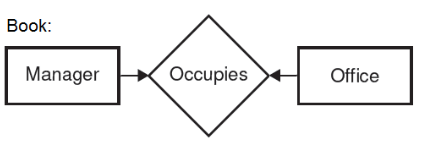
- one to many (0, 1 or more)
    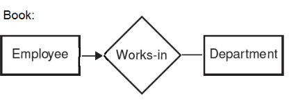
- many to many (no restriction)
    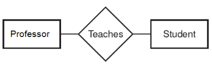
- cyclic
    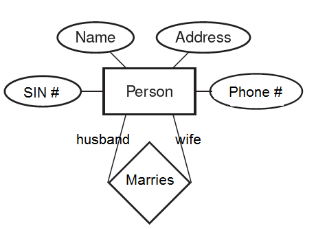

#### Participation Constraints
- mandatory one to many, eg employee has to work in a dept
- basically bold the line for whatever entity must participate
    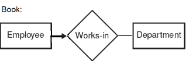

### Weak Entity Set
- no primary key and needs an identifying/owner entity
- must have partial key for identifying among entities
- double diamond, double rectangle
- many-to-one relationship is common (each wek entity needs to have a parent - total participation)
- key = its own underlined attribute + keys from parents
    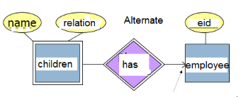

### Subclasses
- entity sets sharing common properties
- ISA - inherit attributes
    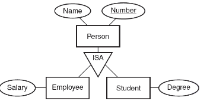

### Aggregation
- dashed box around collection of entities and relationships

### Design with ER Model
- avoid redundancy
- entity vs attribute vs relation
    - minimize number of entities
    - entity set if more than 1 attribute or if many to 1 or many to many relation
- binary vs ternary relation
- don't overuse weak entities!

--------------------------

## Relational Model

- relation schema: name + attributes
- relation: set of tuples conforming to schema
- DB: set of relations with names
- DB schema: set of schemas for all relations - can be in SQL, DDL, DML

### Syntax
```
CREATE TABLE <name> (
    SID CHAR(8),
    Age Integer,
    GPA REAL
);

DROP TABLE <name>;
```
- Types
    - FLOAT
    - REAL
    - VARCHAR(n): variable length
    - DATE (yymmdd)
    - TIME (hh:mm:ss)
- Values
    - strings require single quotes
    - any value can be NULL unless you say NOT NULL for attribute

#### Insert/Delete Tuples

```
INSERT INTO <table> (a1, a2, a3)
VALUES (x, y, z);

DELETE FROM <table> T
WHERE T.attribute = x;

UPDATE <table> T
SET T.attribute = x
WHERE T.id = 123;
```

### Integrity Constraints
- intra-relational means domain/tuple
    - domain constraints
        - every value in tuple must be from domain of its attribute or it could be null
    - tuple uniqueness
- inter-relational (referential) integrity
- key constraints
    - K is a candidate key if K is a minimal superkey
    - primary key: one of the candidate keys chosen by db designer
    - attributes part of primary key can't be NULL

#### Key Contraints in SQL
```
CREATE TABLE Students (
    SID CHAR(8),
    Name CHAR(30),
    Age INTEGER,
    GPA REAL,
    UNIQUE (Name, Age),
    CONSTRAINT StudentKey PRIMARY KEY (SID)
);
```

- foreign key constraints
    - requires that values set X of attributes of a relation R1 must appear as values for the primary key of relation R2
    - no dangling references (to satisfy total participation) therefore we cascade/delete on update

#### Foreign Key Constraints in SQL
```
CREATE TABLE Enrolled (
    sid CHAR(20),
    cid CHAR(20),
    PRIMARY KEY (sid, cid),
    FOREIGN KEY (sid) REFERENCES Students)
);
```
- Enforcing referential integrity
    - 4 options on DELETE (or UPDATE) of Student
        1. delete (or update) all 'Enrolled' tuples that refer to it
        2. Disallow deletion/updating of a Students tuple that is referred to
        3. Set sid in Enrolled tuples that refer to it as a default SID
        4. Set sid in Enrolled as NULL for those tuples

    ```
    CREATE TABLE <table> (
        ....
        FOREIGN KEY (sid) REFERENCES Students
        ON DELETE CASCADE
        ON UPDATE NO ACTION
    );
    ```

### Attribute Rules
- Composite attributes are not supported by relational model (attribute that has multiple attributes coming out of it)
- Multivalued attributes not supported in relational model

### Relationships

#### Without Constraints (many-many)
```
CREATE TABLE Takes (
    mn CHAR(8),
    code CHAR(20),
    mark INTEGER,
    PRIMARY KEY (mn, code),
    FOREIGN KEY (mn) REFERENCES Students,
    FOREIGN KEY (code) REFERENCES Courses
);
```

#### Cyclic Relationships
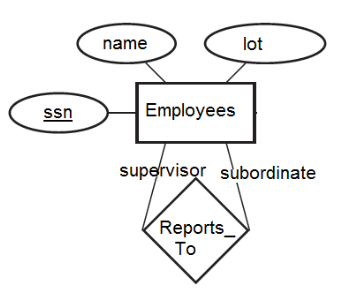
```
CREATE TABLE Reports_To (
    supervisor_ssn CHAR(11),
    subordinate_ssn CHAR(11),
    PRIMARY KEY (supervior_ssn, subordinate_ssn),
    FOREIGN KEY (supervisor_ssn) REFERENCES Employees(ssn),
    FOREIGN KEY (subordinate_ssn) REFERENCES Employees(ssn)
);
```

- if one to one mapping then primaary key can consist of either entity, needs foreign key from each entity
- if many to one, primary key of the **'many'** side

#### Foreign keys

Method 1 
- relationship can be merged with the entity on the 'many' side in 1-1 or many-1

Method 2 

```
CREATE Table Students (
    mn CHAR(8)
    ...
    dos_id CHAR(8),
    PRIMARY KEY(mn),
    FOREIGN KEY (dos_id) REFERENCES DoS
);
```

### Participation Constraints
- satisfied by NOT NULL declaration


### Views
- Don't show all the data! :excited:
- levels of abstraction
```
view 1  view 2  view 3
  |      |       |
  conceptual schema
        |
  physical schema
```

#### Creating Views
```
CREATE VIEW B - Students (sid, course)
AS SELECT S.sid, C.cid
FROM Students S, Enrolled E,
WHERE S.id = E.sid
```

## Relational Algebra
- SQL engine takes SQL query and uses relational algebra which is an optimized plan that gets executed
- procedural computation
- relational calculus is declarative

### Sets
- unique
- Union: {1,2,3} and {2,3,4} = {1,2,3,4}
- Intersection: {1,2,3} and {2,4} = {2}
- Disjoint: no commonality
- Union, intersection, difference all require same attribute mapping

### Renaming
- ρ(R, E): rename relation E as R
- ρ(R(A1..An), E): rename relation E as R and rename attributes
- ρ(A1 --> B1, E): Just rename an attribute

### Selection
- σ<sub>c</sub>(R)
- returns a selection (relation) that satisfies a condition
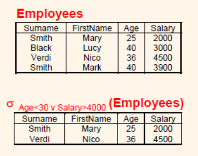

### Projection
- π<sub>y</sub>(R)
- y is the attributes you wish to return
- returns relation that is a subset of original attributes
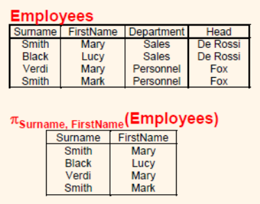

#### Extended Projection
- can do arithmetic on attributes
- π<sub>A+B->C</sub>(R)

### Cartesian Product
```R3 := R1 x R2```

### Join
- connections between sets

#### Theta Join
- joins on condition
- 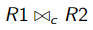
- take product and apply condition

#### Natural Join
- joins relations by equating attribute of same name
- denoted without the <sub>c</sub> from theta join

#### Outerjoin
- preserves dangling tuples by padding them with NULL so they don't go away

### Prcedence of operators
- [σ,π,ρ]
- [x, join]
- [∩]
- [∪, -]

_Can use expression trees to make things easier_
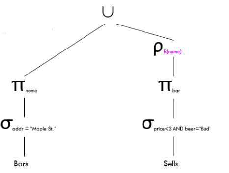

### Extended Algebra
- δ: eliminate duplicates
    - ```R1 := δ(R2)```
- τ: sorts tuples
    - R1 := τ<sub>L</sub>(R2)
- γ: grouping and aggregation
    - sum, avg, count, min, max
--------------------
## SQL

Structured Query Language

- basic syntax
```
SELECT [DISTINCT] <select list>
FROM <one or more relations>
WHERE <conditions>
```

- select * is for everything in R

### Renaming
- ```SELECT x AS y```
- ```SELECT x FROM table T```

### Operators
- boolean AND, OR, NOT
- comparison =, <, >, <=, >=

### Patterns
- containing certain string
- % is any string, zero or more char
- _ is any one character beside
    - '_AB%' can be string with at least 3 characters with second and third AB
```
SELECT *
FROM Products
WHERE Pname LIKE '%gizmo%'
```

### NULL
- anything being operated on by with NULL becomes NULL

### Join in SQL
- can do manually as WHERE statement conditions
- another option
```
SELECT Name
FROM Student
JOIN Course ON s_cid = s_cid
WHERE ...
```

### Self-join
```
SELECT a.company_name, b.company_name, a.company_city
FROM company a, company b
WHERE a.company_city=b.company_city;
```

### Subqueries
- nested queries
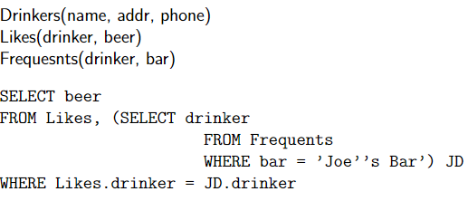

### More operators

#### ALL
- compare all values in nested query
```
SELECT name
FROM Product
WHERE price > ALL ( 
    SELECT price
    FROM Product
    WHERE maker = Gizmoworks)
```

**Note <> means not equal to**

#### EXISTS
- find copycat products
```
SELECT p1.name
FROM Product p1
WHERE p1maker = 'Gizmo'
    AND EXISTS (
        SELECT p2.name
        FROM Product p2
        WHERE p2.maker <> 'Gizmo'
        AND p1.name = p2.name
    )
```

#### ANY
- boolean condition that is true if at least one tuple satisfies condition

#### IN
- find something in a subset
- val IN subquery true if and only if va was produced by subquery
- very concise

#### Union, Intersection, Difference
- query1 UNION query2
- EXCEPT is used the same way
- UNION ALL indicated Multiset operations

### Aggregation
- ```SELECT AVG(Salary) FROM P```
- COUNT(*)
- SUM(A)

### Grouping
```
SELECT Dept, AVG(Salary)
FROM Professors
GROUP BY Dept
```

### Removing Duplication
- COUNT ([DISTINCT] A)
- SUM ([DISTINCT] A)
- AVG ([DISTINCT] A)

### HAVING Clause
- HAVING \<condition> may follow GROUP BY
- contains condition on aggregates
```
SELECT product, SUM(price*quantity)
FROM Purchase
HAVING SUM(quantity) > 100
```

### Sorting
- at the end of SQL statement, ORDER BY attribute DESC or ASC

### Joins
- ```R OUTER JOIN S``` is the core of the expression
- can be modified by adding:
    1. ```NATURAL``` in front of OUTER
    2.  \<condition> after join
    3. ```LEFT/RIGHT/FULL``` before OUTER 


-------------------------
## Storage and Indexing

### Index
- organize data on disk to optimize operations
- advantages: access records in multiple ways, more efficiently
- avoids resorting data each time by having a search key
- clustered: when ordering of data is same/close to data entries in index
    - can have at most 1 clustered index
- Hash: when there are not a lot of uniqye values
- B+ trees are widely used


--------------------------

## Design

### Redundancy Consequences
- redundant storage
- update anomalies: what if 1 thing is updated but the other isn't
- insertion anomalies
- deletion anomalies
- **avoid** by applying relational database theory for degree of vulnerability
    - specify its **Normal Form**

### 1NF First Normal Form
- There’s no top-to-bottom ordering to the rows.
- There’s no left-to-right ordering to the columns.
- There are no duplicate rows.
- Every row-and-column intersection contains exactly one value from the applicable domain (and nothing else).
- All columns are regular [i.e. rows have no hidden components such as row ID or hidden time stamp

### 2NF Second Normal Form
- All non-prime attributes are functionally dependent on an entire candidate key (no partial key dependency)

Example: For a relation
Course(professor, room, time, name, seating)
Where the candidate key is Professor, Room, Time
The functional dependencies are given
Professor, Room, Time → Name
Room → Seating

This relation would NOT qualify for 2NF because one of the non prime
attributes, Seating, depends only on part of the candidate key, Room, not
the entire candidate key (such as the first FD)

### 3NF Third Normal Form
A 2NF table is a 3NF iff every non-prime attribute of R is directly
dependent on every candidate key of R.
- This more explicit condition means that for every non-prime attribute in
R, there must be an FD of the form A → B where A is a candidate key
and B contains is the non prime attribute.
- There must be such an FD for all possible candidate keys.

### BCNF Boyce-Codd Normal Form
A 3NF table is in Boyce-Codd normal form iff, for every one of its
non-trivial dependencies X → Y, X is a superkey (X is a Candidate key or
a superset of one / contains the candidate key)
- Non trivial dependencies are of the form A → A

### Decomposing Relations
Sometimes, to achieve a certain Normal Form level, a relation must be
decomposed into multiple relations

For Example:
House( Address , AdultName, KidName)
The is always at least one Adult, assuming houses must always belong
to at least one person over 18.. But the number of kids may be 0 or more,
if there are zero then there will be a NULL value under KidName

1NF doesn’t allow null values, so to meet the conditions this relation must
be decomposed/split

Owner(Address,Name)
Parent(AdultName, KidName)
Now each relation will have values in every spot

### Functional Dependency

The basic form is X → Y ‘X determines Y’
X and Y are sets (one or more) of attributes of a relation
This statement means that a value in X always maps to the same value
in Y.
- Multiple values of X may map to the same value in Y
-  X always maps to itself ( X → X is a trivial FD)

Example 1<br>
In the table Student( sid , FirstName, LastName)
Where id is the primary key, the following functional dependencies hold:
- sid → FirstName
- sid → LastName

You can have more than one attribute on the left or right side

#### Computing closure
The closure of an attribute in a relation, denoted by {Attribute} + is the set
of attributes reachable through FD’s

Algorithm : For closure of {X} start with the set C = {X}
- If an FD in F exists A → B such that A ⊆ C and B ∉ C then C = C ∪ B

When no more FD’s fit the criteria, C is the closure of X

For example, for the relation R(A,B,C,D,E)
and set of FD’s F = (AB → C, A → D, D → E, AC → B)

```
Closure of A

{A} + = {A} A → D
{A} + = {A,D} D → E
{A} + = {A,D,E} No more
So the closure of A is {A,D,E}
```
### Candidate Keys
A candidate key can be determined by computing closure if the closure of the key in question contains all the attributes of the relation

### Minimum Basis
- Try to remove a functional dependency and see if remaining FD's are equivalent to original set
    1. Split all RHS into singletons
    2. For all f in F', test whether J = (F' - f)<sup>+</sup> is still equivalent to F<sup>+</sup>
    3. FOr all i in LHS(f), for all f in F', let LHS(f') = LHS(f) - i to test whether (F' - f + f')<sup>+</sup> is still equivalent to F<sup>+</sup>
    4. Repeat 2 and 3 until neither makes progress 

#### Example
- ```R(A,B,C,D)```
- ```F = {A -> AC, B -> ABC, D -> ABC}
- find minimal basis M of F
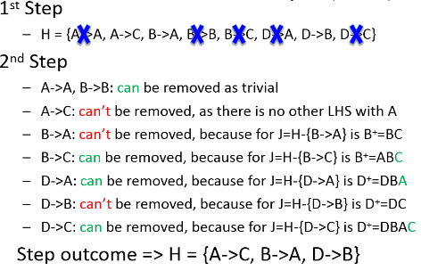

### Projecting Functional Dependencies
- Initialize T = {}
- Create set of attributes of R1 = X
- Compute closure of X
- Add to T all nontrivial FD's X --> A such that A is in the closure of X and an attribute of R1

### Decomposition of Schema
- lossless, avoid anomalies, preserve functional dependencies
- decomposing to BCNF
    - look among FD's for violation X --> Y
    - compute closure of X
    - find all attributes in it that aren't X
    - replace R with R1, R2
        - R1 = closure of X
        - R2 = R - (X<sup>+</sup> - X)

### Limits of Decomposition
- 3NF provides lossless join and dependency preserving schema, NOT anomaly free
- BCNF provides anomaly-free, lossless join schema, NOT preserving dependencies

--------------------------

## Transactions and Concurrency

### Transaction
- unit of program execution that accesses and possibly updates data
- during one, DB may be temporarily inconsistent
- multiple transactions can execute in parallel
- 2 issues: hardware/software failures and concurrency execution risk
- requests from different users are interleaved
- throughput: _# transactions in given amount of time_

#### Transaction States
- Active: initial state and while executing
- Partially committed: after final statement is executed
- Failed
- Aborted: after transaction has been rolled back to prior state
- Committed: successful
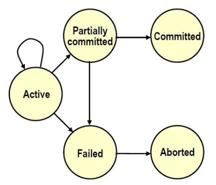

### Acid Properties
- Atomicity
    - either all operations are reflected properly in DB or none
    - inconsistent state should not be visible to users
    - keep track of old state in case of failure
- Consistency
    - transaction must take DB from one consistent state to another
- Isolation
    - should appear as though transaction is executed in isolation
- Durability
    - after successful transactions, updates should persist

### Schedules of Transactions
- chronological sequence of concurrent transactions
- serial schedule - no interleaving, one transaction after another
- equivalent schedule - effect of executing 1 is same as other
- serializable - not serial but can be made serial in some re-arrangement

#### Conflict Operations
- belong to different transactions, access same item and at least one operation is write
- Reading Uncommitted Data (WR)
    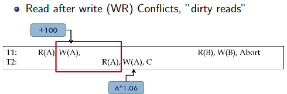
- Unrepeatable reads (RW)
    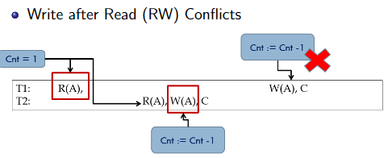
- Lost updates (WW)
    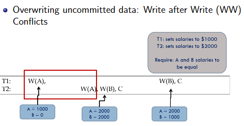

#### Aborting Transactions
- if Ti is aborted, all its actions have to be undone. And if Tj reads an object written last by Ti, Tj must be aborted as well!
- most systems try to avoid such cascading aborts so that if Ti writes, Tj can only read after a commit

#### Types of Schedules
- Recoverable: A schedule in which for any two transactions Ti and Tj, if Tj reads a value written by Ti then Ti must commit before Tj
- Avoids Cascading Commits: A schedule is ACA if data is only read from committed transactions
- Strict: A schedule is strict if any value written by Ti is not read or overwritten
by any other transaction until Ti either aborts or commits
    - All Strict schedules are also ACA
    - All ACA schedules are also Recoverable

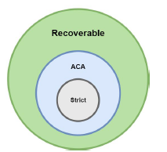

### Precedence Graph
- serializability graph to check for conflict serializable
    - create node for each transaction, find conflict pairs
    - draw edge from schedule for each conflict pair
    - if graph is cyclic it is non-conflict serializable

- Equiavalent
    - Two schedules S1 and S2 are equivalent if they have the same outcome
    - **Serializable: if schedule is equivalent to some serial schedule**
- View Equivalent
    - Two schedules S1 and S2 are view equivalent if for every object A the following hold:
        - If Ti reads the initial value of A in S1, it does the same in S2
        - If Ti reads the value A written by Tj in S1, it does the same in S2
        - If Ti writes the final value of A in S1, it does the same in S2
    - **View serializable: if schedule is view equivalent to some serial schedule**
- Conflict Equivalent
    - Two schedules S1 and S2 are conflict equivalent if
        - They involve the same operations in the same transactions
        - Every pair of conflicting operations is ordered the same way
    - Non conflicting operations may be reordered
    - **Conflict serializable: if schedule is conflict equivalent to some serial schedule**

- All conflict serializable schedules are also view serializable
- All view serializable schedules are also serializable

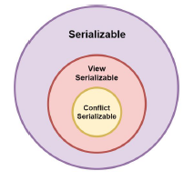

### Locks
- shared lock
- exclusive lock

#### Strict 2PL
- locking protocol
- each transaction must obtain a shared lock before reading and exclusive lock before writing
- all locks released when transaction is complete
- if exclusive lock on A, can't have any other shared or exclusive lock on it
- only allows serializable schedules (acyclic precedence graph)
- recoverable and ACA

#### 2PL - 2 phase locking protocol
- more relaxed than the strict (obv)
- allows locks to be released before end
- implications: all lock requests must precede unlock requests
- 2 phases: growing and shrinking

### Isolation Levels
- provided by SQL to make safe transactions
- degrees of isolation
    - READ UNCOMMITED: no read locks
    - READ COMMITTED: short duration read locks 
    - REPEATABLE READ: long duration read lock on individual items
    - SERIALIZABLE: all locks long duration
- tradeoff: consistency vs concurrency

### Deadlock Detection
- create a waits-for graph
    - nodes are transactions
    - there is an edge from Ti to Tj if Ti is waiting for Tj to release a lock
    - Lock mgr adds edge when lock request is queued
    - remove edge when lock request is granted
- deadlock exists if a cycle forms
- periodically check for cycles

### Deadlock Prevention
- Wait-Die: if Ti has higher priority, Ti waits for Tj otherwise Ti aborts
- Wound-Wait: if Ti has higher priority, Tj aborts, otherwise Ti waits

