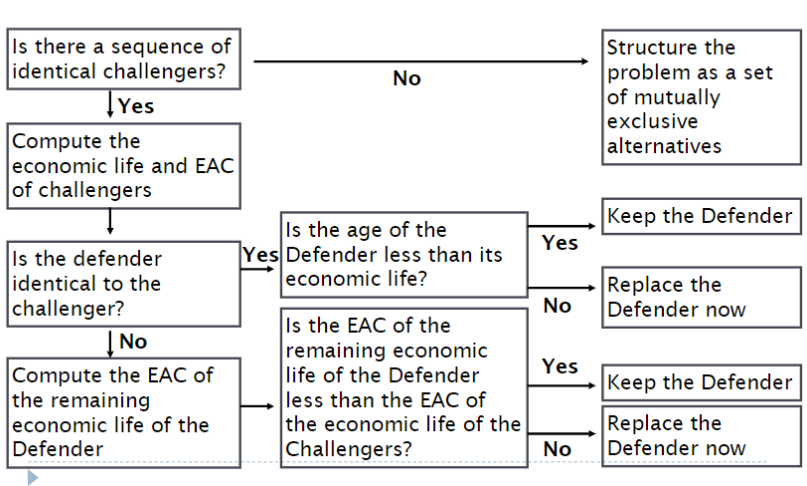
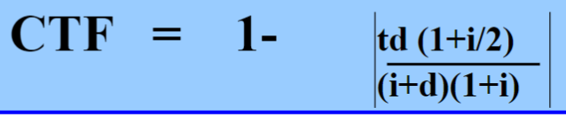
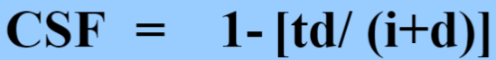

# 2B03 Engineering Economics

## Table of Contents
- [Course Outline](#course-outline)
- [Making Decisions](#making-decisions)
- [What is Sustainability](#what-is-sustainability)
- [Case Study Interface Carpets](#case-study-interface-carpets)
- [Interest](#interest)
- [Simple Interest](#simple-interest)
- [Compound Interest](#compound-interest)
- [Cash Flow Diagrams](#cash-flow-diagrams)
- [Timing of Cash Flow and Modelling](#timing-of-cash-flow-and-modelling)
- [Equivalence](#equivalence)
- [Compound Amount Factor](#compound-amount-factor)
- [Present Worth Factor](#present-worth-factor)
- [Textbook](#textbook)
- [Sinking Fund Factor and Annuity](#sinking-fund-factor-and-annuity)
- [Uniform Series Compound Amount Factor](#uniform-series-compound-amount-factor)
- [Effective Interest Rate](#effective-interest-rate)
- [Effective Interest Rate and Cash Flow Period](#effective-interest-rate-and-cash-flow-period)
- [Critical Point](#critical-point)
- [What Interest Rate to Use](#what-interest-rate-to-use)
- [Capital Recovery Factor](#capital-recovery-factor)
- [Salvage Value](#salvage-value)
- [Series Present Worth Factor](#series-present-worth-factor)
- [Equivalence Examples](#equivalence-examples)
- [Arithmetic Gradient Series](#arithmetic-gradient-series)
- [Geometric Gradient Series](#geometric-gradient-series)
- [When N Approaches Infinity](#when-n-approaches-infinity)
- [Mortgages](#mortgages)
- [Residential Mortgages](#residential-mortgages)
- [Stress Test](#stress-test)
- [Bonds](#bonds)
- [Comparison Methods](#comparison-methods)
- [Relationships Among Projects](#relationships-among-projects)
- [Investing](#investing)
- [Alternatives with Unequal Lives](#alternatives-with-unequal-lives)
- [Payback Period](#payback-period)
- [Internal Rate of Return](#internal-rate-of-return)
- [Incremental Analysis](#incremental-analysis)
- [Review Session](#review-session)
- [Rate of Return Issues](#rate-of-return-issues)
- [External Rate of Return](#external-rate-of-return)
- [Depreciation](#depreciation)
- [Replacement Decisions](#replacement-decisions)
- [Replacement Decisions](#replacement-decisions)
- [Taxes](#taxes)
- [Inflation](#inflation)
- [Ethics and Social Responsability](#ethics-and-social-responsability)
 
_Images are from Prof Cam Churchill's Lecture Slides for ENG 2B03 Engineering Economics._

## Day 1 Jan 4, 2018

### Course Outline

Professor email: church@mcmaster.ca

**Grading**
- Midterm 30% (March 6 @ 7-9pm)
- Quizzes 20% 
	- (on [Avenue](http://avenue.mcmaster.ca/)) 
	- open Thursday, due Sunday - **1 attempt only**
- Exam 50%

_Final and midterm - 2 sided cribsheet & open textbook (can't print pdf)_
_will do problems in class_

\*_Sunday March 4th - 2hr tutorial before midterm_*

### Making Decisions

**Decision Pyramid**


**Dealing with Abstractions**
- engineering econ models typically represent a project through estimates
of costs and benefits of project over time

**Modelling Process**


**Uncertainty and Sensativity Analysis**
- engineers make predictions using economic models
- sensativity analysis can identify _robust_ decisions
- we use design criteria

**Modern Design Criteria**
- components are function, cost, safety, sustainability

## Day 2 Jan 8, 2018

### What is Sustainability

> "Development that mettes needs of the present generation without compromising the ability of future generations to meet their own needs.
> SD is not a fixed state of harmony but a process of change in which exploitation of resources, direction of investment, orientation of technological development and institutiona change are made consistent"
\- UNICEF 1987

#### Business Models
- Linear Model
	- yields a lot of waste

	

- Closed Loop Model
	- Nothing should be wasted

	

#### Important Variables in Sustainable Development

##### Global Goals
- Waste nothing
- adapt to the place
- use free resources
- optimize not maximize
- create livable environemtnt

##### Metrics and Tools
- life cycle cost analysis
- life cycle assessment
- ecological footprint analysis

##### Stakeholders
- should take end-user into consideration
- eg juice box design - one time use, flimsy straws

##### Ethics
- engineers have responsibility towards
	- client
	- profession
	- society

##### Complexity
- important for engineers to understand that their activites and designs will be operating in very complex systems

##### Triple Bottom Line
- need to think about social sustainbaility
	- socially sound, acessible to users
- environmental sustainability
	- conserve earth's resources and raw material
- economic sustainability
	- used to be the main focus

**Three Legged Stool**


### Case Study Interface Carpets
- example of company that has been trying to be more sustainable
- cut down ecologcal footprint by 1/3
- claims to be world's first sustainable corporation
- over 5 billion pounds of carpet now in landfills
- went from selling carpets to leasing carpets (floor covering services)
- Benefits
	- carpet tiles used so only worn out parts replaced
	- increases net employment
	- eliminates disruption
	- less glue fumes
	- incentive of keeping it in good condition '**_drive it like a rental_**
- invented new type of floor-covering called Solenium that can be remanufactured
- all worn materials can be completely separated
- in 10 years they saved $262 mill
- won $20M contract from U of California
- went from trucking to rail
- cut shipping cost by 50%
- inspired Wal-Mart to deploy sustainable practices
- 72% reduction in waste water

### Interest
- [Lump Sum Interest](#lump-sum-interest-rate)
- [Nominal Interest](#nominal-interest-rate)

#### Value of Time and Money
- would rather get a million dollars today vs 10 years
	- due to inflation
	- money has earning power over time (investments)
	- time allows money to earn interest
- engineering decisions involve analysis of costs and benefits
- key to this financial analysis and comparison is the **"interest"** 

#### What is Interest
- it is the **_compensation for giving up the use of money_**
- it is the **_difference between amount of money lent vs paid_**
- the _difference_ between a present amount of money an future amount is **interest**
	- ```future worth = present worth + interest```
	- ```F = P + I```
	- I = Lump sum interest
	- i = interest rate
	- F = future worth
	- P = present worth

#### Lump Sum Interest Rate
- when interest is specified as a percentage of the money borrowed (common)
- then...

```
I = Pi
F = P + I
  = P + Pi
  = P(1 + i)
```
##### Example
Peter wishes to borrow $50000 from his uncle and promises to pay it back after 3 years. His uncle agrees provided Peter pays 60% interest

**There is a legal interest rate, you can't go over 60%**
- or you get charged with usury
- also, lump sum is rarely used

```
i = 60%
I = P*i = 50000*(0.6) = 30000
Therefore F = P + I = 80000
```

#### Nominal Interest Rate
- **Interest rate** may be specified for an **interest period**

> Interest rate - rate of interest charged for use of money, usually expressed as annual rate

> interest period - base unit over time which an interest rate is quoted, usually 1 year
- interest rate specified for one year is a **_nominal interest rate_**
- same as annual percent rate (APR)

### Simple Interest
- rate that doesn't change
- rarely used in practice
- I<sub>S</sub> = PiN
- ``` F = P + PiN```
- there is also compound interest which results in a lot more money

#### Example 1
If $5000 is invested in a savings account at an interest rate of 4% per year, calculate simple interest earned over 3 years.

```
P = 5000
i = 4%
N = 3
I = P*i*N
  = 5000*0.04*3
  = 600
```

#### Example 2
If $5000 is invested in a savings accuont at interest rate of 4% per year, calculate the future worth of investment at the end of 3 years.

```
F = P + I
  = P + P*i*N
P = 5000
I = calculated as 600 in previous example
Therefore, F = 5600
```

## Day 3 Jan 9, 2018

- Amortization Period
	- the duration over which a loan is calculated to be re-paid

### Compound Interest
- **Simple Interest** - method of computing interest where interest earned during interest period is **NOT** added to principal amount used to calculate interest in next period
- **Compound** - standard method of computing interest where interest accumulated in one interest period is added to principal amount used to calculate for next period
	- F = P(1 + i)<sup>N</sup> OR
	- P = F/(1 + i)<sup>N</sup>
	- I<sub>C</sub> = P(1 + i)<sup>N</sup> - P
	- F is future worth
	- P is principal 
	- i is interest rate/compunding period
	- N is number of compounding periods

#### Interest Rate Terms
- compounding period:time between points when interest is computed and added to initial amount
- Payment Period/Cashflow Period - shortest time between payments
- Nominal Rate (r) - simplified expression of annual cost of money
- Annual Percentage Rate (APR) - this is what you see in commercials
	- nominal interest rate on yearly basis
	- Cdn Tire is 25% per year
- Effective Rate - is the rate that is used with the table factors or the closed form equations.
	- it converts nominal rate taking into account both the compounding period and the payment period

#### Sample Question 1
If $5000 is invested in savings account at nominal interest rate of 4% compunded yearly, what is future worth in 3 years?

```
P = $5000
i = 4%
N=3

F = P(1+i)^N 
  = (5000)(1 + 0.04)^3
  = 5624.32
```

#### Question 2
If $5000 is invested in a savings account at nominal rate of 4% compounded yearly, calculate the compound interest over 3 years

```
P = 5000, i = 4%, N=3
Ic = P(1+i)^N - P
   = 5624.32 - 5000
   = 624.32
```
#### Question 3
Manhattan Island was purchased for $24 in 1626. If that was invested at 6% how much would it be today?

```
i = 6%
P = 24$
N = 2017 - 1626
F = P(1 + i)^N
     = 1.88 B
```
#### Question 4
I borrow $100 now and pay you $1000 4 years from now. What is the implied interest rate?

```
Compound
F = P(1+i)^N
1000 = 100*(1+i)^4
i = 0.778

Simple
F = P*i*N
1000 = 100*i*4
i = 2.5
```

#### Credit Card tool
- and excel

### Cash Flow Diagrams
- represented by arrows and relevent periods
- upward arrow = positive flow (receipts)
- down arrow = negative flow (disbursements)
- time 0 is considered **now**
- 

- can construct table outlining all cashflow activites
	- won't get marks for it but it helps 
- period from 0 to 1 is period 1, -1 to 0 is period -1
- end of period means the arrow will be drawn at that period

#### Nominal Interest Rate Revisited
- conventional method of stating annual interest rate
- 18% compounded daily --> ```i = 18%/365```
- ``` i = r/# compounding periods per year ```
- N --> if nothing is stated, assume yearly **except** in car payments and mortgages - assume monthly

#### Example 1
How much is accumulated after 2 years when you deposit $900 into a savings plan that is 12% compounded monthly?

```
P = 900
N = 2*12 = 24
i = 12%/12 = 1%

F = P(1+i)^N
  = 900(1+0.01)^24
  = 1142.76
```

## Day 4 Jan 11, 2018

### Timing of Cash Flow and Modelling

- Discrete Model
	- models that assume all cash flows occur at ends of conventional periods
- Continuous Model
	- not that common
	- assumes that all cash flow occurs continuously - continuous compund period

- can have discrete _cashflow_ and discrete _compounding_
- discrete cash flow - continuous compoounding
- continuous cash flow - continous compounding
- can't have continuous - discrete (continuous money and monthly period)

#### Comtinuous Compounding
- i<sub>c</sub> = effective compound interest rate/year
- r = nominal interest rate/year
- m = number of compounding periods in one year which is approaching infinity
- ```i = r/m``` and ```F=P(1+i)^n```


#### Example 1
What is the effective interest rate of an investment with a 6% nominal interest rate, compounded continuously?

```
using limit: e^0.06 - 1
```

### Equivalence
- condition that exists when value of cost is equivalent to another
1. Mathematical equivalence
	- million dollars today or million dollars in 10 years -- not equivalent in terms of value
	- million today or 1.5 mill in 10 years **may** be equivalent
2. Decisional equivalence
	- indifferent between P dollars now abd F dollars N periods from now
	- inferring implied interest rate from P, F and N
3. Market equivalence
	- decision makers can echange different cashflows in market at 0 cost
	- common when you're shopping around eg mortgages

- if market equivalence holds and decisional can be expressed in monetary terms, then we can assume that mathematical equivalnce can be used

#### Simplification of Cash Flow
- for when it gets too complex
- Convention: Sample Factor (compound amount factor)
	- ```(F/P, i, N)``` = (1+i)<sup>N</sup>
	- read as F given P, i, N
	- F = P(1+i)<sup>N</sup> = P(F/P, i, N)
	- P = F/(i+1)<sup>N</sup> = F(P/F,i,N)

#### Assumptions of Compounding Interest Factors
- if we have N periods, they have to be equally spaced
- payment at time 0 can be considered at end of period -1: _today_
```
@ 2 is end of 2nd month, beginning of 3rd month
          |
  --------------
  0   1   2   3	
  ```

#### Example
- present worth P of cashflow with arrows at 3 and 5
- P = sum of those future amounts 
= P<sub>0</sub> = F1/(1+im)^3 + F2/(1+im)^5
- in short form = F1(P/F, im, 3) + F2(p/F, im, 5)


## Day 5 Jan 15, 2018

### Compound Amount Factor

```(F/P, i, N)```
- allows you to mve single arrow to the future

#### Example 1
If you loan a friend $5000 so that they can buy a portable generator and they promise to repay you with an interest rate of 4% per year, calculate value of your investment in 3 years.

```
P = 5000
N = 3
i = 4%
F = P(1+i)^N
  = 5000*(1+0.04)^3
  = 5624.32
```

#### Example 2
How much money will be in a bank account at the end of 2 years if $5000 is deposited today? Interest rate is 12% compounded monthly.

```
P = 5000
N = 2*12
i = 12%/12 = 1%
F = P(1+i)^N
  = 5000*(1+0.01)^24
  = 6348.67
```

#### Example 3
How much money will be in a bank account at the end of 4 years if $5000 is deposited at the end of each year? Interest rate is 12% compounded monthly.

- multiple arrows for this one
- move all arrows to the future (to 48 months)

```
       |    |    |    |
  ---------------------
  0   12   24   36   48

Use equation 4 times
P = 5000
N = 12 24, 36, 48
i = 12%/12 = 1%
F = 5000(F/P, 0.01, 36) + 5000(F/P, 0.01, 24) + 5000(F/P, 0.01, 12) + 5000

```

**First quiz will be up on avenue on thursday! Due Sunday**
	- everything up to the thursday lecture

### Present Worth Factor

```(P/F, i, N)``` = 1/(1+i)<sup>N</sup>

```P = F/(1+i)^N```

- gives present amount from F
- bringing arrow from future back _N compounding periods_

#### Example 4
What amount desposited today into account bearing 12% nominal interest will give $5000 at the end of 2 years? Interest compunded monthly
```
i = f/m = 12%/12 = 1%
P = F(i/(1+i)^N)
P = F(P/F, 1%, 24)
```

#### Example 5
How much would you deposit into savings account at nominal interest rate 6% **yearly** to accumulate $5000 in 3 years

```
calculating P
P = F(P/F, 6%, 3)
```

### Textbook
- find it online and put the formulas in your crib sheet
- Appendix A - discrete discrete
- Appendix B and C - continuous - continous, discrete - continuous 

#### Example 6
Using interest tables, 12% nominal interest with monthly compunding (1%), N = 24 months, how much do I deposit today therefore you know F not P
- look for 1% and N = 24 = 0.7875 (tbh it's easier to calculate :grimacing:)

## Day 6 Jan 16, 2018

### Sinking Fund Factor and Annuity

```(A/F, i, n)``` = i/[(1+i)<sup>N</sup> - 1]

**Annuity**
- a series of equal cash flows that start at the end of the first period, continue over N reglarly spaced time intervals
	- paycheck (in), cellphone bill (out)
- gives size of annuity that is equivalent to a future amount F
- N is the number of annuities
- if N = 12, there should be 12 annuities on cash flow diagram

#### Example 1
Melissa is saving up for server in 3 years. She thinks she needs $5000 and intends to put aside a uniform amount at the end of each year (an annuity). If nominal interest rate is 6%, how much should she put aside each year?

- cashflow diagram would have 3 annuities, totalling on the third one
- **note**: last annuity has to be on same space as total

```
r = rate = 6%
i = f/m = 6%
A = F(A/F, i, N)
  = 5000(A/F, 6, 3)
```

- however, if her first deposit is today, N=4!! **Example 2**

### Uniform Series Compound Amount Factor

```(F/A, i, n)``` = [(1+i)<sup>N</sup> - 1]/i

```F = A(1 + i)```<sup>```N-j```</sup>

- if you have a quetion like what is F at 20 given 10 annual payments of $1000 at an interest rate of 5%. 
- F20 = 1000(F/A, 5%, 10) **wont** tell you what you have after 20 years, it's only after 10 years
- To get 20 years, use F given P equation. multiply the above by (F/P, 5%, 10) or if after 15 years, (F/P, 5%, 5)
- **DON'T WRITE** F20 = 1000(F/A, 5%, 20) because it means you have 20 $1000 payments

#### For Single Transactions
- Compound Amount Factor (F/P, i, N)

#### Example 3
Bob wants new truck in 3 years. If he saves $25000 each year and puts it in savings w/ annual rate of 4% how much will he have in 3 years
- N = 3, F = ?
- 25000(1 + 0.04)<sup>3-1</sup> + 25000(1 + 0.04)<sup>3-2</sup> + 25000(1 + 0.04)<sup>3-3</sup>
 = 27040 + 26000 + 25000 = 78040


### Effective Interest Rate

 - actual annual interest rate obtained when the compunding period is less thaan 1 year is called the _effective interest rate/year_
 - denoted by i<sub>e</sub> (or subscript annual, quarterly, weekly)
 - if cashflow period is less than compounding period the cashflows will be _collapsed_ to the compounding period
 - no effective interest rates in first quiz
	- will be about first lecture, calculations on moving arrows on cashflow diagram, F given A, A given F application

## Day 7 Jan 18, 2018

#### Nominal vs Effective Interest
- nominal - stated rate of interest
- effecive interest rate - rate actually paid or earned because of compounding period less than 1 year
	- i<sub>e</sub> = effective interest rate/year
	- r = nominal interest rate/year
	- m = # of compounding periods in 1 year
	- r/m = nominal i/compunding period

**Equating future worth after 1 year**

```F = P(1 + i```<sub>```e```</sub>```) = P(1 + r/m)```<sup>```m```</sup>

thus ```i```<sub>```e```</sub> ```= (1 + r/m)```<sup>```m```</sup> ``` - 1```

#### Efective Interest Examples

##### Example 1 Slide 49
WHat is the effective interest rate/year of an investment with a 6% nominal interest rate, compounded daily?

```
r = 6%
m = 365
ie = (1 + r/m)^m - 1
   = 6.18%
```

**\*if i<sub>e</sub> only compounded once a year then it's equivalent to r*\**

**\*if compounded daily for ex. 6% it becomes 6.18%*\**

##### Example 2 Slide 53
How much money will be in a bank account at the end of 2 years if $5000 is deposited today? The interest rate is 12% compounded monthly.

- single arrow on cashflow diagram
```
(F/P, i N) = (1 + i)^N
F = 5000(1 + 12%/12)^24

is equivalent to

ie = (1 + 12%/12) - 1
F = 5000(1 + ie)^2 

F = 6348.67
```

### Effective Interest Rate and Cash Flow Period
- calculation period other than a year
	- nominal interest rate (r) is the conventional annual interest rate
	- compounding period (m) is the period used with compound interest method of computing interest
	- cash flow period (k) is the base unit of time over which an i<sub>e</sub> rate is calculated (may not be 1 yr)
		- k is the # compounding periods in 1 cashflow period

Therefore i<sub>e/k</sub> = (1+r/m)<sup>k</sup> - 1

#### Example 3
An investment earns a 6% nominal interest rate, compounded daily. What is the effective interest rate for a cashflow period of 1 month (30 days)?

```
ie = (1+r/m)^k - 1
   = (1+0.06/365)^30 - 1
   = 0.0049
   = 0.49%
```

**continued**

```
F in 5 years
F = A(F/A, 6%/365, 60)
```

### Critical Point
- when using factors, **n** and **i** must always match
- ex if using (1+i)<sup>N</sup>, the N and i should both be calculated w.r.t same unit of time
- **NOTE** 
	- interest doesn't start accumulating until the money has been invested for the full period
	- if cashflow period is less than compounding period then add up cashflows in compounding period to a single arrow
	- 

#### Example 4
A $5000 investment earns a 6% nominal interest rate compounded daily. What is the future worth of the investment after 5 years, using a cash flow period of 1 month?

**30 days is a bankers month**

```
ie = (1 + r/m)^k - 1
   = (1 + 0.06/365)^30 - 1

F = 5000*(1 + ie)^60
  = 6721.46
```

#### Example 5
A $5000 investment earns a 6% nominal interest rate, compounded daily. What is the future worth of the investment after 5 years using a cash flow period of 6 months?

```
ie<month> = (1 = r/m)^k - 1
Therefore k = 182 and N = 2*5 = 10
```

#### Example 6
Suppose you make quarterly deposits in a savings account which earns 9% interest compounded monthly. Compute the effective interest rate per quarter.
- per quarter = 4 times a year

```
ie = (1+r/m)^k - 1
m = 12
k = # compounding periods in each cashflow period = 3

ie<3 months> = 2.27%
```

### What Interest Rate to Use


## Day 8 Jan 22, 2018
- next quiz will cover Day 9 (effective interest rate)

#### Example 1
A dot-com company plans to place money in a new venture capital fund that currently returns 18% per year, compounded daily. WHat effecctive rate is the a) yearly, b) semi-annually, c) quarterly, d) monthly?

```
ie = (1+r/m)^k - 1
m = 365 -> linked to effective interest rate and won't change
k = # compounding periods in cashflow period

a) k = 365 days
ie = 19.716%

b) k = 182 days
ie = 9.388%

c) k = 91 days
ie = 4.589%

d) k = 30 days
ie = 1.49%
```

#### Example 2 (effective)
Suppose you make equal quarterly deposits of $1000 into a fund that pays interest at a rate of 12% compounded monthly. Find the balance at the end of year 2.
- need to figure out k because cashflow period is more than compounding period

```
m = 12
i = r/m = 12%/12 = 1%
k = quarterly = 3
ie = (1+r/m)^k  - 1
ie = 3.03%

F = A(F/A, i, N)
  = 1000*(F/A, 3.03, 8) <--2 years of quarters
  = $8901.81
```

#### Example 3 (r/m)
Suppose you make equal quarterly deposits of $1000 into a fund that pays interest at a rate of 12% compounded quarterly. Find the balance at the end of year 2.

- same cashflow as example 2, different compounding periods. Use flow chart
- if cashflow period less than compounding period, use i = r/m
- in this case, cashflow period (quarterly) is same as compounding period

```
m = 4
i = 12%/4 = 3%
```

#### Example 4
You have a trust fund that will become available to you 3 years from now (at the end of third year). The fund will pay $10000 every 6 months starting at the end of the 3rd year for 10 years (to the end of 13th year). If you invest all this money into a savings acount that has an interest rate of 8% compounded weekly how much money will yu have 30 years from now?

- cashflow and compounding period are different (cashflow is 26 weeks, compounding is weekly, 52)

```
                  |  |  |  |  |      |
--------------------------------------
0  1  2  3  4  5  6        25  26    60

    (semi-annual)

r = 8%
m = 52
k = 26

ie = (1+r/m)^k - 1
   = (1+0.08/52)^26
   = 0.041

N = the number of arrows on cashflow diagram
  = by the end of 4th year there will be 3 arrows
  = by the end of 5th year there will be 5
  = (year_n - 3)*2 + 1 
  = 21

F_26(13th year) = 10000*(F/A, ie, 21)
F = A[(1+i)^N - 1]/i
  = 10000*[(1+0.04)^21 - 1]/0.041
  = 322441.07

Now find future worth
F = P*(F/P, ie_month, 34)
  = 1254989.39
(F/P, ie_weekly(r/m), 884)
```

#### Example 5
You recently received $50000 from a relative. Your advisor told you he found a 1-year investment for you that provides 15% interest compounded monthly. 

1. What is the effective annual interest rate based on nominal rate of 15% compounded monthly?

```
~special case k = m~

ie = (1+r/m)^m - 1
   = (1+0.15/12)^12 - 1
   = 0.160755
```

If you invest $50000 today how much will you have at the end of 1 year?
```
i = 16.08%
N = 1

F = 50000*(F/P, i, N)
  = 50000*(1+0.1608)^1
  = 58037.75

OR

i = r/m = 16.08%/12
N = 12
```

## Day 9 Jan 23, 2018

Discussion on investing in ACB :trollface:

#### When to use effective interest 
Whenever you have annuity equation, you'll probably have to use effective interest because you have multiple arrows. If single arrow, can use either r/m or effective, it doesn't matter. Best to use the decision flowchart.

**Do problems on Avenue**

#### From last lecture

Hector says he will make the investment for you at fee of 2% of investments total value 1  year from now. What is the effective annual interest rate of this investment after paying Hector's fee?

```
So you have 58037*0.02 going to Hector
That leaves 56876 at the end of one year.

F1 = 56876
P = 50000
N = 1
F = P(1+i)^N
56876 = 50000(1+i)^1 
i = 13.75%
```

If your relative, instead of a lump sum, offered you 4 quarterly installments of $12500 each, how much would you have at the end of one year using Hector's investment (disregard Hector's fee). 

```
F1 = 12500(F/P,i,N) + 12500(F/P,i,N) + 12500(F/P,i,N) + 12500
15% compounded monthly therefore i = r/m = 15%/12
N would be 9, 6, and 3.

From original wording -> compouding monthly, cashflow quarterly.
Since cashflow is not less than compounding period, use effective interest

k = number of compoundng periods in cashflow period = 3
i_quarterly = (1+r/m)^k - 1
            = (1+0.15/12)^3
            = 3.8%
F = 12500(F/A, 3.8%, 4)
F = 12500((1+i)^4-1)/i
F = 12500(4.233)
F = $52920

If it was semi-annual compounding and cashflow still quarterly, we would do i = r/m because cashflow is less than compounding.
i = r/m = 15%/2

F = 25000(i+r/m)^1
OR
F = 25000(F/A, r/m, 2)
both give same answer
```

On test you'll get questions like:
- If cashflow is daily and compounding is monthly, what is your interest rate?

### Capital Recovery Factor

(A/P, i, N) = (A/F, i, N)\*(F/P, i, N) = i*(1+i)<sup>N</sup>/[1+i]<sup>N</sup>-1]

- how much money do I have to save/make to make my investment worthwhile
- gives value, A, of the equal periodic payments or receipts that are equivalent to a present amount P, where
- cashflow diagram starts with initial amount P and you get annuities during the following N periods
- uses F given P equation and A given F equation


#### Example 1
You are considering buying a digital camera for $5000 which you will use for 5 years. It has 0 salvage value. If the nominal interest rate is 10%, what is the expected yearly return on the camera.
- how much money camera needs to bring in to breakeven

```
A = P(A/P, i, N)
A = 5000(A/P, 10, 5)
*compounding and cashflow periods are both annual*
A = 5000*(0.26380)
  = 1319
```

### Salvage Value
- most assets have a value for which they can be sold for
- **WONT** be on Quiz 2

		A = P(A/P, i, N) - S(A/F, i, N)

#### Example 2
You are considering replacing your water heater and buying compact point-of-use water heaters for $5000 with a salvage value of $500 after 5 years. If the nominal interest rate is 10%, what is the expected yearly return on the compact heaters.

```
A = P(A/P, i, N) - S(A/F, i, N)
  = 5000(A/P, 10, 5) - 500(A/F, 10, 5)
  = 1237.10

```

### Series Present Worth Factor

(P/A, i, N)

- when you have annuities and you want to find P
- reciprocal of the previous equation

#### Example 3
Repaying your tuition requires 24 montly payments of $565. Interest is charged at an annual rate of 12% compounded monthly. How much is your loan?

```
(P/A, i, N)
P = 565
i = 12%/12
N = 24 (# of annuities)
```

Midterm - Mar 6, 7-9

## Day 10
- no lecture!

## Day 11 Jan 29, 2018

### Equivalence Examples

#### Midterm Question
The two cashflow diagrams below are equivalent at an interest rate of 12% compounded annuallyy. Determine the unknown value, c


**How to solve:**
- you can simplify the cashflow diagram
- 100, 100, 100, 100, 100 and 0, 0, 200, 200, 200
- LHS:
	- total amount at P=0 = 100(P/A, 12%,5) + 200(P/A, 12%, 3)*(P/F, 12%, 2)
- RHS:
	- total amount at P=0 = C(P/A, 12%, 5) - C(P/F, 12%, 3)
- LHS = RHS, solve for C
- C(P/F, 12%, 1) + C(P/F, 12%, 2) + ... + C(P/F, 12%, 5) would give you the same thing
- we can also move all of the cash to the 5th year:
	- LHS (Fs) --> 100(F/A, 12%, 5) + 200(F/A, 12, 3)
	- RHS: C*(F/A, 12%, 5) - C(F/P, 12%, 2)
- another way, you take the arrows and turn them into equivalent annuity
	- LHS: 100 + 200(F/A, 12%, 3)*(A/F, 12%, 5)
	- RHS: C - C(F/P, 12%, 2)*(A/F, 12%, 5)

#### Example 2 Who Wants to Be a Millionaire 
Investment: F= 1000000, r=6%, compounding monthly, total period 50 years.

How much does he have to save every day
- i = r/m or i<sub>e</sub>
- r/m because cashflow is daily and is less than compounding monthly

```
A = F*(A/F, i, N)
  = 1mill*(A/F, 0.5%, 600)
  = 1mill*(i/[i+1]^N-1])
  = 1mill*(0.005/[(1 + 0.005)^600-1])
  = 264.05
  => divide by 365 (or by 30 i'm not sure)
```

#### Example 3 Series Present Worth Factor
You paid of an 80000 loan completely in 48 months. You paid 2000 per month plus you paid an extra lump sum of $7000 at the end of first year. What was the interest rate on the loan?

```
80000
|
----------------------->
  ||||||||||||||||||||->
              |
48 arrows going down of 2000, after 12th a longer arrow plus 7000

A = 2000
i = ?

80000 = 2000*(P/A, i, 48) + 7000*(P/F, i, 12)

i = 1.12%

```
- really easy to do with goal seek on excel or linear interpolation
- x value is interest rate nd y values re right hand side 
- this will be on midterm, will be given range for interest
- x* = x1 + (x2 - x1)\*[y\*-y1/y2-y1] = 1.0 + (1.5 - 1.0)*(80- 82.1601/73.93-82.1601)
- using 1% and 1.5% interest rate and solving the above equation

#### Example 4

Reginald is budgeting for the next 5 years. His disbursements are listed in the table. If he wanted to pay for everything from one lump sum, how much would he hav to have in his bank today if it pays 3% interest compounded monthly? The tax payments constitute the previous year's payment and therefore a payment will be made starting todat and the last payment will be made at the end of the 5th year.
- rent is 700$, monthly, end of 1st month
- utilities is 300, bi-monthly, end of 1st month
- personal taxes are 1500, annually, today

```
draw cashflow
- 6 down arrows of 1500 today and for omce per 5 years
- 30 down arrows of 300 bimonthly for 5 years
- 60 down arrows of 700 monthly for 5 years

rent: (P/A, r/m, 60)
- pretty straightforward

utilities: (P/A, ie, 30(?))*(F/P, r/m, ) --> k = 2, m = 12
- 

taxes: (P/A, ie, 6)*(F/P, ie, 1) --> k = 12, m = 12
Alternative method for taxes: Po = 1500 + 1500(P/F, ie, 1) = 1500(P/F, ie, 2) ..

P = 700(P/A, 0.0025,60) + 300(P/A, 0.005006, 30)*(F/P, 0.0025, 1) + 1500(P/, 0.30416, 5) + 1500
  = 38956.65 + 8358.31 + 6861.41 + 1500
  = 55676.37

```

## Day 12 Jan 30, 2018

**continuing with example from last lecture**

#### Example 5
- skipped

### Arithmetic Gradient Series
- series of receipts or disbursements that may start at 0 or have base value at the end of first gradient
- there is an increase of constant amount [G]
- we are going to take this **gradient** and find the equivalent annuity or the **base annuity component** [A']
- gradient can be negative as well


- base value is A' and the amoutn it increases by over periods is G
- in following example, base = 300 and G = 200 

```
 300 500 700 900 1500
  |   |   |   |...|
-------------------
0 1   2   3   4...7

have to include base so N = 7, goes from 1-7
A = A' + G(A/G, i, N)
  = 300 + 200(A/G, i, 7)
```

#### Declining Linear Gradient
- down arrows
- starts with -1200 at 1, -1000 at 2, -800 at 3 all the way to 400 at 5

```
A = -1200 + 200(A/G, i, 5)
or
A = 1200 - 200(G/A, i, 5)
```

#### Example 1

Your company as just opened and must dispose of its biomedical waste. The base cost that was quoted to you was $6000 but as business increass you expect the cost to grow by $100 per month. If the interest rate is 10% compounded monthly ehat is the future cost of the disposal at the end of the year?

```
in this example the down arrows increase over time by 100

A' = 6000
G = 100
i = (10/12)%
N = 1*12

A_tot = A' + G(A/G, i, N)
      = 6540.11

then alculate F
F = A(F/A, i, N)
  = 6540(F/A, 0.8333, 12)
  = 82180.20
```

##### Shifted Gradient
- i = 10%
- use A' + G(A/G, i, N) and then P/A

#### Arithmetic Gradient Series to Annuity Conversion Factor

Cases | Meaning
------|-------
A>0 and G>0 | positive annuity and increasing cash flow
A>0 and G<0 | positive annuity and decreasing cash flow
A<0 and G> 0 | negative cashflow but becoming less so, closer to x-axis
A<0 and G<0 | negative cashflow but becoming more so


#### Example 2 Winning the Lottery

You win a lottery and have 2 payment options. The first is a lump sum payment of 3.44 mill dollars today. The second option pays out installments over 26 years. The payment schedule is $175000 one year from today and seond is 189000 in 2 years and subsequen yearly payments that increase each year by 7000 ffor a final payment in 26 years of $35700. If an interest rate of 4.5% is used what is the present worth of each option?

```
base = 189000 and G = 7000
it's a shifted gradient becasue base starts 2 years from now

Atot = A' + G(C/A, i, N)
N = 25
G = 7000
A' = 89000
i = 4.5

A_gradient = 68292.67

A_tot = 68292.67 + 189000
      = 257292.67

if there is a gradient you must use the A/G equation and then use other ones

in this case, we use P given A

but since we need to move back one year, we use P given F as well

P_Opt2 = (175000 + 257292.67*(P/A, 4.5, 25))*(P/F, 4.5, 1)
= (175k + 257292.67(14.828209))(0.9569)
= 3818363

```

## Day 13 Feb 1, 2018

#### Example 1
John and Barbara have just opeed 2 savings accounts at their bank. The account earns 10% interest compounded daily. John wants to deposit $1000 into his account today and then make monthly deposits that would increase by 300 each time. FOr instance at the end of first month he would make a 1300 deposit and at the end of the second month a 1600 deposit. He will do this for 1 year. Barbara wants to make monthly deposits of an equal amount for the next year but she starts her deposit at the end of the first month not today. What should be the size of Barbara's monthly deposits so that the 2 accounts have equal balances at the end of the year.

```
ie = (1+r/m)^k - 1

(A/G, i, N) = 1/i - N/[(1+i)^N-1]

is cashflow (month) less than compounding (day) - No 

k = 30

Atot = A' + G(A/G, i, N)
A' = 1000
N = 13
G = 300
imonthly

ie = ((1+((10/365)/100))^30)- 1
A_john = A' + G(A/G,ie, 13) = 1000 + 300*5.885 = 2765.49

to turn into N equal annuities we can use A/P equation
Po(A/P, i, N)
N = 12


John's first payment is made today so we need to take that single payment and make it into an annuity. SO the annuity from the first payment is found using A/P
A_firstpayment = P(A/P, ie, 12) where A = A_john = 243.01
Barbara's monthly payments are ABarbara = A_firstpayment + A_John = 2765.49 + 243.01 = 3008.5
```

### Geometric Gradient Series

(P/A, g, i, N) = (P/A, i<sup>0</sup>, N)/(1+g)

- has 4 factors
- i<sup>0</sup> is the growth adjusted interest rate
	- = ([1+i]/[1+g]) - 1
- 


Cases | Meaning | Procedure
------|---------|----------
i>g>0 | growth positive, but less than rate of interest thus i^0 is positive | use tables/formula
g>i>0 | growth positive, but more than rate of interest thus i^0 is negative | use formula **only**
g=1>0 | growth equals rate of interest thus i&0 is zero | special case: P = N[A/(1+g)]
g<0 | growth is negative ths i^0 is positive | use tables or formula

#### Example 2

Your retirement benefits are worth $50000 per year which should cover cost of living. However cost of living is said to increase 5% per year. Your investments can make 7% per year. How much should you invest to cover you for 25 years.


```
i = 7%
g = 5%
cost of living is a negative so g is a negative

pension is 582679
i^0 = 0.019

P = 50000(P/A, 1.9, 25)/(1+0.05) = 940696

delta P = 940696 - 582679 = 358017

```

#### Example 3 
**Geometric Gradient to Present Worth Conversion Factor**

Your company has opened and must dispose of biomedical waste. Base cost was quoted as $6000 but as business increases you expect cost to grow by 1% per month. If interest rate is 10% compounded monthly what is the future cost of disposal at the end of first year?

```
g > i so use formula
6000(P/A, g, i, N)
i = 10%/12
N = 12

this equation will give you equivalent amuont at 0

to move the single arrow into the future you use F/P

therefore multiply 6000(P/A, g, i, N) by (F/P, 10%/12, 12)

if we change it to the 3rd year, instead of N = 12 we would use N = 36

P = A(P/A, g, i, N)
  = 6000 * 12.009617 = 72057.70
F = P(F/P, i, N) = 72057.70(F/P, 0.8333, 12)
  = 79603.08
```

**\*Quiz includes geometric**

#### Example 4
Planning for the next 10 years, you need to start hiring employees in 2 years. You anticipate monthly wages you pay will start at $10000 and increase by 5% each month. If interest rate is 3% compounded monthly and first payment starts 25 months, what is the present cost of your workers over next 10 years?

```
g = 0.05
i 3/12
i^0 = ([1+i]/[1+g]) - 1
    = -0.0452
P = 10000(P/A,g,i,N)(P/F,i,24)
  = 10000(P/A, 0.05, 0.0025, 96)(P/F,0.0025,24)
  = 10000*1765.75*0.9418
  = 16630451.56

```

## Day 14 Feb 5, 2018

short - betting against the stock
put - ??

### When N Approaches Infinity
- long-lived projects 
- P = A/i
- might have 1-2 questions on the quiz on this


### Mortgages
- basically means death pledge
- **amortization** - number of years it would take to repay a mortgage loan in full for given interest rate and payment schedule
- **term** - number of years the agreed upon interest rate is fixed. duration over which loan agreement is valid

#### Fixed Rate Mortgages
- **open fixed rate mortgages** - able to repay in full or in part at any time with no prepayment charge. You can also change to another term any time without charge.
- **closed fixed rate mortgage** - interest rate and payments are fixed for the term you choose
- **convertible fixed rate mortgage** - lets you convert to closed term of 1 year or longer at any time without charge.

#### Variable Rate Mortgages
- ???

#### Fixed vs Variable

. | fixed | variable
--|------|-------
description | set for duration of mortage term | fluctuates wth market
pros | eases budgeting anxiety | proven to be less expensive over time
cons | if difference btwn fixed and variable is large, may not be worth paying premium for stability and protedction | financial uncertainty

#### Example 1
Bobby bought a house for $200000. He paid $50000 down, mortgage has nominal interest rate of 10% compounded monthly with 10 year amortization period. The term of mortgage is 5 years. What are Bobby's current monthly payments. How much does he owe in 5 years?

```
2 part question
A = ?
P = ?

P0 = 150000
r = 10%
m = 12
N = 10 * 12

A = P(A/P, i, N)
  = 150000(A/P, .10/12, 120)
  = 1982.26

for the second part
P = 150000
i = .10/12
N = 5*12
A = 1982.26

P60 = A(P/A, i, 60)
    = 93295.85

OR

P60 = 15000(F/P, i, 60) - A(F/A, i, 60)

After 5 years, Bobby still owes $93295.94
```

#### Bobby's Payment Breakdown
- P<sub>remaining</sub>
- P<sub>p</sub> + A =  I<sub>p</sub>
- after 5 years, Bobby will need to renegotite his mortgage and choose a new term
- usually annuity payment amount will not change, the actual amortization period have changed

## Day 15 Feb 6, 2018

#### Example 2

You bought a house that is worth 1.9 million and you will give 60 payments of 10000 mortgage. Interest rate = 6% compounded monthly

```
P = A(P/A,i,N)

1900000 = 10000*(P/A, .6/12, 60)

Using Goalseek
601 payments
that's why we don't have 50 year amortization - it's too much interest

```

#### Example 3 Car Payments
Determine monthly payments required if you want to borrow 30k from a bank to buy a car at 6% interest compounded monthly for 6 years

```
i = 0.6/12
P = 30000
A = 30000(0.005*(1+0.005)^72/((1+0.005)^72-1))
  = 497.19

the 24th payment is 497.19
- the interest -> Ip
- principle reduction -> Pp

Po = 30000
P23 = A(P/A, 0.06/12, 23)
30k = A(P/A, 0.06/12, 23) + F(P/F, .06/12, 23)
F = 21560
or
P = A*(P/A, 0.06/12, 72-23)
interest is $107.80
and p reduction $389.39

You can also do F23-F24 to get principle reduction

```

For previous car loan, when you hand the bank your cheque for the 24th payment (answered above).

How much interest do you pay overall for those 6 years
- bank makes $5800 off of you

```
total interest= 497.19(72)-30000 = 5797.6
```

### Residential Mortgages
- a secured loan using a residencial property as collateral
- _conventional mortgage_ : when based on cerdit of purchaser and collateral

#### Amortization Period
- July 2008: reudced max length of insured high-ratio mortgage to 35 years
- Jan 2011: max amortization period dropped to high-ratio insured 30 years
- June 2012: brought down to 25 years

#### Credit Approval
- when you apply for mortage they look at 2 things
  1. payment to income ratio
  2. loan to value (LTV)
    - higher ratio -> higher probability of default
    - ltv of oer 100% is concerning

#### Down Payments
- for new mortgage loans, LTV is based on amount paid as down payment
  - if you put 15% down and you don't have debt then your ltv is 85%
- in canada, mortgage loan is required when it is more than 80% if purchase
- minimum is 5% but you have to get insurance (with CMHC insurance)
- Feb 15, 2016 -> homes less than or equal to 500k the minimum is 5% down
- for homes with purchase price greater than 500k and less than 1 mill, minimum is 5% of first 500k and 10% of remaining balance
- 1 mill+ homes, minimum down is 20%

### Stress Test
- as of Jan 2018
- originally only applied to people applying for high-ratio mortgages or mortgage term of less than 5 years
- you have to show that you can afford an mortgage
- either 5 year bench mark rate, at a rate of 4.89% OR it's based upon your current rate and they add 2% to it and see which one is bigger

#### Example 1 Stress Test
Famlily with yearly income of $100k qualifies for 5 year fixed rate mortgage at 2.83%. They have a 25-year amortization period and are making a 20% down ayment. If they applied before Jan 1, 2018 they could hav been able to afford $726939 but htey did it after so thye can afford $570970.

Same family with same income qualifies for 5 year fixe contract rate mortgage at 3.09% with 25 year amortization. Until Jan 1 they could afford $706692 but after stress test is applied they have to add 2% (now 5.09%) and can only afford $559896 house

## Day 16 Feb 8, 2018

#### Mortgage Interest
- Canada Bank Act: quoted rates must be stated on semi-annual compounding basis monthly rate is (1+r/2)^1/6 - 1
- in the US it is monthly payments

#### Example 1 Mortgage
You have negotiated a 25-year, $100k mortgag at rate of 7.4% per year compounded semi-annually w/ TD Bank. To answer most mortgage questions we have to convert quoted annual interest compounded semi-annually to get actual interet charged each month/get efective monthly period rate.

```
EPR = 0.074/2%
EAR = (1 + EPR)^2 - 1 = 1.037 - 1 = 7.5369%
EPR_1/12 = (1 + EAR)^1/12 - 1 = 1.075369^1/12 - 1
        = 0.00607369 = 0.607369% PER MONTH

What is the monthly payment on the above mortgage?

PVo = $100000
EPR_1/12 = 0.607369
T = 25*12 = 300 months

Mortgage is annuity with equal monthly payments therefore we use annuity

A = 100000(A/P, 0.00607369, 300)
  = 725.28
```

### Bonds
- issuer in return pays investor interest at predetermined rate and schedule (coupon)
- date to repay amount borrowed (face value) is maturity date
- maturity date: can range from 1 day to 30 years, there have been 100yr bonds issued
- short term bonds are more predictable that long term
- longer time to maturity usually corresponds to higher interest rate, longer term bods also fluctuate more
- known as fixed-income securities because you know exact amount of cash you get back provided you hold it to maturity

#### Debt vs Equity
- bonds are debt and stocks are equity
- by purchasing stock, investor becomes owner and has right to vote
- by purchasing bonds, investor becomes creditor to corporation and has higher claim on assets but no share in profits

#### Why Buy Bonds
- because stock market is very volatile
- retirement
- short time horizons - money needed for specific purpose

#### Bond Rating
- safer investments have higher ratings whereas risky investments have low ratings
- **junk bonds** bonds of companies in financial difficulty, must offer higher yields

#### Government
- treasury bonds: maturity > 10 years
- treasury notes: maturity 1-10 years
- treasury bills (T-bills): maturity < 1 year
- govt securities considered extremely safe in industrialized countries

#### Corporate
- short term < 5 yrs
- intermediate term: 5-12 yrs
- long term: > 12 yrs
- higher yields than govt bc higher risk, credit quality determines interest rate

#### Terminology
- par or face value is amount needed for which bonds can be redeemed for at maturity
  - actual price of bond would be different from face value except at redermption
  - corporate bonds normally have $1000 par values when issued

#### Coupon - interest rate
- amount investor receives as interest payment
- most bonds pay interest every 6 months but it's possiel for them to pay more or less frequently
- **fixed rate**
- **floating rate**
- for example - coupon rate of 10% on a bond with $10000 face alue would pay annuity $500 every 6 months

## Day 17 Feb 12, 2018
- mortgage interest rates in Canada are lower than US by 0.5%

#### Example 1 Bonds
Bond with face value of $10000, coupon rate of 10% compounded semi-annually with a maturity period of 20 years. What is the purchase price of this bond (present worth)?

- present worth of bond depends on going interest rate
- assume buyer expects 15% (r) interest compouned semi-annually
- can do:
  1. take all arrows to future
  2. take all arrows to present
  3. turn everything into annuities

```
Option 3, turn everything into annuities
P = ?
A = 500
F = 10000
τ = 15%/2 = 7.5%

P(A/P, 7.5%, 40) = 500 + 10000(A/F, 7.5%, 40)

P = 500(P/A, 7.5%, 40) + 10000(A/F, 7.5%, 40)

alternatively **use this one**
ie = (1 + 15/2)^2 - 1
P = 500(P/A, 7.5%, 40) + 10000(P/F, ie, 20)
  = 6851.39
```

#### Exmaple 2 Midterm Question
- Want to make at least 13.55% compounded weekly
- how much would the face value have to be for a bond maturing in 12 years if it had a coupon rate of 10% and you had $500 today to buy it

```
coupon = F x 10%/2
ie_semiannual = (1 + 13.55%/2)^26 - 1 = 0.07

P = A(P/A, i, N) + F(P/F, i, N) where N=24
5000 = coupon(P/A, 7%, 24) + F(P/F, 7%, 24)
F = 6488.338406

A = F x coupon_rate/2
```

#### Midterm Question
If you bought a bond today for $5000 which is maturing in 12 years with a face value of $7000 and it had a coupon rate of 10%, what is the ie on your investment?

```
Step 1: 5000 = A(P/A, i, 24) + F(P/F, i, N) // use linear interpolation to get i

Step 2: convert semi-annual interest rate to ie(annual)
ie_annual = (1 + i_semiannual)^2 - 1

```
## Day 18 Feb 13, 2018

### Comparison Methods
- PW method - compare projects by examining the present worth of all project cash flows
- AW method - comparison based on converting all cash flows to annuities (uniform series)
- Payback Period estimates how long it takes to pay back investments

#### Assumptions
1. everything is measurable in terms of money
2. future cash flows are known with certainty
3. cashflows are unaffected by inflation
4. sufficient funds are avilable
5. taxes are not applicable - for now
6. projects with first costs have cash inflows, after the first costs, that match or exceed the first costs
- You can operate at a loss but still do well because of 0 corporate taxes

**crown corporations** - companies run/funded by government that don't need to make a profit

### Relationships Among Projects
1. Independent
  - simplest form
  - expected costs and benefits do not depend upon whether some other project is implemented
2. mutually exclusive
  - choosing one project means eliminating all others
3. related but not mutually exclusive
  - usually related pairs of projects
  - a lot of choices that are interconnected
  - expected costs and benefits of one project depends ____
  - 2<sup>n</sup> permutations

#### Example 1
District improvements
  - alternatives to make street better
    1. converting part of roadway to gardens
    2. add old fashioned light standards
    3. replace pavement
    4. make street 1-way
  - constraints
    1. only 2 of the first 3 projects can be done at once
    2. garden only possible for 1 way street
    3. 
  - number of alternatives: 2^n - 1 because you can't have null set
    - leaves us with 7 due to the rest of the constraints

#### Minimum Acceptable Rate of Return (MARR)
 - an interest rate that must be earned by project to be accepted
 - aka rate of return required to attract investors/shareholders
 - **present worth** - use MARR and compute PW
  - move all cashflow arrows to 0 and choose project with best present worth
  - if present worth is negative and you're using your MARR, you're losing money over time
 - **annual worth** - transform all disbursements and receipts to a uniform series at MARR
- **future worth** - move all arrows to future and calculate future worth

present worth | actions
-----|--------|-----
>0 | acceptable
<0 | unacceptable
=0 | marginal

#### Example 2
Company specializing in vericomposting (worm eat waste). Currently mails out all of his orders but is thinking he could save up to $34000. MARR = 10%

- 1st cost - $30k
- fuel - $100/week, annual $5200
- insurance - $2000/yr
- driver - $1500/month - 18k/year
- maintenance $1000/year

```
cashflow diagram: 34000 saved, 30000 capital cost, 25200 in expenses
PW = -30000 + 7800(P/A, MARR, 5)
= -431.76
```

#### Example 3 from Midterm
Should a company purchase new copy machines. Will last 7 years, no salvage value, will cost $5000 to pruchase, annual savings of $1700 at the end of the first year, $1500 in the second, $1300 in third, decreases by 200 per year. MARR = 15%

```
N = 7 because it includes base

A_tot = A' + G(A/G, i, N)
      = 1210
PW = -5000 + A_tot(P/A, 15%, 7)
= 34.23
```

#### Mutually Exclusive Projects
- easy to use when service lives are same for all projects under consideration
- compute present worth of each project using MARR
- project with greatest present worth is the preferred project
- **remark** for minimum cost problems, pick project which has smallest present cost at MARR

## Day 19 Feb 15, 2018

### Investing

#### Example 1
- consider 2 investments over 3 year period

Company | 1st Costs | Net Revenue | MARR
--------|-----------|-------------|------
Burger Friends | $100000 | $45000/yr | 12 %
Live Bait | $80000 | $3000/mth | 12%

```
PWa
= -100k + 45k(P/A, 12, 3)
= 8081

PWb
= -80k + 36k(P/A, 12, 3)
= 6465
```

#### Example 2
Software genius selling rights to video game. He has 2 offers/contracts.

First offer: $10000 at each year end for next 5 years and then $20000 for next 6 to 10 years

Second offer: 10 payments starting $10000, $130000 second year, 

He must invest 50000 now for development and his MARR is 9%.

```
Need to find equivalent annuity

N = 10, i = MARR, use A/P

PW = -50000 + 10k(P/A, 9%, 5) + 20k(P/A, 9%, 5)(P/F, 9%, 5)
= 72316

PW2 = -50000 + 10k(P/A, 9%, 10) + 3000(A/G, 9%, 10)(P/A, 9%, 10)
= 87295

Should choose second option.

This is for the previous question I think
AWa
= 3365
AWb
= 2692

```

#### Example 3
Two investments are being compared...

#### Example 4
Appledale Dairy is considering upgrading an old ice-cream maker. Modertate upgrade cost is $6500 now and yields annual savings of $330 in first year, $3000 in second, $2700 in third, decreasing by $300. Extensive upgrading costs 10550 and saves $5600 in first year. Savings then decrease by 16.94% each year thereafter. If machine will last 7 years in both cases, state the better upgrading option usng present worth comparison and MARR of 8%.

```
PW(moderate) = -6500 + [3300 - 300(A/G, 8%, 7)](P/A, 8%, 7)
= 6473.78

PW(extensive) 
g = -16.94 therefore ig = (1 + i)/(1+g) - 1 = 0.30
= -10550 + 5600(P/A, ig, 7)/1+g
= 8330.60

Extensive upgrading is better.
``` 

### Alternatives with Unequal Lives
- comparisons are performed on basis of common time frames
1. repeated lives
  - use least common multiple of service lives of alternatives
  - eg if you have service life of 10 years and one with 4 years, use 20
2. adopted study period
  - specific time period is given

#### Lawn Guy Problem (Example)
```
Present Worth

Lawn Guy PW
= -350 + -350(P/F, 5, 10) + (-60-30)(P/A, 5, 20)
= -1686.45

120 dollars to buy a new lawn mower
Clip Pro PW
= -120 + -120(P/F, 5, 4) + -120(P/F, 5, 8) + -120(P/F, 5, 12) + -120(P/F, 5, 16)
= 1667.94

Annual Worth
- easier to do

Lawn Guy AW
= 1686.45(A/P, 5%, 20)
```
- if lives are different, pick annual worth

#### Study Period Example
- used if it cannot be assumed that alternatives can be repeated
- Suppose that given study period for lawmower is 4 years
- You estimate salvage value of $150 for lawn guy mower

```
Lawn Guy
PW = -$350 - $90(P/A, 5, 4) + 150(P/F, 5, 4)
   = -545.74

Clip Pro
PW = -120 - 100(P/A, 5, 4)
   = -474.60

```

What would salvage value have to be to make the 2 equivalent.

```
Set salvage value to be S and equate the lawn guy and clip pro

- 350 - 90(P/A, 5, 4) S(P/F, 5, 4) = 474.60
S = 236.47
```
- Quiz will go up to the end of this lecture ^ and will be open til Monday 26th midnight

## Day 20 Feb 26, 2018

- for present/annual worth, if you have positive numbers, take the highest one. If they're both negative and do nothing is not an option, you take the least negative

### Payback Period
- number of years for the first cost of an investment to be recovered
- payback period = first cost/annual benefits
- if annual benefits are not constant, payback period is __

#### Example 1
2 independent investment opportunities. What is the payback period for each? If you require a 3 year payback, should none, both or either be purchased?

. | Machine A | Machine B
--|-----------|----------
first cost | 15000 | 20000
revenues | 9000 | 11000
annual costs | 6000 | 8000
scrap value | 1000 | 2000
service life | 5 yeas | 10 years

```
Machine A

First cost = 15000
annual net benefits = 9000 - 6000 = 3000
payback period = (15000)/3000 = 5 years

Machine B
First cost = 2000
annual net benefits = 11000 - 8000 = 3000
payback period = 20000/3000 = 6.7 years (or 7 if assuming year end)

Therefore, you should not invest in either.
```
#### Example 2
. | Cashflows occur at | the end | of | each year
-----|--------|----------|-------|----------
. | First Cost | Year 1 | Year 2 | Year 3
A | -25000 | 15000 | 10000 | 5000
B | -35000 | 10000 | 5000 | 30000

Project | Year 1 | Year 2 | Year 3
--------|--------|--------|--------
A | -10000 | 0 | 5000
B | -25000 | -20000 | 10000

- you would choose project A because it gets you payback by year 2 :0
- payback value is ez but it ignores interest and future revenue

**Crib sheet - normal paper double sided**

### Internal Rate of Return
- the interest rate at which NPV = 0, the rate of return at which the present value of the cashflow inflows equals the present value of the cash outflows
- PW = 0 = -10000 + 2000(P/A, i, 6) for -10000 initial and 2000 yearly for 6 years
- calculating IRR
  - PW (disbursements) = PW(receipts)
  - AW (disbursements) = AW(receipts)
  - FW (disbursements) = FW(receipts)
  - solve for unknowne i*
- **IRR** - interest rate i* such that all ash flows of project are discounted at i*, PW of cash 
- PW = 0 = sum of all (Rt - Dt)/(1 + i*)<sup>t</sup> where Rt and Dt are receipts and disbursements in period t = 0,1,2...T
- for 100 invested today returning 110 in a year, the IRR is 10%
  - o = PW = -100 + 110(P/F, i, 1)
- if IRR > MARR, accept
- if IRR < MARR, reject
- if equal, marginally acceptable

#### Example 3
New Windows at NF are expected to save $400 per year in energy over their 30 year life. The windows have an initil cost of $8000 and will have 0 salvage value.

- use a spreadhseet to plot PW and calculate the IRR
- without excel, use annuities and PgivenA equation
- PW = - 8000 = 400(p/a, i , 30)

#### Example 4
IRR and NPV
- yield on single receipt
- 2 arrows on cashflow, initial payout of 28371 and return of 50000 on year 5
- PW = 0 = -28371 + 50000(1/(1+i*)^5)
- solve for i, i = 12%

## Day 21 Feb 27, 2018

#### Non-uniform Cash Flow Diagram
- down arrow - 100
- up arrow - 20, 30, 20, 40, 40
- calculate annuity for up arrow
- for IIR, generally will just ask for it and you can solve any way
- know that i* is 10%-15%

```
PW = 0 ## also called NPV
   = -100 + 20(1/(1+i*)) + 30(1/(1+i*)^2) + 20(1/(1+i*)^3) + 40(1/(1+i*)^4) + 40(1/(1+i*)^5)

i = 10% ----> PW = 10.16
i = 15% ----> PW = -4.02

if you plug in your first value and get a positive number, to know which way to go to get higher value 

- smaller i => higher present worth generally

i* = 10% + (15% - 10%)(10.16/(10.16 - -4.02))
   = 13.5%
```

#### Example 1
Investor has opporuntity to invest $28371 today. Investment will provide $445.66 at the end of each month for the next 8 years. What is the annual IRR compounded monthly?

```
P = A(P/A, i*, N)
28371 = 445.66(P/A, i*, 96)

IRR and MARR in general are nominal

To get annual:

i* = r/m
r = (i*)*m
  = (i*)*12

i*_effective = (1+i*)^12 - 1

i*_monthly = 0.9167%
then you would multiply by 12 to get 11.0%
```

#### Root Finding Approaches
- Computational - numerical method
  - bisection
  - false position
  - fixed point iteration
  - newton-raphson
  - modified newton-raphson
  - secant method

### Incremental Analysis

#### Rate of Return Analysis
- IRR is used for analysis since it produces single measure of project desirability

#### IRR for Mutually Exclusive Projects

. | Plan A | Plan B
---|--------|------
1st cost | $1 | $1000
year end | $2 | $1900
IRR | 100% | 90%

- need to find weighted average
- for 2 alternatives, calculate incremental rate of return, delta IRR, based on difference between alternatives' cash flows
  - if delta IRR >= MARR, choose higher cost (cost at time period 0) alternative
  - if delta IRR < MARR, choose the lower cost alternative
- we need equal length cashflow diagram, or calculate equal study period

#### Why Inremental Analysis is Necessary
- asumme company has $90k to invest and uses MARR of 16%. Has to choose between 2 projects
  - A with initial cost 50k, IRR i*a = 35
  - B with initial cost 8500 IRR i*b = 29
- if we do weighted average, the rate of return for is
  - i*a = (50000(35%) + 40000(16%))/90000 = 26.6 
  - i*b = 28.3%

## Day 22 Mar 1, 2018

#### Steps in Incremental Analysis
1. identify alternatives, including "do nothing"
2. (optional) Compute rate of return for each individual alternative
  - all optionals will have IIR greater than MARR in midterm/exam so don't do this step
3. arrange (remaining) alternatives 
4. calculate delta IRR on the increment (B-A) for the first 2 alternates (A= lower cost alternative)
5. compare the retained alternative from Step 4 with the next higher cost alternative on the ordered list
  - use same criteria as Step 4
  - B-A delta IRR > MARR, eliminate B
  - C - A, C delta IRR > MARR, eliminate A
  - D - C, delta IRR < MARR, go with D
6. repeat steps 4-5 until all alternatives have been examined

#### Flowchart

#### Custard Machine Example

You have been put in charge f buying a machine that will inject jelly and custard

Project | First Cost | IRR | Machine 1 | Machine 2 | Machine 3
--------|-----------|------|-----------|---|---
1 | 100000 | 19 | . | . | .
2 | 175000 | 15 | 9 | .
3 | 200000 | 18 | 17 | 23|  .
4 | 250000 | 16 | 12 | 17 | 13

If they were independent, get rid of 2 because it's less than 16%, keep 4 it's marginally stable. If you're only keeping one, you cant look at IRR column because first costs are different. You have to do incremental.

They are already in order of least to most expensive. 

```

when IRR < MARR, keep the cheaper machine

machine 3 vs machine 1
delta IRR is 17%
IRR > MARR therefore we keep machine 3

now do machine 4 vs machine 3
delta IRR < MARR therefore we keep lower one

keep machine 3

```


#### Incremental Calculation

COnsider the 2 over a 10 year period and MARR of 20%

Energy Source | 1st cost | Net Saving
--------------|----------|----------
wind turbines (B) | $1.5 mill | $400000/yr
photovoltaic calls (A) | $1.2 mill | $300000/r

```
do more expensive - less expensive (B - A)
PW = 0 
-30000 = 10000(P/A, i*, 10)

plug 20% for i* and see what you get, so there is no need for a range

when we do i* = 20%, we get RHS > 300000

the answer is 31% but we just need to know if it's more or less than MARR

if IRR > MARR, keep the more expensive therefore go with B
```

#### Example 3

Rimouski Dairy needs to get a filling machine for their creamer. They serve 3 choices. Revenues fromt he line are 200000 per year. MARR = 10%

1. Purchase new machine, first cost = 65000, life = 6yrs, salvage = 10000 (C)
2. contract with packaging suplier for free machine. packaging = 15000 per year for 6 years (A)
3. buy used machine for 30000 which has 0 salvsage vallue at the end of 6 years. maintenance costs are 3000 in first year, increasing by 2500 each year (arithmetic) (B)
- installation is 60000. 
- what is the preferred alternative

```
cashflow -> down arrow 30000, up arrow 12000
-30000 + [12000 - 2500(A?G, IRR, 6)](P/A, IRR, 6) = 0
try MARR = 10%
PW = -1948
need to know how it's going to change with IRR, so try 9%, which brings you closer to zero, therefore, you're going to have a low interest rate, well below the MARR. therefore we are going to go with the less expensive machine (A) and get rid of B

now we have C - A

C machine: 65000+6000 down arrow, no maintenance so 20k positive arrows per year and then salvage vlue at the end of years

minus

A machine: 

= 

65000 down arrow, 15000 per year and then salvage value

bring all arrows back to zero
- 65000 + 15000(P/A, IRR, 6) + 10000(P/F, IRR, 6)
try 10%, we get $5974
we try and find out if IRR is greater or less than MARR
delta IRR is greater than MARR so we end up with more expensive (which is )

- since number is positive you know that IRR > MARR 
need to specify how you know in exam/midterm

```

#### Example 4
Suppose that a project pays $2500 today costs $12500 one year from now and pays $15000 in 2 years. WHat is the IRR?

```
+2500, - 12500, +15000

2500 - 12500(1/(1+i*)) + 15000(1/(1+i*)^2)

i*^2 - 3i^2 + 2 = 0
(i* - 1)(i*-2) = 0

```

- Midterm will cover up to this point. So the Rmouski Dairy example

**Review at MDCL 1102 from 1-3pm on Sunday**

### Review Session

1. A Paradorian bond pays $500 coupons and $5000 five years from now. I want to earn at least 300 percent annual (effective) interest on this investment (to compensate for the very high inflation in Parador). How much should I pay for this bond now?

All our bonds are coupon bonds - coupons come every 6 months in general

- purchase price
- up arrows every 6 months for coupons until maturity date
- then you get face value

Priority of what we'll be asked

- unknown = purchase price
- face value = 5000 
- coupon rate = not given
- interest rate (effective) --> 300
- N = 5 years

- since it's every 6 months, we need a 6 month interest rate to use P/A and move arrows around.

```
i_e = (1 + r/m)^k - 1
i_e = (1 + i_6month)^2 - 1
sqrt(3 + 1) - 1 = i_6month
i_6month = 100%

P = 500(P/A, i_6month, 2*5) + 5000(P/F, i_6month, 2*5)
  = 500(P/A, 1%, 10) + 5000(P/F 1%, 10)
  = 504.39453125
```

If we were given P = 500, CR = 20%, i_e = 300%, FV = ?, N = 5 years

```
We can't get an actual number for FV but we know that coupon = (0.2/2)FV

500 = (0.2/2)FV(P/A, 1, 10) + FV(P/F, 3, 5)
``` 

2. Pacific Oil Company's monthly revenue is invested at nominal interest rate of 11.72% compounded monthly. However, its quarterly revenue alternates between $100000 and $125000, every other quarter (first quarter 100k, then 125k..). If the revenue starts flowing in one quarter from now what will be the accumulated revenue at the end of 10 years. 

- can split into series: odd months (1, 3, 5..39) and even months (2, 4,..40)
```
125k every 2 months up to 40 quarters
ie = (1 + r/m)^k - 1
   = (1 + 11.72/12)^6 - 1
   = 0.06004958609574107
F = 125000(F/A, ie, 40/2)
  = 4600650.693603614

100k every 2 months up to 39 quarters and then move it 1 quarter = 3789416.4660202246

ie_6months = (1 + 11.72/12)^6 - 1 = 0.06004958609574107
ie_3month = (1 + 11.72/12)^3 - 1 = 0.029587094953963167
F = 100000(F/A, ie_6month, 20)(F/P, i_3month, 1) + 125000(F/A, 1_6months, 20)
  = 8390067.159623839

```
3. Clarice would like to buy a house and after budgeting everything she knows that she can afford monthly payments of $1650. If mortage rate is 3% and she plans on amortizing her loan over 25 years how large a mortgage can she get?

```
at 0 she gets a mortgage (unknown) and the next month and for 25*12 months she pays $1650

P = 1650(P/A, 0.03/12, 25*12)
  = 347946.1480109683

```

After a 5 year term how much would Clarice have left to pay on her mortgage if she took the full amount of the loan calculated in part (a)

```
We know P = 347946.1480109683 and A = 1650

F = P_0(F/P, 0.03/12, 12*5) - 1650(F/A, 0.03/12, 12*5)
  = 297513.00878057623

```

For the remaining amount calculated in part (b) how long would it take Clarice to pay off her loan if the interest rate stayed the same but she increased her monthly payments to $1900

```
P = F from (b) = 297513.00878057623

P = 1900(P/A, 0.03/12, N)
297513.00878057623 = 1900((1+0.03/12)^N - 1)/((0.03/12)*(1+0.03/12)^N)
range of N = 180 to 250

x* = ?
y* = 297513.00878057623

x1 = 180
y2 = 275130.3957682878

x2 = 250
y2 = 352883.90778240655

x* = x1 + (x2 - x2)(y*-y1/y2-y1)
  = 198.928 
Using Solver -> Type your equation, ALPHA bracket for X and ALPHA calc for =
                Then do SHIFT solve, type 1 for X? and then SHIFT solve again
                Wait
                = 198.928 

Round up to 199
```

On her 45th payment, how much is interest and how much is principal reduction? CHECK NOTES


4. A construction company needs to install new fall-arrest equipment on their tower cranes. Two cranes are under consideration.

- Model A will cost $15000, will last 2 years, and will cost $2500 per year to service and inspect
- Model B will cost $18000, will last 3 years, and will cost $2000 per year to service and inspect
- if company uses a MARR of 10%, which model should they choose using PW, AW or FW analysis
- AW is the easiest bc you already have annuities

```

PW for A = -48530
PW for B = -40234

AW of Model A -> (-15000 - 2500(P/A, 10%, 2))(A/P, 10%, 2) = -11142.857142857138
OR -15000(A/P, 10%, 2) - 2500
AW of Model B -> (-18000 - 2000(P/A, 10%, 3))(A/P, 10%, 3) = -9238.066465256792

Choose model B because it is less negative.

```

5. An entrepeneur is looking at leasing houses that he can then rent out to students. Two lease options are avilable, each with a first cost, annual lease cost, and deposit return estimates show below. Note you must also consider do-nothing option. MARR = 13%

. | Location A | Location B
--|------------|-----------
initial lease payment | 9000 | 18000
annual lease cost | 4000 | 4500
anticipated yearly revenue | 13000 | 14000
lease term (yrs) | 2 | 6
```
Use IRR flowchart
rank least expensive (A) to most expensive (B) and subtract cashflow B - A and we get a new cashflow diagram

Ranking
A -> Do nothing
B -> Location A
C -> Location B

Do A - B, A is a straight line
B -> down arrow 9000 and then up 9000 (13000-4000)
AW = 0 = 9000(A/P, i*, 2) - 9000
i* > MARR when we solve so we keep the more expensive (get rid of do nothing)

Do C - B, common N is 6
C is down arrow 18000, 6 up arrows of 9500
You get down arrow of 9000, up arrows of 500, 9500, 500, 9500, 500, 500
don't need to calcualate IRR, just need to know if it's less or more than MARR

- 9000 + 500(P/A, MARR, 6) + 9000(P/F, MARR, 2) +  9000(P/F, MARR, 4)
= 5566.963593966478

if this gives us a positive number. to get zero you would need a higher i
so delta IRR is going to be greater than MARR. It's gonna be around 34%

if you get confused during midterm, try MARR and then try another number and see if it gets larger or smaller. If it's larger, you need to go in the opposite direction. 

if your delta IRR is greater than MARR you keep the more expensive one --> Location B
```

**no class for the next week due to midterm**

## Day 23 Mar 12, 2018

### Rate of Return Issues
- the normal case is when there is just one sign change associated with cash flow series
  - initial negative cash flow a year 0 followed by positive cashflows
  - initial positive cash flow at time 0 folowed by all negative cash flows
- in this case, NPW Plot which graphs NPW vs interest rate will intersect the x-axis at i* = IRR
- if there are no sign changes that means NPW will stay positive (or negative) and will never cross 0
- if cash flows series changes signs more than once, then multiple IRR points of intersection may exist (multiple roots)

#### Descartes Rule of Signs
- gives upper limit on the numbere of positive, real roots of a polynomial with real coefficients
- the number of positive, real IRRs is less than or equal to the number of sign changes in cash fow
- there were 2 signs in the lecture example
  - descarted rules says there can be 0, 1, or 2 positive real IRRS
- thi helps us determine ERR

### External Rate of Return
- what return is earned by money associated with a project that is not invested in the project?
  - the usual assumption is that the funds that are invested elsewhere and earn an explicit rate of return (usually more than MARR)
- the ERR is the rate of return on a project where any excess cash from a project is assumed to earn interest at a pre-determined explicit rate (usually MARR)
- in this class
  - if you have multiple sign changes, you will be doing ERR
  - we will also be doing approximate ERR

#### Approximate ERR
- all net receipts will be taken to the future at the MARR
- all net disbursements will be taken to the future at the unknown rate i<sub>ea</sub>* (approx ERRR)
- set FW(receipts) = FW(disbursements) and solve for i<sub>ea</sub>* 

#### Example 1
A project has cashflows of $2500 now, -$12500 in one year and $15000 in 2 years. If the MARR is 25%, find the approximate ERR.

```
2300(1.25) - 12500
= -9350

at year 2, positive money has grown by MARR to -9350

-9350(1 + ERR)^1 + 15000 = 0
Solve for ERR

ERR = 60%

that's fine if you just have 3 arrows b

if you had -, -, + +, -, +
you'd move the two - arrows to year 3

2500(1.025)^2 - 12500(1 + ERR)^1 + 15000 = 0
ERR = 0.51

```

- approx ERR will be between MARR and actual ERR

#### When to Use ERR
- the ERR method should be used whenever multiple IRRs are possible. Unfortunately, it is sometimes hard to know in advance when there are multiple IRRs
- **simple investments** - an investment characterized by one or more periods of cash outflows followed by one or more periods of cash inflows
- if project is not simple investment, there may be more than 1 IRR
- use regular IRR for simple investments that don't have multiple IRRs by plotting PW

Method | Advtantages | Disadvantages
-------|----------|--------
IRR | faciliates comparisons, commonly used | relatively difficult to caclulate, multiple IRRs may exist
PW | givs explicit measure of profit | difficult to compare if dif N
AW | annual cash flows may have failiar meanings | difficult to compare for dif N
payback period | easy to calculate | discriminates against long-term projects

#### Example 2 Exam Question
Grafton Corp wants to build spare parts storage facility that will last 8 years. 2 locations. Perform rate of return analysis and find best location. MARR = 8% and do nothing **is** an option. 

Location | Initial Cost | Cost Savings
-------|------------|------
1 | $122000 | 27000 in first year increasing by 1000 per yr
2 | $130000 | 20000 per year plus 20000 savings every 4 years (40k every 4 years)

```
do nothing is A
Location 1 is B
Location 2 is C

B - A

PW = 0 = -122000 + [27000 + 1000(A/G, IRR, 8)](P/A, IRR, 8)

Try IRR = MARR = 8% we get PW = 50965

since it's positive, delta IRR will be above MARR so we keep higher cost one and elininate do-nothing

C - B

After subtracting diagrams you get -8000, negative numbers and positive numbers every 4 years

THATS MULTIPLE SIGN CHANGES :o

```
## Day 24 Mar 13, 2018

```
Positive i=MARR

FW = 10000(F/P, 8%, 4) + 6000 = 19604

8000(F/P, ERR, 8) + 7000(F/P, ERR, 7) + 8000(F/P, ERR, 6) +  9000(F/P, ERR, 5) + 11000(F/P, ERR, 3) + 12000(F/P, ERR, 2) + 13000(F/P, ERR, 1)


OR

COSTS:
[6000 + 1000(A/G, ERR, 4])](P/A, ERR, 4)(F/P, ERR, 9) + 2000(F/P, ERR, 9) + [11000 + 1000(A/G, ERR, 3)](P/A, ERR, 3)(F/P, ERR, 4)

Try ERR=8% (MARR)

We get a negative future worth -> -51218
would need less than 8% ERR so choose B  (keep lower cost)
```

#### Example 1
Entrepeneur is looking at leasing houses that he can rent to students. Two lease options available. Do-nothing is an option, MARR is 13%.

. | Location 1 (B) | Location 2 (C)
--|----------|----------
Initial Lease Payment | 14000 | 18000
annual lease cost | 4000 | 4500
anticipated revenues from rent | 13000 | 14000
lease term (years) | 6 | 9

**do at home**

### Depreciation
- straight line
- declining balance

#### Lingo
- **Generalization**: An asset starts to lose its value as soon as you purchase it
- **Purchase Value**: The amount paid at purhase. Its the market value at purchase
- **Market value**: MV(n) Actual value of an asset that can be sold for in an open market
- **Book value**: BV(N), value of an asset used for accounting purposes. calculated using depreciation methods (what the govt is allowing you to say it's worth)
- **Salvage value**: actual value of asset when sold
- **Scrap value** - actual value of an asset when sold at the end of physical life

#### Reasons for Depreciation
- use-related physical loss
  - phone, car
- time related physical loss
  - electronics that aren't being used but are losing value
- functional loss
  - obsolete 

### Replacement Decisions
- economic incentive to replace things before theyre totally dead

## Day 25 Mar 15, 2018

#### Reasons for Depreciation cont'd
- financial statements
- replacement decisions
- tax calculations
  - paying a difference between book value and market value

#### Methods of Depreciation
- straight line - reverse of simple interest
- declining balance - what we use for tax purposes and income

##### Straight Line Method
- d<sub>sl</sub> = (P-S)/n
- can use depreciation to avoid taxes
- depreciate by a certain amount each year
- the book value of an asset diminishes by an equal amount (d) during each period (year)
- BV_4 = 1000 - 4(100) = 600

##### Declining Balance
- percentage, more intuitive
- the book value of an asset diminishes by an equal proportion (d) during each period (year)
- BV<sub>db</sub>(0) = P
- BV<sub>db</sub>(n) = P(1-d)<sup>n</sup>
- in summary, if d = depreciation rate and P = purchase value, 
- D<sub>db</sub>(n) - BV<sub>db</sub>(n-1)d = P(1-d)<sup>n-1</sup>d
- if you end up with a negative depreciation it means you messed up

#### Example 1
A new press brake costs Medicine Hat Steel $780000. It is expected to last 20 years with a $60000 salvage value. WHat rate of depreciation for the declining balance method will produce a book value after 20 years that equals the salvage value of the press?

```
d = 1 - Nthroot(S/P)
78000(1-d)^N = 60000
d = 0.12
```
#### Example 2
An asset was purchased 7 years ago for $10000. It was estimated to have a 10 year service life and a salvage value of $2000 at the end of its service life. If the value of the asset is believed to be deprciating at a constant rate each year, what is its book value today if depreciation is calculated using the declining balance method?

```
in this case, today is at year 7
d = 1 - nthroot(2000/10000) = 
BV(7) = P(1-d)^7 = 
```

#### Example 3
A machine has a life od 30 years, costs $245000 and has a salvage value of $10000 using straight line depreciation. Determine what depreciation rate (declining balance) will result in the machine having the same book value for both methods in 20 years.

```
```

## Day 26 MAr 15, 2018

### Replacement Decisions
- reduced performance
  - physical deterioration of equipment or system
  - this is when a good maintenance program is vital
- new requirements
  - piece of equipment has to be replaced or enhanced
  - system cannot meet the new requirments such as speed/accuracy
  - additional functionality may be needed
- obsolescence
  - effect of rapidly changing technology
  - often a result of ever-decreasing development cycle time to bring new products to market
  - lack of technical support/spare parts

#### Mutually Exclusive Choices
1. do nothing
2. overhaul existing asset
3. retire
4. replace

#### Capacity Costs
- **cost 1** - capital costs
- **cost 2** - installation costs
- **note 1**: installation costs are not depreciable
- **note 2**: when something is installed the defender has a cost advantage
- **note 3**: sunk costs are irrelevent in future replacement decisions - costs that were incurred in the past

#### Example 1
- printing service vs photo copier
- current annual cost = $36000
- new machine = $35000
- installation cost = $3000
- annual O & M cost = $24000
- O & M growth = 5%
- MARR = 10%

```
/salvage value/

defender A = 36000 
new machine cost + o & m brought back to present?
A = ? = (35000 + 3000)(A/P, 10%, 10) + 24000(P/A, 5%, 10%, 10)(A/P, 10%, 10) - 3758(A/F, 10%, 10)
= 35008

Declining Balance
BV(10) = P(1-0.2)^10
```

#### Replacement Example cont'd
- Assume ongoing need for product
- EAC(capital) = A = (P-S)(A/P, i, N) + Si (Chapter 3)
- replacement decision also depends on operating and maintenance costs
  - tend to increase
  - EAC of O&M a car can be computed for N years
- economic life is the number of years that minimizes EAC(total) = EAC(capital) + EAC(O&M)
- installation cost can be either capital or o&m since it's a one time cost
- in economic life example, to get 13800 capital cost at year 1, you need to add the installation cost to 5hr 35k
- installation cost is not added to purchase price because it does not get depreciated
- treat EAC(o&m) as an arithmetic or gradient series

#### Cost and Values
- when considering an asset's value, there are several possibililites
  - first costs
  - book value
  - replacement cost
  - trade-in value
  - market value

## Day 27 Mar 20, 2018

#### Forklift Example
- new forklift costs 18000, has operating costs 1000 in the first year and salvage value 10000 at the end of first year
- operating costs increase by 15% each year, truck depreciates by 25% per year, MARR = 15%
- this problem can be best solved on a spreadsheet

#### Equivalent Annual Costs (EAC)
- (P+I)(A/P, i, N) - S(A/F i, N)
- EAC(capital) = ____

```
N = 1
EAC = EAC(capital) + EAC(O&M)
18000(A/P, 15%, 1) - 10000(A/F, 15%, 1)

N = 2
0 - down arrow 18000
1 -
2 - up arrow 18000(1-0.25)^2 = 10125

EAC(capital) = 18000(A/P, 15%, 2) - 10125(A/F, 15%, 2)
= 3290.47

EAC(O&M) = 1000(P/F, 15%, 1) + 1150(P/F, 15%, 2) {approximation}
         = 1739.130434782609
         = 4316 (according to the prof)

EAC(tot) = 7406

N - EAC(tot)
1 - 10800
2 - 8720
3 - 7406
4 - 6678
5 - 6642
6 - 6258
7 - 6394

when it plateus - it signifies the lowest EAC, economic life

*** the numbers are probably all wrong ***
```

#### Example 2 - Pump and Challengers
- new water pump is $10000
- $1000 is immediately needed to install (part of capital but not salvage)
- O&M is $500 first year, increasing by $300 each year
- Salvage value at any ime can be estimated by declining rate of 20%
- interest is 10%
- calculate the EAC for replacing the pump after 1 yr, 2 yrs.. to find economic life (when it should be replaced)

```
N = 0
SV = 10000
N = 1
SV = 8000
N = 2
SV = 6400

Should be replaced at year 8
```

#### One Year Principle
- over time the EAC flattens out
- biggest drop is when things depreciate quickly
- "if the cost of keeping the defender one more year extends the EAC of the challenger at its economic life, then defender should be replaced

#### Pump
- above pump is being considered for replaement
- current one has salvage value of $1000 and will retain this value indefinitely
- O&M are $2500 per year rising by $400/yr
- should it be replaced/when?

```
economic life = 8 years
EAC = 3317
marginal cost of keeping it one more yr
MC = 1000*10% + 2500 = 2600
note: P - S = 0

so we do not want to replace now

assuming O&M is 3500 rising by 200, we get MC = 1000*10% + 3500 = 3600 (should replace now)
```

#### When Challenger is Different from Defender
- challenger will always repeat
- decision rules
  - determine economic life of challenger and its EAC
  - determine remaining economic life of defencer and its EAC
  - if EAC(defender) > EAC(challenger), replace now

#### Exmaple 3
- brockville brackets has 3 yr old robot and challenger is upgraded used robot
- maintenance for upgrades is 40k first year increasing by 10% per yr
- current robot maintenance is 50k increasing by 10% per yr
- MARR = 15%

. | Defender | Challenger
---|---------|------------
price | $300000 | $175000
installation | $50000 | $10000
useful life | 12 yrs | 9 yrs
annual depr. rate | 20% | 20%

```
2 arrows on cashflow diagram (today and at the end of 1 year)

if you keep what's in place 5 yrs -- 97808 dollars

challengers lowest number is 92440

much better than best scenario for keeping defender
```

**useful life != economic life**

#### Challenger is not Repeated



## Day 28 Mar 22, 2018

### Taxes

#### Comparisons of Forms of Business Organizations
- sole propietorships
- partnerships
- corporations

#### Sole Proprietorships
- advantages
  - easy and inexpensive to form
  - owner's right to all profits
  - direct control of busines
  - freedome from govt regulation
  - no special taxation
  - ease of dissolution
- disadvantages
  - unlimited liability
  - difficulty in raising capital
  - limited managerial expertise
  - difficulty finding qualified employees
  - personal time commitment
  - unstable business life
  - owner absorbs all losses

#### Partnership
- 2 or more persons carrying on a business ith a view to making a profit
- consensual and contractual
- written agrement between partners s not necessary to show that a partnership exists
- a court looks for the substance of the relationship beween parties to determine if it is a partnership
- general partnerships
  - partners co-own assets and share profits
  - each partner is individually liable for all debts
- limited partnerships
  - limited liability
  - many provinces have enacted laws concerning these partnerships
  - a non-negligant partner is not personally liable for the debts, obligations, and losses caused by negligance of another partner
  - limited partner sould ensure their name is not used in the name of the partnership
- advtantages
  - ease of formation
  - availability of capital
  - diversity of skills and expertise
  - flexibility
  - no special taxes
  - relative freedom from govt control
- disadvantages
  - unlimited liability
  - potential conflict
  - sharing of profits
  - difficulty in leaving or ending a partnership

#### Corporation
- a legal entity with an existence and life separate from its owners, who therfore are no personally liable

##### Incorporation Process
1. select company name
2. write and file the articles of incorporation
3. pay fees and taxes
4. hold organization meeting
5. adopt bylaws, elect directors, and pass operating resolutions

##### Types of Corporations
- private corporation
  - does not trade publicly and therefore isnt on the stock exchange
  - number of shareholders is no more than 50
  - public not invited to share in its securities
- public corporation
  - has the right to issue shares to the general public and is listed on stock exchange
- advantages
  - limited liability
  - easy to transfer ownership
  - unlimited life span
  - ability to attract financing
  - ability to attract potential employees
- disadvantages
  - double taxation - corporate tax + personal income tax (45%)
    - makes you lose profit
  - cost and complexity of formation
  - more govt regulations and restrictions

##### Specialized Forms of Organizations
- cooperatives
  - legal entity
  - competitors get together
- franchises
  - franchisor supplies
  - advantages
    - increased ability for franchisor to expand
    - recognized name
    - finanaical assistance for franchisee
    - management training and assistance for franchise
  - disadvantages
    - loss of control for franchisor
    - costs of franchising
    - restricted operating freedom for franchisee

## Day 29 Mar 26, 2018

#### Some Tax Effects
- income taxes affect investment decisions because they take a portion of the firm's earnings
- both depreciation (capital cost allowance) and other tax incentives are important
- anything can be filed as a business expense

#### Corporate Tax
- tax losses can be carried forward to offset future earnings, but they are lost after 7 years
- corporations can re-file tax returns after the fact to create or use tax losses already incurred
- CCA does not have to be taken in any year so these credits can be held for future years indefinitely

#### Tax form Example
- 40 something classes on the left followed by desciption
- class 10: automobiles and electronics
- beside class is the depreciation rate
- cutlery and shit: 100% "accelerated depreciation"
  - allows govt to help a sector that isn't doing so well
  - gets people to replace thier cutlery/dental equipment after 1 year
  - even though really the book value probably only went down by 20%

#### Tax Incentives
- **Accelerated Capital Cost Allowances** provide companies a reason to invest in equipment now rather than future
- **investment Taxx credit** is another way to provide incentive to cdn companies to make new capital spending plans
  - give companies investment tax credits (aquisition of new buildings and new equipment)
  - sometimes there is a regional incentive (to locate in low growth areas)
- goods must be acquired for the designated activity and be unused when acquired
  - income tax act specifies the rules
- R&D incentive
  - Scientifci Reasearcg and Experimental Development Program provides tax incentives to canadian businesses
  - intended to encourage SR&ED

#### Some Important Issues
- taxable income = gross income - deductions/expenses
- purchase of a fixed asset is not an eligble expense at the time of purchase
  - if you just bought a new truck for your company, youc can't claim it as an expense, you can claim its depreciation though (for each year)
    - bc you're using this asset over time
- depreciation is not an actual cashflow
- firm many finacne projects through equity (owners $) or debt financying (bonds, loans)
- **all cars have the same depreciation rate :o

#### Mechanics of Tax Calculations
- taxes to be paid = (taxable income) x (tax rate)
- allowable deductions
  - taxable income
  - interest
  - capital cost allowance (depreciation)
  - operating costs

#### More on Depreciation and Taxes
- companies want to depreciate their assets as quick as possible
- govt wants the opposite of that
- there is a basic unfairness in how govt treats depreciation for tax purposes
  - you spend cash now and they give you relief later, time value of money is on their side

#### Example 1
- facts
  - investment interest rate (MARR) = 10%
  - tax rate = 40%
  - fixed cost = $80k, life = 5 years
- question 
  - how much would he have with depreciation  of 100% vs 30%

Method A - First cost 80k

Year | 1 | 2 | 3 | 4 | 5
----|--|--|--|--|--
depreciation expense | 80k | 0 | 0 | 0 | 0
tax rate | 40 | 40 | 40 | 40 | 40
tax savings | 32k | 0 | 0 | 0 | 0 |
accumulated tax savings | 32000 | 35200 | 38720 | 42592 | 46851

The other method

Year | 1 | 2 | 3 | 4 | 5
----|--|--|--|--|--
depreciation expense | 24k | 16800 | 11760 | 8232 | 5762


#### Capital Cost Allowance System
- may deduct capital expense over period of years by claiming depreciation expenses each year of the useful life
- at the end of the year you have a UCC
  - the day after the UCC closes and then it is the UCC opening

#### Half Year Rule
- started in the 80s
- capital cost of asset is total acquisition vost (incl installation, transportation, legal, accounting)
- as asset is depreciated, company keeps track of UCC which may differ from market or salvage value
- in the year of pruchase only half the depreciation is applied (can only use it on half the value of an asset)
- need to keep this rule in mind for all the questions that we do

## Day 30 Mar 27, 2018

#### Tax Implications on Depreciable Assets
- undepreciated capital cost - capital cost at the end of the year
- when the thing you bought reaches its depreciation, multiply by UCC rate
- column 13 slide 40 - 42072
- SLIDE 42: column 7
  - if net addition is positive, (25000-850)/2
- when we talk about net casflow diagram with additions and dispositions
- always do the net before applying 50% rule
- if you have sold more than you bought then 50% rule is not used
- recap
  - **CCA = [UCC<sub>opening</sub> + (1/2)additions] x CCA rate**
  - 80000 dollar vehicle but we look at 40k
- when depreciation is a percent, it never goes to 0, as long as you never sell that asset
- to calculate present worth, we look at it as a geometric series
- we can create a factor CTF, capital tax factor

#### Capital Tax Factor
- PW of an asset - P*CTF



#### Capital Salvage Factor
- since half year rule doesn't apply to disposals, must use differnt factor
- PW -> S x CSF



#### Using CTF and CSF
- P\*CTF = [S\*CSF]*(P/F,i, N)
- if there is additional savings or expenses, during period n, then [A*(1-t)]*(P/F, i, N)

#### Example
- automobile purchasd or $25000. CCA rate = 30%, corporate tax = 43%, after tax MARR = 12% (i)
- what is the PW of the first cost

```
      1 - 0.43(0.3)(1+.12/2)
CTF = ----------------------
       [0.12+0.3][1+0.12]

    = 0.709311

PW = CTF*P
   = 0.709311*25000
   = 17733

for tax calculations, you have to calculate CTF. Sometimes the asset is not sold so you do CSF

CCA is the govt rate
```

#### Components of a Complete PW Tax Calculation
- first costs - multiply it with CTF to find the after tax cost
- savings or expenses - reduce these by the tax rate by multiplying them by (1-t). Assuming company is profitable and company is paying taxes
- salvage value - we apply CSF

#### Example 2
- recovery system costs $30000, saves $5280 per year of its 7 year life. Salvage value is $7500. After tax MARR = 9% and taxes are 45%
- what is the net after-tax annual cost

```
annual worth
CTF = 0.7025
CSF = 0.6897
AW_p = 30000CTF(A/P, 9%, 7)
AW_savings = -5280(1-T) = -5280(1-0.45)     // already annuities but we have to take taxes off
AW_salvage = -7500CSF(A/F, 9%, 7)

overall AW = 721 (cost)

d = 1- nthroot(S/P)
```

## Day 31 Mar 29, 2018

#### Before and After Tax MARR
- MARR<sub>after-tax</sub> ~ MARR<sub>before-tax</sub>(1-t) where t is corporate tax rate
- we have been using before tax MARR
- now if youre given a before tax MARR we will have to convert

#### Example 1
- watter bottling company purchased automated bottle capper
- SV = 2000
- tax rate = 50%
- after-tax = 12%
- CCA rate = 20%
- what is the after-tax PW if it costs $10000 and saves $4000/year ove its 5 year life?

```
PW = Pc*CTF + A(1-t)(P/A, i, A) + S*CSF(P/F, i, S)
CTF = 0.70424
CSF = 

PW = -10000(0.70424) + 4000(1-0.5)(P/A, 12%, 5) + 2000*CSF(P/F, 12%, 5)
   = 947

```

#### After Tax IRR
- tax can affect IRR
-  IRR<sub>after-tax</sub> ~ IRR<sub>before-tax</sub>(1-t) where t = income tax rate

#### Example 2
- truck costs $12000 and aves $4000 per year over a 5 year life with a $2000 salvage value
- after-tax MARR = 8%, taxes at 50%, CCA 20%
- is the investment justified? use PW

```
CTF = 0.6571
CSF = 0.6429

P = -12000(0.6561) + 4000(1-t)(P/A, 8%, 5) + 2000(0.6429)(P/F, 8%, 5)
   = 987

AW = -12000CTF(A/P, i*, 5) + 4000(1-0.5) + 2000CSF(A/F, i*, 5)

i* is aound 10.64% (after tax) and after-tax MARR is 8%
without taking taxes into account, before tax IRR would be 22.72% (calculation below)

AW = 0 = -12000(A/P, i*, 5) + 4000 + 2000(A/F, i*, 5)
```

#### Example 3 - Exam q
- oil company purchased for 15 mill
- operating costs 2 mill/yr
- output is 1000 barrels/day
- calculate after tax IRR given corporate tax 25%, $20/barrel, 5 years life, 2mill salvage value
- if after tax MARR is 15% is this a good investment
- if there is choice, calculate you can do before tax and then convert it
- range for after tax IRR given

```
-15000000 - 2000000(A/P, i*B, 5) + (20*1000*365)(P/A, i*B, 5) + 2000000(P/F, i*B, 5)
i*B ~ 0.247

convert to i*After i*A = i*B(1-0.25)
i*A ~ 18.5%

if you were doing after tax PW/AW/FW calc you would have
-15000000*CTF - 2000000(A/P, i*, 5)(1-t) + (20*1000*365)(P/A, i*, 5)(1-t) + 2000000(P/F, i*, 5)CSF
```

### Inflation
- increase in the general (average) price level of goods and services in the economy
- it means that cost increases over time (not time value of money)
- on cashflow - changes the magnitude of the arrow
- decrease of money's purchasing power
- deflation - opposite, where currency buys more than before
- differential inflation - item whos price is changing as a result of the economy as a whole

#### Examples
- eng consultant chatged 150$/hr in 2000 and since then its 165$/hr, this reflects economy's inflation rate (1.5-2% per year)
- cost of accounting services has increaed at annual rate of 5%, differential inflation of 3%
- cleaning services have stayed the same for 3 years, 6% deflation

## Day 32 Apr 2, 2018

#### INflation conts
- CPI consumer price index = (CYP/BYP) x 100%
  - BYP base year
  - CYP cost of market basket
- annual rate of inflation ARI
- ARI = ((CPIY - CPIPY)/CPIPY) x 100%
  - CPIY - consumer price index in given year
  - CPIPY - consumer price index in previous year
- for exam assume inflation is constant

#### Conversion
- convert actual dollars in year N into real dollars in year N relative to base year 0
- actual is current
- C<sub>N</sub> - current dollars in year N
- I<sub>0,n</sub> = value of global prices
- R<sub>0,N</sub> = C<sub>N</sub>/I<sub>0,n</sub>/100)
- R<sub>N</sub> = C<sub>N</sub>/(1+f)<sup>N</sup>
- can be rewritten as R<sub>N</sub> = C<sub>N</sub>(P/F, f, N)
  - doesn't mvoe the arrow, just adjusts it for inflation
- to move it you would do PW = C<sub>N</sub>(P/F, f, N)(P/F, i, N)

#### Actual and Real Interest Rates
- current interest rate (i) = observed interest rate based on actual dollars
- real interest rate (i') = interest rate tat would give the samenumber of real dollars without infaltion as the actual interest rate gives with inflation
- i' = (1+i/1+f) - 1
- if you rearrange, you can find the actual (i)
- up to this point we had been working with actual interest rate

#### Inflation Effect on the IRR
- IRRc = IRRr + f + IRRr*f
- IRR_real = (1 + IRRcurr/1+f) - 1

## Day 33 Apr 3, 2018

#### Example 1
- loan has real interest rate of 12% compounded monthly and inflation is 4%
- what is the current effective interest rate (i<sub>curr</sub>)
- i<sub>eff</sub> = (1+r/m)<sup>m</sup> - 1

```
ieff = (1 + 0.12/12)^12 - 1 = 0.127

iee_current = i' + f + i'f 
            = 0.127 + 0.04 + (0.127*0.04)
            = 0.172
```

#### Example 2
- a graduate chemical engineer got a job in 2007 and was paid $60k/yr. His salary grew to $65k by 2010 but Consumers' Price Index grew from 119.5 to 130.4. When was he better off?

```
R_2007 = 60000/(119.5/100) = 50209
R_2010 = 65000/(130.4/100) = 49846

Therefore, in terms of purchasing power, he was better off in 2007
```

#### Example 3
- project has a $10k first cost and $15k savings at the end of year 2. Inflation rate is 5%, MARR<sub>R</sub> is 13%. Should the project be accepted (based on IRR analysis)
- actual dollars with real interest rate
- we can get actual IRR and convert MARR OR we can adjust the arrows to take inflation into account

```
PW = 0 = -10000 + 15000(P/F, i*, 2)
10000/15000 = (P/F, i*, 2)
0.6 = 1/(1+i*)^2
IRR_acctual = 22.5%

IRR_real = (1 + 0.225)/(1+0.05)
         = 16.6%

In this case we would go for it since MARR < IRR_real
```

#### Example 4
- your broker alers you to the availability of a 30 yr bond with 15 yrs left to maturity with a 8% coupon, compounded semi-annually, it's face value is $2000
- but you want to return of at least 12% real interest, compounded semi-annually with inflation at 3.6%. How much should you pay for this bond?
- would have to change 31 arrows if we used the inflation rate so we're going to change the interest rate to actual

```
i_acctual = 0.12 + 0.036 + 0.12*0.036
         = 16%

P = 800(P/A, 8%, 30) + 20000(P/F, 8%, 30)
  = 800(11.258) + 20000(0.0993773) 
  = 10993

``` 
#### Example 5
- investment and inflation
- you can make an investment that pays $1000/yr for the next 4 years and $10k at the end of the 5th yr
- inflation rate is 5%, real MARR is 8%m what is the PW?

```
(changing the size of each arrow and moving it back)
PW_real = 1000(P/F, f, 1)(P/F, i, 1) ......
        = 1000/(1.05*1.08) + 1000/(1.05^2*1.08^2) + 1000/(1.05^3*1.08^3) + 1000/(1.05^4*1.08^4) + 10000/(1.05^5*1.08^5)

MARR_actual = 0.08 + 0.05 + 0.08*0.05
            = 0.134

PW = 1000(P/A, 13.4%, 4) + 10000(P/F, 13.4%, 5)
   ~ 8282
```

## Day 34 Apr 5, 2018

### Ethics and Social Responsability
- events leading to 1980s rise of social responsability
  - manhattan project
  - silent spring
  - pinto
  - 3 mile island
    - meltdown in the 70s
    - nuclear powerplant
    - all control systems were designed independently so when something went wrong, a lot of lights went off
    - they couldn't implement any of the safety measures

#### Types of Ethics
- utilitarianism
- rights
- duty ethics
- the other one

## Day 35 Apr 9, 2018
- review day
- he posted slides
- 15MC + 6 long answer
