# 2B03 Engineering Economics

## Table of Contents
- [Course Outline](#course-outline)
- [Making Decisions](#making-decisions)
- [What is Sustainability](#what-is-sustainability)
- [Case Study Interface Carpets](#case-study-interface-carpets)
- [Interest](#interest)
- [Simple Interest](#simple-interest)
- [Compound Interest](#compound-interest)
- [Cash Flow Diagrams](#cash-flow-diagrams)
- [Timing of Cash Flow and Modelling](#timing-of-cash-flow-and-modelling)
- [Equivalence](#equivalence)
- [Compound Amount Factor](#compound-amount-factor)
- [Present Worth Factor](#present-worth-factor)
- [Textbook](#textbook)
- [Sinking Fund Factor and Annuity](#sinking-fund-factor-and-annuity)
- [Uniform Series Compound Amount Factor](#uniform-series-compound-amount-factor)
- [Effective Interest Rate](#effective-interest-rate)
- [Effective Interest Rate and Cash Flow Period](#effective-interest-rate-and-cash-flow-period)
- [Critical Point](#critical-point)
- [What Interest Rate to Use](#what-interest-rate-to-use)
- [Capital Recovery Factor](#capital-recovery-factor)
- [Salvage Value](#salvage-value)
- [Series Present Worth Factor](#series-present-worth-factor)
- [Equivalence Examples](#equivalence-examples)
- [Arithmetic Gradient Series](#arithmetic-gradient-series)
- [Geometric Gradient Series](#geometric-gradient-series)
- [When N Approaches Infinity](#when-n-approaches-infinity)
- [Mortgages](#mortgages)
- [Residential Mortgages](#residential-mortgages)
- [Stress Test](#stress-test)
 
_Images are from Prof Cam Churchill's Lecture Slides for ENG 2B03 Engineering Economics._

## Day 1 Jan 4, 2018

### Course Outline

Professor email: church@mcmaster.ca

**Grading**
- Midterm 30% (March 6 @ 7-9pm)
- Quizzes 20% 
	- (on [Avenue](http://avenue.mcmaster.ca/)) 
	- open Thursday, due Sunday - **1 attempt only**
- Exam 50%

_Final and midterm - 2 sided cribsheet & open textbook (can't print pdf)_
_will do problems in class_

\*_Sunday March 4th - 2hr tutorial before midterm_*

### Making Decisions

**Decision Pyramid**
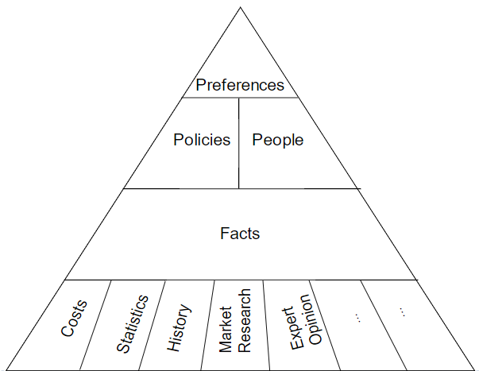

**Dealing with Abstractions**
- engineering econ models typically represent a project through estimates
of costs and benefits of project over time

**Modelling Process**

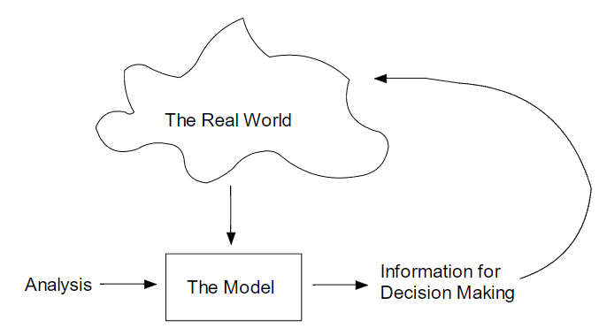

**Uncertainty and Sensativity Analysis**
- engineers make predictions using economic models
- sensativity analysis can identify _robust_ decisions
- we use design criteria

**Modern Design Criteria**
- components are function, cost, safety, sustainability

## Day 2 Jan 8, 2018

### What is Sustainability

> "Development that mettes needs of the present generation without compromising the ability of future generations to meet their own needs.
> SD is not a fixed state of harmony but a process of change in which exploitation of resources, direction of investment, orientation of technological development and institutiona change are made consistent"
\- UNICED 1987

#### Business Models
- Linear Model
	- yields a lot of waste

	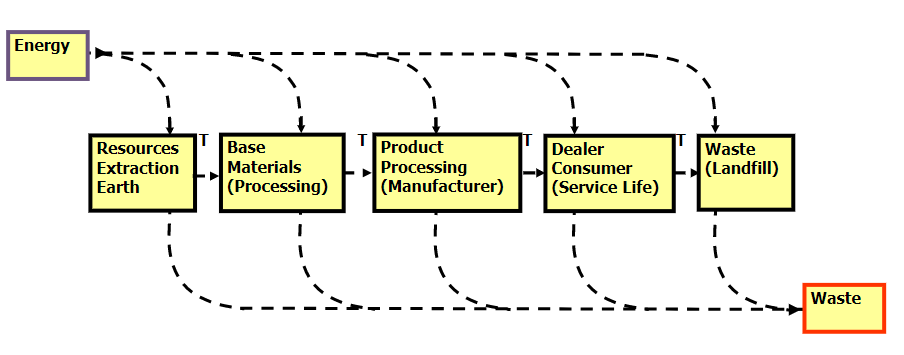

- Closed Loop Model
	- Nothing should be wasted

	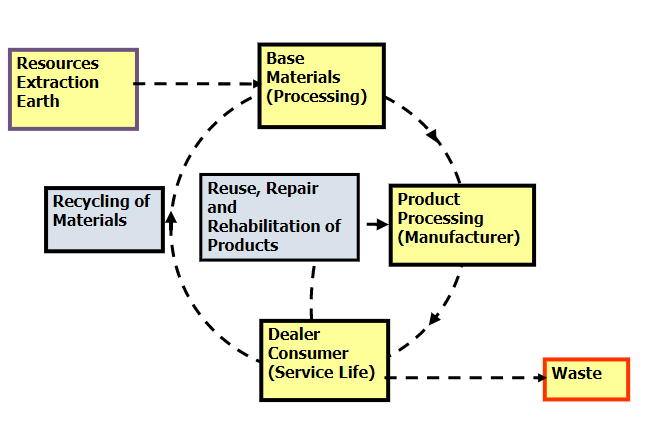

#### Important Variables in Sustainable Development

##### Global Goals
- Waste nothing
- adapt to the place
- use free resources
- optimize not maximize
- create livable environemtnt

##### Metrics and Tools
- life cycle cost analysis
- life cycle assessment
- ecological footprint analysis

##### Stakeholders
- should take end-user into consideration
- eg juice box design - one time use, flimsy straws

##### Ethics
- engineers have responsibility towards
	- client
	- profession
	- society

##### Complexity
- important for engineers to understand that their activites and designs will be operating in very complex systems

##### Triple Bottom Line
- need to think about social sustainbaility
	- socially sound, acessible to users
- environmental sustainability
	- conserve earth's resources and raw material
- economic sustainability
	- used to be the main focus

**Three Legged Stool**


### Case Study Interface Carpets
- example of company that has been trying to be more sustainable
- cut down ecologcal footprint by 1/3
- claims to be world's first sustainable corporation
- over 5 billion pounds of carpet now in landfills
- went from selling carpets to leasing carpets (floor covering services)
- Benefits
	- carpet tiles used so only worn out parts replaced
	- increases net employment
	- eliminates disruption
	- less glue fumes
	- incentive of keeping it in good condition '**_drive it like a rental_**
- invented new type of floor-covering called Solenium that can be remanufactured
- all worn materials can be completely separated
- in 10 years they saved $262 mill
- won $20M contract from U of California
- went from trucking to rail
- cut shipping cost by 50%
- inspired Wal-Mart to deploy sustainable practices
- 72% reduction in waste water

### Interest
- [Lump Sum Interest](#lump-sum-interest-rate)
- [Nominal Interest](#nominal-interest-rate)

#### Value of Time and Money
- would rather get a million dollars today vs 10 years
	- due to inflation
	- money has earning power over time (investments)
	- time allows money to earn interest
- engineering decisions involve analysis of costs and benefits
- key to this financial analysis and comparison is the **"interest"** 

#### What is Interest
- it is the **_compensation for giving up the use of money_**
- it is the **_difference between amount of money lent vs paid_**
- the _difference_ between a present amount of money an future amount is **interest**
	- ```future worth = present worth + interest```
	- ```F = P + I```
	- I = Lump sum interest
	- i = interest rate
	- F = future worth
	- P = present worth

#### Lump Sum Interest Rate
- when interest is specified as a percentage of the money borrowed (common)
- then...

```
I = Pi
F = P + I
  = P + Pi
  = P(1 + i)
```
##### Example
Peter wishes to borrow $50000 from his uncle and promises to pay it back after 3 years. His uncle agrees provided Peter pays 60% interest

**There is a legal interest rate, you can't go over 60%**
- or you get charged with usury
- also, lump sum is rarely used

```
i = 60%
I = P*i = 50000*(0.6) = 30000
Therefore F = P + I = 80000
```

#### Nominal Interest Rate
- **Interest rate** may be specified for an **interest period**

> Interest rate - rate of interest charged for use of money, usually expressed as annual rate

> interest period - base unit over time which an interest rate is quoted, usually 1 year
- interest rate specified for one year is a **_nominal interest rate_**
- same as annual percent rate (APR)

### Simple Interest
- rate that doesn't change
- rarely used in practice
- I<sub>S</sub> = PiN
- ``` F = P + PiN```
- there is also compound interest which results in a lot more money

#### Example 1
If $5000 is invested in a savings account at an interest rate of 4% per year, calculate simple interest earned over 3 years.

```
P = 5000
i = 4%
N = 3
I = P*i*N
  = 5000*0.04*3
  = 600
```

#### Example 2
If $5000 is invested in a savings accuont at interest rate of 4% per year, calculate the future worth of investment at the end of 3 years.

```
F = P + I
  = P + P*i*N
P = 5000
I = calculated as 600 in previous example
Therefore, F = 5600
```

## Day 3 Jan 9, 2018

- Amortization Period
	- the duration over which a loan is calculated to be re-paid

### Compound Interest
- **Simple Interest** - method of computing interest where interest earned during interest period is **NOT** added to principal amount used to calculate interest in next period
- **Compound** - standard method of computing interest where interest accumulated in one interest period is added to principal amount used to calculate for next period
	- F = P(1 + i)<sup>N</sup> OR
	- P = F/(1 + i)<sup>N</sup>
	- I<sub>C</sub> = P(1 + i)<sup>N</sup> - P
	- F is future worth
	- P is principal 
	- i is interest rate/compunding period
	- N is number of compounding periods

#### Interest Rate Terms
- compounding period:time between points when interest is computed and added to initial amount
- Payment Period/Cashflow Period - shortest time between payments
- Nominal Rate (r) - simplified expression of annual cost of money
- Annual Percentage Rate (APR) - this is what you see in commercials
	- nominal interest rate on yearly basis
	- Cdn Tire is 25% per year
- Effective Rate - is the rate that is used with the table factors or the closed form equations.
	- it converts nominal rate taking into account both the compounding period and the payment period

#### Sample Question 1
If $5000 is invested in savings account at nominal interest rate of 4% compunded yearly, what is future worth in 3 years?

```
P = $5000
i = 4%
N=3

F = P(1+i)^N 
  = (5000)(1 + 0.04)^3
  = 5624.32
```

#### Question 2
If $5000 is invested in a savings account at nominal rate of 4% compounded yearly, calculate the compound interest over 3 years

```
P = 5000, i = 4%, N=3
Ic = P(1+i)^N - P
   = 5624.32 - 5000
   = 624.32
```
#### Question 3
Manhattan Island was purchased for $24 in 1626. If that was invested at 6% how much would it be today?

```
i = 6%
P = 24$
N = 2018 - 1626
F = P(1 + i)^N
     = 1.88 B
```
#### Question 4
I borrow $100 now and pay you $1000 4 years from now. What is the implied interest rate?

```
Compound
F = P(1+i)^N
1000 = 100*(1+i)^4
i = 0.778

Simple
F = P*i*N
1000 = 100*i*4
i = 2.5
```

#### Credit Card tool
- and excel

### Cash Flow Diagrams
- represented by arrows and relevent periods
- upward arrow = positive flow (receipts)
- down arrow = negative flow (disbursements)
- time 0 is considered **now**
- 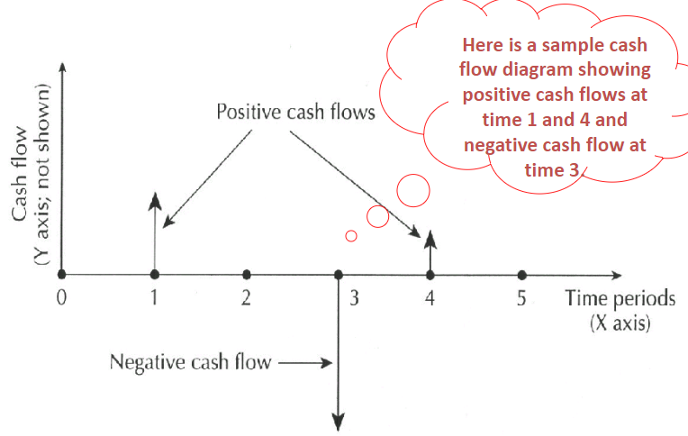

- can construct table outlining all cashflow activites
	- won't get marks for it but it helps 
- period from 0 to 1 is period 1, -1 to 0 is period -1
- end of period means the arrow will be drawn at that period

#### Nominal Interest Rate Revisited
- conventional method of stating annual interest rate
- 18% compounded daily --> ```i = 18%/365```
- ``` i = r/# compounding periods per year ```
- N --> if nothing is stated, assume yearly **except** in car payments and mortgages - assume monthly

#### Example 1
How much is accumulated after 2 years when you deposit $900 into a savings plan that is 12% compounded monthly?

```
P = 900
N = 2*12 = 24
i = 12%/12 = 1%

F = P(1+i)^N
  = 900(1+0.01)^24
  = 1142.76
```

## Day 4 Jan 11, 2018

### Timing of Cash Flow and Modelling

- Discrete Model
	- models that assume all cash flows occur at ends of conventional periods
- Continuous Model
	- not that common
	- assumes that all cash flow occurs continuously - continuous compund period

- can have discrete _cashflow_ and discrete _compounding_
- discrete cash flow - continuous compoounding
- continuous cash flow - continous compounding
- can't have continuous - discrete (continuous money and monthly period)

#### Comtinuous Compounding
- i<sub>c</sub> = effective compound interest rate/year
- r = nominal interest rate/year
- m = number of compounding periods in one year which is approaching infinity
- ```i = r/m``` and ```F=P(1+i)^n```

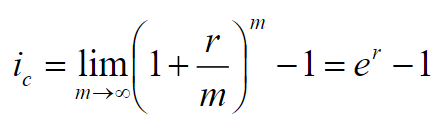

#### Example 1
What is the effective interest rate of an investment with a 6% nominal interest rate, compounded continuously?

```
using limit: e^0.06 - 1
```

### Equivalence
- condition that exists when value of cost is equivalent to another
1. Mathematical equivalence
	- million dollars today or million dollars in 10 years -- not equivalent in terms of value
	- million today or 1.5 mill in 10 years **may** be equivalent
2. Decisional equivalence
	- indifferent between P dollars now abd F dollars N periods from now
	- inferring implied interest rate from P, F and N
3. Market equivalence
	- decision makers can echange different cashflows in market at 0 cost
	- common when you're shopping around eg mortgages

- if market equivalence holds and decisional can be expressed in monetary terms, then we can assume that mathematical equivalnce can be used

#### Simplification of Cash Flow
- for when it gets too complex
- Convention: Sample Factor (compound amount factor)
	- ```(F/P, i, N)``` = (1+i)<sup>N</sup>
	- read as F given P, i, N
	- F = P(1+i)<sup>N</sup> = P(F/P, i, N)
	- P = F/(i+1)<sup>N</sup> = F(P/F,i,N)

#### Assumptions of Compounding Interest Factors
- if we have N periods, they have to be equally spaced
- payment at time 0 can be considered at end of period -1: _today_
```
@ 2 is end of 2nd month, beginning of 3rd month
          |
  --------------
  0   1   2   3	
  ```

#### Example
- present worth P of cashflow with arrows at 3 and 5
- P = sum of those future amounts 
= P<sub>0</sub> = F1/(1+im)^3 + F2/(1+im)^5
- in short form = F1(P/F, im, 3) + F2(p/F, im, 5)


## Day 5 Jan 15, 2018

### Compound Amount Factor

```(F/P, i, N)```
- allows you to mve single arrow to the future

#### Example 1
If you loan a friend $5000 so that they can buy a portable generator and they promise to repay you with an interest rate of 4% per year, calculate value of your investment in 3 years.

```
P = 5000
N = 3
i = 4%
F = P(1+i)^N
  = 5000*(1+0.04)^3
  = 5624.32
```

#### Example 2
How much money will be in a bank account at the end of 2 years if $5000 is deposited today? Interest rate is 12% compounded monthly.

```
P = 5000
N = 2*12
i = 12%/12 = 1%
F = P(1+i)^N
  = 5000*(1+0.01)^24
  = 6348.67
```

#### Example 3
How much money will be in a bank account at the end of 4 years if $5000 is deposited at the end of each year? Interest rate is 12% compounded monthly.

- multiple arrows for this one
- move all arrows to the future (to 48 months)

```
       |    |    |    |
  ---------------------
  0   12   24   36   48

Use equation 4 times
P = 5000
N = 12 24, 36, 48
i = 12%/12 = 1%
F = 5000(F/P, 0.01, 36) + 5000(F/P, 0.01, 24) + 5000(F/P, 0.01, 12) + 5000

```

**First quiz will be up on avenue on thursday! Due Sunday**
	- everything up to the thursday lecture

### Present Worth Factor

```(P/F, i, N)``` = 1/(1+i)<sup>N</sup>

```P = F/(1+i)^N```

- gives present amount from F
- bringing arrow from future back _N compounding periods_

#### Example 4
What amount desposited today into account bearing 12% nominal interest will give $5000 at the end of 2 years? Interest compunded monthly
```
i = f/m = 12%/12 = 1%
P = F(i/(1+i)^N)
P = F(P/F, 1%, 24)
```

#### Example 5
How much would you deposit into savings account at nominal interest rate 6% **yearly** to accumulate $5000 in 3 years

```
calculating P
P = F(P/F, 6%, 3)
```

### Textbook
- find it online and put the formulas in your crib sheet
- Appendix A - discrete discrete
- Appendix B and C - continuous - continous, discrete - continuous 

#### Example 6
Using interest tables, 12% nominal interest with monthly compunding (1%), N = 24 months, how much do I deposit today therefore you know F not P
- look for 1% and N = 24 = 0.7875 (tbh it's easier to calculate :grimacing:)

## Day 6 Jan 16, 2018

### Sinking Fund Factor and Annuity

```(A/F, i, n)``` = i/[1+i)<sup>N</sup> - 1]

**Annuity**
- a series of equal cash flows that start at the end of the first period, continue over N reglarly spaced time intervals
	- paycheck (in), cellphone bill (out)
- gives size of annuity that is equivalent to a future amount F
- N is the number of annuities
- if N = 12, there should be 12 annuities on cash flow diagram

#### Example 1
Melissa is saving up for server in 3 years. She thinks she needs $5000 and intends to put aside a uniform amount at the end of each year (an annuity). If nominal interest rate is 6%, how much should she put aside each year?

- cashflow diagram would have 3 annuities, totalling on the third one
- **note**: last annuity has to be on same space as total

```
r = rate = 6%
i = f/m = 6%
A = F(A/F, i, N)
  = 5000(A/F, 6, 3)
```

- however, if her first deposit is today, N=4!! **Example 2**

### Uniform Series Compound Amount Factor

```(F/A, i, n)```

```F = A(1 + i)```<sup>```N-j```</sup>

- if you have a quetion like what is F at 20 given 10 annual payments of $1000 at an interest rate of 5%. 
- F20 = 1000(F/A, 5%, 10) **wont** tell you what you have after 20 years, it's only after 10 years
- To get 20 years, use F given P equation. multiply the above by (F/P, 5%, 10) or if after 15 years, (F/P, 5%, 5)
- **DON'T WRITE** F20 = 1000(F/A, 5%, 20) because it means you have 20 $1000 payments

#### For Single Transactions
- Compound Amount Factor (F/P, i, N)

#### Example 3
Bob wants new truck in 3 years. If he saves $25000 each year and puts it in savings w/ annual rate of 4% how much will he have in 3 years
- N = 3, F = ?
- 25000(1 + 0.04)<sup>3-1</sup> + 25000(1 + 0.04)<sup>3-2</sup> + 25000(1 + 0.04)<sup>3-3</sup>
 = 27040 + 26000 + 25000 = 78040

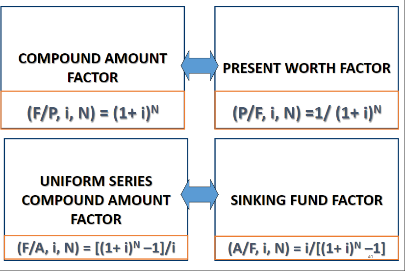

### Effective Interest Rate

 - actual annual interest rate obtained when the compunding period is less thaan 1 year is called the _effective interest rate/year_
 - denoted by i<sub>e</sub> (or subscript annual, quarterly, weekly)
 - if cashflow period is less than compounding period the cashflows will be _collapsed_ to the compounding period
 - no effective interest rates in first quiz
	- will be about first lecture, calculations on moving arrows on cashflow diagram, F given A, A given F application

## Day 7 Jan 18, 2018

#### Nominal vs Effective Interest
- nominal - stated rate of interest
- effecive interest rate - rate actually paid or earned because of compounding period less than 1 year
	- i<sub>e</sub> = effective interest rate/year
	- r = nominal interest rate/year
	- m = # of compounding periods in 1 year
	- r/m = nominal i/compunding period

**Equating future worth after 1 year**

```F = P(1 + i```<sub>```e```</sub>```) = P(1 + r/m)```<sup>```m```</sup>

thus ```i```<sub>```e```</sub> ```= (1 + r/m)```<sup>```m```</sup> ``` - 1```

#### Efective Interest Examples

##### Example 1 Slide 49
WHat is the effective interest rate/year of an investment with a 6% nominal interest rate, compounded daily?

```
r = 6%
m = 365
ie = (1 + r/m)^m - 1
   = 6.18%
```

**\*if i<sub>e</sub> only compounded once a year then it's equivalent to r*\**

**\*if compounded daily for ex. 6% it becomes 6.18%*\**

##### Example 2 Slide 53
How much money will be in a bank account at the end of 2 years if $5000 is deposited today? The interest rate is 12% compounded monthly.

- single arrow on cashflow diagram
```
(F/P, i N) = (1 + i)^N
F = 5000(1 + 12%/12)^24

is equivalent to

ie = (1 + 12%/12) - 1
F = 5000(1 + ie)^2 

F = 6348.67
```

### Effective Interest Rate and Cash Flow Period
- calculation period other than a year
	- nominal interest rate (r) is the conventional annual interest rate
	- compounding period (m) is the period used with compound interest method of computing interest
	- cash flow period (k) is the base unit of time over which an i<sub>e</sub> rate is calculated (may not be 1 yr)
		- k is the # compounding periods in 1 cashflow period

Therefore i<sub>e/k</sub> = (1+r/m)<sup>k</sup> - 1

#### Example 3
An investment earns a 6% nominal interest rate, compounded daily. What is the effective interest rate for a cashflow period of 1 month (30 days)?

```
ie = (1+r/m)^k - 1
   = (1+0.06/365)^30 - 1
   = 0.0049
   = 0.49%
```

**continued**

```
F in 5 years
F = A(F/A, 6%/365, 60)
```

### Critical Point
- when using factors, **n** and **i** must always match
- ex if using (1+i)<sup>N</sup>, the N and i should both be calculated w.r.t same unit of time
- **NOTE** 
	- interest doesn't start accumulating until the money has been invested for the full period
	- if cashflow period is less than compounding period then add up cashflows in compounding period to a single arrow
	- 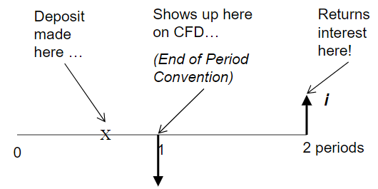

#### Example 4
A $5000 investment earns a 6% nominal interest rate compounded daily. What is the future worth of the investment after 5 years, using a cash flow period of 1 month?

**30 days is a bankers month**

```
ie = (1 + r/m)^k - 1
   = (1 + 0.06/365)^30 - 1

F = 5000*(1 + ie)^60
  = 6721.46
```

#### Example 5
A $5000 investment earns a 6% nominal interest rate, compounded daily. What is the future worth of the investment after 5 years using a cash flow period of 6 months?

```
ie<month> = (1 = r/m)^k - 1
Therefore k = 182 and N = 2*5 = 10
```

#### Example 6
Suppose you make quarterly deposits in a savings account which earns 9% interest compounded monthly. Compute the effective interest rate per quarter.
- per quarter = 4 times a year

```
ie = (1+r/m)^k - 1
m = 12
k = # compounding periods in each cashflow period = 3

ie<3 months> = 2.27%
```

### What Interest Rate to Use

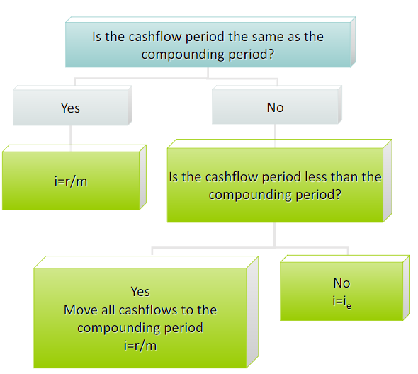

## Day 8 Jan 22, 2018
- next quiz will cover Day 9 (effective interest rate)

#### Example 1
A dot-com company plans to place money in a new venture capital fund that currently returns 18% per year, compounded daily. WHat effecctive rate is the a) yearly, b) semi-annually, c) quarterly, d) monthly?

```
ie = (1+r/m)^k - 1
m = 365 -> linked to effective interest rate and won't change
k = # compounding periods in cashflow period

a) k = 365 days
ie = 19.716%

b) k = 182 days
ie = 9.388%

c) k = 91 days
ie = 4.589%

d) k = 30 days
ie = 1.49%
```

#### Example 2 (effective)
Suppose you make equal quarterly deposits of $1000 into a fund that pays interest at a rate of 12% compounded monthly. Find the balance at the end of year 2.
- need to figure out k because cashflow period is more than compounding period

```
m = 12
i = r/m = 12%/12 = 1%
k = quarterly = 3
ie = (1+r/m)^k  - 1
ie = 3.03%

F = A(F/A, i, N)
  = 1000*(F/A, 3.03, 8) <--2 years of quarters
  = $8901.81
```

#### Example 3 (r/m)
Suppose you make equal quarterly deposits of $1000 into a fund that pays interest at a rate of 12% compounded quarterly. Find the balance at the end of year 2.

- same cashflow as example 2, different compounding periods. Use flow chart
- if cashflow period less than compounding period, use i = r/m
- in this case, cashflow period (quarterly) is same as compounding period

```
m = 4
i = 12%/4 = 3%
```

#### Example 4
You have a trust fund that will become available to you 3 years from now (at the end of third year). The fund will pay $10000 every 6 months starting at the end of the 3rd year for 10 years (to the end of 13th year). If you invest all this money into a savings acount that has an interest rate of 8% compounded weekly how much money will yu have 30 years from now?

- cashflow and compounding period are different (cashflow is 26 weeks, compounding is weekly, 52)

```
                  |  |  |  |  |      |
--------------------------------------
0  1  2  3  4  5  6        25  26    60

    (semi-annual)

r = 8%
m = 52
k = 26

ie = (1+r/m)^k - 1
   = (1+0.08/52)^26
   = 0.041

N = the number of arrows on cashflow diagram
  = by the end of 4th year there will be 3 arrows
  = by the end of 5th year there will be 5
  = (year_n - 3)*2 + 1 
  = 21

F_26(13th year) = 10000*(F/A, ie, 21)
F = A*i/[(1+i)^N - 1]
  = 10000*0.041/[(1+0.04)^21 - 1]
  = 322441.07

Now find future worth
F = P*(F/P, ie_month, 34)
  = 1254989.39
(F/P, ie_weekly(r/m), 884)
```

#### Example 5
You recently received $50000 from a relative. Your advisor told you he found a 1-year investment for you that provides 15% interest compounded monthly. 

1. What is the effective annual interest rate based on nominal rate of 15% compounded monthly?

```
~special case k = m~

ie = (1+r/m)^m - 1
   = (1+0.15/12)^12 - 1
   = 0.160755
```

If you invest $50000 today how much will you have at the end of 1 year?
```
i = 16.08%
N = 1

F = 50000*(F/P, i, N)
  = 50000*(1+0.1608)^1
  = 58037.75

OR

i = r/m = 16.08%/12
N = 12
```

## Day 9 Jan 23, 2018

Discussion on investing in ACB :trollface:

#### When to use effective interest 
Whenever you have annuity equation, you'll probably have to use effective interest because you have multiple arrows. If single arrow, can use either r/m or effective, it doesn't matter. Best to use the decision flowchart.

**Do problems on Avenue**

#### From last lecture

Hector says he will make the investment for you at fee of 2% of investments total value 1  year from now. What is the effective annual interest rate of this investment after paying Hector's fee?

```
So you have 58037*0.02 going to Hector
That leaves 56876 at the end of one year.

F1 = 56876
P = 50000
N = 1
F = P(1+i)^N
56876 = 50000(1+i)^1 
i = 13.75%
```

If your relative, instead of a lump sum, offered you 4 quarterly installments of $12500 each, how much would you have at the end of one year using Hector's investment (disregard Hector's fee). 

```
F1 = 12500(F/P,i,N) + 12500(F/P,i,N) + 12500(F/P,i,N) + 12500
15% compounded monthly therefore i = r/m = 15%/12
N would be 9, 6, and 3.

From original wording -> compouding monthly, cashflow quarterly.
Since cashflow is not less than compounding period, use effective interest

k = number of compoundng periods in cashflow period = 3
i_quarterly = (1+r/m)^k - 1
            = (1+0.15/12)^3
            = 3.8%
F = 12500(F/A, 3.8%, 4)
F = 12500((1+i)^4-1)/i
F = 12500(4.233)
F = $52920

If it was semi-annual compounding and cashflow still quarterly, we would do i = r/m because cashflow is less than compounding.
i = r/m = 15%/2

F = 25000(i+r/m)^1
OR
F = 25000(F/A, r/m, 2)
both give same answer
```

On test you'll get questions like:
- If cashflow is daily and compounding is monthly, what is your interest rate?

### Capital Recovery Factor

(A/P, i, N) = (A/F, i, N)\*(F/P, i, N) = i*(1+i)<sup>N</sup>/[1+i]<sup>N</sup>-1]

- how much money do I have to save/make to make my investment worthwhile
- gives value, A, of the equal periodic payments or receipts that are equivalent to a present amount P, where
- cashflow diagram starts with initial amount P and you get annuities during the following N periods
- uses F given P equation and A given F equation

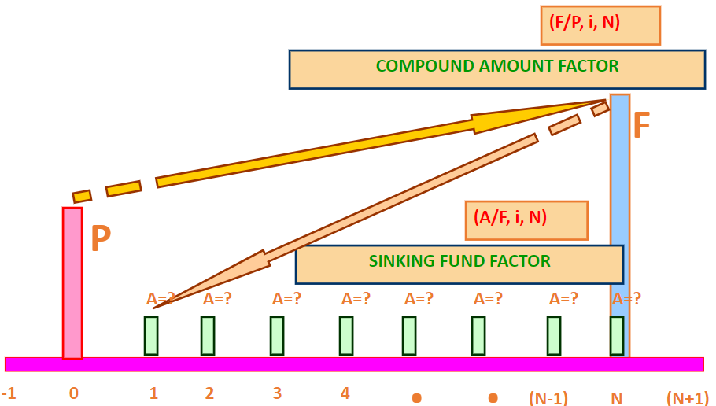

#### Example 1
You are considering buying a digital camera for $5000 which you will use for 5 years. It has 0 salvage value. If the nominal interest rate is 10%, what is the expected yearly return on the camera.
- how much money camera needs to bring in to breakeven

```
A = P(A/P, i, N)
A = 5000(A/P, 10, 5)
*compounding and cashflow periods are both annual*
A = 5000*(0.26380)
  = 1319
```

### Salvage Value
- most assets have a value for which they can be sold for
- **WONT** be on Quiz 2

		A = P(A/P, i, N) = S(A/F, i, N)

#### Example 2
You are considering replacing your water heater and buying compact point-of-use water heaters for $5000 with a salvage value of $500 after 5 years. If the nominal interest rate is 10%, what is the expected yearly return on the compact heaters.

```
A = P(A/P, i, N) - S(A/F, i, N)
  = 5000(A/P, 10, 5) - 500(A/F, 10, 5)
  = 1237.10

```

### Series Present Worth Factor

(P/A, i, N)

- when you have annuities and you want to find P
- reciprocal of the previous equation

#### Example 3
Repaying your tuition requires 24 montly payments of $565. Interest is charged at an annual rate of 12% compounded monthly. How much is your loan?

```
(P/A, i, N)
P = 565
i = 12%/12
N = 24 (# of annuities)
```

Midterm - Mar 6, 7-9

## Day 10
- no lecture!

## Day 11 Jan 29, 2018

### Equivalence Examples

#### Midterm Question
The two cashflow diagrams below are equivalent at an interest rate of 12% compounded annuallyy. Determine the unknown value, c


**How to solve:**
- you can simplify the cashflow diagram
- 100, 100, 100, 100, 100 and 0, 0, 200, 200, 200
- LHS:
	- total amount at P=0 = 100(P/A, 12%,5) + 200(P/A, 12%, 3)*(P/F, 12%, 2)
- RHS:
	- total amount at P=0 = C(P/A, 12%, 5) - C(P/F, 12%, 3)
- LHS = RHS, solve for C
- C(P/F, 12%, 1) + C(P/F, 12%, 2) + ... + C(P/F, 12%, 5) would give you the same thing
- we can also move all of the cash to the 5th year:
	- LHS (Fs) --> 100(F/A, 12%, 5) + 200(F/A, 12, 3)
	- RHS: C*(F/A, 12%, 5) - C(F/P, 12%, 2)
- another way, you take the arrows and turn them into equivalent annuity
	- LHS: 100 + 200(F/A, 12%, 3)*(A/F, 12%, 5)
	- RHS: C - C(F/P, 12%, 2)*(A/F, 12%, 5)

#### Example 2 Who Wants to Be a Millionaire 
Investment: F= 1000000, r=6%, compounding monthly, total period 50 years.

How much does he have to save every day
- i = r/m or i<sub>e</sub>
- r/m because cashflow is daily and is less than compounding monthly

```
A = F*(A/F, i, N)
  = 1mill*(A/F, 0.5%, 600)
  = 1mill*(i/[i+1]^N-1])
  = 1mill*(0.005/[(1 + 0.005)^600-1])
  = 264.05
  => divide by 365
```

#### Example 3 Series Present Worth Factor
You paid of an 80000 loan completely in 48 months. You paid 2000 per month plus you paid an extra lump sum of $7000 at the end of first year. What was the interest rate on the loan?

```
80000
|
----------------------->
  ||||||||||||||||||||->
              |
48 arrows going down of 2000, after 12th a longer arrow plus 7000

A = 2000
i = ?

80000 = 2000*(P/A, i, 48) + 7000*(P/F, i, 12)

i = 1.12%

```
- really easy to do with goal seek on excel or linear interpolation
- x value is interest rate nd y values re right hand side 
- this will be on midterm, will be given range for interest
- x* = x1 + (x2 - x1)\*[y\*-y1/y2-y1] = 1.0 + (1.5 - 1.0)*(80- 82.1601/73.93-82.1601)
- using 1% and 1.5% interest rate and solving the above equation

#### Example 4

Reginald is budgeting for the next 5 years. His disbursements are listed in the table. If he wanted to pay for everything from one lump sum, how much would he hav to have in his bank today if it pays 3% interest compounded monthly? The tax payments constitute the previous year's payment and therefore a payment will be made starting todat and the last payment will be made at the end of the 5th year.
- rent is 700$, monthly, end of 1st month
- utilities is 300, bi-monthly, end of 1st month
- personal taxes are 1500, annually, today

```
draw cashflow
- 6 down arrows of 1500 today and for omce per 5 years
- 30 down arrows of 300 bimonthly for 5 years
- 60 down arrows of 700 monthly for 5 years

rent: (P/A, r/m, 60)
- pretty straightforward

utilities: (P/A, ie, 30(?))*(F/P, r/m, ) --> k = 2, m = 12
- 

taxes: (P/A, ie, 6)*(F/P, ie, 1) --> k = 12, m = 12
Alternative method for taxes: Po = 1500 + 1500(P/F, ie, 1) = 1500(P/F, ie, 2) ..

P = 700(P/A, 0.0025,60) + 300(P/A, 0.005006, 30)*(F/P, 0.0025, 1) + 1500(P/, 0.30416, 5) + 1500
  = 38956.65 + 8358.31 + 6861.41 + 1500
  = 55676.37

```

## Day 12 Jan 30, 2018

**continuing with example from last lecture**

#### Example 5
- skipped

### Arithmetic Gradient Series
- series of receipts or disbursements that may start at 0 or have base value at the end of first gradient
- there is an increase of constant amount [G]
- we are going to take this **gradient** and find the equivalent annuity or the **base annuity component** [A']
- gradient can be negative as well

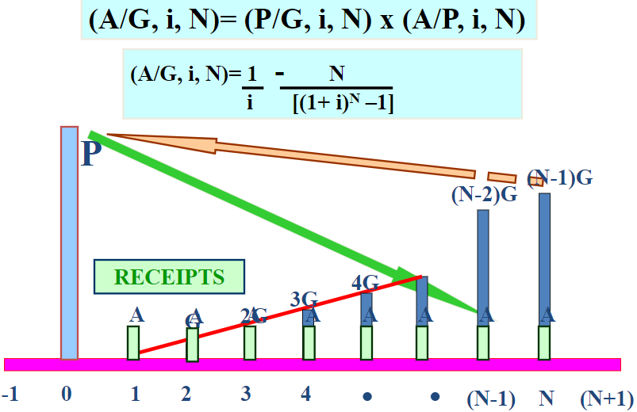

- base value is A' and the amoutn it increases by over periods is G
- in following example, base = 300 and G = 200 

```
 300 500 700 900 1500
  |   |   |   |...|
-------------------
0 1   2   3   4...7

have to include base so N = 7, goes from 1-7
A = A' + G(A/G, i, N)
  = 300 + 200(A/G, i, 7)
```

#### Declining Linear Gradient
- down arrows
- starts with -1200 at 1, -1000 at 2, -800 at 3 all the way to 400 at 5

```
A = -1200 + 200(A/G, i, 5)
or
A = 1200 - 200(G/A, i, 5)
```

#### Example 1

Your company as just opened and must dispose of its biomedical waste. The base cost that was quoted to you was $6000 but as business increass you expect the cost to grow by $100 per month. If the interest rate is 10% compounded monthly ehat is the future cost of the disposal at the end of the year?

```
in this example the down arrows increase over time by 100

A' = 6000
G = 100
i = (10/12)%
N = 1*12

A_tot = A' + G(A/G, i, N)
      = 6540.11

then alculate F
F = A(F/A, i, N)
  = 6540(F/A, 0.8333, 12)
  = 82180.20
```

##### Shifted Gradient
- i = 10%
- use A' + G(A/G, i, N) and then P/A

#### Arithmetic Gradient Series to Annuity Conversion Factor

Cases | Meaning
------|-------
A>0 and G>0 | positive annuity and increasing cash flow
A>0 and G<0 | positive annuity and decreasing cash flow
A<0 and G> 0 | negative cashflow but becoming less so, closer to x-axis
A<0 and G<0 | negative cashflow but becoming more so


#### Example 2 Winning the Lottery

You win a lottery and have 2 payment options. The first is a lump sum payment of 3.44 mill dollars today. The second option pays out installments over 26 years. The payment schedule is $175000 one year from today and seond is 189000 in 2 years and subsequen yearly payments that increase each year by 7000 ffor a final payment in 26 years of $35700. If an interest rate of 4.5% is used what is the present worth of each option?

```
base = 189000 and G = 7000
it's a shifted gradient becasue base starts 2 years from now

Atot = A' + G(C/A, i, N)
N = 25
G = 7000
A' = 89000
i = 4.5

A_gradient = 68292.67

A_tot = 68292.67 + 189000
      = 257292.67

if there is a gradient you must use the A/G equation and then use other ones

in this case, we use P given A

but since we need to move back one year, we use P given F as well

P_Opt2 = (175000 + 257292.67*(P/A, 4.5, 25))*(P/F, 4.5, 1)
= (175k + 257292.67(14.828209))(0.9569)
= 3818363

```

## Day 13 Feb 1, 2018

#### Example 1
John and Barbara have just opeed 2 savings accounts at their bank. The account earns 10% interest compounded daily. John wants to deposit $1000 into his account today and then make monthly deposits that would increase by 300 each time. FOr instance at the end of first month he would make a 1300 deposit and at the end of the second month a 1600 deposit. He will do this for 1 year. Barbara wants to make monthly deposits of an equal amount for the next year but she starts her deposit at the end of the first month not today. What should be the size of Barbara's monthly deposits so that the 2 accounts have equal balances at the end of the year.

```
ie = (1+r/m)^k - 1

(A/G, i, N) = 1/i - N/[(1+i)^N-1]

is cashflow (month) less than compounding (day) - No 

k = 30

Atot = A' + G(A/G, i, N)
A' = 1000
N = 13
G = 300
imonthly

ie = ((1+((10/365)/100))^30)- 1
A_john = A' + G(A/G,ie, 13) = 1000 + 300*5.885 = 2765.49

to turn into N equal annuities we can use A/P equation
Po(A/P, i, N)
N = 12


John's first payment is made today so we need to take that single payment and make it into an annuity. SO the annuity from the first payment is found using A/P
A_firstpayment = P(A/P, ie, 12) where A = A_john = 243.01
Barbara's monthly payments are ABarbara = A_firstpayment + A_John = 2765.49 + 243.01 = 3008.5
```

### Geometric Gradient Series

(P/A, g, i, N) = (P/A, i<sup>0</sup>, N)/(1+g)

- has 4 factors
- i<sup>0</sup> is the growth adjusted interest rate
	- = ([1+i]/[1+g]) - 1
- 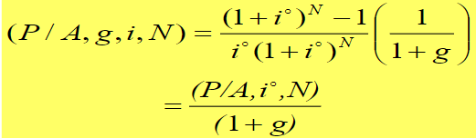

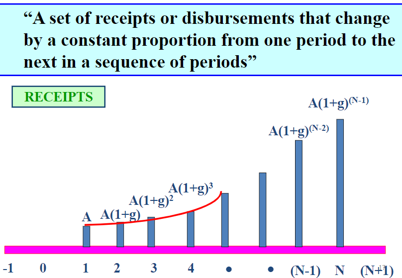

Cases | Meaning | Procedure
------|---------|----------
i>g>0 | growth positive, but less than rate of interest thus 1^0 is positive | use tables/formula
g>i>0 | growth positive, but more than rate of interest thus i^0 is negative | use formula **only**
g=1>0 | growth equals rate of interest thus i&0 is zero | special case: P = N[A/(1+g)]
g<0 | growth is negative ths i^0 is positive | use tables or formula

#### Example 2

Your retirement benefits are worth $50000 per year which should cover cost of living. However cost of living is said to increase 5% per year. Your investments can make 7% per year. How much should you invest to cover you for 25 years.

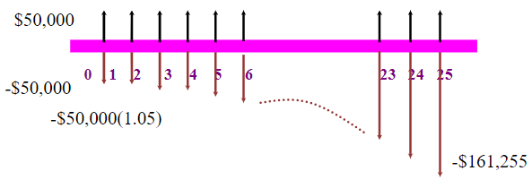

```
i = 7%
g = 5%
cost of living is a negative so g is a negative

pension is 582679
i^0 = 0.019

P = 50000(P/A, 1.9, 25)/(1+0.05) = 940696

delta P = 940696 - 582679 = 358017

```

#### Example 3 
**Geometric Gradient to Present Worth Conversion Factor**

Your company has opened and must dispose of biomedical waste. Base cost was quoted as $6000 but as business increases you expect cost to grow by 1% per month. If interest rate is 10% compounded monthly what is the future cost of disposal at the end of first year?

```
g > i so use formula
6000(P/A, g, i, N)
i = 10%/12
N = 12

this equation will give you equivalent amuont at 0

to move the single arrow into the future you use F/P

therefore multiply 6000(P/A, g, i, N) by (F/P, 10%/12, 12)

if we change it to the 3rd year, instead of N = 12 we would use N = 36

P = A(P/A, g, i, N)
  = 6000 * 12.009617 = 72057.70
F = P(F/P, i, N) = 72057.70(F/P, 0.8333, 12)
  = 79603.08
```

**\*Quiz includes geometric**

#### Example 4
Planning for the next 10 years, you need to start hiring employees in 2 years. You anticipate monthly wages you pay will start at $10000 and increase by 5% each month. If interest rate is 3% compounded monthly and first payment starts 25 months, what is the present cost of your workers over next 10 years?

```
g = 0.05
i 3/12
i^0 = ([1+i]/[1+g]) - 1
    = -0.0452
P = 10000(P/A,g,i,N)(P/F,i,24)
  = 10000(P/A, 0.05, 0.0025, 96)(P/F,0.0025,24)
  = 10000*1765.75*0.9418
  = 16630451.56

```

## Day 14 Feb 5, 2018

short - betting against the stock
put - ??

### When N Approaches Infinity
- long-lived projects 
- P = A/i
- might have 1-2 questions on the quiz on this

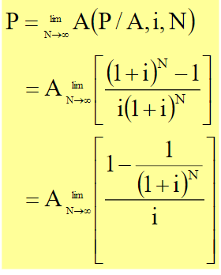

### Mortgages
- basically means death pledge
- **amortization** - number of years it would take to repay a mortgage loan in full for given interest rate and payment schedule
- **term** - number of years the agreed upon interest rate is fixed. duration over which loan agreement is valid

#### Fixed Rate Mortgages
- **open fixed rate mortgages** - able to repay in full or in part at any time with no prepayment charge. You can also change to another term any time without charge.
- **closed fixed rate mortgage** - interest rate and payments are fixed for the term you choose
- **convertible fixed rate mortgage** - lets you convert to closed term of 1 year or longer at any time without charge.

#### Variable Rate Mortgages
- ???

#### Fixed vs Variable

. | fixed | variable
--|------|-------
description | set for duration of mortage term | fluctuates wth market
pros | eases budgeting anxiety | proven to be less expensive over time
cons | if difference btwn fixed and variable is large, may not be worth paying premium for stability and protedction | financial uncertainty

#### Example 1
Bobby bought a house for $200000. He paid $50000 down, mortgage has nominal interest rate of 10% compounded monthly with 10 year amortization period. The term of mortgage is 5 years. What are Bobby's current monthly payments. How much does he owe in 5 years?

```
2 part question
A = ?
P = ?

P0 = 150000
r = 10%
m = 12
N = 10 * 12

A = P(A/P, i, N)
  = 150000(A/P, .10/12, 120)
  = 1982.26

for the second part
P = 150000
i = .10/12
N = 5*12
A = 1982.26

P60 = A(P/A, i, 60)
    = 93295.85

OR

P60 = 15000(F/P, i, 60) - A(F/A, i, 60)

After 5 years, Bobby still owes $93295.94
```

#### Bobby's Payment Breakdown
- P<sub>remaining</sub>
- P<sub>p</sub> + A =  I<sub>p</sub>
- after 5 years, Bobby will need to renegotite his mortgage and choose a new term
- usually annuity payment amount will not change, the actual amortization period have changed

## Day 15 Feb 6, 2018

#### Example 2

You bought a house that is worth 1.9 million and you will give 60 payments of 10000 mortgage. Interest rate = 6% compounded monthly

```
P = A(P/A,i,N)

1900000 = 10000*(P/A, .6/12, 60)

Using Goalseek
601 payments
that's why we don't have 50 year amortization - it's too much interest

```

#### Example 3 Car Payments

Determine monthly payments required if you want to borrow 30k from a bank to buy a car at 6% interest compounded monthly for 6 years

```
i = 0.6/12
P = 30000
A = 30000(0.005*(1+0.005)^72/((1+0.005)^72-1))
  = 497.19

the 24th payment is 497.19
- the interest -> Ip
- principle reduction -> Pp

Po = 30000
P23 = A(P/A, 0.06/12, 23)
30k = A(P/A, 0.06/12, 23) + F(P/F, .06/12, 23)
F = 21560
or
P = A*(P/A, 0.06/12, 72-23)
interest is $107.80
and p reduction $389.39

You can also do F23-F24 to get principle reduction

```

For previous car loan, when you hand the bank your cheque for the 24th payment (answered above).

How much interest do you pay overall for those 6 years
- bank makes $5800 off of you

```
total interest= 497.19(72)-30000 = 5797.6
```

### Residential Mortgages
- a secured loan using a residencial property as collateral
- _conventional mortgage_ : when based on cerdit of purchaser and collateral

#### Amortization Period
- July 2008: reudced max length of insured high-ratio mortgage to 35 years
- Jan 2011: max amortization period dropped to high-ratio insured 30 years
- June 2012: brought down to 25 years

#### Credit Approval
- when you apply for mortage they look at 2 things
  1. payment to income ratio
  2. loan to value (LTV)
    - higher ratio -> higher probability of default
    - ltv of oer 100% is concerning

#### Down Payments
- for new mortgage loans, LTV is based on amount paid as down payment
  - if you put 15% down and you don't have debt then your ltv is 85%
- in canada, mortgage loan is required when it is more than 80% if purchase
- minimum is 5% but you have to get insurance (with CMHC insurance)
- Feb 15, 2016 -> homes less than or equal to 500k the minimum is 5% down
- for homes with purchase price greater than 500k and less than 1 mill, minimum is 5% of first 500k and 10% of remaining balance
- 1 mill+ homes, minimum down is 20%

### Stress Test
- as of Jan 2018
- originally only applied to people applying for high-ratio mortgages or mortgage term of less than 5 years
- you have to show that you can afford an mortgage
- either 5 year bench mark rate, at a rate of 4.89% OR it's based upon your current rate and they add 2% to it and see which one is bigger

#### Example 1 Stress Test
Famlily with yearly income of $100k qualifies for 5 year fixed rate mortgage at 2.83%. They have a 25-year amortization period and are making a 20% down ayment. If they applied before Jan 1, 2018 they could hav been able to afford $726939 but htey did it after so thye can afford $570970.

Same family with same income qualifies for 5 year fixe contract rate mortgage at 3.09% with 25 year amortization. Until Jan 1 they could afford $706692 but after stress test is applied they have to add 2% (now 5.09%) and can only afford $559896 house

## Day 15 Feb 8, 2018

**skipped**

#### Mortgage Interest
- Canada Bank Act: quoted rates must be stated on semi-annual compounding basis monthly rate is (1+r/2)^1/6 - 1
- in the US it is monthly payments

#### Example 1 Mortgage
You have negotiated a 25-year, $100k mortgag at rate of 7.4% per year compounded semi-annually w/ TD Bank. To answer most mortgage questions we have to convert quotd annual interest compounded semi-annually to get actual interet charged each month/get efective monthly period rate.

```
EPR = 0.074/2%
EAR = (1 + EPR)^2 - 1 = 1.037 - 1 = 7.5369%
EPR_1/12 = (1 + EAR)^1/12 - 1 = 1.075369^1/12 - 1
        = 0.00607369 = 0.607369% PER MONTH

What is the monthly payment on the above mortgage?

PVo = $100000
EPR_1/12 = 0.607369
T = 25*12 = 300 months

Mortgage is annuity with equal monthly payments therefore we use annuity

A = 100000(A/P, 0.00607369, 300)
  = 725.28
```

### Bonds
- issuer in return pays investor interest at predetermined rate and schedule (coupon)
- date to repay amount borrowed (face value) is maturity date
- known as fixed-income securities because you know exact amount of cash you get back provided you hold it to maturity

#### Debt vs Equity
- bonds are debt and stocks are equity
- by purchasing stock, investor becomes owner and has right to vote
- by purchasing bonds, investor becomes creditor to corporation and has higher claim on assets but no share in profits

#### Why Buy Bonds
- because stock market is very volatile
- retirement
- short time horizons - money needed for specific purpose

#### Bond Rating
- safer investments have higher ratings whereas risky investments have low ratings
- **junk bonds** bonds of companies in financial difficulty, must offer higher yields

#### Government
- treasury bonds: maturity > 10 years
- treasury notes: maturity 1-10 years
- treasury bills (T-bills): maturity < 1 year
- govt securities considered extremely safe in industrialized countries

#### Corporate
- short term < 5 yrs
- intermediate term: 5-12 yrs
- long term: > 12 yrs
- higher yields than govt bc higher risk, credit quality determines interest rate

#### Terminology
- par or face valu is amount needed for which bonds can be redeemed for at maturity
  - actual price of bond would be different from face value except at redermption
  - corporate bonds normally have $1000 par values when issued

#### Coupon - interest rate
- amoutn investor receives as interest payment
- most bonds pay interest every 6 months but it's possiel for them to pay more or less frequently
- **fixed rate**
- **floating rate**
- for example - coupon rate of 10% on a bond with $10000 face alue would pay annuity $500 every 6 months


