# 3A04 Software Design III 

## Table of Contents
- [Course Breakdown](#course-breakdown)
- [Last Year Final Exam](#last-year-final-exam)
- [Introduction to Software Architecture](#introduction-to-software-architecture)
- [Role of Software Architect](#role-of-software-architect)
- [Software Architecture Design Space SlideSet 2](#software-architecture-design-space-slideset-2)
- [Software Elements](#software-elements)
- [Group Project Overview and Deadlines](#group-project-overview-and-deadlines)
- [Software Connectors](#software-connectors)
- [Iterative Refinement of an Architecture](#iterative-refinement-of-an-architecture)
- [Models SlideSet 3](#models-slideset-3)
- [4 plus 1 Model](#4-plus-1-model)
- [UML for Software Architecture](#uml-for-software-architecture)
- [Surprise Quiz 1](#surprise-quiz-1)
- [How to find the views](#how-to-find-the-views)
- [Tutorial 2 Jan 23, 2018](#tutorial-2-jan-23-2018)
- [UML](#uml)
- [Structural Class Diagrams](#structural-class-diagrams)
- [Structural (Static) Diagrams](#structural-static-diagrams)
- [Behavioural (Dynamic) Diagrams](#behavioural-dynamic-diagrams)
- [General Design Principles SlideSet 4](#general-design-principles-slideset-4)
- [Design Principles for Security](#design-principles-for-security)
- [Data Flow Architecture SlideSet 5](#data-flow-architecture-slideset-5)
- [Batch Sequential](#batch-sequential)
- [Pipe and Filter Architecture](#pipe-and-filter-architecture)
- [Process Control Architecture](#process-control-architecture)
- [Data Centered Software Architecture SlideSet 6](#data-centered-software-architecture-slideset-6)
- [Repository Architecture Style](#repository-architecture-style)
- [Blackboard Architecture Style](#blackboard-architecture-style)
- [Midterm 2017](#midterm-2017)
- [Hierarchy Structure SlideSet 7](#hierarchy-structure-slideset-7)
- [Main Subroutine Software Architecture](#main-subroutine-software-architecture)
- [Master Slave Architecture](#master-slave-architecture)
- [Layered Architecture](#layered-architecture)
- [Virtual Machine](#virtual-machine)
- [Discussion 1](#discussion-1)
- [Interaction Oriented Software Architecture SlideSet 8](#interaction-oriented-software-architecture-slideset-8)
- [MVC](#mvc)
- [PAC](#pac)
- [Discussion 2](#discussion-2)
- [Distributed Architectures SlideSet 9](#distributed-architectures-slideset-9)
- [Multi Tier Architecture](#multi-tier-architecture)
- [Broker Architecture](#broker-architecture)
- [Service-Oriented Architecture](#service-oriented-architecture)
- [Exercises](#exercises)
- [Heterogeneous Architecture SlideSet 10](#heterogeneous-architecture-slideset-10)
- [Product Families SlideSet 11](#product-families-slideset-11)
- [Product Family Algebra](#product-family-algebra)
- [Final Exam](#final-exam)

_Images are from Dr. Khedri's Lecture Slides for SFWR ENG 3A04 Software Design II._

## Day 1 Jan 5, 2018
- Fridays are for problem solving :relieved:

### Course Breakdown
1. Software requirements
    - Pre-reqs
    - reqs
    - Architecture design 
    - Coding
    - Testing
2. Software architecture design space (types of software structures, software elements, sofware connectors)
3. Design Principles for sustainable systems
4. How to approach practical problems using architecture design

### Last Year Final Exam
- answers can be found in [Exercises](#exercises)
1. Using appropriate design principles, compare 2 designs in the figure.
    - Design A - interconnected, multi-directed, a lot of things depend on other things
    - Design B - organized, singly directed, not a lot of interdependency
  
  Design B is better as it has low coupling high cohesion! :bowtie:
  
2. Build simple software that translates Fahrenheit to Celcius. Choose suitable architecture design.
    - not that hard :innocent:
    
3. AI system. Algorithm has uncertainty therefore we need specific architecture. What wil be the most suitable architecture?
  
4. Given context for system, system to allow fire dept to follow fire situation in agricultural, forest, industrial areas. System will have sensors for each area.
    - choose appropriate software architecture
 
#### Grading and Textboook
- Project
  - teams of 4-5 (not chosen by us :cold_sweat:)
  - need log book 
  - will appoint leader 
- Surprise 5-10 minute Quizzes :expressionless:
  - up to 6, can drop 1
- Midterm (Feb 26) worth 20%
- Exam
  - counts for (40 - 2* number of quizzes that count)% of your score
  - eg if 4 quizzes then (40 - 2*3)% = 34%
  - may be oral?
  
**Textbook:** Software Architecture and Design Illuminated
  
## Day 2 Jan 8, 2018

### Introduction to Software Architecture

#### What is Design
- can be seen in any human artefact and in nature
- objective and subjective
  - aesthetic (look and feel) vs functional (speed performance)
  - artistic or mathematical or both?
- decomposition of complex systems/artifacts is an aim of design

#### Design as a mathematical activity
- Construction of a deterministic finite automata that takes in strings of binary with even number of 0s and number of 1s is a multiple of 3
- **Design Process**: create a language to satisfy constraints
- L(M3) is an intersection of 2 languages L(M1) and L(M2) therefore we use product construction

Design could be viewed as an activity that translates an idea/goal into a blueprint for an artefact or a process that is fit for its envionment

## Day 3 Jan 10, 2018

- Group project: **identifying objects** :frog:
- good design in software reduces risks
- makes system traceable for implementation and testing

#### SDLC V Model


#### What is meant by Software Architecture
- blueprint for developing small and large systems based on requirement analysis
- highlights early decisions
- has set of constraints (space, time, budget)
- Considers separation of concerns
  - each software component hides something
- there are connectors between software components

:sleepy:

**Must be included in software architecture**
- specialization of software elements
- connection types
- set of constraints (space, time, budget)
- set of desired quality attributes (eg performance)

#### Architecture Style
- proposed architecture can address some or all of desired attributes
- families of architectures have similar choices on element types and connections
- each arch. style represents
  - the way elements are arranged
  - connections and interactions among elements
  - control transfer among elements in system
  - semantic constraints and behaviours concerning data trasnfer of the architectural style
  - quality attributes trade-off
- partial list of quality attributes
  - performance
  - reliability
  - portability
  - usability
  - security
  - maintainability
  - adaptability
  - usability

#### System Architecture
- IEEE Std 1471 - "the fundamental organization of a system embodied in its components, their relationships to each other, and to the environment, and the principle guiding its design and evolution"

### Role of Software Architect
- system static partioning
- decomposing system into sub-systems
- establish dynamic control relationships between sub-systems in control flow/data flow/message dispatching
- quality attribute tradeoff analysis
- ensure that chosen arch. style satisfies functional and non-functional requirements
- promote high cohesion and loose comp

## Day 4 Jan 12, 2018

### Software Architecture Design Space SlideSet 2
- software architecture can be given from several perspectives
  - [software code units](#code-structure) (elements are source, binary code, modules or software component deployment units)
  - [project's runtime structure](#project-runtime-structure) (elements are threads, processes, sessions, transactions)
  - [allocation structure](#software-management-structure) (project management structure)
- each structure class uses different connectors and different performance attributes

:cry: :cry: **so hungry** :cry: :cry:
 
#### Code Structure
- **module** : software component that hides a secret - big part of code structure
  - behaviour hiding modules
  - hardware hiding modules (hide communication between software and hardware)
    - eg robot's secret is its language
  - software hiding modules
    - have secrets like algorithms, data structures (can be generalized to 3 types - tuples, list, sets)
  - each module is assigned function/non-functinoal attributes and public APIs
- there are dependency relations between modules
  - contains
  - follows
  - delivers data to
  - uses
- amount of knowledge that component modules have of each other kept to minimum (**high cohesion low coupling**)
- information flow between compoenents is restricted to flow from method calls
  - the **uses** relation is often called a "call graph" for this reason 
- connectors in structures have:
  - direction - if module A invokes a method of module B then A -> B is connected
  - synchronization
    - asynchronous - operates independently of other processes
    - synchronous - process runs as result of other processes
- sequence - some connectors must be used in particular sequence (label connector with sequence id)

 ## Day 5 Jan 15, 2018

- last week we began to look at 3 architectural views - code view, runtime view, management view

#### 3 things in architecture
- we give many views that provide 3 things
  1. components
  2. connectors
  3. rationale for having the above to explain non-functional reqs

#### Project Runtime Structure
- at runtime project can be **threads**, **processes**, **functional units** and **data units**
- these elements may run on the same or multiple computers
- elements in code structures can implement or support multiple runtime elements (modules implement processes)
- several code structure elements may implement or support single runtime element (many threads run many methods from in different code units)
- connectors at this level inherit atributes from their source-code counterparts
  - **multiplicity** - one element may be connected to multiple other elements if it needs to invoke methods of multiple elements at runtime
  - **distance and connection media** - two connected elements may communicate in the same process/thread/computer
    - eg communication by optical cable OR LAN to the media
  - **universal invokable** - protocol to communicate with an element, allows ANY external software system to invoke the method at connector's target
    - software protocol is a way of exchanging information eg bluetooth is 15 dif protocols
    - allows heterogeneous info systems
  - **self-descriptive** - allows external software system to invoke its target methods without pre-installation
    - eg bluetooth devices discovering each other

#### Software Management Structure
- ~~are we skipping this just because???~~
- used for project resource allocation

### Software Elements
- they have functions and are connected into dependency graphs through connectors
- each one has different synchronization and performance constraints
- some elements are re-entrant 
  - usually more efficient since they avoid synchronization, therefore can be safely executed concurrently, they can be implemented by any thread or process
  - if element is not reentrant then it should not be more than one thead executing in it at any time
  - can have an element be invoked by limited number of other elements or unlimited (performance issue)

#### Basic Guidelines for runtime elements
1. if an element is reentrant, it can be implemented by any thread/process
    - usually more efficient
    - business logics may not allow some elements to be reentrant since order of operations matters a lot when you have shared resources
2. if element is not reentrant and multiple threads or processes may need to communicate with it, must run on separate threads or processes (thread safety)
3. if element has high multiplicity and performance is important to global system, use an application server for implementation
    - take advantage of thread/resource pooling and data caching
4. if heavy computations involved for deployment at particular location, consider using _cluster of processes_
    - architecture is master-slave but it will suffer from performance problem if a master is connected to like 1000 slave processors at one layer
      - if multiple layers it is mores manageable
    - size of cluster is determined by computation load and communication traffic

  

5. if element is assigned well-defined complex functions and similar off-the-shelf software exists and performance not critical then use **off the shelf solution**
6. complex system can be expanded into sub-system with its own elements and connectors
7. complex element can be transformed into sequence of layered elements
    - each layered element hides low-level system details from upper layers


8. complex element can be transformed into sequence of tiered elements (each interface must be well-defined)


## Tutorial 1 Jan 16, 2018

### Group Project Overview and Deadlines
- identification app for Android
- can be specific or general
- need 3 experts that guess what the thing is (experts must be disjoint, communicate with central forum)
- experts can say I don't know
- must use some sort of database to store results
- _keep a log book_

**Deadlines**
- Feb 9 - SRS Doc (list functional/nf reqs by business event)
- Mar 9 - Use Case Diagram and SRC Diagram, introduce classes
- Mar 30 - Code
- Apr 6 - Final

## Day 6 Jan 17, 2018

### Software Connectors
- in abstract form, connector indicates necessity during system execution for 1 element to send message to another element & potentially get a return message
- if those 2 elements mapped to single process, connector could be mapped to local method invocation
- if those 2 elements mapped to two different processes on same computer, then connector could be mapped to local message queue or an operating system pipe
- if those 2 elements mapped to 2 different computers then remote method invocation or Web service invocation can be used

#### Software Connector Attributes
- Synchronization mode - eg semaphores
  - blocking connectors
  - non-blocking connectors
- Initiator
  - makes request for communication
  - one-initiator connectors - client initiates communication
  - two-initiator connectors - if they are non-blocking
  - callback support - requires two-initiator connectors
- Information carrier perspective
  - what medium to use
    - variable (2 threads in same process)
    - environment resource (register, pipes, file, local message queues)
    - method invocation and message
- Implementation type
  - protocol-based can implement multiple operations
  - signature-based methods implement **one** type of operation
- Active Time
  - when you make connection to program
  - event-driven - when something becomes active, something happens (reactive systems like thermostat)
- Connective Span (Perspective)
  - scope: local or global (network)?

  

- Connector fan-out
  - is it a one-to-one connector or many-to-many
  - one-many have more important impacts on implementation
- Connector environment
  - homogeneous (same programming language and software framework and same OS)
  - heterogeneous

### Iterative Refinement of an Architecture
- third part of architecture (elements, connectors, now **iterative refinement**)
- given project spec, an absract high level software architecture is proposed (elements + connectors)
- goes through multiple refinement phases

#### Example steps of implementing an architecture
1. standalone, local system
  
2. remote system
  
3. refine system by adding protocols
  
4. layered architecture
  

### Models SlideSet 3
- Will discuss the 4 + 1 model for architecture
- architecture has components, connections and interactions between these components
- need to specify configuration topology
  - **Bus** is an infrastructure or more formally, a sofware system
    - the bad thing about the bus infrastructure is that if a single part of the system fails, the inter-related system makes it so that the whole thing fails (most of the time)
  - **Star** architecture has a central node with things coming into it
    - not that much differnet from bus
  - **C4/K4** is like a square with an X in the middle
    - aka C<sub>N</sub>, every edge has N-1 connections
    - the good thing is: if one of the nodes fails the system still functiona
    - bad thing: it is complex so it might require more maintenance as well as redundant information

#### Ways to describe software architecture
- formal (ADL) and informal (UML) ways
- Box-and-line diagram - formal way
  - describes business concept
  - lines indicate relationshp among components (unlike UML)
  - lines may refer to dependancy, control flow, data flow
  - lines may be associated with arrows to indicate process direction and sequence
- UML is one of the Object-Oriented solutions for software modeling and design
- "4+1" view is another way to show different views with different concerns for dif aspects (F + NF reqs)
  - it is formal, UML

## Day 7 Jan 19, 2018

### 4 plus 1 Model
- has 5 views
  1. Logical View - identifies software modules and their boundaries
  2. Process View - addresses non-functional requirements and performance at runtime
  3. Development View - organizes software units appropriately
  4. Physical View - specifies physical software, hardware, network configuration, installation and deployment
  5. Scenario/User Interface View - most important, gives look and feel


### UML for Software Architecture
- UML is a graphical language for visualizing, specifying, constructing and documenting software artifacts aka **system's blueprints**
- UML provides many modeling diagrams of 2 major categories - structural (static), behavioural (dynamic)
- system within environment has interactions, actors, initiators for events
- **event** - initializes set of interactions
- **business event** - is independent from the system. It is from the environment to the system. has an initiator
  - happening that the system has to deal with outside of the system is followed by interaction between environment and system
- **scenario** - series of interactions between system and environment triggered by business event
- for every business event, there are view points, each view point is associated with a scenario
 
**Scenario View**

- BE<sub>2</sub>
  - VP1
    - Scenario
  - VP2
    - Scenario
    - ```Scenario has system response and actor and system - should end with system```

...

- BE<sub>n</sub>

## Day 8 Jan 22, 2018

### Surprise Quiz 1
What is a business event?
- An occurence outside of the environment of the system that initiates some sort of interaction in the system.

What role business events play in determining the scenario view in the 4+1 model?
- Each business event has view points and each view point has a scenario
- business events can be modelled using templates such as Volere, IEEE, Boeing, Ministry of Defense of UK
- systems have modes (assisstants) which denote a set of states of a program
- these sets of states are encompassed by classes
- scenarios can be described using modes (a scenario for each mode) - tells you how machine is supposed to work
  - however each mode can have multiple view points and a scenario for each viewpoint
  - ex James Bond's car can have a car viewpoint and a submarine view


### How to find the views
- 4+1 model is what most software architectures follow

#### Logical View
1. Read the scenario
  - identify the names
    - ie user, which is outside of the system

    ```
    Scenario:
      -------Name 1------
      -------Name 2------
    ```
    - we are looking for if the above name belongs to the environment
    - if the name belongs to the system then it is potentially a class/module
  - identify the verbs
2. Write a diagram

#### Process View
Looking at logical view we can determine the process view.
Below is a activity diagram for procss view.


#### Development View
- once you have identified classes and modules
- this is also known as the source code view
- below is an package diagram for development


#### Physical View
- depends on the other views
- allows you to organize what packages you need (from development view)
- need to know specifications like concurrency (from process view)


### Tutorial 2 Jan 23, 2018
- tips on writing software requirements document
- user characteristics: who is going to be using your product and what is the scope of their knowledge?
- constraints: any constraints that you, the team, has that must be abided
- apportioning of requirements: any requirements you need to cut out (this should **not** be part of this SRS)
- section 3 - highlight your **innovative idea**, usually the longest section
- use slide 29, not 30 for the viewpoints (business events followed by viewpoints)
- you don't need to have political requirement so just say n/a

## Day 9 Jan 24, 2018

### UML
- used to describe structural software architecture
- there is a class hierarchy and structure
- the relationshps between classes include:
  - inheritance
    - is-a
  - aggregation - aka composition
    - has-a
  - association
    - uses-a
  - messaging
    - method invocation
- we wish to depict the control flow between software elements (class diagram, component diagram, deployment diagram)
- Behavioural dynamic software architecture describes behaviour of objects (classes) and entails sequence diagrams, collaboration diagrams and activity diagrams

#### Tools for UML
- Rational Rose, Boland Together, Microsoft Visio
- might get these in the future

### Structural Class Diagrams
- each of the views in the 4+1 model have a class diagram
- these can be derived from use cases/scenarios
- the elements of a class are class name, attributes, operations
- relationships (connectors)
  - composition (HAS A)
    - components HAVE same lifespan as owner
    - components CANNOT be involved in another composition
  - aggregation (HAS A) 
    - components DO NOT HAVE same lifespan as owner
    - components CAN be involved in another comp
  - association (USES A)
    - includes name, type and multiplicity
    - composition is a type of association
  - dependency
    - x depends on y if changes to y leads to changes in x
  - inheritance (IS A)
    - when attributes are common btwn classes
    - this weakens the encapsulation of an OO design

### Structural (Static) Diagrams
- object diagram
  - gives objects + relationship at runtime
  - overview of instances of class diagram at point in time
  - based on class diagram

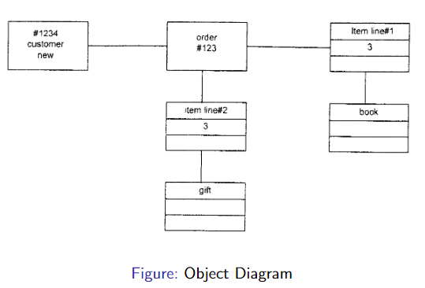

- composite structure diagram
  - describes inner structure of component (all classes and interface)

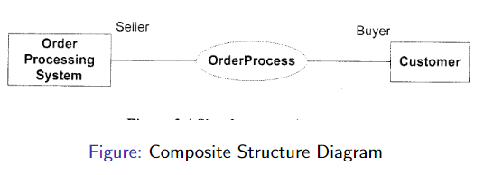

- component diagram
  - describes all components of system
  - gives interrelationships, interactions, interface
  - outline of composition structure of components or modules

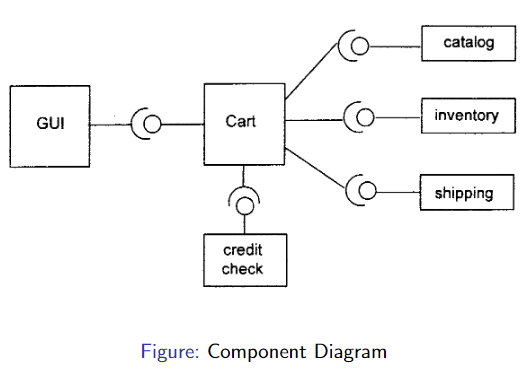

- package diagram 
  - describes package structure and organization
  - covers classes in package and packages within packages

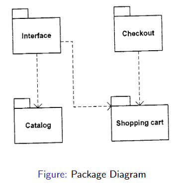

- deployment diagram
  - describes hardware, software, network connections for distributed computing
  - covers server configuration and network 

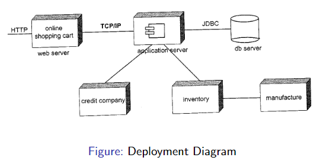

- there are 3 types of classes
  1. **boundary** - secret of this class is how to communicate with the environment (the edge of the system)
    - <span style="color:blue">hardware hiding</span>, environment hiding
    - it is an interface class 
  2. **entity** - secret is the <span style="color:blue">software-hiding</span> modules (like tuple)  
  3. **control** - finite state machine
    - controls flow of system
    - secret is the algorithm of <span style="color:blue">behaviour-hiding</span>

### Behavioural (Dynamic) Diagrams
- Use Case Diagrams
  - it is a visual representation of a scenario
  - there are actors that are part of the environment outside the system
  - they trigger business events 
  - sees the system as a blackbox, doesn't tell you what system does

  

- Activity Diagram
  - outline of activity data and control flow
  - workflow oriented diagram
  - covers decision points

  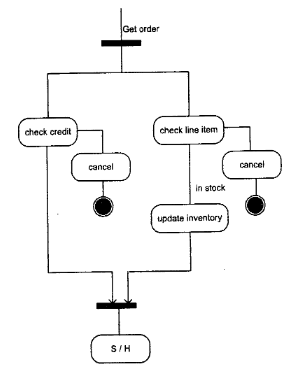

- State Machine
  - life cyce of an object
  - diagram has states and transitions
  - system + business process

  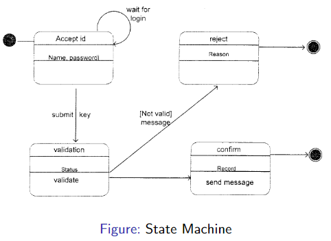

- Interaction Overview
  - combines activity and sequence diagrams to provide control flow

  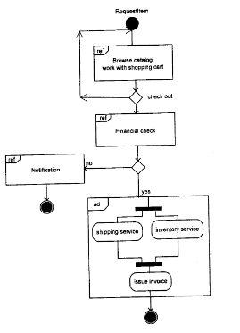

- Sequence of Diagram
  - chronological sequence of messages between objects
  - corresponds to 1 use case
  - full arrowhead: synchronous message
  - half arrowhead: asynchronous message

  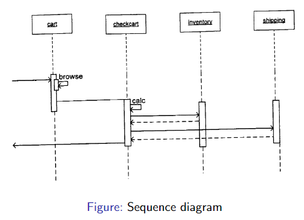

- Communication Diagram
  - describes message passing sequence
  - depicts how object receives and sends messages
  - every communication diagram is equivalent/can be converted to sequence diagram

  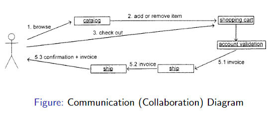

- Timing Diagram
  - combines state diagram and time sequence
  - dynamic view of state change caused by external events over time
  
  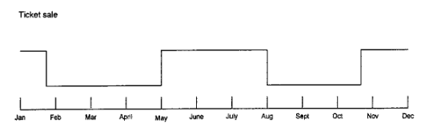
  
## Day 10 Jan 26, 2018
- looking over at diagrams

**Finite state machine**
- components are
  - start state
  - set of inputs
  - set of states
  - language

1. What are the main characteristics that an event needs to satisfy to be considered as a relevent business event. Explain the role played by business events in identifying the functional requirements
- it needs to be inititaed from outside the system that evokees some resonse from the system
- each scenario and viewpoint is a functional requirement
- good starting point for writing functional requirements

2. Read the following informal requirements and identify one business event
> the turnstile consists of a rotating barrier and a coin slot and is fitted with an 
> electrical interface. The mechanial apparatus has alrady been chosen and the 
> development project is to provide controling software. To enter the stadium, a vistor
> must first insert the correct coin into the coin slot and then push the turnstile
> barrier for access. The turstile is equipped with a locking device, when locked it
> prevents barrier from rotating. The controlling s/w should only allow the barrier to
> rotate once when a valid coin has been inserted.

- request to enter the stadium

3. - What are the models of a software system? Give an example of one formal design model and one rigorous design model
- (partial and approximative) descriptions of different aspects of the system/artefact that put emphasis on some things
- graph (set of edges and vertices)
- so a formal design model would be finite state machine, predicates, relations, logic
- rigorous diagram would be class diagram and sequence diagram

4. Software architects initiate their work from the requirements specification document. Explain the influence of the non-functional requirements on the architecture of a system. Can the architect always satisfy the non functional requirements as stipulated in the requirements document and why?
- in canada the registration system _works_ but it had to be cancelled because a lot of non functional requirements were left out
- sometimes the architect cannot satisfy nf reqs completely and must compromise

5. WHen designing a trave application, a designer came up with the followin class diagram. (AppClass ---> [trip1, trip2]) However new requirements reveal we can have several other categroies of trips such as land trip, sea trip, river trip that involves a non-empty subset of these catgeories. Propose new class diagram that captures these new requirements and would easily allow addition of new trip categories.
- System ---> Trip ---> all the different kinds of trips

6. Many to many relationships can be awkward to implement. They can sometimes be simplified thanks to a mediator class or 'event remembered'. Consider a wedding gift registration system. Every store registers many couples Every couple registers with many stores. The Store <---> couple diagram caputres many-to-many. Propose another diagram modeling the system but introduce mediator called _Registration_.
- Store ------ Registration --------- Couple

7. Name and explain the role of 3 types of classes used in Analysis Class Diagram. Which one has an n-tuple secret
- boundary, entity, controller
- entity is tuple

## Day 11 Jan 2, 2018

### General Design Principles SlideSet 4
- in general
  - low coupling and high cohesion (cohesion = how much communication is between modules and coupling = dependence)
  - in object oriented need to have controller classes


- **interface** - abtract class that implements a contract. it tells you it doesn't have a concrete implementation of its methods but it has the method signature

#### Principle Of High Cohesion Low Coupling
- don't have a lot of interdependent classes or it will be hard to maintain
- change in one class may lead to cascading updates to other classes
- tight-coupling can be removed with new classes or inheritance
- there should be easy expansion, simplicity and elegance
- improvements in information hiding help system to be more cohesive (info hiding = hiding decisions that are most likely to change)
- makes systems easier to modify
- 7 +- 2 is a useful guideline - difference between small and large scale projects is amount of nesting btwn modules
- possible architecture for **video games** consists of
  - environment of game (areas, connections)
  - mechanism controlling the game (encounters, reactions to events)
  - participants in game (player, foreign characters)
  - artifacts in game (sword, books)
- personal finance app would have
  - accounts
  - bill paying
  - reports
  - loans
  - investments
  - lots of coupling btwn the above
- alternative architecture could be
  - assets
  - sources
  - suppliers
  - interfaces

#### Open-Closed Principle
- open to extension: system can be extended to meet new requirements
- closed to modification: the existing implementation and code should not be modified as a result of system expansion
- increases reusability
- technical approach is using abstraction via inheritance and polymorphism
- separation of implementation and interface
- keep attributes private
- minimize use of global variables

#### Liskov Subsitution Principle
- let q(x) be a provable property for objects x and type T. Then q(y) should be true for y objects of subset of type T
- in design by contracts, it leads to restrictions on interactions having to do with inheritance
- preconditions cannot be strengthened in subtype
- postconditions cannot be weakened
- invariants must be preserved in subtype

## Day 12 Jan 31, 2018

#### Dependency Inversion Principle

> High level modules should not depend upon low level modules.
> Both should depend upon abstractions.
> Abstractions should not depend upon details.
> Details should depend upon abstraction
- **rule**: design to an interface, not an implementation

> Packages that are maximally stable should be maximally abstract. 
> Instable packages should be concrete. 
> The abstraction of a package should be in proportion to its stability.
- kinda like the Hollywood principle - don't call us we'll call you
- can have partner apps
- concrete but has business rules that are likely to change

#### Interface Segregation Principle
- Clients should not be forced to depend upon interfaces that they do not use
- if there are 2 non-cohesive functionalities, keep them separate
- avoids design of fat interfaces and provides clear design to user
- break the functionalities into atomic interfaces that can be then individually accessed by the user

#### Law of Demeter
> Each unit should have only limited knowledge about other units: only units "closely" related to the current unit.
- style for building systems
- "only talk to immediate frens"

### Design Principles for Security

#### Principle of Least Privilege
> The principle of least privilege states that a subject should be given only those privileges that it needs in order to complete its task.
- if subject does not need access, it shouldn't have access

#### Fail-Safe Defaults Principles
> The principle of fail-safe defaults states that, unless a subject is given explict access to an object, it should be denied access to that object.
- when system fails we back up
- assumes tHt the default access to an object is none
- if the subject is unable to complete its action or task, it should undo those changes it made to thte security state of the system becore it terminates
- fault-tolerance: when we can't guarantee that system will behave in a safe way

#### Principle of Economy of Mechanism
> Security mechanisms should be as simple as possible
- if design and implementation are simple, there is fewer possibility for errors
- simple design => less assumptions, less risks, simpler testing

## Day 13 Feb 2, 2018

#### Principle of Complete Mediation
> requires that all accesses to objects be checked to ensure they are allowed.
- restricts the caching of information
- OS mediates these actions (determining if allowsed and providing resources)

#### Open Design
> The security of a mechanism should not depend on the secrecy of its design or implementation
- complexity does not add security

#### Separation of Privilege
> A system should not grant permission based on a single condition
- this is restrictive because it limits access
- equivalent to separation of duty principle

#### Least Common Mechanism
> The mechanisms used to access resources should not be shared.
- to prevent information being transmitted through channels
- also a restrictive one

#### Psychological Acceptability
> Security mechanisms should not make the resouce more difficult to access than if the security mechanisms were not present
- recognizes human element in security
- configuring and executing should be easy and intuitive
- interpret as: the security mechanism may add extra burden but that burden must be minimal and reasonable

## Day 14 Feb 5, 2018

### Data Flow Architecture SlideSet 5
- Data coming in, going through a bunch of tranformations
- software system is decomposed into functional processing modules
- connections = 
  - I/O streams
  - I/O files
  - buffers
  - piped streams
- BASICALLY we will be talking about architectures that use such conenctions to transofmr input data into output data
- focus in data flow architecture is data availability
  - in batches or streams
  - linear
  - cyclic
  - tree
- no interaction between modules except the data connection between them
- modifiability and reusability are the property attributes of data flow architecture
- function is a relation that is deterministic
- different ways to connect output data of module to input of other modules
  - batch sequential
  - pipes (stateless and serve as conduits for moving streams of data between multiple filters)
  - filters (stream modifiers, which process incoming data and send modified data stream out over pipe to another filter)
- pipes are special cases of filters
- close loop process control is another typical data flow architecture

### Batch Sequential
- this architecture is seen in the financial sector
- they use COBOL or RPG
  - COBOL is specifically designed for this stuff
- you literlly can't start a process until the one before is done
- in Java, your class has declaration (the datatype), behavioural (the functions)
- in COBOL you have:
  - identification
    - program id
    - author
    - installation
    - date written/compiled
  - environment
    - configuration
      - source computer - the one on which we compile
      - object computer - the one where it is supposed to run
    - input - all the input files
  - data
    - file section 
      - file description
      - blockage factor - allows you to read files in 'N' factors, N = blockage factor
    - tape section
  - procedure
    - the program and its functions


- when sorting with batch sequential you can run into 2 situations
  - after partitioning N ways, can I sort the data?
     - merge and sort and merge and sort and merge and sort
    - hadoop
- connection links between batch sequential elements is conducted through temporary files
- common for business data processing 
- scripts are commonly used to make batch sequence but we can also make a program

#### Applicable Design Domains
- data is batched
- each subsystem reads related input files and writes output files

#### Benefits
- simple divisions between subsystems
- each subsystem is standalone

#### Limitations
- requires external control
- low throughput
- no interactive interface

## Day 15 Feb 7, 2018

**skipped**

### Pipe and Filter Architecture
- decomposes system into components
  - data source
  - filters
  - pipes
  - data sink
- connections between components are data streams
- a **data stream** is a first-in first-out buffer type data structure
- a **filter** is an independent data stream that reads from input data stream, transforms and process it and then writes transformed data stream over pipe to next filter
- filter does not need to wait for batched data as a whole, it works incrementally
- filter does not know the identity of data
- a **pipe** is a stateless conduit that moves data stream from one filter to next
  - can carry binary or character stream
- an object type data must be serialized to be able to go over stream
- **serialization** is the process of saving an object into storage medium or transmit it across network connection link in binary form
- when resulting series of bytes are reread according to serialization, it can be used to make an architectural clone
- the process of serializing is calling **defalting** or **marshalling** an object
- **deserialization** - opposite operation/extraction of data structure from a series of bytes


#### Data Flow Methods
1. Push only (Write only)
  - data source and filter may push data in a downstream
2. Pull only (Read only)
  - data sink and filter may pull data from upstream
3. Pull/Push (Read | Write)
  - a filter may pull data from an upstream and push transformed data in a downstream

#### Types of Filters
1. Active filter
  - pulls in data and pushes out transformed data
  - works with passive pipe which provides read/write mechanisms
2. Passive filter
  - lets connected pipe push data in and pull data out
  - works with active pipes that pull data out from a filter and push data into next filter


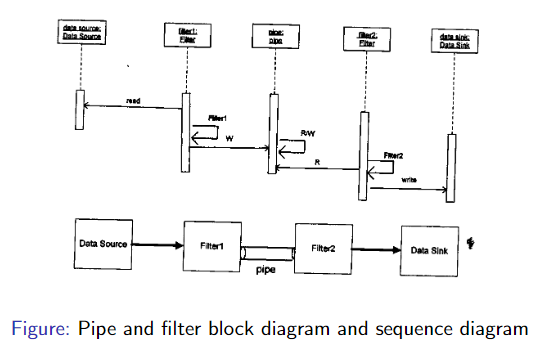

#### Applicable Design Domain
- whenever system can be broken into series of processing steps
- simple and stable data format
- significant work to be pipelined
- suitable for producer/consumer model

#### Benefits
- concurrency
- reusability: encapsulation of filters make it easy to plug and play
- modifiability: low coupling between filters
- simplicity: clear division btwn filters
- flexibility: supports sequential and parallel execution

#### Limitations
- not for dynamic interactions
- low common denominator needed for ASCII data
- overhead of data transformation among filters
- error handling is sparse

### Process Control Architecture
- suitable for embedded system software design
- decomposes system into 2 subsystems
  1. executor processor unit for changing process control variables
  2. controller unit for calculating amount of changes


- process control system must have
  - **controlled variable**
  - **input variable**
  - **manipulated variable**

#### Applicable Domains
- embedded software system involving continuing actions
- system that needs to maintain an output to remain stable
- system with target point

#### Benefits
- better solution to control system where no precise formula can be used to decide manipulated var
- software can be completely embedded

#### Limitations
- can be unstable and requires really careful math

## Day 16 Feb 9, 2018

#### Midterm Question
Compiler involves several elements that provide tranformation phase of source file to machine file.
- lexical analysis
- syntax analysis
- type checking
- intermediate code generation
- register allocation

Discuss conditions under which we cn use the styles of data flow architecture

#### Midterm Question 2
- propose batch sequential architecure for payroll system. system takes id, work time, rank and generate paycheck for each worker. 

```
<Type files>---> ??? ----> ??? ----> taxes and reduction ---> reduction files --->> generate paycheck
```

## Day 17 Feb 12, 2018

#### Data Flow Architecture Review
1. Pipe and Filter
  - discrete flow of data
2. Batch Sequential
  - flow in quantity
3. Control (gateways)
- the data is either contained and controlled by an entity or is given in a complete or partial view of considered world
- AI is used when there is no clear view of considered world

### Data Centered Software Architecture SlideSet 6
- characterized by centralized data store belonging to entity that holds it
- data store: data transfer and its knowledge - explicit and reasoning (in our case data and knowledge is the same)
- data store is shared by all related components
- system is decomposed into
  1. data store
  2. independent software component agents
- connections between data modules and software components are implemented by
  - explicit method invocation
  - implicit method invocation based on repository catgeory
- in pure data centered software architecture
  - software components do not communicate with each other directly, they only communicate via data store
  - shared data module provides all mechanisms for software components to access it
    - insertion
    - deletion
    - update
    - retrieval
- 2 categories of data centered architecture
  - repository
    - data store is passive
    - clients of data store are active
    - client may access repo interactively or by batch transaction request
    - widely used in DBMS, library system

    

  - blackboard
    - widely used in real life
    - data store is active
    - clients are passive and are knowledge sources
    - will reach approximation, not definite
    - new data change may trigger evnts to its listeners
    - infrom clients through notify
    - can keep adding more clients
    - most apps using this are knowledge based systems like voice and image recognition, security systems

    

## Day 18 Feb 14/15, 2018

### Repository Architecture Style
- supports user interaction for data processing instead of batch transaction
- clients can get data from data store and put data in data store (so active)
- student (clients) and database (data store)

#### Applicable Domain
- large complex info system with many s/w clients accessing in different ways
- info system where data transactions drive control flow

#### Benefits
- data integrity - easy to back up and restore
- system scalability and reusability of agents - easy to add new software component
- reduce overhead of transient data between components

#### Limitations
- data store and reliability/availability are important issues
- centralized repo is vulnerable to failure compared to distributed repo
- high dependency btwn data structure of data store and agents
- changes on data structure leads to impact on agents
- overhead cost of moving data if it's distrubuted

#### Related Architecture
- layered
- multi-tier
- MVC

### Blackboard Architecture Style
- all thing work in parallel and indepedently
- 2 major partitions
  1. blackboard subsystem used to store data
  2. knowledge source subsystem where domain specific knowledge is stored
  3. optional controller that is used to initiate things
- connection = implicit invocation
- change in store triggers matched knowlegde source
  - if there is a problem on the blackboard, student starts solving

#### Applicable Domain
- immature and complex problems where non-deterministic solutions exist
- problem spans multiple disciplines
- optimal, partial, approximate solution is acceptable
- exhausted searching is impractical

#### Benefits
- scalability  - ez to add new source or update it
- concurrency - can work in parallel
- supports hypotheses experimentation
- reusability of agents

#### Limitations
- tight dependency btwn blackboard and knowledge source
- difficult to know when to terminate reasoning
- synchornization of multiple agents is an issue
- debugging and testing is a challenge bc no clear execution path

#### Related Architecture
- implicit invocation eg event based


- What is innovative about blackboard?
  - blackboard allows you to add more observers without modification
- used commonly for machine learning
- repo style examples
  - eg water - clients need water
  - ecommerce/Amazon - packaging is the interface
  - religion - ppl go to a priest

## Day 19 Feb 16, 2018

Software Archicture Design by Tao Ch 6

### Midterm 2017
- 9 questions 25/20 marks

1. Main characteristics that an event needs to satify to be event

#### Exercise 1
AI software system for speech that has minimal uncertainty?
- need to use different techniques to recognize voice

Which software architecture is suitable?
- Black board because you can have multiple experts that can be added to minimize uncertainty
- combination of partial results to reach approximation
- dont say batch sequential or pipes and filters

#### Exercise 2
S/w system to control robot given typica functions.
Challenges: obstacles blocking path, sensor input imperfectm may run out of power, restrict accuracy of movement (this adds uncertainty so we need blackboard)

## Day 20 Feb 28, 2018
- Master Slave - dependapbility and performance

### Hierarchy Structure SlideSet 7
- a substystem or element is assigned a functionality
- method invocation 
- we need lower level modules because of design principles
- modules communicate with adjacent modules
- middle layers are usually for processing
- characterized by explicit method invocation (call-and-return) connection styles
- all architectural styles have this structure (except maybe Master-Slave)
- hierarchial structure combines really well with other styles

#### Unix Architecture
- interface includes shell, utilities, app
- system call interface sends and receives signals from file system
- device drivers send signals to hardware control
- middle layer includes process control
- usually there are many scheduling and memory managment algorithms
- upper layer is the interface

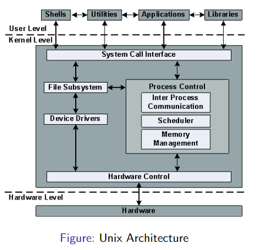

### Main Subroutine Software Architecture
- traditional style
- purpose it to have maximum reuse of subroutines and make individual subroutine be developed independently
- we start from data flow diagram (acquired in Requirements stage)
- in OO, data is encapsulated in indiavidual object
- system decomposed into subroutines hierarchially according to system functionality
  - behaviour hiding with _secrets_:
    - input formats
    - screen formats
    - messages
  - software hiding with _secrets_:
    - algorithms
    - data structures
  - machine hiding with _secrets_:
    - hardware machine
    - VM
    - interfaces
- we start building from bottom-up
- map requirements to main/subroutine
  - find tranform or transaction flow
  - transform flow is mapped with a controlling module
  - transaction center is at origin of action paths called the dispatcher control module


#### Benefits
- easy to decompose system
- can be used in sub-system of OO design

#### Limitations
- globally shared data is vulnerable
- tight coupling can cause ripple effects
- not good design
  - not easy to maintain

## Day 21 Mar 2, 2018

### Master Slave Architecture
- variant of main/subroutine architecture style
- supports fault tolerance and system liability
- slave provides replicated services to master
- master selects particular result among slaves

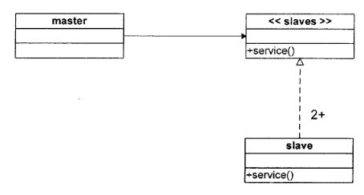

#### Benefits
- suitable for parallel computing and accuracy
  - open to addition, closed to modification
  - slaves can execute in parallel

#### Applicable Design Domains
- when liability is critical
  - eg need many sensors (european, american)
- where performance is critical (to a limit)
- capacity issue solution: delegate requests to different workers that can handle the requests

#### Midterm Solutions
 - distance of connectors - two elements related with a connector have a distance expressed as in the same thread/process/computer/or on different computers across a network
- observer pattern example - blackboard, MVC
- compiler architecture - data flow (using files) - batch sequential and data-centered (repository, diagsram from slides)
- main elements and characteristics of black board architecture
  - knowledge sources (problem solving modules sharing common global database called blackboard)
  - data store (holds knowledge)
- biometric system question - blackboard

## Day 22 Mar 5, 2018

### Layered Architecture
- system decomposed into higher and lower layers
- each layer is a group of classes/subroutines
- request to layer i+1 invokes services provided by layer i
- high cohesion
- each layer has interface to upper and lower layer
- pure layered there is only service to adjacent upper layer
- higher layers are kinda abstract and lower layers are specific utility type
- we can encapsulate all servces and deploy using a JAR file
  - includes services from Java API
- simple software would have
  1. interaction layer
  2. processing layer

```
Joseph's diagram

Layer i+1
Layer i
Layer i-1
```


- what kind of class would be at the user interface?
  - boundary class
- for utility class, we can use blackboard architecture
- last layer, Layer 1, only has one link and can be a virtual machine

#### Applicable Design DOmain
- any system that can be divided between application specific protions and plaform specific
- apps with clean division between core services, critical services, user interface services
- apps that have a number of classes closely related to each other

#### Benefit
- incremental software development based on increasing levels of abstraction
- enhanced independence of layers
- enhances reusability
- component-based technology is suitable technology to implment layered structure
- promotion of protability - each layer can be abstract machine deployed independently (because of design)

#### Limitations
- long path from request to service (many layers) so lower runtime performance
- performance concerns on overhead on data marshalling and buffering by each layer
- many apps cannot fit this architecture
  - they are usually networks
- expections and error handling are an issue

#### Related Architectures
- repo
- cliend-server
- virtual machine

## Day 23 Mar 7, 2018

#### Quiz 3
Master Slave Architecture addresses 2 non functional requirements. Identify one of them.

- performance
  - fault tolerance
  - system liability
  - capacity
  - speed

### Virtual Machine
- built on existing system
- separates programmign language, hardware language, or application from a physical execution platform
- It plays the role of an emulation software
- provideds emulation of functions of one system using a different system
- allows exact reproduction of external behaviour of a system

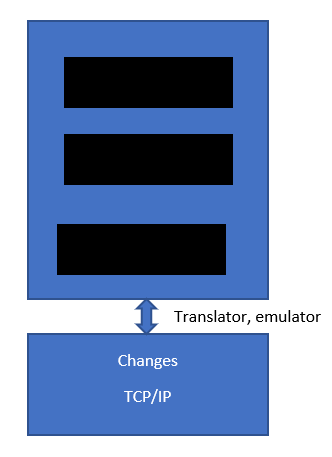

- in example below, the interface and pilot part stays the same
  - interface + pilot example = unix shells + kernel
  - and then you have the machine

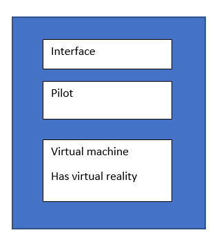


The example below is for compiling different languages under one machine

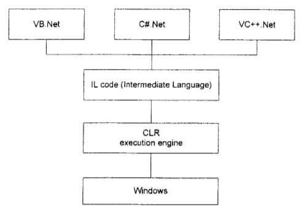

Java Virtual Machine is very variable because you can run it on many machines

#### Applicable Design Doamins
- solving a problem by simulation or translation
- interpreters of microprogramming, XML processing, script command language exeution, rule-based system execution, Small talk and Java interpreter typed programmging language

#### Benefits
- portability and machine platform independence
- simplicity of software development
- simulation

#### Limitations
- slow execution of interpreter
- additional overhead due to the new layer

#### Related Architecture
- interpretor, repository, layered architecture

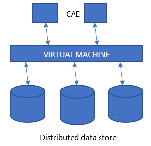

## Day 24 Mar 9, 2018

### Discussion 1

#### Question 1
- user interaction with free robotic arm is extremely controlled
- It has n controllable sections, each with a control unit and own processing time
- propose an architecture for this system

#### Answer 1
- time constraints (performance) therefore we have boundary intervals
- master slave architecture
- can also be blackboard architectures

#### Question 2
- software architect designing a system that
  - requires divide and conquer to decompose main task and improve performance
  - calculation task that system is carrying can be partitioned into several independent equal sub-tasks
  - users should not be aware that calculation is divide and conquer
  - users or processing of sub-tasks should not depend on algorithms for partioning work and assembling final result
  - to increase computational accuracy, can use dif implementations
  - easy to corrdinate sub-tasks

#### Answer 2
- main sub routine
  - does it use divide and conquer? - yes 
  - can computation be processed independently? - no because it doesn't guarantee equal
  - therefore we can't use it
- master-slave (the second flavour)
  - you ask each worker to submit a result and choose the best one (2nd) 
  - either you have fault tolerance (doing things in different ways) and for accuracy
  - is it easy to coordinate sub tasks? - yes, when you get results from worker, master can use them

#### Question 3
- sustainable software development
- software that depends heavily on hardware and software should not be affected by changes to hardware. 
- layered architecture, lowest layer should be highly coupled to hardware
- aim onr unning same software on legacy hardware with litte maintainence

#### Answer 3
- VM for sustainability and for simulatio/emulation

#### Question 4
- both blackbard and master-slave delegate tasks to low level agents
- wrt task delegation, what are the main differences between them

#### Answer 4
- master-slave, worker gets work and worker returns result
- blackboard more exchange between data store and knowledge sources

#### Question 5
- architecture for transmitting data from source to target and target to source 
- when common replication set is updatabe on both sides during replication interval
- accomplished by copying data from source to target

#### Answer 5

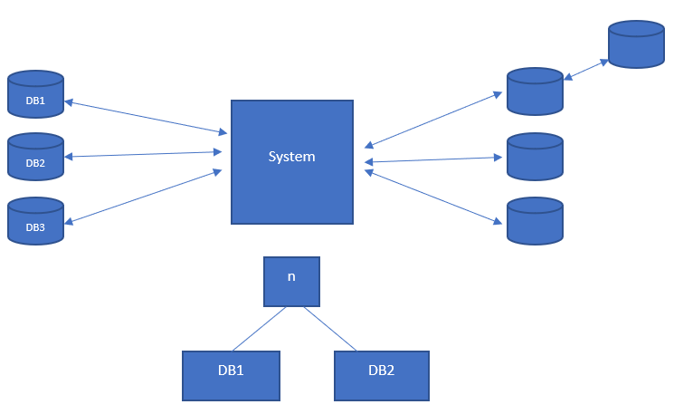


## Day 25 Mar 12, 2018
- languages are a set of acceptable strings defined by grammars, full of terminal and non-terminal expression

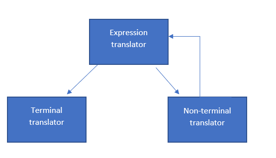

### Interaction Oriented Software Architecture SlideSet 8
- given a set of data, there are many ways to represent it
- the modules + secrets of each method is:
  - data Module ---> (secret.Data) **ENTITY CLASS**
  - Interaction Module ----> (secret: what to present to user) **CONTROLLER CLASS**
    - this is also called the flow control and determines communication between modules
  - module v1...5 ---> how to display v1...5 (5 modules) **BOUNDARY CLASSES**
    - this is the view presentation that is responsible for visual/audio output
  - module other? **BOUNDARY CLASS**
- 3 kinds of modules (above in reverse)
  - view modules
  - controller modules - Finite State Machine
  - data modules
- this architecture allows separation of user interactions from data abstraction and business data processing
- allows multiple views for a same data set
- 2 categories
  1. presentation-abstraction-control (PAC)
  
  2. model-view-controller (MVC)
  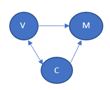

### MVC
- all modules are connected together
- common in web dev
- used where UI is prone to changes
- supports look and feel

#### Summary
- the controller
  - manages user input requests
  - controls the sequence of user interactions
  - selects desired views for output displays
  - manages all initlialization, instantiations, and registrations of other modules in MVC system (subscribe-notify pattern)
- model module
  - provides core functional services and encapsulates all data details
  - does not depnd on other modules and does not know whch view are registerd with or attached to it
- view module
  - is responsible for displaying data provided by model module and updating the interfaces whenever the data changes

## Day 26 Mar 14, 2018

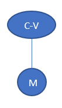

#### MVC I
- simple version of MVC architecture (pictured above)
- view component - look and feel (view)
  - can have many of these
- brain of the interaction (controller)
  - can be more than 1
- data model (model)
  - normally unique, just 1
- logic - tuple with set of symbols (0,1), set of rules, set of actions and set of formulas you can form from the symbols
- Controller/View
  - handles input and output processing and their interfaces
  - interaction comes to the controller and the view displays data
  - registers with data module
  - observer is the controller

#### MVC Black board
- MVC I connection can be designed using the subscribe/notify pattern
- controller/view (subscribes the model and model notifies of changes

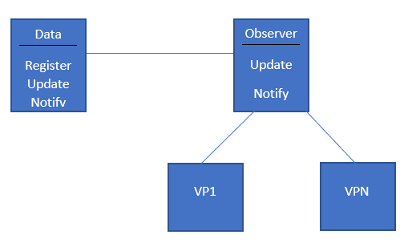

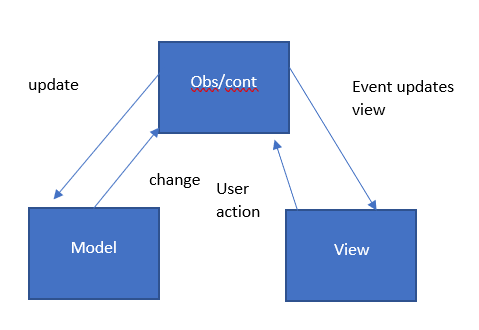

#### MVC II
- model provides all core functionality and data from database
- controller
  - dispatches tasks
  - controller and the view register with the model module
  - whenever the data in the model module is changed the view module and controller module are notified
- comparison to MVC-I
  - in both, Model module plays an active role
  - you register controller with the model and then the view
  - in mvc2 the view and controller are completely separated
- from sequence - controller register with model and initializes view, view registers with model and the controller updates while the model notifies and view gets updated

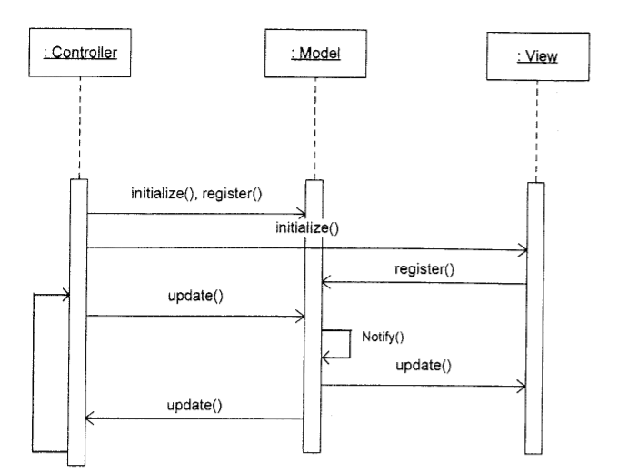

#### Applicable Domain of MVC Architecture
- suitable for interactive applications (multiplr views are needed + volatile graphics interface)
- there are clear divisions between the controller, view and data modules (dif professionals can be assigned to work on different aspects of the system)
- different sets of data changing differently (differnt lives, speeds) then do PAC not MVC

#### Benefits
- many MVC vendor frameworks available
- multiple view synchronized with same data model
- easy to plug in new interfaces or change
- very effective for developments (team = graphics, programming, data professional)

#### Limitations
- does not fit agent-oriented applications such as interactive/robotics
- multiple pairs of controllers and viws based on same data model = expensive
- division btwn view and controller is not always clear

#### Related Architecture
- implicit invocation such as event-based
- multi-tier
- PAC

## Day 27 Mar 16, 2018

### PAC
- agent based hierarchial architecture similar to MVC
- system is decomposed into many cooperating agents
- each agent has 3 components - presentation, abstraction, control
- no direct connection between abstraction and presentation

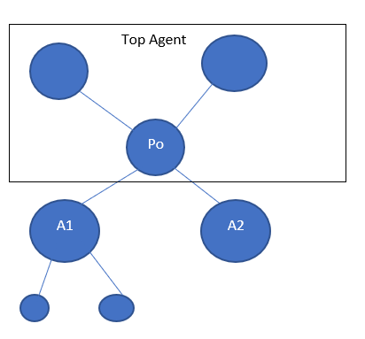

- developed from MVC to support the application requirement of multiple agents in addition to the interactive applciation requirement
- 3 components concepts applied to all concetrete subsystem architecture
- very suitable for any distributued system where each remote agent has its own functionalities and its own data and interactive interface
- another feature: all agents need to communicate
- no communication between presentation and abstraction
- ```presentation <---> control <------> abstraction```

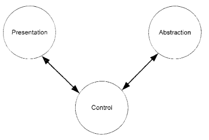

#### Applicable Domain of PAC
- interactive system where system can be divided into many cooperating agents in a hierarchial structure (master-slave does this but doesnt support interaction) - each agent has specific job
- coupling among the agents is expected very loose (changing one agent doesn't affect others)

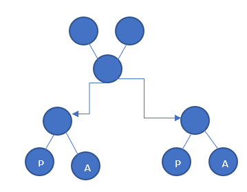

#### Benefits
- supporting multitasking, multi-viewing
- supporting agent reusability and extensibility
- easy to plug in new agent or replace existing one (using notify-subscribe)
- supporting concurrency (agents in different threads or different devices or computers)

#### Limitations
- overhead due to
  - control bridge between presentation and abstraction
  - communications of controls of many agents
- difficult to determine the right numbers of the agents based on the lose couplings between agents and high independence of each other
- development complexity: due to complete separation of presentation and absraction (communications between agents only take place between the controls of agents)
- increased complexity of the system design and implementation
- another limitation
  - after detailed design, implementation and during testing
  - the controllers are are finite state machines working in parallel
  - you would use **product construction** to look at them together, with 5 controllers and 10 events you would have 50 events to test, making very large test areas becaus eyou are testing how the machines work in parallel
  - FSM -> FSM0 = (Q0, S0, i0, F0) and FSM1 = (Q1, S1, i1, F1) would give FSM => cartesian product for states
  - initial state would be i0\*i1 and F = F1\*F2 

#### Related Architecture
- layered
- multi-tier
- MVC

### Discussion 2

#### Question 6
- fire losses in US are too high and firefighting is haardous
- 330 billion dollars spent
- designing a system that allows firefigting det to follow the fire situation in areas under its control
  - agriculture areas
  - forest
  - indutril
  - residential
- system employs different info gathering tools (sensors) that are appropriate area
- need flexibility in visualizing some data and omitting others

#### Answer 6
- key words: data feed of different structures and frequencies (different kinds of data coming at different speeds)
- need agents
- can use PAC
  - in abstraction you would store general info (date, title)

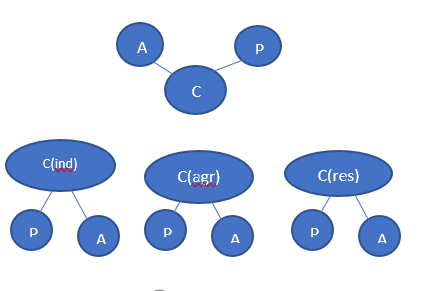

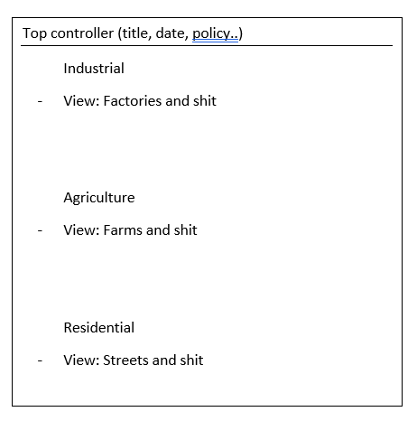

#### Question 7
- difference between PVC I and PVC II

#### Answer 7
- from notes

#### Question 8
- consider a class diagram. WHat is the architecture of the modelled system?

#### Answer 8
- PAC since it says presentation abstraction and controller

#### Question 9
- we would like to build simple software system translates temperature from F to C and vice versa
- when started it displays temp of water at freezing point in F and C
- user can ask for conversion
- would like 3 dif GUIs that have to change simultaneously
- what is the suitable architecture and why
- explain role of each proposed architecture components

#### Answer 9
- need concurrency
- MVC
- not PAC because we have the same dataset. if it were different we would use PAC
- if we want to build it, the pattern we would use for detailed design is
  - classes: 

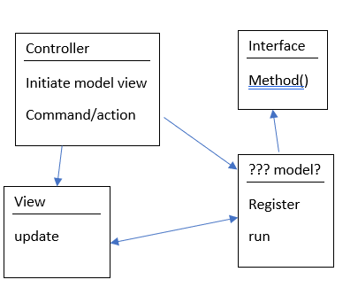

## Day 28 Mar 19 2018

### Distributed Architectures SlideSet 9
- example of importance
  - virtual network provider that started off smol wants to extend trouble ticketing system and support 2-way interaction
  - most appropriate architecture
  - key point
    - uncertain in how many steps they are going to provide
    - have a smol team
    - don't want high learning curve
  - can't be PAC because it's not about global views but different specialized services for specific people
- distributed system is a collection of computers connected through a communication network
  - data is distributed (not like repo or blackboard)
  - software is distributed
  - users are distributed
- subsystems within this system communicate with each other through
  - message passing
  - remote preocedure calls

#### 2 Design Issues/Areas
1. topology
- the way entities connect with each other
- how everything is organized
- examples include
  - bus - most common, many things connected to the bus
    - logical link between application and resources
  - star - broker would use this, everyone comes to broker and he/she is connected to everything
2. mode
- the method by which they communicate with each other
  - synchronous
  - asynchronous
  - message driven
  - callback
  - event driven
- **important features of distributed architecture**
  - service location transparency
  - service reliability and availability

#### Client Server
- based on 2 communicating subsystems usually running on different processors
  - client issues rquest to second process server
  - server receives request, carries it out and sends reply to client
- reduces load to server
- reduce communication
- response to client is quicker
- performance on client side and server side is better

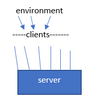

#### Why the Above is a Bad/Good Design
- high coupling
- leads to problem of avilability because if one element fails it causes a lot of problems
- but it's good because we can mirror servers
  - if one fails another can take over

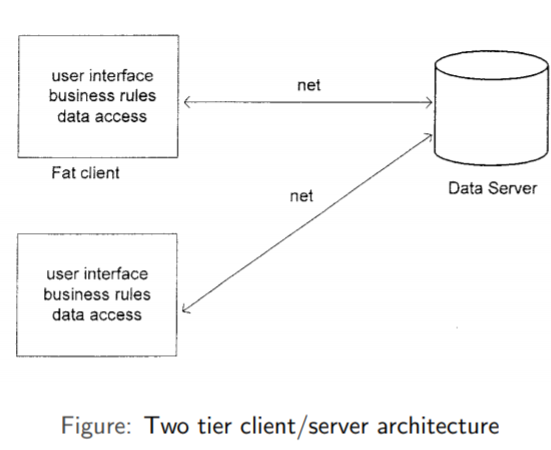

##### Advantages
- separation of responsabilities such as user interface presentation and business logic processing
- reusability of server components

##### Disadvantages
- lack of heterogenous infrastructure to deal with the requirement changes
  - due to volaltility of technology we develop family of products, not a single product
  - characteristic is the commonality of the family
- data can be compromised (security complications)
  - thin clients are invoked for security reasons
- service availability and reliability
  - because of high coupling
- testability and sclability
  - due to volatility and synchronization
- fat-clients/thin-clients (depends on application)

## Day 29 Mar 21, 2018

#### Canarie?
- need to make sure requirements are met
- needed to account for multiple views
- that's why they used the PAC architecture
- firearm registration was supposed to be 1 million but ended up being a billion and got scrapped by the govt :o
- normal engineering - like a building or bridge
- radical engineering - once in thousand years
  - software eng is radical
  - only 50 years old

### Multi Tier Architecture
- sometimes we need to have many tiers to put on system
- first one is the front tier, deals with user interface presentation
- many middle tiers taking care of business logic, app decisions and executions
- sometimes layer is buffer between harware and system
- backend tier usually works on database management or on a virtual machine

#### Advantages
- enhancement of reusabiltiy
- scalability by middle tier (building brokers, having a network of servers)
- middle tier can also provide multi-threading supports for scalability (ie master slave)
- reduces traffic on network

#### Disadvantage
- complex testability

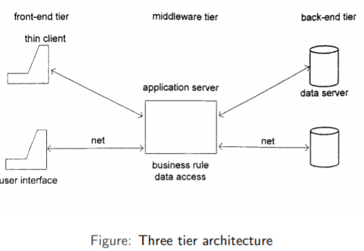

### Broker Architecture
- wat pattern
  - broker knows how to ask insurance company
  - insurance company sends signal if available
- middleware architecture widely used in distributed computing
- suitable for dist. computing that coordinates and facilitates communcation
  - brokering the service requests
  - locating proper server
  - forwarding and dispatching requests
  - sending responses or exceptions back to clients
- can be used to structure distributed software systems with decoupled components that interact by remote service invocations
- **better decoupling between clients and servers**
- servers make their services available to clients by registerig and publishing interfaces with broker
- clients can request services of broker statically or dyamically by look-up
- broker acts as policeman in busy intersection who controls and interacts with client and server components


#### Detailed Design of Broker Architecture
- distributed client can access distributed service by calling remote methods
- similar concept to Remote Procedure Calls on Unix and Java Remote Method Invocation
- next lecture: proxies and stuff in broker arch

## Day 30 Mar 23, 2018

#### Proxies in Broker Architecture
- client has direct connection to its client-proxy
- server has direct connection to its server proxy
- proxy talks to mediator broker
- proxy is well-known pattern for hiding low-level detailed communication processing
  - it intercepts client's request
  - gets all arguments
  - packets it
  - marshals (streamlines) and formats the package in communication protocol format
  - sends it to broker
- broker is also called proxy-based system

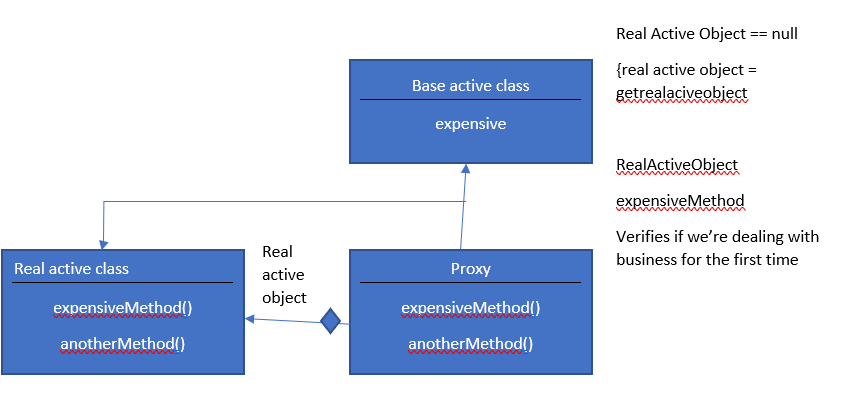

#### Sub Components of Broker Architecture
- broker
- stub (client-side proxy) - mediates btwn client and broker
- skeleton (server-side proxy)
  - statically gnerated by the service interface compilation and then deployed to server side
  - receives requests, unpacks requests, unmarshals the method arguments and clls appropriate service
  - also marshals results from the server before it sends back to the client
- bridges (optional)
  - used to hide implementation details when 2 brokers interoperate
  - can connect 2 different netwroks based on dif communication protocols

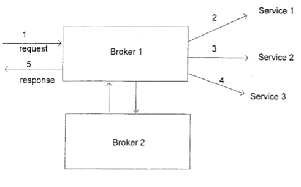

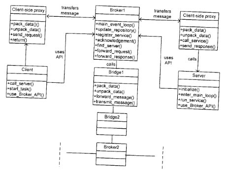

#### Advantages
- server component implementation and location transparency
- changeability and extensibility
- simplicity for clients to access server and server portability
- interoperability via broker bridges
- reusability
- feasibility of runtime changes of server components (add/remove server comps)

#### Disadvantages
- inefficiency due to overhead of proxies
- low fault-tolerance
- difficulty in testing (lots of branches also running concurrently)

## Day 31 Mar 26, 2018

### Service-Oriented Architecture
- service is a business functionality that is:
  - well defined and self-contained
  - independent from other services
  - published and availale to be used via an interface
- interface communicated with service
- can be reused extensively regardless of if its based on legacy software
- loose coupling of SOA provides flexibility to make use of many available services
- connections are conducted by common and universal msg oriented protocols like SOAP web service protocol
- to use many services, you need a flow control language
  - allows specifying the sequence and logical order of business executions based on business logic
- some services can be reused by other applicationsm
- we can build new services from  existing service (even recursively)
  - aggregation: extends one endpoint of a service to makea new interface of a new service
  - containment structure: has one interface that wraps all used services
- possible configuration of recursive:

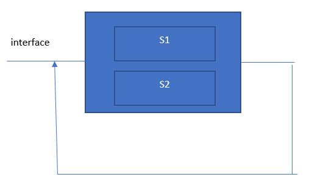

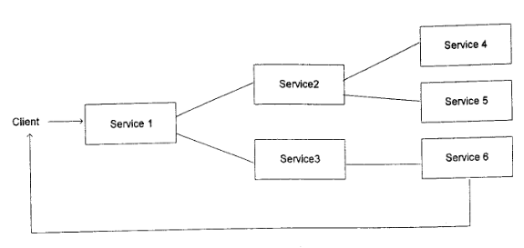

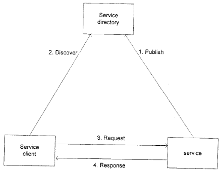

#### Advantages
- loosely coupled connection 
  - service by themselves don't have connections bc we add em
- each service comp is indeepn dent from other services due to stateless service feature
- interoperatbility - technically any client or any service can access other service regardless of platform, technology, vendors or language implementations
- resuablity - any service can be reused by an other services and service is developed to be resued as well
- scalability - loosely coupled service makes thmeselves easy to scale (related principle: )
  - if you have a lot of services for one interface makes it a fat service

#### Disadvantages
- testability
  - services are independent so they can be independently tested
  - if we have aggregation (one service needs another and that on e needs an other) makes it harder to test all 

### Exercises

#### Question 1
- virtual network provider wants to extend ticketing service as a sared business process to a busness partner
- deliberately started smol bs smol team
- shorter learning curvle
- what is the most appropriate architecture for this system

#### Answer 1
- characteristics of system: improve communication  and better experience for end user, open to addition-closed to modification 
- characteristics of manager: doesn't know how many services to create
- SOA 

#### Question 2
- credit swiss group IT partners closely related with the business to deliver innovative and cost-effcient results
- IT drives performance and revenue growth
- credit swiss IT manages more than 1000 services
- all services are made available for 66400 supported users in  550 locations
- suitable style for thin service interface and contracts, allows loose coupling, service abstraction and reusability, ease of service discovery and data sharing
- discuss weaknesses
- 
#### Answer 2
- service oriented architecture through aggregation
- aggregation: one service open to others 
- weaknesses
  1. testability
  2. since it's linked one after another, you need to go through many interfaces so performance and time will be a weakness

#### Question 3
- heterogenous environment - diverse technology
- company has many dif software applications and databases are supported by many dif OS
- headquarters: accounting, finance, HR
- R&D dept in chicago, others in NY // all over the world
- want it to be open to addition closed to modification
- architecture that wll make it easy to integreate and make it easy to maintain and expand

#### Answer 3
- obv service oriented architecture
- can do containment or aggregation
- if it's fat client then choose aggregation 

## Day 32 Mar 28, 2018

#### SOA vs Broker
- soa a lot of services with an interface
- user chooses which service to choose
  - containment and aggregation to choose
- broker is the routing master, tells you which route to take to reach the most available/least costly service
  - user does not choose which service, it's given to you
- sometimes we build a macro service that is a combo of architctures

#### Enterprise Service Bus
- enterprise info systems have dramatically changed and progressed
- technology that comes with SOA
- for really really large systems so we can respond quickly, while using agile and merger
- a lot of changes to enterprise info systems is brought by
  - corporation merger
  - internal control and regulatory compliance control for personal info protection
- motivation 
  - strong demand for low cost and quick system dev
  - sometimes a quick change is needed to keep up but this leads to a bunch of independent systems in different departments
  - cost of overall system increases
  - we see diminished enterprise management
- enterprise systems require highly adaptale and highly flexible architecture as well as low-cost/quick dev
- we can satisfy thes by
  1. using existing systems and APIs'
  2. minimizing newly developed parts
  3. using a combo of the above
- an ESB is a middleware that provides unified architecture for high resulability btwn client and service
- environment designed to foster interconnectivity that is sophisticated
- helps overcome problems with reliability, scalability and communication disparity
  - SOA gives fat with containment and aggregated is deep (wtf did i just write)

#### Components of ESB
- reliable messaging
- rules centralization
- service broker

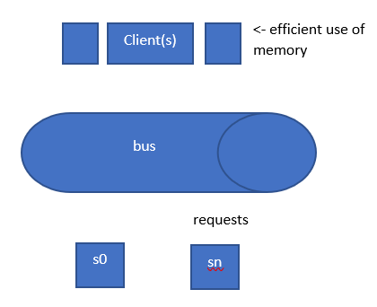

1. asynchronous queuing 
    - about how a service and its consumers accomodate isolated failures and avoid unnecesarily locking resources
    - make a request and hold memory
      - once client makes request, client is put out of memory usage untl service is ready to use (put back into memory)

```
clnt A ----> BUS ----> SB
box: client ID, job, states

(1) Request A to ___ the memory
Step 2)
the queue submits the service request to ServiceB and changes states

You can have 2 queues, one you just receve and ones you sent and are waiting for respone to be free

(3) ServiceB either responds (3.1) or does not (3.2) (within delta t)

4(3.1) queue erases client request and returns answer

4(3.2) --> return time out + ERASE FROM QUEUE
  OR it can keep request and resend to SB for n times at max

in all these cases client A is out of memory
(5) client A regains access to memory
```

2. event driven messaging
    - consumer establishes itself as subscriber of the service
    - service, in turn, automatically issues notifications of relevent events to this and any of its subscribers
3. intermediate routing
    - various types of intermediary routng logic can be used to create message paths
4. policy centralization
    - policies that apply to multiple services can be redundant and inconsistent so we should use global policies
  - separation of concerns
    - policies that apply to multiple services introduce redundancy
    - global or domain specific policies can be isolated and applied to multipe services
5. reliable messaging
    - concept of communciating messages across unreliable infrastructure while being able to make certain guarantees about successful transmission of the msgs
    - send message request and wait
    - if timeout, let client know service is not available
    - note: services do not talk to each other, you put them together through containment (an interface)

  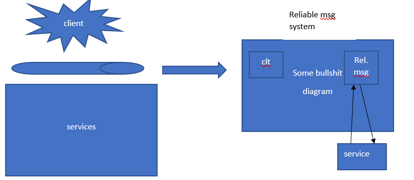

6. rules centralization
    - same business ruls may apply across different business services, leading to redundancy and governance challenges
    - the storage ad management of business rules are positioned within a dedicaed architectural extension from where they can be centrally accessed and maintained
7. service broker
  - acts like a middleman, performs translations on request according to whateer service is needed
  provides services:
  - data model tansofmration 
  - data format transformation
  - protocol bridging - a protocol to handle communication, maybe cryptography


## Day 33 Apr 2, 2018

#### Enterprie Service Bus contd
- intended for short term turnaround ie a merge between 2 companies
- last week we discussed the servie broker and found that we can have any of the 3 (data model, data format, protocol bridging) or all 3

  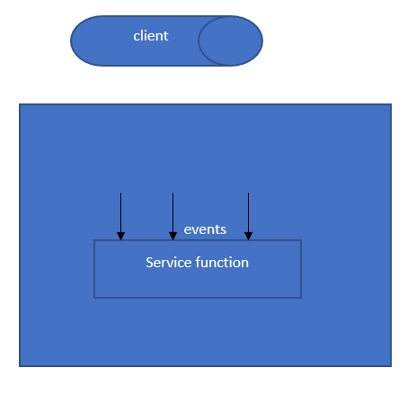

  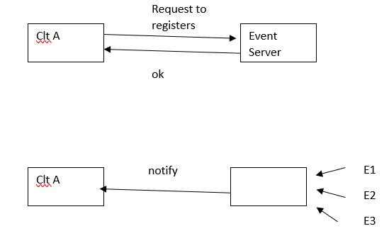

### Heterogeneous Architecture SlideSet 10
- sometimes you need many architectures combined together
- how do we combine them and what do we need
- weighing the pros and cons of each architecture
- relevent sdlc phases: non functional reqs and achritecture design (which is before detailed design)

#### System Quality Attributes
- designs vs non-functional requirement matrix to evaluate which designs satisfy what requirements (number 1-100)
- these numbers are assessed using scenarios
- obtained from requirements also

. | Performance (50%) | Reliability (50%) | **Sum**
--|------------------|--------------|----
Design 1 | 10 | 30 | 10\*50% + 30*50%
Design 2 | 20 | 20 | 10\*50% + 80*50%

#### Comparison of architectural styles
- Batch sequential
  - reusability should be a plus 
- process control
  - learnability is hard
- repository 
  - time economic bc direct access to data store nd space economy bc only one data store
  - understandability
  - learn database managemnt
- master slave - reduce task into many subtasks so time economic  - not resuable bc each task is specifci to decomposition that master does
- virtual machine
  - time economic - bad bc adds on extra layer instead of going directly to sensors
  - space economy - bad bc new layer
  - security - yes because you can have security mechanisms
  - hardware and software indepenedence - vm does it best
- service oriented 
  - hardware independence bc you don't care if it runs on ibm or legacy system
  - software independece 
  - resuability - can be reused many times eg credit card services
  - learnability - easy to learn, update as new services are added

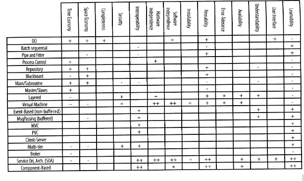

#### SAAM Method
- evaluate candidate architecture design using a collection of scenerios (scenario represents important usage of system)
- 3 stages
1. define a collection of design scenarios covering functional and nf req
2. perform an evaluation on all candiates
3. perform an analysis on interactions of system

##### SAAM Example
- 4 more exmaples in textbook
- tax payer case study
- stakeholders interested in
  - extendability - add more occupations
  - performance - because millions of cases
  - modifiability - format and method of calculation
- Scenario 1 - add one more occupation
  - assess the other factors and test expandability
- Scenario 2 - perform virtual exhaustive testing on system
  - tests performance
- Scenario 3 - Alter tax rate calculation algorithm
  - tests modifiability
- first design using first scenerio
  - add one occuputation by going to IRS's modules (which is going to be very hard to do)
- the second design is open for addition since it has an interface for IRS (American tax payer)
- both designs Scenario 2
  - roughly the same
  - heavy for both of them
- Scenario 3 is a little bit easier in design 2 but generally both are slow
- first design would be eliminated because it's hard to add new occupation
- however, second design doesn't scale with performance
- therefore, we can try service broker architecture
  - Task Dispatcher is contacted by client and communicates with IRS
  - can have 100s of clients and work under heavy load

. | Scenario 1 Expandability | Scen 2 Time Efficiency | Scen 3 Modifability
---|------------|------------|---------
Design 1 | - | - | +
Design 2 | + | - | +
Design 3 | + | + | +

### Product Families SlideSet 11
- sequential completion - classic method of developing software
- 1976 - Parnas gave product families a lot of attention
- due to
  - increase in speed of market
  - necessity of launching new products
- product family shares at least 1 common functionality
- concept of software family comes from hardware industry
- hardware product lines allow manufacturing of several similar products
- there are some embedded systems you can't use VM for
  - ie pacemaker's battery that is variable because FDA asks for minimality of product

## Day 34 Apr 6, 2018

#### Product Fam cont'd
- product family
  - set of products that share common hardwaere or software artefacts such as requirements, architectural properties, components, middleware, etc
- feature can be seen as
  - any of above artefacts
  - conceptual characteristics that is visible to stakeholders

#### Feature Modelling
- approach to model product families in terms of features
- usually a graph
- vertex represents a feature
- different techniques used (all derived from FODA)
  - FODA
  - FORM
  - FeatuRSEB
  - GP
  - PLUSS
- most used now is FORE
- FODA - Feature Oriented Domain Analysis
  - give the mandatory, optional and alternative relationship
- feature model of bike

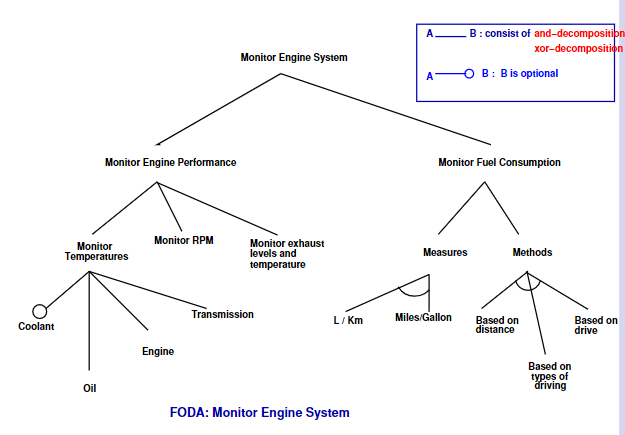

- skipped FeatuRSEB Monitor Engine System
  - XOR - choose 1, OR - choose 0, 1, 2..
- FORM - Feature Oriented Reuse Method
  - start with commonalities among apps
  - construct feature model using and/or
    - AND indicates mandatory features
    - OR is alternative

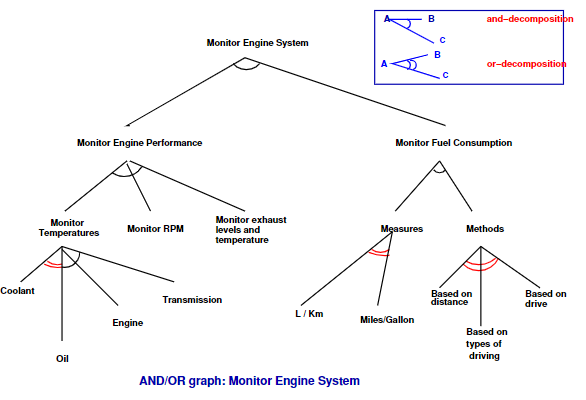

- FeatuRSEB - Feature Reuse-Driven Soft Eng Business
  - also a graph
  - edges are UML dependence relationships
    - composed of
    - optional feature
    - alternative relation
  - can specify 'requires' and 'mututal exclusion'

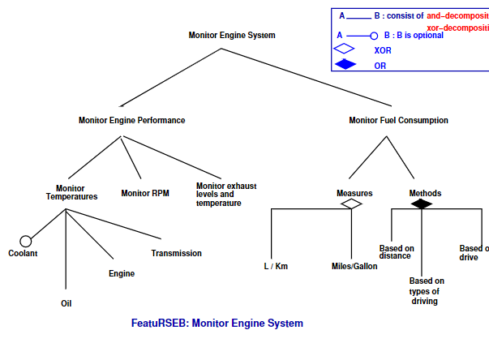

- generative programming
  - parent feature is composed of combo of some or all of its children
  - not very independent, very related
  - all you really need is the AND and OR
  - dark bullet is mandatory, white bullet is optional
  - when cardianlity is given it means you can choose 1 or 2 or 3 or n


- tools for modelling
  - don't care but there are a lot

```
G = (V,E)
V = {1, 2, 3}
E = {(1,2), (1,3)}
```

#### Practical Goals
- repository where you have all the features
- apply a formal transformation for combinations
- very straightforward, especially given mathematical model
- k-near - close to each other by 3 features
- problem: if we take the feature as a diagram, we can't do calculation because it's a graph so we need a way to represent family

### Product Family Algebra
- **monoid** is a 3-tuple (S, +, 0) where (S, +) is a semigroup and 0 is the identity element for the binary operation +
  - simple algebra
- **semiring** is a quintuple (S,+,0,\*,1) such that (S,+,0) is commutative monoid and (S,\*,1) is a monoid that distributes + over 0
  - 0\*a = 0 = a\*0
  - commutative and therfore idempotent if + is idempotent (a + 0 = a)
- relation a <= b <=> a + b = b is a partial order, natural order on S
- it has 0 as least element (in prod fam algebra it is the impossible constraint)
- \+ and \* ar isotone w.r.t <= 
- we don't need to go too in depth for this
- allows you to build and compare things
- an idempotent commutative semiring a product family algebra elements are product families and can be considered as abstractly representing sets of products eac of which is compoed of features
  - \+ is optionality
  - \* is mandatory

```
set S and set O of operators
(S, Op) --> Algebra
--------------------------
(S, Relators)
eg graphs have vertices (set S) with edges (relators)
------------------------------
3 > 2
> - relator
equivalent to saying there exists (p | : 2 + p = 3)
------------------------------
F = a*b*(1+c)
 = a*b + a*b*c
 = two product families
--------------------------------
robot with 5 wheels
R = w*w*w*w
  = w^4
w^4*w = 0 is a constraint and means 5 wheels is impossible
which means that w^4*w*w is also impossible since w^4*w = 0 so 0*w = 0
----------------------------------
F = a*b*(c+d+w)
H = a*b(c+d)

is H a product - it's a product family bec 2 products
H can be abc or abd (2 products)

abc <= H 
<=> abc + abc + abd = H1
it si idempotent
= True
therefore it is not a product
a is a product if for every b that is less than it, b = 0 v b = a

------------------------------------
efficient algorithm - greatest common divisor/euclids
```

### Final Exam
- same length as midterm
