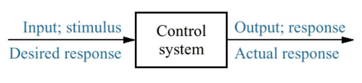
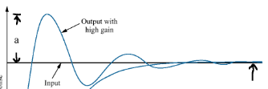

# 3DX4 Dynamic Systems and Control

## Day 1 Jan 4, 2018

### Grading

- Assignments/Quizzes 10%
- Labs 10% (ITB 235)
- Midterm 30%
- Exam 50%

\*_8 or 9 quizzes, drop lowest 1 or 2_

### Textbook
- Control Systems Engineering - N. Nise (7th Edition)

### Software
- Matlab simulink
- Labview

[Link to Matlab and Labview](https://virtualdesktop.cas.mcmaster.ca/)

### What is a Control System
- simplest form - output provided for a given input

- unity feedback - input 1 output 1

### Why Need?

- power amplification
- remote control
- convenience on input
- compensation for disturbances - i.e slope of ball, air, door opening
- improve system speed, accuracy, repeatability, performances

### System Configurations

#### Open-Loop System


- open loop control (cheap, not robust)
- no way of knowing if expected output is actual output

### Closed-Loop System


- allows you to check output

### Transient and Steady-State Response


_tansient = in transition_
- transient response tradeoff
	- if you get where you want really fast (high gain)
	- oscillates around point and doesn't settle
	
	- low gain: doesn't overshoot
```	
overshoot = a/b * 100%
a = x-axis to highest point
b = x-axis to lowest point
```

### Stability

```
Total response = Natural response + Forced response
```

- Natural response (homogeneous) - evolution of system due to initial conditions
- Forced response (particular soln) - Evolution of system due to input
- bounded input doesn't create bounded output :dizzy-face:
- system has to be stable


