# 3DX4 Dynamic Systems and Control

## Table of Contents
- [Course Outline](#course-outline)
- [What is a Control System](#what-is-a-control-system)
- [System Configurations](#system-configurations)
- [Transient and Steady-State Response](#transient-and-steady-state-response)
- [Lab 1 and PID Controller](#lab-1-and-pid-controller)
- [Laplace Transforms and Table](#laplace-transforms-and-table)
- [Transfer Function](#transfer-function)
- [Laplace and PartFrac Examples](#laplace-and-partfrac-examples)
- [Some MatLab Commands](#some-matlab-commands)
- [Stability Analysis](#stability-analysis)
- [Impedence, Electric Network Transfer Function, and Circuits](#impedence-electric-network-transfer-function-and-circuits)
- [Kirchhoff's Current and Voltage Law](#kirchhoffs-current-and-voltage-law)
- [Mesh Analysis](#mesh-analysis)
- [Cramer's Rule](#cramers-rule)
- [Nodal Analysis](#nodal-analysis)
- [Operational Amplifiers](#operational-amplifiers)
- [Mechanical Systems and their Components](#mechanical-systems-and-their-components)
- [Translational System](#translational-system)
- [Translational System Example](#translational-system-example)
- [Rotational Systems](#rotational-systems)
- [Rotational Example](#rotational-example)
- [Rotational Mechanical System with Gears](#rotational-mechanical-system-with-gears)
- [Electromechanical Transfer Functions and DC Motors](#electromechanical-transfer-functions-and-dc-motors)
- [Linear and Nonlinear systems](#linear-and-nonlinear-systems)
- [Reduction of Multiple Systems (Slides 3)](#reduction-of-multiple-systems-slides-3)
- [Modelling in the Time Domain](#modelling-in-the-time-domain)
- [State Space to Transfer Function Written Example](#state-space-to-transfer-function-written-example)
- [Time Response](#time-response)
- [First Order Systems](#first-order-systems)
- [Testing to Determine Transfer Function](#testing-to-determine-transfer-function)
- [Second Order Systems](#second-order-systems)
- [Approximation of Higher Order Systems](#approximation-of-higher-order-systems)
- [Stability](#stability)
- [Stability and Routh Tables Example](#stability-and-routh-tables-example)
- [Routh Table Cases](#routh-table-cases)
- [Steady-State Errors](#steady-state-errors)
- [Steady State Error Example](#steady-state-error-example)
- [Static Error Constants](#static-error-constants)
- [Root Locus Techniques](#root-locus-techniques)
- [Departure Angles](#departure-angles)
- [Transient Response Design via Gain Adjustment](#transient-response-design-via-gain-adjustment)
- [Matlab Competition???](#matlab-competition)
- [Improving Transient Response](#improving-transient-response)
- [Improving Transient Response via Compensation](#improving-transient-response-via-compensation)
- [Lead Compensation](#lead-compensation)
- [Concept of Frequency Response](#concept-of-frequency-response)
- [Bode Plots](#bode-plots)
- [State Space Control Theory](#state-space-control-theory)
- [Observers](#observers)
- [Digital Control](#digital-control)
- [Exam Hints](#exam-hints)

## Day 1 Jan 4, 2018

### Course Outline

#### Grading

- Assignments/Quizzes 10%
- Labs 10% (ITB 235)
- Midterm 30%
- Exam 50%

\*_8 or 9 quizzes, drop lowest 1 or 2_\*

#### Textbook
- Control Systems Engineering - N. Nise (7th Edition)

#### Software
- Matlab simulink
- Labview

[Link to Matlab and Labview](https://virtualdesktop.cas.mcmaster.ca/)

### What is a Control System
- simplest form - output provided for a given input

- unity feedback - input 1 output 1
- control systems have a transient response and steady state response

#### Why Need?
- power amplification
- remote control
- convenience on input
- compensation for disturbances - i.e slope of ball, air, door opening
- improve system speed, accuracy, repeatability, performances

### System Configurations

#### Open-Loop System

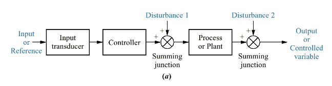
- open loop control (cheap, not robust)
- no way of knowing if expected output is actual output
- sensitive to disturbances and hard to control

#### Closed-Loop System

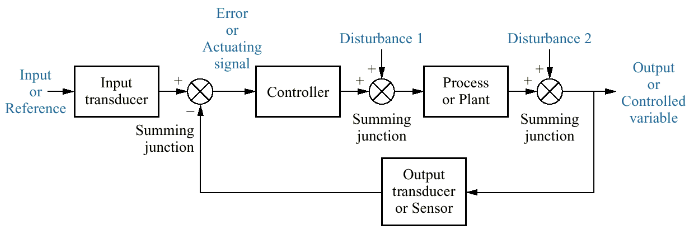
- allows you to check output
- measuring the output response of a system and comparing it to a reference turns open loop system into closed loop

### Transient and Steady-State Response

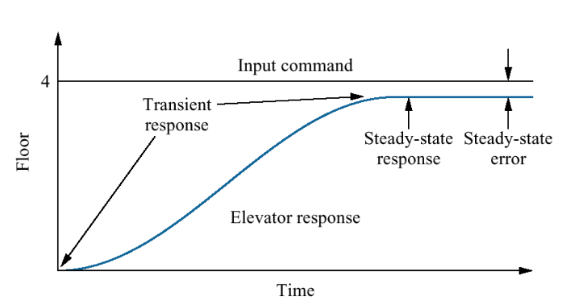
_transient = in transition_
- transient response tradeoffs
	- if you get where you want really fast (high gain)
	- oscillates around point and doesn't settle
	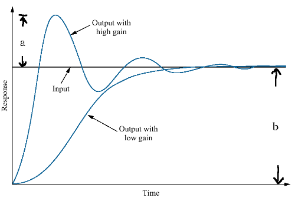
	- low gain: doesn't overshoot
```	
Percent overshoot = a/b * 100%
a = x-axis to highest point
b = x-axis to lowest point
```

#### Stability Intro

```
Total response = Natural response + Forced response
```

- Natural response (homogeneous) - evolution of system due to initial conditions, the way system dissipates or acquires energy
- Forced response (particular soln) - Evolution of system due to input
- generally, system is stable if the natural response eventually goes to zero or oscillates at fixed amplitude
- bounded input doesn't create bounded output so unstable system grows without bounds, becoming uncontrollable :dizzy_face:
- system has to be stable to be useful

#### Control Objectives
1. Stabilize the system
2. Produce desired transient response
3. Decrease/eliminate steady state error
4. Make system robust to withstand disturbances and variations in parameters
5. Achieve optimal performance

#### Design Process
1. Transform requirements into physical system - concept
2. Draw a functional block diagram - detailed layout
3. Create a schematic
4. Develop mathematical model (block diagram)
	- mechanical
	- electrical
	- rotational
5. Reduce block diagram
6. Analyze and Design

#### Testing Waveforms

Input | Function | Use
------|----------|-----
impulse | 𝛿(t) | transient response modeling
step | u(t) | transient respone and steady-state error
ramp | tu(t) | steady-state error
parabola | .5t<sup>2</sup>u(t) | steady-state error
sinusoid | sin wt | transient response, modeling, sse

## Day 2 Jan 5 2018

### Compensator Terminology and PID controllers

#### Lab 1
- 70% of problems can be solved with PID
- In Lab 1, you design a PID controller to control position of a DC electric motor's shaft. Criteria for the controller's step response are
	- settling time less than 0.04s
	- overshoot less than 16%
	- system is free of steady-state error

#### Proportional Control System 
- calculating controlled output to make motor go proportionally faster
- open loop version: apply step voltage to motor
   - through feedback, you can put more energy into the system cranking up the gain enough so that it doesn't go unstable or start to oscillate
- makes things go faster by feeding error signal directly to plant

#### Integral Control System
- feeds integral of error to plant
- keeps the motor moving in theory
- however, not always how it works in practicality therefore, a step voltage doesnt mean anything
- therefore you need to integrate over time so the voltage becomes big
- integral gain gets rid of steady state error

#### Derivative Control System
- feeds derivative of error to plant
- prevents overshoot or gets desired amount of overshoot
- later we will learn the theory to predict the control of systems
- in practice, requires a lot of tweeking and fine tuning 
- improves performance of system

#### Underdamped Response Specifications
Let c<sub>final</sub> = lim<sub>t->inf</sub>c(t)

**c(t)** is the output

1. **Rise time** T<sub>r</sub> is the time for output to go from 10% (0.1c<sub>final</sub>) to 90% (0.9c<sub>final</sub>)
2. **Peak time** T<sub>p</sub> - time required to reach first and largest peak
3. **Percent overshoot** - %OS percentage that output overshoots final value

%OS = ((c<sub>max</sub> - c<sub>final</sub>)/c<sub>final</sub>)*100%

4. **Settling time** - is it close enough to do whatever we have to do? (settles within +-2% ofc<sub>final</sub>

#### PID Controller
- transfer function of proportional integral derivative controller

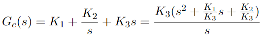

- first term is proportional, second integral.. etc
- system has 2 zeros plus a pole at origin

### Modeling in the Frequency Domain
- 2 methods to develop mathematical models
	1. transfer functions in frequency domain
	2. state equations in time domain

#### Block Diagram Representation of System
- can use differential equations to represent relationship between input r(t) and output c(t) or a block diagram of subsystems
- however, we want cascading subsystems to make life easier which isn't possible with differential equations
- therefore, we need transfer functions

### Laplace Transforms and Table
- modelling in the frequency domain entails laplace transforms
- can do by hand or using MatLab
- helps us understand dynamic behaviour of processes
- time domain vs laplace domain (s-domain)
- laplace is best used for stability analysis, controller design, block diagrams)
- **Laplace Transform** - going from time domain differential equation to laplace algebraic equation 
- **Inverse Laplace transform** - algebraic equation to time domain solution

**_Definition of Laplace Transform_**

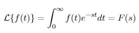
- s = σ + jω is the Laplace transform variable
- no information for time less than zero so we multiply f(t) by u(t) 
- but its ok if you write L(1/s^2) = t

#### Laplace Table

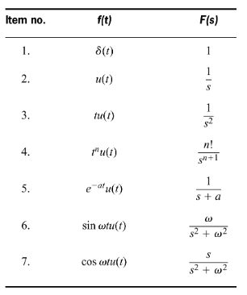

#### Important properties of laplace
- linearity - can bring constants out
- differentiation: limit as t goes to zero
	- laplace of derivative is s*F(s) - f(0-)
- frequency shifting: if you multiply by exponential e<sup>-at</sup> and take laplace, you replace F(s) by F(s+a)

#### Laplace Transform Theorems

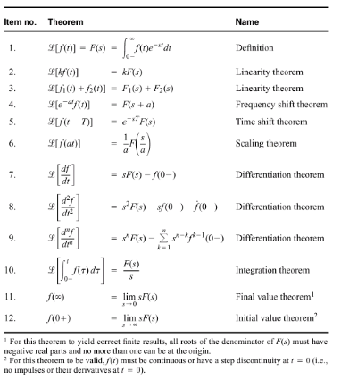
- \#11 could have poles on left side and maybe one at origin but if it doesnt it violates condition and is unstable

### Transfer Function
- the box in the middle that transforms input
- n<sup>th</sup> order LTI differential equation is of the form:
	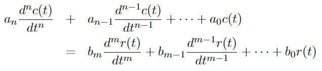
- c(t) is output, r(t) is input, G(S) = C(s)/R(s)

#### Example
```
Tp*dc(t)/dt + c(t) = kp*r(t)
------take laplace-----------------
L(Tp*dc(t)/dt + c(t)) = L(kp*r(t))
-------linearity---------------------
Tp*L(dc(t)/dt) + L(c(t)) = kp*L(r(t))
--------differentiation----------------
Tp*(s*C(s) - c(0)) + L(c(t)) = kp*L(r(t))
------apply laplace, assume c(0) = 0----
Tp*s*C(s) + C(s) = kp*R(s)

--------find G(S)-----------------------
G(s) = C(s)/R(s) = kp/(Tp*s + 1)
```

#### Inverse laplace transform
- 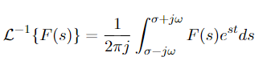
- just look at the tables

#### Partial Fraction Expansion
- since the system model will most likely of the form F(s) = N(s)/D(s)
   ```
		s^2 + 2s - 3		       			
	F(s) = ----------------
		s^5 + s^4 - s - 1	   	   

		= s^2 + 2s - 3
		  -----------------
		(s-1)(s+1)^2(s^2+1)

		= A      B       C        Ds + E
		----- + ----- + ----- +  -------
		s-1     s+1    (s+1)^2   s^2 + 1
	```
- expect a bunch of dif terms
- pole zero cancellation, when both denom and numerator have same pole
- so when you expand the term with s - 1 wont be there

## Day 3 Jan 9, 2018

#### Laplace and PartFrac Examples

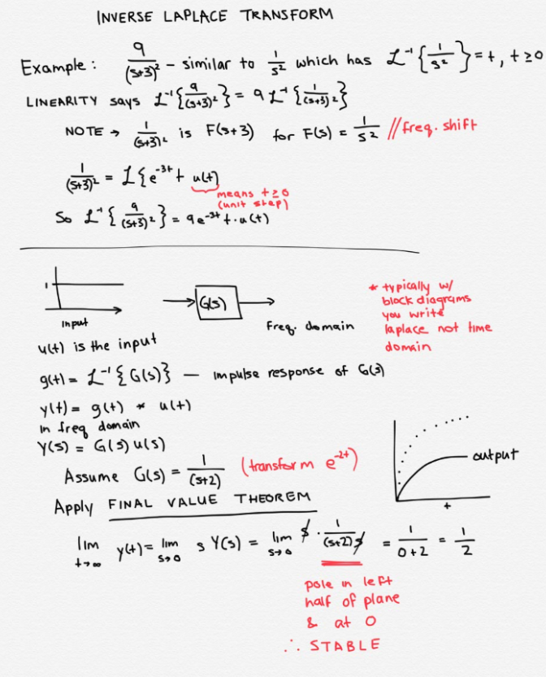

- Final Value Theorem is a quick way to look at the system in the long run
- we know the above is a first order system therefore there are no oscillations

#### Partial Fraction Expansion
- take transfer function and decompose it to compare to the table
- refer to [Cover Up Method](#cover-up-method)

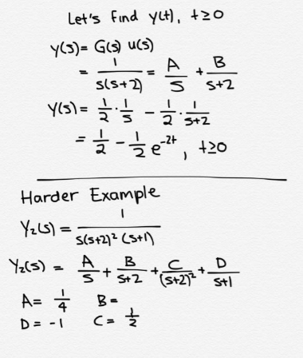

### Some MatLab Commands
- define F
- define ```syms s, t```, etc
- ```ilaplace``` - computes laplace
- ```partfrac(F)``` - gets partial fractions
- ```pretty(x)``` - makes it pretty

#### Partial Fractions Decomposition
1. Divide if improper, degree of numerator is denominator
	- do long division
2. Factor denominator so they can't be further reduced
3. Linear factors
	- if you have (s+a)<sup>m</sup>, include A/(s+a) ... A<sub>m</sub>/(s+a)<sup>m</sup>
4. Quadratic factors - Bs + C when you have as^2 + bs + c denominator
5. Determine unknowns

#### Cover Up Method
- neat lil trick for the bois back home
- say you're solving for A
	- look at its denominator and find its pole
	- then cover up that denominator from original
	- sub in the value of the pole and answer shall be A :information_desk_person:

## Day 4 Jan 11, 2018

### Stability Analysis
- if you have a complex polynomial N(s) and D(s)
- after expansion, we refer to roots of D(s) as poles
- if you have some polynomial in matlab, you can do roots([a b c]) with the coefficients of your polynomial ax^2 + bx + c
- ```s = tf('s')``` - makes it so that s is the variable in transfer function
- can find poles of G(s), a transfer function, by doing the above command and ```pole(G)```
- if you have distinct poles p1, p2, p3 then you end up with A<sub>1</sub>e<sup>-p<sub>1</sub>t</sup> + A<sub>2</sub>e<sup>-p<sub>2</sub>t</sup> + ... A<sub>n</sub>e<sup>-p<sub>n</sub>t</sup>
- between G(s) = 1/(s+1) and 1/(s-1), the second one is unstable as it comes to a finite value

#### Case 1: Real Roots
If we have poles at s = -p<sub>i</sub> = - σ<sub>i</sub> +- jω<sub>i</sub>
- if ω<sub>i</sub> = 0 then pole is strictly real 
- if σ<sub>i</sub> > 0, then pole is in left side of imaginary plane and response decreasess to zero over time - system is **stable**

#### Real and Imaginary Roots
- if ω<sub>i</sub> = 0 and σ<sub>i</sub> < 0 then pole is in right side of imaginary plane, response increases over time and system is **unstable**
- sometimes you want an oscillation, can tune a system so poles are on imaginary axis
- if only pure imaginary roots, technically considered stable - called **marginally stable** because its impulse response doesn't blow up - σ<sub>i</sub> = 0 and ω<sub>i</sub> != 0
	- this system has no damping

##### Example of Marginally Stable
- poles at -3 and +3 on j (imaginary) axis with G(s) = 1/(s<sup>2</sup> + 9)
- system will blow up with a repeating periodic impulse input
- bounded input to break system: hit it with oscillation of 3 rad/s

#### Case 3: Roots are Complex or Imaginary
Again, if we have poles at s = - σ<sub>i</sub> +- jω<sub>i</sub>
- if ω<sub>i</sub> and σ<sub>i</sub> both != 0 we have complex roots

```
Unstable Example
G = 1/((s-2 +j*3)*(s-2-j*3))

>> impulse(G)
>> step(G)

starts oscillating a lot and doesn't plateau

----------
Stable Example
G = 1/((s+2 +j*3)*(s+2-j*3))

>> impulse(G)
>> step(G)

some oscillation, then plateaus out
```

#### Time Functions associated with s-plane
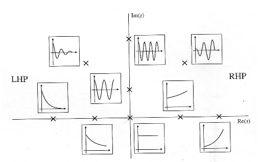
- in theory, turning up the gain and spending infinite energy will make system response large
- on s-plane, things on j plane appear in complex conjugates

### Electrical Network Transfer Function
- impedence is laplace generalization of resistance
- need Ohm's law: ```v(t) = Ri(t)```
	- Laplace ```V(s) = R!(s)```
- impledence: ```Z(s) = V(s)/I(s) = R```
- admittance: ```Y(s) = !(s)/V(s) = 1/R = G```

#### Impedence of Inductor
- voltage-current relation of inductor
- ```v(t) = L di(t)/dt```
- assume 0 condition when performing Laplace to find transfer function
- given this cicruit, replace L by Ls
- 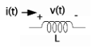

#### Impedence of Capacitor
- dv/dt = (1/C)i
sV = (1/C)I
- Z(s) = V/I = 1/C*S

#### Summary of Circuit Elements
- things with very low voltage signal use active components - eg cellphone
- active components inject energy unlike passive componenets (without internal energy source)

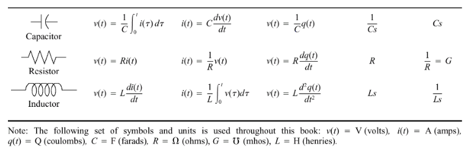

#### Equivalent Resistance and Impedence
- resistance in serial can be replaced by equivalent resistor R<sub>s</sub> = R<sub>1</sub> + .. + R<sub>N</sub>
- same with impedence: Z<sub>s</sub> = Z<sub>1</sub> + .. + Z<sub>N</sub>
- in parallel resistors are R<sub>p</sub><sup>-1</sup> = R<sub>1</sub><sup>-1</sup> + .. + R<sub>N</sub><sup>-1</sup>
- same with imepedence: Z<sub>s</sub><sup>-1</sup> = Z<sub>1</sub><sup>-1</sup> + .. + Z<sub>N</sub><sup>-1</sup>

## Day 5 Jan 12, 2018

### Kirchhoff's Current and Voltage Law

#### Current Law
- point of connection between 2 or more circuit elements is referred to as **node**
- current flows into node considered positive, leaving the negative node
- _KCL_ says that the algebraid sum of currents entering any node is 0
- 5 going in, i going in, -3 going out and -2 going out gives a sum of 0
- 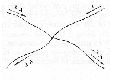

#### Voltage Law
- algebraic sum of voltages around closed loop/path is zero
- to find voltage across op resistor, we're going from plus to minus so subtract, therefore it's 3 V
- 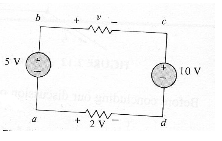

#### Written Example
- finding transfer function V<sub>c</sub>(s)/V(s)
- voltage across capacitor varies with integral of v so c becomes 1/cs
- current = the voltages (in series) + Ls + Lr + 1/Cs
- voltage = current * impedence

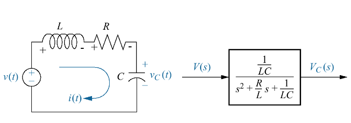

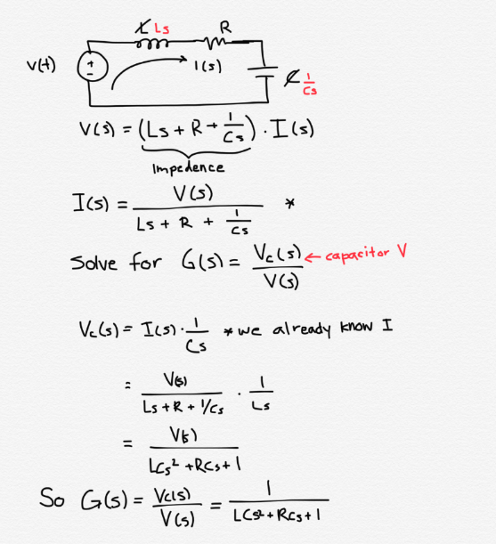

### Mesh Analysis
- if you know the currents in the circuit then you can figure out anything else because current * impedence
- if you know the voltages, same thing because you can do voltage/impedence

#### Mesh Example
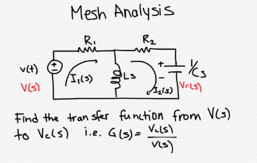

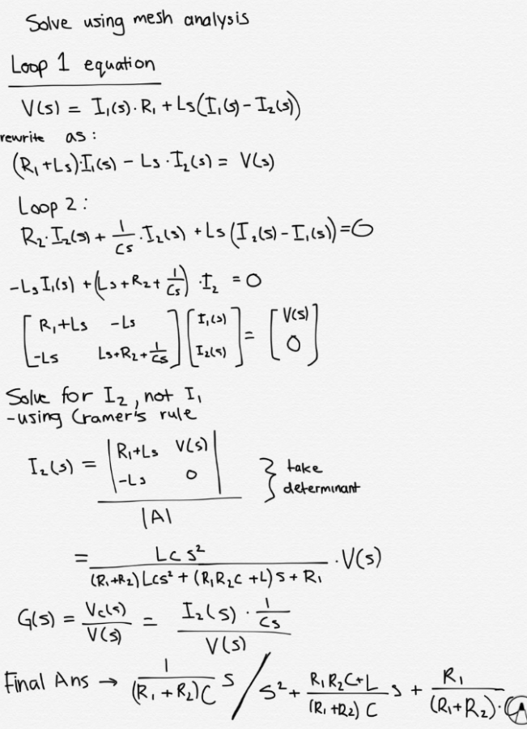

### Cramer's Rule
- if Ax = B is a system of N linear equations and you wanna solve for N unknowns such that det(A) != 0, then system has unique solution and you can solve for x
- replace column of A<sub>n</sub> by column of B 

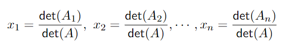

- brute force mechanical way of solving matrix
- probably won't have to do a matrix bigger than 3x3
- might wanna put formulars on cheat sheet 

**2 pages of notes allowed on midterm**

### Nodal Analysis
- alternative to mesh analysis
- start out with circuit
- replace elements with their laplace equivalent
- L -> Ls, C -> Cs, etc
- use kirchhoff's current law for equations for unknown voltages

#### Nodal example

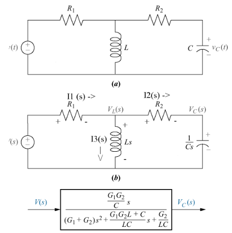

## Day 6 Jan 16, 2018

***Midterm during week before reading week\***

### Operational Amplifiers
- resistors, conductors - passive elements that don't put energy into system
- you don't get as much out of these systems
- if you want large gain in system, you need to amplify with _active_ components
- following characteristics
	1. v0(t) = A(v2(t) - v1(t))
	2. high input impedence Zi = infinity
	3. low output impedence Z0 = 0
	4. the more current you draw, still basically same voltage: high constant gain A = infinity
- ideal Op Amp assumptions
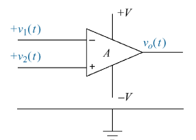
	- input voltages are equal: v1(t) = v2(t)
	- no current flows into inputs i+ = i- = 0

#### Inverting Op Amps
- if we tie v2(t) to ground, with output vo(t) = -Av1(t)
- large impedence so current ~ 0
- 2 marks for writing down voltage - voltage at ground = 0, V1(x) = 0
	- current flowing in is 0
	- relation between i1 and i2: i1 = - i2
	- if A is very large gain, force of the two voltages is equal in example below
	- since v1 is approx 0, value of current i1 = (input - 0)/zi
	- i2 = (Vout/z2)
	- This gives the transfer function - V0(s)/Vi(s) = -Z2(s)/Z(s)
	- should write down this configuration on your cheat sheet

	

#### Example
Find transfer function Vo(s)/Vi(s) of the following:

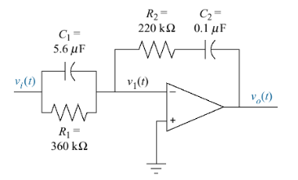

- Vo(s)/Vi(s) = -Z2(s)/Z1(s), both of which we need to determine 
- using parallel inductance, Z1(s)<sup>-1</sup> = C<sub>1</sub>s + R1<sup>-1</sup>
- Z1(s) = inverse of above = 360000/(2.016s + 1)
- using serial inductance rule, Z2(s) = R2 + C<sub>2</sub>s<sup>-1</sup>
- through substitution we can now find the transfer function
- multiplying input by s implies derivative
- division by s corresponds to integral
- Vo(s)/Vi(s) = (220000 + 10^7/s)/(360000/(2.016s + 1))
- putting those 3 terms together gives you PID controller
- Gc(s) = K3(s^ + K1s/K3 + K2/K3)/s (as seen earlier)

#### Noninverting Op Amp
- want input to go into positive terminal (unlike previous example)
- we know that Vo(s) = A(Vi(s)-V1(s))
- using voltage division, 
- voltage divider circuit

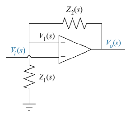

```
Vo(s)    Z1(s) + Z2(s)
----- = -----------------
Vi(s)        Z1(s)
```

**written example that I missed?**

### Mechanical Systems: Translational and Rotational
- once in laplace form, we just know transfer function
- there are 2 types of mechanical systems, [translational](#translational-system) and [rotational](#rotational-system)

#### Mass Component
- we wish to find transfer function Z<sub>m</sub>(s) = F(s)/X(s)
- Newton's second law of motion ```{sum} f = ma```
- laplace forms for position f(t) = Ma(t) is F(s) = Ms<sup>2</sup>X(s)
- if you know position, multiply by s to get velocity **(assignment q)**

#### Viscous Damper
- the things that adds friction to doors so they don't swing open like crazy
- friction is proportional to velocity
- middle part is typically moving through some liquid
- f(t) = f<sub>v</sub>v(t)
- taking Laplace we get F(s) = f<sub>v</sub>sX(s) -- ratio of force to position

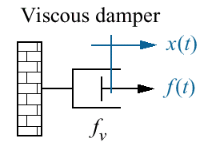

#### Spring Constant
- K
- f(t) = Kx(t)
- in laplace: F(s) = KX(s)
- impedence of that Zm(s) = F(s)/X(s) = K
- F(s) = K/s*V(s)
- the derivative/velocity is then K/s

#### Summary of Translational Elements

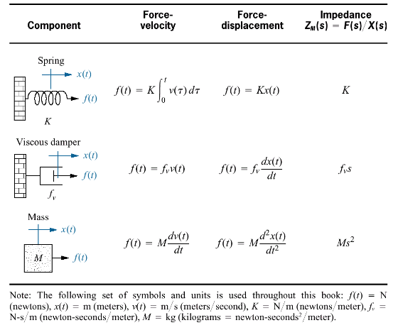

#### Translational System
- to find transfer function
	- draw free-body diagram
	- use f = ma to create force equations
	- in example there is force acting to right and force Kx as well as fv*x
	- the m*a component will be left over
	- assume positive direction of travel is to the right
	- Kx and fvx pulling you back

	

	- b) is laplace form

#### Two degrees of motion
- state space systems, state of a system in the future
- only care about position and velocity
- number of equations of motion = number of linerly independent motions
- in system below, there is a viscous damper between the two masses so they can independently
	- they interact but if one moves the other can remain stable
	- therefore 2 degrees of freedom, one for each mass

	

- Find transfer function of above by using principle of superposition
- works on linear systems
1. draw free-body diagram of one object by holding the other object still
2. draw free-dbody diagram not olding other object still
3. total force acting on original object is superposition of forces

**M1** 
- nail M2 to the floor
- if M1 moves right, viscous damper pushes you back, spring between gets compressed and spring on left getting stretched AND coefficient of friction AND m*a


- a) is fbd if only m1 moves independent of m2
- b) is is m1 when m2 moves
- c) is the superposition of all forces

## Day 7 Jan 18, 2018

#### Translational System Example
- find transfer function X(s)/F(s)

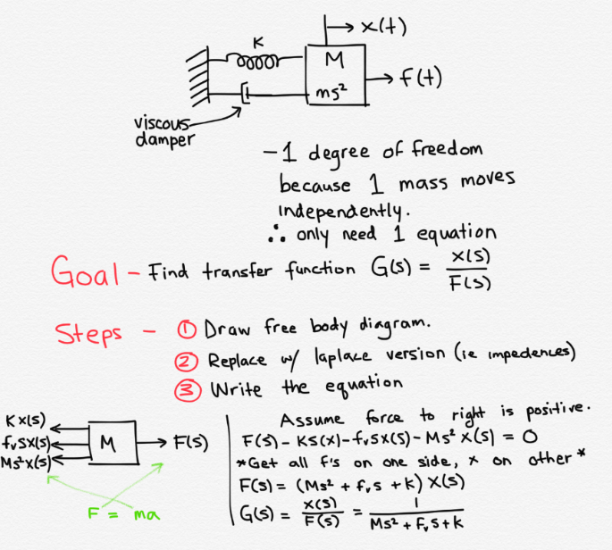

- moving on to more complex example

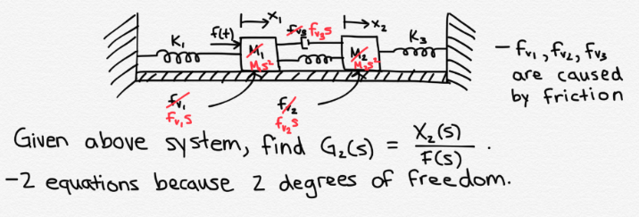

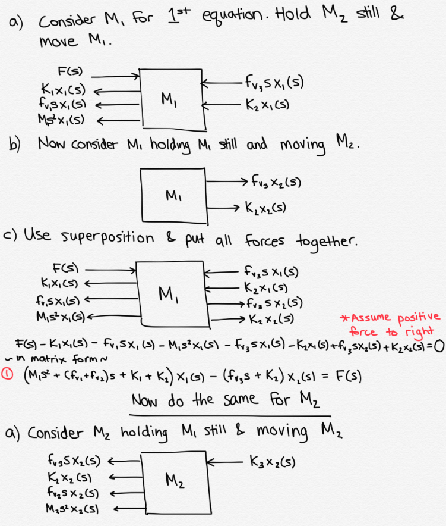

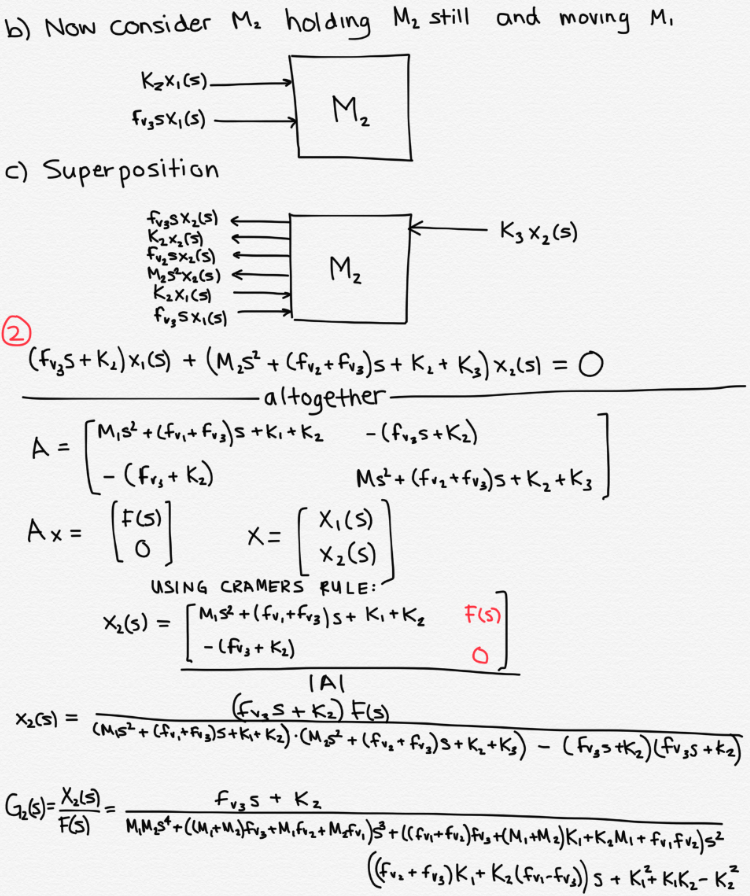

## Day 8 Jan 19, 2018

- when asked for transfer function for position from velocity - multiply by 1/s

#### Rotational Systems
- x(t) --> θ(t) 
- v(t) --> ω(t) angular velocty
- f(t) --> T(t) torque
- M --> J moment of inertia
	- impedence is Js^2
- fv --> D viscous damper
	- impedence is Ds
- K --> K
	- impedence is K

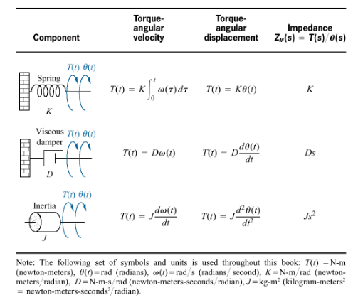

#### Rotational Degress of Freedom
- which mass you can rotate independently
- in diagram, there are 2 degrees of freedom

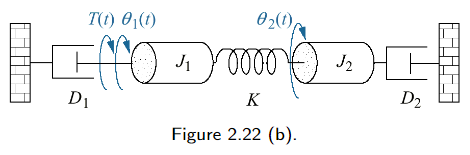

#### Homework next week
- if you have something that looks like

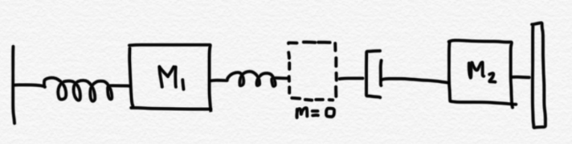
- you have additional degree of freedom. add in mass of size 0

#### Writing Equations of Motion
- use same principle as translational motion
- Consider J1 holding J2 still, consider J1 holding J1 still and add them
- Do the same for J2 and find the sum of torques

## Day 9 Jan 23, 2018

#### Rotational Example
- Find the transfer function θ<sub>2</sub>(S)/T(S)
- flexible rod suported at both ends, undergoing torsion
- system can be approximated by a spring at one point in the rod with inertias J1 and J2
- a) is physical system and b) is schematic

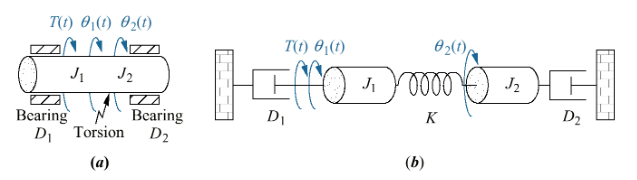

#### Free body Diagrams for J1
- torues on J1 due to motions of J1 (a)
- torques on J1 due to only motion of J2 (b)
- sum of all torques on J1 (c)
- You get J<sub>1</sub>s<sup>2</sup>θ<sub>1</sub>(s) + D<sub>1</sub>sθ<sub>1</sub>(s) + Kθ<sub>1</sub>(s) = T(s) + Kθ<sub>2</sub>(s)

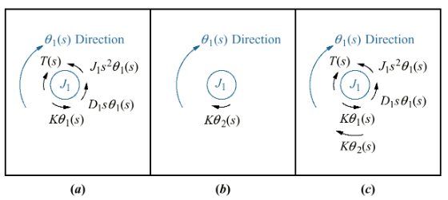

#### Free body Diagrams for J2
- torues on J2 due to motions of J2 (a)
- torques on J2 due to only motion of J1 (b)
- sum of all torques on J2 (c)
- You get J<sub>2</sub>s<sup>2</sup>θ<sub>2</sub>(s) + D<sub>2</sub>sθ<sub>2</sub>(s) + Kθ<sub>2</sub>(s) = Kθ<sub>1</sub>(s)


#### Putting it all together
- from the 2 equations, we move the unknowns to the left side and collect terms for θ<sub>1</sub> and θ<sub>2</sub>
- Put this into the form of Ax = B

```
x = [ θ1(s) ]
    [ θ2(s) ]

A = [ J1*s^2 + D1*s + K          -K          ]
    [       -K           J2*s^2 + D2*s + K   ]

B = [ T(s) ]
    [  θ   ]
```

- use Cramer's rule to find 0<sub>2</sub>(s) = |A<sub>2</sub>|/|A|
- thus we get θ<sub>2</sub>(s)/T(S) = |K|/|A|

### Rotational Mechanical System with Gears

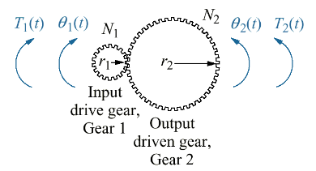

θ<sub>2</sub>/θ<sub>1</sub> = N<sub>1</sub>/N<sub>2</sub> =
T<sub>1</sub>/T<sub>2</sub>

So T1\*N2 = T2\*N1

```
T1--->[N2/N1]--->T2
```

#### Using Transfer Function for Lossless Gears

Equation of motion is (Js<sup>2</sup> + Ds + K)θ<sub>2</sub>(s) = T<sub>1</sub>(s)(N<sub>2</sub>/N<sub>1</sub>)

- assume negiligable inertia and dampening

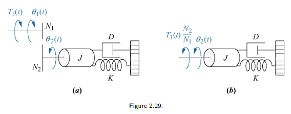

#### Generalizing Reflecting Impedance
Rule: "Rotational mechanical impedances can be reflected through gear trains by multiplying the mechanical impedence by the ratio (# of teeth of gear on destination shaft/# of teeth of gear on source shaft)^2

#### Examples

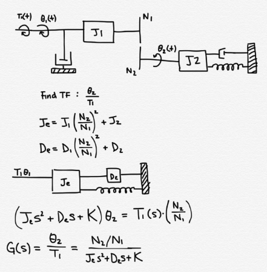

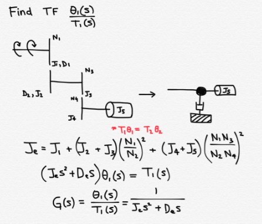

## Day 10 Jan 25, 2018
- Midterm: Feb 8 or 15 5:30 to 7:30

### Electromechanical Transfer Functions and DC Motors
- systems that are a mixture of electrical and mechanical variables

#### DC Motor
- motor that takes a voltage as input and produces a physical displacement as output
- we will derive the transfer function for the armature-controlled dc servomott
- voltage applied -> angular displacement
- it's armature control because you're applying the voltage across the armature

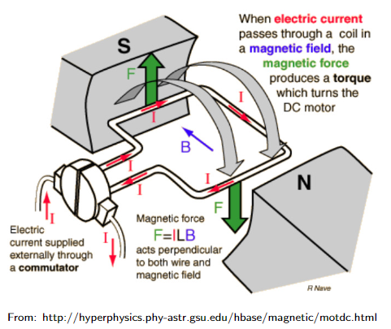

##### DC Motor Principles
- they have a comutator
- coil has current flowing up
- need to use handrule to find direction of magnetic force
- F = Bli<sub>a</sub>(t)

##### DC Motor Basics
- contains stationary magentic field provided by permanent or electromagnetic
- motor contains rotating circuit called the armature (the coils) through which current i<sub>a</sub> flows
- there is inductance in the coil

#### Back EMF
- when conductor moves at right angles to magnetic field, it generates voltage at terminals of the conductor (like a generator)
- since armature is rotating in magnetic field is produces voltage proportional to velocity
- vb(t) = Kb*(dθ<sub>m</sub>/dt)
- taking laplace we get V<sub>b</sub> = K<sub>b</sub>sθ<sub>m</sub>(s)

#### Analyzing Armature Ciruit for Transfer Function
- we wish to find θ<sub>m</sub>(s)/E<sub>a</sub>(s)
- torque is proportional to curent
- apply kirchoff's coltage law
- we end up with equation of motion:

```
Tm(s) = (Jm*s^2 + Dms)*θm(s)

*m is subscripted
Dm is viscous damping
Jm is moment of inertia
```

This gives us transfer function K/(s(s+α)).

#### Deriving Jm and Dm
- typical use of motor

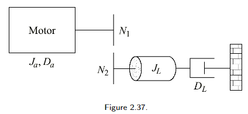

- Ja is moment of inertia, Da is viscous damping
- we can reflect the lad to get armature inertia, gears: desitination/source gear squared

#### Deriving Electrical Constants
- _dynamometer_ measures torque and speed of a motor under constant applied voltage
- previously we derived: (R<sub>a</sub>/K<sub>t</sub>)*T<sub>m</sub>(s) + K<sub>b</sub>sθ<sub>m</sub>(s) = E<sub>a</sub>(s)
- taking the laplace inverse of that we get (R<sub>a</sub>/K<sub>t</sub>)*T<sub>m</sub>(t) + K<sub>b</sub>ω<sub>m</sub>(t) = e<sub>a</sub>(t)
- if we tune our mechanical system we
- stall point is the maximum torque you can get out of the system

In lab we will apply voltage across motor, it will ramp up (like first order system) then go into steady state and run at steady state velocity

### Linear and Nonlinear systems
- linear has 2 properties
	1. Superposition means that the output response to a sum of inputs isequal to the sum of the output response of each individual input that makes up the sum
	2. Homogeneity - means that when input is multiplied by a scalar, the result is a response multiplied by same scalar
- non-linear
	- op amps are linear over given range but exhibits saturation at high inputs
	- motor exhibits deadzone where it doesn;t respond to low input voltages due to friction
	- backlash occurs when gears don't fit well
	- sometimes you can do a [linear approximation](#linearization) of non-linear systems

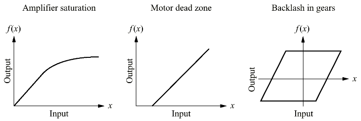

#### Linearization
1. Identify non-linear components and write nonlinear
2. Choose small range of input values over which the system behaves approximately linear. This is a _small-signal input_.
3. Write linear differential expression for this range and then apply Laplace tranforms

##### Linearizing a Function
- take first derivitave of function
- evaluate it at given point (pi/2)
- slope becomes -5

## Day 11 Jan 26, 2018

**Midterm Prep**
- 2017 midterm block diagram problem
- the closed loop in a closed loop in a closed loop

### Reduction of Multiple Systems (Slides 3)
- multiple block diagrams that require block diagram algebra to perform reduction

#### Block Diagrams
- there are **summing junctions** that combine 2 or more signals, producing algebraic sum as output
- depending on the signs on the arrows, your output will be summed
- there are also **pickoff points** that break the input signal into multiple copies

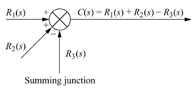

#### Cascade Form
- one controller flows into the next in sequence
- we will do unity feedback ssytem where plants are in line with the controllers
- in laplace form, cascade is achieved by multiplying all the transfer functions

##### Loading in Cascaded Subsystems
- seen in assignment 1 circuit analysis question
- when you have things in parallel the current changes, can't just compute 2 transfer functions independently and multiply them together

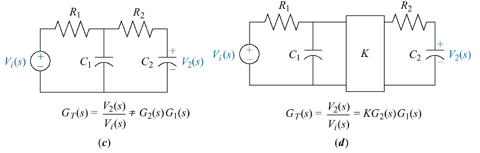

#### Parallel Form
- sum together all the gains

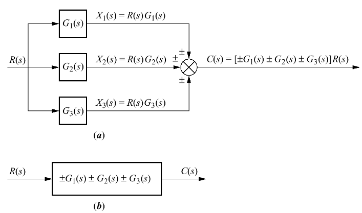

#### Feedback Form
- **input transducer** takes input motion from potentiaometer and translates it to voltage
- **output transducer** - most commonly there are systems with negative feedback
- the feedback is the output C(s) going through H(s)
- by substituting E(s) = R(s) +- C(s)H(s) and C(s) = G(s)H(s) we get G<sub>e</sub> = C(s)/R(s) = G(s)/(1 +- G(s)H(s))

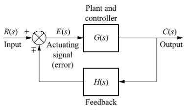

#### Moving Blocks
- to create familiar forms
	- because of distribution, the following 2 are equivalent
- through summing junctions
- through pickoff points

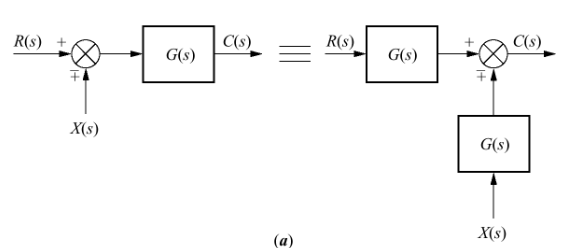

##### Reduction via Familiar Forms Example

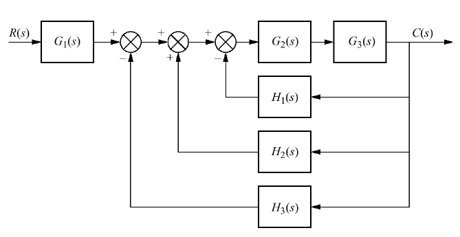

- cascade G2 and G3
- all the summing junctions can be merged into 1 summing junction
- all H(s) then become parallel so you can sum them
- multiple ways to do it


#### Reduction By Moving Block
1. move G2 to left of pickoff point creating parallel form
2. reduce feedback system (G3, H3)
3. reduce parallel form containing 1/G2(s) and unity
	- the new block will be (1 + 1/G2(s))
4. Taking G1(s) and pushing it past summing junction, replace H2(s)/G1(s)
5. Can also put above and H1(s) in parallel --> they get summed
6. replace with H2(s)/G1(s) + H1(s)

#### Exam 2016 example


## Day 12 Jan 30, 2018

#### Midterm 
- Feb 8, 5:30-7:20pm at Canadian Martyrs Centre
- 2 pages of double sides notes

### Modelling in the Time Domain
- there are 2 main approaches for modelling and designing control systems
- so far we have done frequency domain which is only good for SISO
- the more modern technique is **state space** representation which is in the time domain
- thid method can also be applied for non-linear systems but that is beyond our scope

#### State Space Representation
- ```ẋ = Ax + Bu``` are state equations - how the system's state evolves
- ```y = Cx + Du``` are output equationss
- the state equation for an nth order system, a set of n simultaneous, first-order differential equations with n variables
- for linear time invariant systems (second order systems, n=2), single input v(t), there will be 2 equations of the form:

 

- **System variables** - respond to a system input or initial conditions
- **Linearly dependent** - x should linearly independent and can't be written as a combo of other variables
- **State variables** - minimal amount of info needed to predict into the future
- **State vector** - x_transposed 
- **First derivatives** - x_dot = dx/dt = [dx1/dt dx2/dt...]
- **Output vector** - y = [y1, y2, y3..yp]
- **input of control vector** - u = [u1, u2,..., um]

#### State Space Representation Example
- go around the block and do kirchoffs law
- write the loop equation Lsi/dt + Ri + 1/C integralidt = v(t)
- we want to convert the equation to 2 first order differential equations
- state vairables are q, the charge and i, the current (staying in time domain)

First equation: derivate of q wrt i is the current

Second equation: integral of idt = q
	- we get the d1/dt = -q/LC - Ri/L + v(t)/L

Take the second equation nd multiple by L to get voltage

Now we can write in matrix format
- state ector is qi

The rate of change of q is i

x vector = [dq/dt, di/t]^T
A = [0 1, -1/LC -R/L]^T
z = [q i]^T
B = [0 1/L]T^ 
u = v(t)

Now you can calculat C and D

#### Aplying State Space Representation
- Select the state vector
	- look at the energy storage (capacitors, inductors) in electrical network
	- for mechanical systems, need to know mass (for every mass there are 2 state variables - position and velocity)
	1. have to be linearly independent
	2. minimum number of state variables must be chosen, this will be the number of state equations
	- it turns out that if we do this in lapace, we end up with nth order transfer function
	- the number needed is usually equal to the number of storage elements in system

#### Electrical Network
Find a state space representaion for the network below with output ir(t) the current through the resistor
1. label branch currents (iL, iR, iC)
2. write derivative equations for all energy storing elements
3. rewrite the derivative equations in terms of state variables
4. solve for output in terms of input and state variables
5 express in state space form

#### Translational Mechanical System
- find state space representation for system if the output is x<sub>2</sub>(t)
- use position and velocity of each linearly independent point of motion
- take state variable 

```
x_vector = [x1 v1 x2 v2...]
we want x2, position of second mass

dx/dt = Ax + Bu
y = Cx + Du

D matrix will be equal to 0
C matrix will be [0 0 1 0] because we are picking x2

A matrix = [0 1 0 0 ] 
           [-----   ]
           [0 0 0 1 ]
           [ -----  ]
```

#### Convert Transfer Function to State Space
- be careful of pole 0 cancellation
- can derive state space equation from a transfer function
- assume you're given an nth order differential eqation, y is system output, u is input
- we will use phase variable approach
- Ax + Bu where A's last row is the negative coefficients and B's last entry is b0

##### Example
- say you have G(s) = 2s^3 + 2s^2 + 3s + 4/s^3 + 5s^2 + 6s + 7
- C(s) = Y(s)/U(s) = 2 + b2s^2 + b1s + b3/s^2 + 5s^2 + 6s + 7
- typically we will be asked for controller canonical form

<SLIDE  19>

## Day 13 Feb 1, 2018
- controller form: you take coefficients of denominator and reverse them
- G(s) = s^2 + 7s + 2/s^3+9s^2+26s+24


## Day 14 Feb 2, 2018

### State Space to Transfer Function Written Example


Midterm will cover up to chapter 4-5.

### Time Response
- we are gonna try and develop intuition on what properties w need in a system to get what we want
- so we can look at a system and tell how its gonna behave

#### Poles and Zeroes
- system is infuenced by its poles and zeroes
- consider a transfer function
	- poles are the roots of denominator
	- zeroes are roots of numerator
- in general, at poles G(s) = inf. unless the pole is cancelled by a matching zero
- at zeroes, G(s) = 0 unless zero is cancelled by matching pole

#### Poles and Zeroes of First Order System
- forced/steady state response (input) and the natural/homogeneous response (how system behaves with initial conditions)
- for simple system s+2/s+5 and input 1/s
	- in the graph, x represents poles and o represents a zero
	- in matlab, there is a live editor that lets you interleave text and equations (go to insert -> equation)

```
G = y/x
s = tf('s')
```

## Day 15 Feb 6, 2018

#### Evaluating Response Using Poles
- we can identify between forced and natural response by inspection

### First Order Systems
- systems without zeroes
- we can find form specifications for this system like:
1. time constant: 1/a
	- the time required for step response to reach 63% of its final value
	- can get a from the initiial slope at time t = 0, the derivative of c(t) is ae<sup>-at</sup>
	- a is the exponential frequency
2. rise time/settling time
	- rise: time it takes to get to 10% to 90%of final value
		- 2.2/a
	- settling: time required to reach 98% of final value
		- 4/a

**board time**


### Testing to Determine Transfer Function
- often not possible/practical to determine function by analytic means
- in general, gain of system at s = 0 (DC input) is not unity
- more general model is G(s) = K/s+a
- by Final Value Theorem, we get steady state as K/a using partial fractions
- for system to be first order its unit step response should have no overshoot and should have non-zero initial slope
- c(inf) = K/a

### Second Order Systems
- for first order, varying system parameters only changes speed
- second order system is b/(s<sup>2</sup>+as+b)
- these changes can change the form of the system's response
- might see damped oscillation
	- overdamped - looks similar to first order but its kinda curvy
		- 2 non-equal real poles
	- pole closest to 0 is the dominant pole
	- under damped - most interesting behaviour
		- complex conjugate poles (non-zero real and imaginry parts)
	- critically damped - 2 equasl real poles response
	```
		 G(s) = 9/(s^2+6s+9)
		      = 9 /(s+3)^2
		C(s) = G(s)/s = 9/(s*(s+3)^2)
		     = A/s + B/(s+3) + C/(s+3)^2
	```
	- undamped - system with 2 imaginary poles (0 zero parts)
		- frequency of osciallations corresponds to imaginary part

#### General Second Order Systems
- we will tpically get the frequency of a system without any dampening
- then we talk about ratio of dampening, independent of time scale
- takng the transfer function of second order system, we get the poles
- We can rewrite the system in terms of w<sub>n</sub> and ζ
	- natural frequency w<sub>n</sub> is frequency of oscillation of system with damping removed
	- damping ratio ζ is a way to describ system's damped oscillation, independent of time scale (exponential decay/natural frequency)
                                            
## Day 16 Feb 8, 2018

#### Deriving Parameters for Second Order Systems
- midterm day
- didn't pay attention but I think it was a review of [Day 17](#day-17)
- also did a lot of matlab stuff

##### Poles
- s1,2 = -ζw<sub>n</sub> +- w<sub>n</sub>sqrt(ζ<sup>2</sup>-1)

##### Zeta
- real part of poles/wn

##### Peak Time
- Tp = pi/(w<sub>n</sub>sqrt(ζ<sup>2</sup>-1))

##### Percent Overshoot
- %OS = e<sup>-ζpi/sqrt(ζ<sup>2</sup>-1)</sup> * 100%
- but if we know what percent OS, we can get ζ
	- ζ = -ln(.OS)/sqrt(pi<sup>2</sup> + ln<sup>2</sup>(.OS))

##### Settling Time
- when output reaches and stays within 2% of final value
- Ts ~ 4/(ζw<sub>n</sub>)

## Day 17 Feb 9, 2018

### Approximation of Higher Order Systems
- approximate them as second-order systems containing dominant polesk
- dominant poles are the 2 poles farthest to the right (typically)
- how far is far enough away? depends on how accurate you want to be
- textbook assumes 5 times further to the left than dominant poles

```
G2nd = .....
[p, z]=pzmap(G2nd) # second order
define p, z, p3
step(G2nd)
G3rd = zpk([],[p(1) p(2) p3],1) # gain = 1

output if you hit this with step (all poles are in left half plane)

z = 0x1 empty double column vector

step(G2nd)
hold
step(G3rd)

```

#### Justification for Ignoring Nondominant Poles
- the further you put them the faster they decay exponentially
- if D is really big then it will have a fast response
- steady state response is unity gain
- if D is big it will have an initial effect
- if we let C go to infinity then D looks like -b

```
C(s) = bc/(s(s^2+as+b)(s+c)) = A/s + (Bs + c)/(s^2+as+b) + D/(s+c)
A = 
B = ca-c^2/
C = (ca^2-c^2a-bs/(c^2+a-ca))
D = -b(c^2+b-ca)
```

#### System Response with Zeros
- if we have zeros, they don't affect order but they affect response
- therefore same denominators
- if zero is far to the left then it lets A get large, it gets much larger than poles

#### Nonminimum Phase System
- as soon as yu give it input, it goes in the opposite direction
- this is when zero is in the right half plane

#### Pole Zero Cancellation
- if you have a zero and it's really close to the pole
- the zero will cancel the pole
- can only be used to cancel things in left half plane with a zero, **NEVER** the right half plane
	- this was asked on the 2016 final

```
C(s) =     26.25(s+4)
       -----------------
      s(s+4.01)(s+5)(s+6)

this is an unstable system

```

#### Analysis and Design of Feedback Systems

```
---> o ---> K ----> 1/(s(+a)) ---->
|				|
|				|
---------------------------------

T(s) =  K/(s(s+a))
     -----------------
      1 + L/(s(s+1))
     =      K
	 -----------
	  (s+a) + K

    =      w_n^2
	---------------
	s^2 + 2 {{zeta(?)S + w_n}

w_n^2 = K
2(zeta)w
```

#### Gain Design for Transient Respone
- design a value for system gain K such that resposne has 10% overshoot
- overshoot formula for zeta


- **matlab script**
```
a = 5
G = zpk([], [0 -a],1)
pos = 10
zeta = formula
Wn = sqrt(K)

rlocus(G)
```

## Day 18 Feb 13, 2018

### Stability
- there will be a question on this on the final

#### Intro
- ways to determine if a system is stable
- if the system is unstable, transient respone and steady state are irrelevant
- all the other criteria don't matter so stability is the first thing you check

#### Stability and Natural Reponse 
- for LTI systems, total response of system is c(t) = c<sub>forced</sub>(t) + c<sub>natural</sub>(t)
1. stable if natural resposne goes to 0 as t approaches inf
2. unstable if it gets unboudned
3. marginally stable if natural respone either decays or grows (stays constant or oscillates with fixed amplitude)

#### Bounded Input Bounded Output
- so you don't need to isolate forced and natural
1. if any bounded input produces an unbounded output (even just one) then the system is unstable
2. if every bounded input produces bounded output then it is stable

#### Stability and Poles
- stable if all poles strictly in left half plane (negative exponentials/complex, decaying amplitude)
- unstable if any pole in right hand side
- marginally unstable
	- zeros on -y and +y just generates oscillations and is marginally stable (1/(s^2+w^2))
	- but if you take that and double the poles ie 1/(s^2+w^2)^2 is unstable
- multiplicity 
- poles on imaginry axis with multiplicity of 1 will be untable by the BIBO definition
	- for example if we hve G(s) = 25/((s^2+25)(s+1))
	- u(t) = cos(wt), U(S) = s/(s^2+w^2)
	- C(s) = G(s)U(s) = 25s/((s+1)(s^2+25)^2)
	- matlab simulation: 
	```
	G = 25/(s^3+s^2+25s+25)
	impulse(G*s/(s^2+25))

	# in time domain use elsim, gives same output
	G_theta = 5/(s^2+5s)

	step(G_theta)
	```
	- for BIBO, nothing can be on j omega axis or else that input will be able to mess up the system
	- if you have marginally stable system with poles on j axis, it is not BIBO stable because bounded input (the pole) can blow system up (give bounded input)

#### Example
- gain of 3, unity gain
- gives underdamped system
- poles of the closed loop system strictly in left half plane therefore BIBO
- input that will give biggest oscillation is 1.047


- second example is unstable


#### Stability Summary

Real Part of Poles | Natural Response | BIBO
------------------ | ---------------- | ------------
All poles < 0 | stable | stable
any pole > 0 or imaginary poles of multiplicty > 1 | unstable | untable
poles <= 0 and imaginary poles multiplicity of 1 | marginally stable | unstable

#### Closed Loop Systems
- when poles arent where we want we can use feedback control system

##### Necessary Stability Condition
- necessary condition for polynomial to haev all roots in open left hand plane (all positive coefficients)
- not a sufficient condition
- if some coefficients are missing, may be unstable or at best marginally unstable

#### Routh Hurwitz Criterion
- gives stability info without having to find poles of closed loop system
- create a routh table
	1. label rows of table with powers of s down to s^0
	2. list coefficients across top row starting with coefficient of highest power of s
	3. list remaining coefficients in second row starting with coefficeint of second highest power
- fill in the remainder
	- 2x2 determinants
	1. each entry is negative determinant of entries from previous 2 rows
	2. each determinant i divided by the entry in the first column of row above
	
##### Interpresting a Basic Routh Table
- system is stable if there are no sign changes in the first column
- on thursday we're gonna do the routh table for system on slide 15

## Day 19 Feb 15, 2018

### Stability and Routh Tables Example


 


## Day 20 Feb 16, 2018

### Routh Table Cases

#### Case I: Zero Only in First Column - Reciprocal
- polynomial whose roots are reciprocal of original polynomial, has poles with same distributions
- if you have a pole at -2, the reciprical is -1/2 which is still in the left half plane

#### Case II: Row of Zeroes
- if we evaluate s<sup>3</sup> row, we find all entries to be 0
- why row of zeros:
	- when purely even or odd polynomial as a factor
	- where all powers of s are even or odd
	- for the T(s) example, no sign changes and 4 imaginary poles, all poles on y axis and it's marginally stable

#### Stability Design via Routh-Hurwitz
- tuning system to make sure it's stable (solved yesterday)
- now we are going to look at it in state space

#### Stability in State Space
- from linear algebra we know sI-A inverse is the adjoint
- using all the equations we have we get det([sI-A]) = D(s)
- roots of det([sI-A]) = 0 will be the eigenvalues of A

### Steady-State Errors
- difference input and output as t --> infinity

#### Test Inputs
- can have step, ramp or parabola
- find out if its accelerating (1/s^2), at constant velocity (1/s) or stationary (1)
- step: pretty simple, going from point A to B
- ramp would be used for vehicles?
	- AIM, autonomous intersection management - vehicle reservation/request system \ - reduce need for deceleration and acceleration since constant velocity
	- intersection managers, communication protocol to make sure cars get through intersection quickly without collision
	- inersection manager calculates trajectory of car in space time (position vs time)
	- vehicle to vehicle communication
- parabola would be for a rocket

#### Steady State Error and Stable Systems
- design system to be stable first and then you can fine tune to have finite error
- there is transiet and forced resposne. for step input you'll get k/s
- two scenarios that you want for step
	1. goes to where you expect (zero error) - approaches exponentially but decays
	2. constant error value


#### 3 Scenarios for Steady State Error in Ramp Input
1. zero error (converges)
2. constant value error
3. ramp can't keep up with system, infinite error (grows at different angles)


## Day 21 Feb 27, 2018

#### Steady State Error and Block Diagrams
- closed loop TF T(s), what we get from input to the output you do what we want minus what we have
- we are intrested in time domain signal
- reference signal - output of closed loop system

#### Sources of Steady State Error
- for an electric motor you should get 0 error if you do feedback control (proportional error feedback)
	- in actual, your response gets really close to steady state
- if TF going to 0, you get smaller and smaller error
- if you wanna reduce steady state error, crank up the gain (might cause overshoot and oscilations)
- if we have K/s, lim as t -> inf as long as K is positive and stable --> 0/(0+K) = 0
- in general, given close loop TF, output C(S) = TF*R(S), error is R(S)[1 - T(S)]
```
e_ss = lim s->0 s*E(s)
     = lim s->0 s*R(S)/(1 + G(s))
	 **assuming stable function

For R(s) = 1/s
e_ss = 1/(a + lim s->0 G(s))
     = the lim s->0 G(s) part is the DC gain for a step input of the forward TF
```

- to have zero steady state error we need the lim of G(s) as s goes to 0 to be infinity
- if you want to track a step you need a pole at the origin

```
For R(s) = 1/s^2
e_ss = 1/(a + lim s->0 G(s))
     = the lim s->0 G(s) part is the DC gain for a ramp input of the forward TF
```

- if you have a 1/s term (intgegrator) you will get a steady state error for n = 0
- same thing for parabolic input and R(S) = 1/s^3
- to get infinity as the limit you need 3 poles at the origin minimum
- if n = 2 and you multiply by s^2 you get the poles???
- if n = 1 you get infinite error
- you cant track a parabola unless you have 1/s^3

### Steady State Error Example

Find steady state inputs for inputs 5u(t), 5tu(t), 5t<sup>2</sup>u(t)
- the forward path (100*(s+2)(s+6))/(s(s+3)(s+4))
- tracks a ramp bc 1/s


### Static Error Constants
- steady state error performance specs 
1. Position Constant 
	- K<sub>p</sub> = lim<sub>s->0</sub>G(s) 
	- thus e<sub>step</sub>(inf) = 1/(1 + K<sub>p</sub>)
2. Velocity Constant
	- K<sub>v</sub> = lim<sub>s->0</sub>sG(s) 
	- thus e<sub>ramp</sub>(inf) = 1/K<sub>v</sub>
3. Acceleration Constant
	- K<sub>a</sub> = lim<sub>s->0</sub>s<sup>2</sup>G(s) 
	- thus e<sub>para</sub>(inf) = 1/K<sub>a</sub>

#### System Type
- this is what the static error constant is made using, based on number of integrants

#### Steady State Error Summary


#### Tight Steady-State Error Specification
- when you gotta be careful but have a lil bit of constant error like a robotic arm

#### Error Specification Example
- find value of K such that there is 10% error steady state
- type of system - Type 1
- K(s+5)/(s(s+6)(s+7)(s+8))
- in response to a ramp for type 1 system you get 1/K<sub>v</sub>

```
want e<sub>ramp</sub>(inf) = 0.1
= 1/Kv

Kv = lim s->0 s*G(s)
   = 5K/(6*7*8)
```

## Day 22 Mar 1, 2018

#### Steady State Error and Disturbances
- using feedback systems to handle unwanted disturbances
- track reference signal with 0 error
- ```E(s) = R(s) - C(s) => C(s) = R(s) - E(s)```
- using final value theorem, e<sub>ss</sub> = e<sub>R</sub>(inf) + e<sub>D</sub>(inf)
- if we set R(s) = 0, then we get ```E(s)/D(s) = G2/(1 + G1G2)```


#### Steady State Error and Disturbances


#### Continued Example
- Want to track steps at R(s) with 0 error in the presence of non-zero step disturbance input at V(s)
- G(s) is a type 1 system so it trakcs steps R(s) with zero error for C(s) = K
- forward path is type 2
- in this case, closed loop from R(s) to θ(s)


## Day 23 Mar 2, 2018


## Day 24 Mar 6, 2018

### Root Locus Techniques
- where closed loop poles are gonna go

#### Control System Problem
- poles of open loop transfer function are typically easy to find and do not depend on gain K
- thus it is easy to determine stability and transient response
- for closed transfer function, need to factor T(s)
- For example G(s) = (s+1)/(s(s+2)) and H(S) - lag compnesator = (s+3)/(s+4)
	- closed loop TF = T(s) = K(s+1)(s+4)/
- root locus gives us an idea of how the poles move around as the gain changes

#### Vector Representation of Complex Numbers
- the rules of root locus and how to compute
- just need to follow the rules
- given any complex number we can represent it in polar coordinates with magnitude M and angle theta
- if F(s) = (s + a) we would get (σ + a) + jω

F(s) = (s+1)/(s(s+2)) at s = -3 + j4

Pole at 0, pole at -2 and 0 at -1.    


                                                 
```
matlab - atan2   

Try at home
s = tf('s')
F = ..
s1 = evalfr(F, -3+j*4)
M=abs(s1)
theta = angle(s1)

other commands
feedback()
poles()
```

#### Sketching Root Locus
- put this on cheat sheet
1. Number of branches
	- the paths that poles tranverse
	- number of brahces thus equals number of poles
2. symmetry on real axis
	- complex conjugate
3. Real-axis segments
	- for k > 0, root locus only exists on the real axis to the left of an odd number of infitinte open-loop poles and/or zeros that are also on the real axis
	- angles must add up to multiple of 180
	- for every complex conjugate, the angles cancel each other out
	- just need to draw x's and o's and count odd numbers
4. starting and ending points
	- root locus begins at the finite and infinite poles of G(s)H(s) and ends at the finite and infinite zeros off G(s)H(s)
	- root locus begins at zero gain and for small K, denominator is D_G(s)D_H(s) + epsilon

## Day 25 Mar 8, 2018


- on figure 8.8 you would shade p3
- if you had a PID controller (s + 3s + 4)/s, there's one infinite pole, so there would be a line coming in from infinity
- finite pole goes from 0, to te first zero (-1)
- for this one, if s gets really big, it looks like s^2/s = s which is 1 infinite pole
- number of infinite zeroes as s gets infinitely large is m-n for m > n, for a system (s<sup>m</sup>+a<sub>m-1</sub>s<sup>m-1</sup>...)/(s<sup>n</sup>+b<sub>n-1</sub>s<sup>n-1</sup>...)


G(s) = 1/s


if you have K/(s+1)(s+2) or 2 ininte zeroes, we need 2 ines going to infinity. get one mark sketxhing line between the 2 x's - easy for quadratics

5. Behaviour at Infinity
	- as locus approaches infitinity, it approaches straight lines as asymptotes

## Day 26 Mar 9, 2018


#### Real-axis and Break in Points
- the number of poles that come up and meet is 180 or pi divided by the number of poles that are meeting up
- typically will be in pairs
- what value of K does figure 8.13 correspond to at each ends of the x axis?
- K = -1/(G(σ)H(σ))
- if you evaluate that functions at all the numbers on the x-axis line, you will reach a maximum


#### The jω Axis Crossings
- can use Routh Hurwitz criteria

```
syms sigma s K

G = K*(s+3)/(s*(s+1)*(s+2)*(s+4))

eq1=G==-1

// need to et into form K = ___ so we can take a derivative
eq2=isolate(eq1,K)


// take derivative of K and set it to 0, gives you something complex
points=solve(diff(rhs(eq2),1)==0)

// this is more useful
dK=diff(rhs(eq2),1)

simplifyFraction(dK)

// find roots of dK
points=roots([3 26 77 84 24])

G = zpl([-3], [0, -1, -2, -4]) % (s+3)/(s(s+1)(s+2)(s+4))

angle(evalfr(G,points(3)))
ans=0
angle is not an odd multiple of pi so -1.6097 is not a breakin/out point for K > 0. It is actually a breakout point for root locus K < 0.

angle(evalfr(G,points(4)))
= 3.14...

rlocus(G)

syms s K
%symbolic version of transfer function -> G
Gcls = Gs/(1 +k*Gs)

```

## Day 27 Mar 13, 2018
- continuation of matlab script above

```
Routh Table
Gcls =
RT = [s^4 1 14 3*K; s^3 7 K+8 0]

after d=collect(d)

d = s^4 + 7s^3 + 14s^2 + (K+8)s + 3K

subs(d,s,j*omega)

ans = 3K - 14w&2 + w^4 - 7w^3i + w(K+8)i

(solve by substitution using lambda = w^2 and do quadratic formula)
both the real and imaginery parts of the d equation have to equal 0 for the jw to be on the root locus (cloed lop emans denomination is zero ...)

soln(2)
ans = 7sqrt(145)/2 - 65/2

First lets solve for values of jw that make the imaginary part zero -> j[(K+8)w-7w^3]=j0

eval(subs(solve(3K-14*omega^2 + omega^4==0),K,soln(2)))
ans = 3.3881, -3.3881, 1.5877,-1.5877

**Check uploaded script**
```

### Departure Angles
- is it getting closer to getting stable (right) or unstable (left)
- sum of zero sngles - sum of pole angles = (2k+1)180deg

```
            K(s+2)
G(s) = --------------------
        (s+3)(s+1+j)(s+1-j)


angle of G(-1+j + epsilon) e=epsilon
    = angle(-1 + j + e + 2) - angle(-1+j+e+3) - angle(-1+j+e+1+j) - angle(-1+j+e+1-j)

approx = angle(-1+j+2) + angle(-1+j+3) - angle(-1+j+1+j) - angle(-1+j+e+1-j)

last term is the departure angle we are looking for

in order for it to lie on root locus it has to equal (2k+1)*pi

θ1 = θ3 - θ4 - θ2 - (2K+1)pi
```

## Day 28 Mar 15, 2018

K = 1/(|G(s)||H(s)|)

 -- need to do

### Transient Response Design via Gain Adjustment
1. highr order poles are much farther left (more than 5 times) of the s-plane dominant closed loop poles
2. closed loop zeros near 2 dominant closed loop poles must be nearly cancelled or must be far away from the two dominant poles
- wind up with G_cl = (~~s+z~~)/((~~s+z+eps~~)(...))
3. closed loop zeroes that are not cancelled have to be far away

#### Defining Parameters on Root Locus
- as percent overshoot is a function of the damping ratio, we get a constant number of lines
- previously we showed that settling time is 4/damping ratio*omega_n
- vertica line is a constant settling time
- if we get %OS and damping ratio, you can draw a line and that;s your desired closed loop pole location
- peak time (of overshoot) is pi/(w_n*sqrt(1-zeta^2))
- horizontal lines are consant peak time
- we will either get a peak and settling or OS% and we will get any 2 of those
- need to have all 3 lines intersecting

#### Design Procedure for Higher Order System
1. sketch the root locus (for open loop system)
2. assume system has no zeros and is second-orde. find desired gain that gives desired transient respone
- check that system satisfies criteria t ojustify approximation
4. simulate system to make sure transient response is aceptable
- - if your poles are not far enough to the left then it's not an accurate representaion

#### Example
- given a system, unity feedback system with a zero, closed loop system has zero at 1.5
- open loop poles at 0, -1, -10
- when you do second-order system approximation, the pole at -10 is gonna be higher order (the one we try to ignore)
1. do the x and 0s, colour between so odd number to the right
- as k is cranked up, the leftmost pole goes further and further
 - if we crnk up gain high enough, 
 - in order to figure this out you need to calculate breakin break out points (there are multiple)
	- need to taake derivatives and set polynomial to zero
- in this case 0.8 is the damping ratio coresponding to 1.52 OS%
- there are 3 possible k values (at inteersectio)
- if it intersect at an s value it'll give u k (1/G(s))
- damping ratio thet = 0.8 = arccoss(0.8)
- search along the line to find the s values
- rlocfind does this for you on matlab
- first value plugged in gives k = 7.36

#### Continuing on Matlab

```

OS% = pos = 1.52
zeta = -log(pos/100)/sqrt(pi^2+log(pos/100)^2)
G8_21 = (s+1.5)/(s*(s+1)*(s+10))
rlocus(G8_21)
sgrid(zeta,0)
K = 1/abs(evalfr(G8_21, s,))

[K,p]=rlocfind(G8_21)

compute closed loop system
Gcl= feedback(K*G8_21,1)

----> K ----> G ----->
 ^                |
 |----------------|

step(Gcl)

we can now see transient response

```

once you know the 3 pole locations (dif choices of K = 7.36, 12.79, 39.64) then you can compute peak time and settling time

#### Third Order System Gain Design
- third order system is higer because it has a 0 and acts like a PD controller (which responds quickly when a zero is added to the system)

## Day 29 Mar 16, 2018

### Matlab Competition???

1. 
```
define transfer function

poles(g)

```
2. Compute rlocus of function
- there is a pole in the RHP that eventally comes over to LHP as gain goes higher so it can be stabilied with feedback control
- on paper: can do root locus sketch or Routh-Hurwitz criteria

3. Ways to enter matlab tf

```
tf([], [])

s = tf(s)
G = ...

G = zpk([zeros], 
```

4. 
```
pos = 5
zeta = -log(pos/100)/sqrt(pi^2+log(pos/100)^2)
     = 0.6901
```

5. 
```
define g2 and zeta
rlocus(g2)
sgrid(zeta,0)
// find intersection of 0.69 with pole thing
click on intersection to find K
[K,p] = rlocfind(g2)

gives k of 184

then compute closed loop function
gcl = feedback(k*g2, 1)

then show the function
step()
overshoot is around 20%

pzmap(gcl)

now find the other intersection with rlocus(g2) and zeta

overshoot = 5.03%

pos = (evalfr(gcl, 0) - max(step(gcl))/evalfr(gcl,0)

```

## Day 30 Mar 20, 2018

### Improving Transient Response
- may be difficult to find system with correct response and still satisfy other needed properties
- instead we augment or compensate system by adding poles and zeros to get desired behaviour
- disadvantage: method increases order of system
- sometimes you satisfy conditions but some conditions are close to being violated, this causes second order approximation to be violated
- so you should always do the last step, evaluate system via simulation

#### Improving Steady State Error
- can also add compensators to improve this
- can treat difference between 2 masses as a disturbance
- if you add an integral term the problem is that it remembers things from the past
- if you have integral term on (b) and go to 1, the integra term gets bigger even though you have overshot
- that's why integral controllers make your overshoot worse
- rule of thumb: steady state error --> integral controller, system too slow --> derivative controller
- to optimize transient respone, steady state error usually gets worse so you need an integral compensator

#### Compensator Terminology
- Proportional - compensators that feed error signal directly to plant
- Integral - 
- Derivative

#### Configurations
- cascade compensator - often done in digital control since it's easy to implement
- forward you can do a feedback compensator
- at the end of the fay (feedback/feedforward path) doesn't mater bc poles and zeros have the same effect in terms of changing the angle
	- might have some effect on steady state error though

#### Improving SE w/ Cascade
- intgral control
	- ideal integral compensation - add an integrator to the forward path
	- lag compensation
- fake an integral
- first method produces a 0 sse and requires active circuit
- second method uses only passive components (resistors, conductors, capacitors)
	- less likely to get overflow issues when doing this in software

##### Ideal integral Compensation
- add an integrator to the forward path
- PI controller
- if we just add pole at the origin, replace K by K/s we significantly change the root locus
	- with higher gain, poles are going to go unstable eventually but theyre not that far to the left
	- no sse but transient respone suffers
	- in second graph there is no way you can get close t desired settling time (vertcal line)
- to get around this, you add a zero (proporional integral controller)
- gives you a 0, Ka/s is the integral part and the other part is proportional (K) in K(s+a)/s
- if you take A and put it super close to origin, the 2 angles pc and zc can be a degree or 2 (not really changing)
	- you'll end up with a point really close to A
	- it will behave like it did but the transient respose does not suffer and it has no sse
	- the 2 angles pc and zc cancel each other out
- implications: the pole in (c) will move to 0 slowly (takes long time to decay)
- implementation
	- proportional part + integral part: K1 + K2/s

#### Example with Ideal Integral Compensation
- puttig a 0 really close to origin
- addd a pole at 0 and you have a pole at 0.1 so they are almost cancelling each other out
- uncompensated system, gain is 164.6 with pole at -0.694 + j3.926s
- daming ratio is the line going out from the origin
- sse: from version a of system (type 0 - 0 poles at origin) = 1/(1+kp)
- this makes it at -0.679 + j3.873, relatively close
- settling time will be similar, slightly slower mybe but it'll have 0 sse due to integral term
- we basically changed it from type 0 to type 1 system
- if you cmpute closed loop poles of the system, you get that the 0 pole heads towards the open loop zero
	- at k = 158.2 it has an s = -0.091 which is super close to zero at -0.1, effectively cancelling out
- really close to j omega axis so it's going to be really slow to get to +-2% of original final value but the old system wasn't even getting to 10%
- the further you move poles to the left, the faster the system will respond

#### Lag Compensation
- if you didnt want an integral controller and you were doing thnigs in analog
- basically means when you're picking poles and zeros the zero is to the left of the pole
	- almost like having a zero term but not quite like that
	- you dont get 0 error, just smaller error
- type 1 - with step it'll have 0 error, with ramp it'll have error 1/kv
- take limit of s --> of forward gain
- z1\*z2*.../p1\*p2...
- for compensated system w have Kvn = Kv0 * zc/pc
- increasing Kv will decrease SSE
- make zc big enough by a factor to reduce SSe

### Improving Transient Response via Compensation
- goal: design system with desired percent OS but better settling time
2 appraoches
	- ideal derivative compensation - noisy?, involves adding zero, can add unwanted signal
	- lead compensation

#### Ideal Derivative Compensation
- requires ative circuit (PD controller with op amp)
- make so new pole lies on root locus
- you add a 0 to the compensator: s + zc
- idea: for ste input, derivative has a large change so input of system will be very big initially to drive the system faster
- design
	- ideniy closed loop poles at desired OS% and settlign time
	- take difference between actual angle of G(s)H(s) and the odd multiple of 180 deg to get angular contribition of this compensator zero
	- **exam** go ahead and get me a 16% overshoot
		- you know you can get 16% overshoot from teh s(s+4)(s+6) example
		- 16% OS will correspond to some line
		- formula for OS going to zeta value
	- sample q: draw the root locus, is it possible to find a K value that gives 16% overshoot
		- ans- root locus will have to intersect this line
		- now refine so it has a 5x better settling time
- in matlab you can find zeta and run rlocfind command
	- the pole locations you get -1.205 += j2.064
	- you can get gain K from -1/abs(G(pole)H(pole))
	- you get settling time Ts = 4/wn = 3.320 which we can make 5x better using something??


## Day 31 Mar 22, 2018

#### Ideal Derivative Compensation cont'd
- K/(s(s+4)(s+6)) example
- to make settling time 3x faster
- settling time is inversely proportional to the real part of the closed loop poles
- still has to lie on the dotted line for 16% overshoot
- so you move the pole farther from the origin
- Ts = 4/(zeta*omega_n) = 4/real part of pole = 4/1.205 = 3.320
- gain of 43.35 gives s = -7.59 pole which is a valid second order approximation
- for new settling time you just divide by 3, = 1.107
- to find sigma you do 4/Ts = 3.613
- imaginary part is omega_d = 3.613tan(80-120.26) = 6.193


- zero must contribute theta = 275.6 degrees - 180 = 95.6
- will do an example like this later
- to get desired poles we need gain = 47.54
- to check if there is a pole-zero cancellation we need to perform a simulation
- uncompensated vs compensated system simulation tells you if your compensation is good enough

#### PD Controller
- first you do a proportional controller to see if it's fast enough
- PD controller will speed thing up but wont get rid of sse
- remember: need an intgeral part to improve sse
- requires active circuits

### Lead Compensation
- approximates derivative by adding a zero that is left of the pole (pole to the right of the zero)
- since we want a net angular contribution of zero and poles, theta_c = theta_z - thea_p (which is an odd multiple of 180 degrees?)

#### PID Controller Design
1. evaluate system's performance
2. design PD conroller for trasnient respone improvement
3. simulate system
4. redesign f simulation shows they are not
5. design PI controller for sse improvement
6. determine gains

#### Example
Design PID controller so system has 20% overshoot, zero sse for step input and peak time that is 2/3 original
- settling time corresponds to vertical lines
- peak time corresponds to horizontal lines
- zeta = -log(pos/100)/swrt(pi^2+log(pos/100)^2)
- gives zeta = 0.4559


```
G = zpk(poles/zeros)
sgrid
rlocus
damping ratio zeta (0.456) intersects transfr function root locus so we can get desired overshoot

peak time = pi/imaginary part of poles
we want 2/3 of this
so omega_d = pi/Tp = pi/((2/3)*0.297) = 5.87

sum of angles to s = -8.13 + j15.87 is -198.37
```

- now we have our zero location
- to get the gain we plug in our zero, -8.13 _ j15.97 into the TF
- this gives a K of 5.34
- on matlab: 1/abs(evalfr(s+55.92)*G, -8.13+j15.97)
- to get the closed loop system, we go Gpd=feedback(K*(s+55.92)*G,1)

## Day 32 Mar 23, 2018

### Concept of Frequency Response
- the steady state output phaser is input magnitude * TF maginative * angle of TF evaluated at tha frequency
- magnitude freuency response 
- phase frequency response
- most of the time ppl do analysis, you just look at magnitude plot, not the phase plot

#### Plotting Frequency Reponse
- magnitude: magnitude in decibals vs log(omega)
- phase: phase angle vs log(omega)

#### What the hell is a Decibel
- how system affects the power
- what is the power gain from input to output if you run it through the system
- we are interested in if the power is increased or decreased
- power varies as voltage^2
- so we can assume that if we have some load, power gain p_out/p_in is (v_out/v_in)^2
- the decibal gain of 20log<sub>10</sub>|G(jw1)| dB
- if you're talking about power then 10logbase10 but if it's voltage then 20logbase10 (more common)


#### System Bandwidth
- important for digital control system integration
- aliASsing woowa 
- if the power is down by 1/2 that means the ratio of Py/Pu must be 1/2, which varies with the tranfer function squared

```
1/2 = |G(jwBW)|^2

|G(jwBW)| = 1/sqrt(2) = 0.707

20log|G(jwBW)| = 20log(1/sqrt(2)
               = -3 dB
```


#### Plotting Frequency Response
- G(s) = 1/(s+2)
- set s = jw
- G(jw) = 1/(jw+2)
- angle = arctan(o/a)

```
IN MATLAB
bode(1/(s+2))
- gives log scale plot for magnitude in dB and phase in degrees
```

### Bode Plots

#### Asymptotic Approximations
- if we have some transfer function G(s) = K*zeros/s^m\*poles
- when we take the log of multiplied numbers, it's the log of the two numbers added

```
when omega = a
20logM = 20log(|a+ja|)
       = 20log(sqrt(a^2+a^2))
```

#### Steps to Draw
- learn later :o
- we probably won't have to draw one but need to read phase margin and gain margin

#### Normalizing
- makes it easy to compare plots iwth different break points

## Day 33 Mar 27, 2018

#### Bode Plot for G(s) = (s+a)
- when omega gets really large you get a line that goes down 20dB/decade for zeros, up 20dB/decade for poles

```
for G(s) = s

high freq asymptot with magntude 10logw
straightlin with 20/db/dec slope
equal to 0db at w=1
phase constant at 90deg (if u take s and plug in omega (w), the phase is a constant 90deg)

G(s) = 1/s
straight line slope with slop -20db/dec and 0db at w=1
phase is constant at -90deg
we get -90 because G(s) = 1/s so G(jw) = (1/jw)*(j/j) = -j/w
```

#### Drawing Bode Plots: Magnitude
1. determine initial slope
2. determine leftmost starting value
	- if pole or zero at origin
	- otherwise aka magnitude for dc gain
3. at each break frequency, increase slope by +20dB/dec
4. effect of gain K is to shift up or down, K >1 moves magnitude of curve up

```
G1 = 1/(s+10)
bode(G1) 	// starts at -20
20*log10(K) = 23.5218
```

#### Drawing Bode Plots: Phase
1. determine leftmost starting value
	- if no pole/zero at origin, start at 0 deg
2. start graph at 0.1a, where a is the smallest break freuency
3. for each zero break frequency a
4. for each pole, similarly, at 0.1a, decrease pole by 45deg/decade
5. K haas not effect because

#### Example

```
MATLAB
G = zpk([-3], [0 -1 -2], 1)
bode(G) (after releasing any prev plot w/ hold)

BY HAND
start by sketching 3/2s
```


#### Bode Plots for G(s) = s^2 + 2{wns + wn^2
- when omega gets really large the dominant term is s^2
- when omega gets rly smol the dominant term is wn^2
- when omega = wn, high and low frequency are equal
- to sketch, start out flat until w<sub>n</sub>
- phase starts at 0 and ends up at 180deg
	- take jw, evaluate 

#### Corrections for Second-Order Bode Plots
- magnitude of omega = sqrt()

## Day 34 Mar 29, 2018

#### Gain and Phase Stability Margins
- for K and s, we know a closed loop pole exists when we have 1 + KG(s)H(s) = 0
- find value of omega when eqn on 43 = 1 and then calculate angle
- typically for root locus there are 2 cases
	1. system unstab;e as k increases
	- stabiltiy condition is |KG(w)
	2. if the system becomes stable as K increases we wanna be bigger than 1 for all |KG(w..)

#### Gain Margin
- how much can you change the gain of a fedeback loop before system goes unstable
- how much we have to change freq response magnitude to reach the 0dB value when you have an odd muliple of 180 deg
- 10.37
	- freq where we have 180 deg bode plot - if it intersect with 0 dB it means poles are on imaginary axis, but in this case, system will eventuaally go unstable, which will lift up the bode plot (K > 1)
	- questin: how much can you lift it up before it goes unstable
	- 1st determine frequency w_m, when phase is (2k+1)180
	- then determine magnitude

#### Phase Margin
- corresponds to time delay (gain corrsponds to magnitude of amplitude)
- ho we change freq response
- first dtermine freq w which is when gain is 0dB
- in 10.37 the phase margin is phi at 0dB gain and if it's close or far from 180 

#### Example
- G(s)H(s) = K(s+1)/(s(s-1))
- we know it gets stable as K increases bc pole +1
- 20log10(abs(evalfr(K*G, j*1))) gives you how far it is from 0dB
- how much can you change K by question given K*G see how far it is from 0dB when we have odd multiple of 180 deg, dif from 0db is how much u have to change gain by in decibals (we have to convert back to K tho)


#### System Bandwidth
- power is no more reduced tha 50%
- in that case, gain is down by 1/2
- 20log(1/sqrt(2)) = -3dB
- 10.36 - when down by 3 you can read of bandwidth
- don't need to know nyquist!!

### State Space Control Theory
- freq response allows us to place dominant second order poles
- usually we plac the higher order poles and hope other things don't get in the way
- to place n poles, need n separate gains (adjustable parameters)
- state space control theory is gonna let us design a system that lets us do that

#### Intro
- introduce adjustable params and provide techniques to determine these values
- downside: we don't know where zeros will wind up
- very sensitive to parameter changes

#### Control Design
- nth order feedback control system
	- closed loop poles (TF) correspond to eigenvalues of A
	- A' is a closd loop system matrix

#### Topology for Pole Placement
- inputs u (from actuators) enter the system through B matrix, integrator x dot integreats Bu with Ax
- at output we have Cx (sensor values)
- to fix system, assume we can see inside box and its state values even tho the sensors don't tell you
- this allows us to do anything we want to control the system
- now we take our original system by picking off x and sending it thru a feedback matrix -K
- now u = x + r
- replaced u by -K matrix
- don't need signal flow graphs


#### Phase Variable Form
- in controller canpncial form (phase var form) take output x2....sn are derivatives
- statespace eqn is x1 dot = x2, x2 dot = x3....
- take coef of denominator and reverse negate along bottom row for state space eqn

#### Pole Placement with Phase-Variable Form
- steps


- simulation gives us overshoot of about more han 11.5% (we wanted 9.5) because we didnt cancel the zero at -5)

#### Controllability
- not always possible to place every pole in a system
- final exam: will be asked about controllabiltiy
- if you could see the internal state given B actuators, can I put the poles anywhere
	- compute the controllability matrix, if it is rank n then yes you can put em anywhere u want
	- gotta do row reduction
	- as long as determinant of square matrix is non-zero ur good

## Day 35 Apr 3, 2018

#### Board Example from 2017 Exam


#### Computing Same Example in Matlab

```
ctrb(A,B) for controllability gradient?
rank(ctrb(A,B))

K = place(A,B,[-5+j*22 -5-j*22 -10])
gives us 22, 60 and 5095

now we can do eignenvalues of A-B*K
eig(A-B*K)
```

##### Controllability cont'd
- if the rank is a max # of independent rows or columns, then it is going to (with SISO) be able to move the eignevalues anywhere we want to and the determiannt of that matrix should be non-zero

##### Matlab Example

```
A = [-1 1 0; 0 -1 0; 0 0 -2]
B = [0 0 1]'

ctrb(A,B)
 0 1 -2 
 1 -1 1
  ...
rank(ctrb(A,B)) = 3
determinant of ___ is nonzero
```

##### Non Controller Canonical Form Eg

```
-1 1 0
0 -1 0
0 0 -2

B = [0 1 1]'

actually have to compute symbolic determinant
```

#### Alternate Approach to Controller Design
- put in phase var form and use a feedback controller to map into the form of state space representation you chose
	- if not in canonical form
- basically a change of bases that is picked to put system into phase variable form
- eg z system is not in phase variable but we will put it into phase variable form 
	- everywhere you see z, replace with Px, giving a new A and B and C matrix
- to compute controllabiltiy matrix of the new coordinate system (x)
	- new B matrix P<sup>-1</sup>B, new A = P<sup>-1</sup>AP

#### Controller Design by Transform
- might be asked to design a controller but it'll be in controller canonical form
- won't go into this

### Observers
- sensors are expensive and some properties are harder to measure
- therefore we want to try and estimate what some of our state variables are
- this will allow us to do state feedback controller
- observers (estimators) allow us to do this
- given input and output, try to estimate what's happening inside the box
- I stopped paying attention after this part

#### Observer Design
- idea is to increase speed with open loop
- then we feedback
- estimate a state output and subtract the actual

#### Observer Canonical Form
- canonical form for designing observers
- cross multiply some thing (R and C)
- collect all the r's and c's in the form of an integrator that feeds into another integrator (1/s)
- draw a single flow graph that represents what integrator is feeding into what integrator
1. now our C matrix is 1 0 0 0 ...
2. denom. coeffiecients make up the left column of A
3. numerator coefficients make up B matrix
- now for our observer we have x^ = Ax + Bu + L(y-y^)

## Day 36 Apr 5, 2018

#### Observer Design cont'd
- typically set eigenvalues 10x bigger on the left half plane
- we put them in order of magnitude on the left
- det(lMBA(I - (A-LC)))
	- coefficients of L matrix get subtracted
- in slide 47 example
	- multiply by TF
	- take coeff and neage them, right them in right column
	- C is just 1 and all zeros
	- A - LC gives a characteristic equation
	- if original poles are at -1 +- j2 and you want dominat poles 10 times faster, make it -10 += j20
	- multiply them all together for chaarcteristic equation and pattern match

#### Observability
- when can we assign/place observer poles arbitrarily
- if the system is observable, we can do this
- if the initial state x(to) of system can be determined from y(t) and u(t) observed over a finite time interval starting at to, we say the system is observable
- observability
- system is controllable is step 1, then check if it's observability, both matrices should have rank n
- if it's not in observer canonical (we won't be asked to do this) you do some tranformation

#### Steady State Error Design via Integral Control
- feedback integral of the error
- this changes the state equations

#### Example
- design controller with 10% OS and 0.5 settling time
- we can determine from above that s = -8 +- j10
- system is in canonical controller form already
- need to determine K
- upon solving for coefficients we get k1, = 180.1 and k2 = 11
- steady state error comes out to be almost 1
- after finding integral gain, computing steady state error gives 0

### Digital Control
- **Exam tip** Given analog system - give zero hold order and sampling rate so you dont have aliasing (which depends on closed loop poles)
- digital computers do 2 main tasks
	1. supervisor tasks - outside of control loop such as sheduling, monitoring out of range values, shutdown init
	2. control tasks - within closed loop
- these days almost all are digital and very little analog

#### Advantages of Digital Computer
1. reduced cost
2. felxibility
	- implementing new controller is a matter of software
3. noise immunity

#### Converting Between Analog and Digital
- e and f are analog and go into analog plant, therefore we need to do digitization
- put a converter before and after, something that is built into most microcontroller
- put into something that samples and holds it (zero order hold - straight line that holds values constant)

#### Quantization
- dynamic range of input signal is divided into discrete levels
- M/2^n + 1 is the range for error

#### Minimum Sampling Frequency
- 16 or 12 bits is pretty cheap
- need to make sure we don't lose important info (info on signals)
- if fs > 2f1 then x(t) can be reconstructed

#### Modeling the Digital Computer - Zero Order Hold
- didn't pay attention for this part
- zero order pole part has TF of (1 - e^-sT)/s

#### The z Transform
- f(kT) = kT example - do it at home 
- in matlab, F = ztrans(f,k,z)
- look up table will be given with s and z tranforms
- inverse z transform (stuff we have done already i just can't believe he expects me to remember)
- F(z)/z easier with partial fractions using cover-up method

#### Transfer Functions
- continuous system
- with sampled input
- and sampled output

#### Derivation of the Pulse Transfer Function
- ideal sampler used on r(t), then c(t) in response will be scaled impulse responses
- if we take t = kT then our repsonse becomes 13.34
- doing substitution for z transform + change of variables, gives you convolution G(z)C(z)?
- convolution becomes multiplication

## Day 37

#### ZOH Transformation Example
- G(s) = s+2/s+1 for T = 0.5
- use the lookup table
- do partial fractions
- plug in value for T

#### ZOH Discrete in Matlab

```
```

#### Block Diagram Reduction
- 

#### Pulse Transfer of Fedback System
- do an ideal sampler on first case
	- you have feedback and there's no intervening sampler
- we didn't do the rest of the cases

#### Stability
- for z tranforms stability is inside unit circle
- for laplace it's left half plane or else it's growing without bound

#### Missle Guidance Example
- analog to digital conversion that tracking data goes through
- value goes to computer (getting feedback of reltive position)
- does converion and gets amplifier and then goes to airframe dynamics
- guidance given by twisting control surfaces
- (c) we are given functions for each plant thingy
- in (c), D/A --> ideal samplers and A/D --> ZOH
- if we think of it as a block (samplers) and can push them both on the other side to make them equivalent (in d)
- find G(z) given ZOH, amplifier gain, airfram dynamics
- take G(s)/s and take the z transform using partial fractions (slide 45)
- tajej Z{G(s)/s} and multply with  (z-1)/z
- if we take A = 27 and T = 0.1 we get the z transform of our plant's equivalent
- closed loop digital system then becoms G<sub>cl</sub>(z) = G(z)/(1+G(z)) <--- feedback, with K built in since we plugged it in already
- we can try different gains for Gcl and find the poles, make sure they are in the unit circle
- K = 20 vs 100 the system reacts faster, which means higher bandwidth (higher frequencies)
- eventually you pass the band that goes to the nyquist frequency
- for continuous system when K = 100, at w = 76ish, Gcl(w) = -3dB - 76/2/pi = 12 Hz
- Nyquist frequency is 10/2 Hz, so our's is way beyond
- thee is crossover at a gain of 33, which goes outside the unit circle
- which means your digital implementation can go unstable because of sampling rate and aliasing
- for K = 20, bandwidth is 27 radians/s which is 27/2/pi = 4.29 Hz which is not past Nyquist frequency yet so it's stable

### Exam Hints
- might get continuous plant, if you wanna do digital impl, 
- tak plant/s take trasofrm multoply by z-1/z
- if this is the sampling and t why is it not unstable - look at bandwdith and you might be past the aliasing frequency
- is this system stable?
	- given TF (s+3)/(s^4 + 5s^3 + 3s^2 + 2) ---> o routh hurwitz and check sign changes
	- if you put that in feedback control system adn you get asked what K causes sign canges for when it goes unstable
- sketch the root locus
	- put plant in feedback loop
	- does the system become unstable as K increases
- assuming the feedback loop is stable, as you crank up K, it's guaranteed to - cross the imaginary axis
	- 4 poles and 1 zero, 4-1 = number of asymptotes
	- since it has 3 asymptotes, it is guaranteed to cross imaginary axis since the 3 asympotes
	- to find eaxt value of K it blows up - routh criteria
	- in general if #poles-#zeros >= 3 then bc of root locus and asymptotes, system always goes unstable
- assume you pick a value of K and get poles here but you want them elsewhere (or this overshoot)
	- do PD compensation
	- look at step reesposne and see if it sucks
	- if steady state error - do integral compensator
- state space questions
	- given system, see if its controllable
	- if it si, put poles at this location
	- probably won't get 4x4
	- might get aksked if it's observable
- digital control system (last slides et)
- given analog control system, make discrete version of it
- might get asked for matlab command o do something
	- eg step response or bode plot or 
	- or closed loop feedabck of a plant control
- won't be worth more than 5 marks
- cheat sheet - 2 double sided sheets + calculator
