# 3Y03 Statistics and Probability

## Table of Contents
- [What is Probability](#what-is-probability)
- [Sample Spaces](#sample-spaces)
- [Events](#events)
- [Event Operations](#event-operations)
- [Counting Techniques (aka Combinatorial Analysis)](#counting-techniques-aka-combinatorial-analysis)
- [Permutations](#permutations)
- [Combinations](#combinations)
- [Binominal Theorem](#binominal-theorem)
- [The Axioms of Probability](#the-axioms-of-probability)
- [Conditional Probability](#conditional-probability)
- [Intersection/Multiplication and the Laws of Total Probability](#intersection/multiplication-and-the-laws-of-total-probability)
- [Independence](#independence)
- [Random Variables](#random-variables)
- [Discrete Random Variable](#discrete-random-variable)
- [Probability Mass Function](#probability-mass-function)
- [Cumulative Distribution Function (cmf)](#cumulative-distribution-function-cmf)
- [Mean and Variance of a DRV](#mean-and-variance-of-a-drv)
- [Binomial Distribution](#binomial-distribution)
- [Geometric and Negative Binomial Distribution](#geometric-and-negative-binomial-distribution)
- [Negative Binomial Distribution](#negative-binomial-distribution)
- [Hypergeometric Distribution](#hypergeometric-distribution)
- [Poisson Distribution](#poisson-distribution)
- [Continuous Random Variables](#continuous-random-variables)
- [Normal Distribution](#normal-distribution)
- [Marginal Probability Density Functions](#marginal-probability-density-functions)
- [Independent Random Variable](#independent-random-variable)
- [More on Covariance and Correlation](#more-on-covariance-and-correlation)
- [Quartiles, Histograms and Box Plots](#quartiles-histograms-and-box-plots)
- [Probability Plots](#probability-plots)
- [Chapter 7 - Point Estimation of Parameters](#chapter-7---point-estimation-of-parameters)
- [ANOVA](#anova)
- [Adequacy of the Regression Model](#adequacy-of-the-regression-model)
- [Single Factor Experiments and ANOVA](#single-factor-experiments-and-anova)
- [Confidence Intervals on Treatment Mean](#confidence-intervals-on-treatment-mean)
- [Unbalanced Tests](#unbalanced-tests)
- [Fishers LSD Test](#fishers-lsd-test)
- [Review 1](#review-1)
- [Review 2](#review-2)

### What is Probability
- Statistics is roughly the science and application of collecting and analyzing data and inferring information from possibly incomplete data sets
- Probability is the mathematics of random events
- Probability Theory (2.1) in textbook
- an experiment is anything that produces data
- a random experiment is one which can produce different outcomes each time that you run it
    - flipping a coin
    - rolling a die
    - checking the temperature

### Sample Spaces
- A sample space, S, is the set of all possible outcomes of the given experiment
    - for flipping a coin: S = {H, T}
    - sample space for rolling a die: S = {1..6}
- sample spaces can be
    - discrete i.e - finite sample spaces, countably infinite
    - continuous i.e contains n interval of the real number R
        - eg checking temperature S = {x>=0 : x ∈ R}

#### Tree Diagrams
- for visualizing sample spaces
- Experiment: flip the coins consecutively
    - possible outcomes: HTH, TTT, ...

```
         .
       /   \
      H     T
    /  \   / \
   H   T  H   T 
```
- possible outcomes for 2 flps is 4 outcomes

### Events
- Say in the last example, we are interested in the outcomes such that there are two H's.

{ HHH,...} excludes { TTT, TTH, THT, HTT}

- Such a set is called an event
- Defn: An event is a subset of a sample space E ⊆ S of any experiment

#### Constructing Events
- we have operations to construct events from others
    1. Union: Given E1 and E2 events, the union E1 U E2 := {x: x ∈ E1 or x ∈ E2} is an event
        - Ex: S = {1..6}
        - E1 = {2,3,5} E2 = {5,6} then E1 U E2 = {2,3,5,6}
    2. Intersection: Given E1 and E2 events, the intersection E1 ⋂ E2 = {x: x ∈ E1 and x ∈ E2} is an event
        - Ex: E1={2,3,5}, E2={5,6}, E1 ⋂ E2 = {5}
    3. Complementation: Given E ⊆ S, E' = {x ∈ S: x is not in E} is an event
        - Ex If E = {1,2,3} S = {1..6} then E' = {4,5,6}
    - Note: in some cases people write E<sup>C</sup> or E'
    - Note: E U E' = S, S' = {} = Ø

## Day 2 - Sept 5, 2019

### Event Operations
- Recall that, given a sample space S, an event is a subset E ⊆ S
- Definition: Two events E1 and E2 are mutually exclusive if E1 ⋂ E2 = Ø (they have nothing in common)
- We have laws concerning the operatins U, ⋂, '
    1. (E')' = E
    2. Distributivity
        - i. (A U B) ⋂ C = (A ⋂ C) U (B ⋂ C)
        - ii. (A ⋂ B) U C = (A U C) ⋂ (B U C)
    3. DeMorgans Laws
        - i. (A U B)' = A' ⋂ B' if you take a union and a complement, you flip the union
        - ii. (A ⋂ B)' = A' U B'

### Counting Techniques (aka Combinatorial Analysis)
- when you want to know how many possible outcomes there are for an experiment

#### Basic Counting Principle
- suppose you have r-many experiments. say for 1 <= i <= r, the ith experiment has n<sub>i</sub> many possible outcomes. Then the total # of outcomes is the product

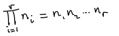

##### Simple Example
- tossing a coin 3 times
- 2 * 2 * 2 = 8 outcomes

#### Realistic Example
- a single game of OLG Lotto Max consists of choosing 7 numbers each from 1-50
- so 7 slots, each with 50 options
- 50<sup>7</sup> possible outcomes
- 781 250 000 000 outcomes

### Permutations
- consider the set {a, b, c}
- how many ways can we arrange the letters?
- abc, acb, bac, bca, cab, cba (6 permutations)
- general situation: n objects -> n!
- fun fact - 52! is more than the number of particles
- consider we have n objects but we want to permute r of them
- so the number of ways to permute r objects chosen from set of n objects is n!/(n-r)!

#### Permutations with identical ojects
- how many unique permutations of the letters of the word banana
- some permutations will give identical results (n, a)
- 6!/(2!3!) = 60 permutations
- there are 2!3! permutations that leave things unchanged
- in general, the number of permutations when you have identical objects (n<sub>i</sub> identical objects) is

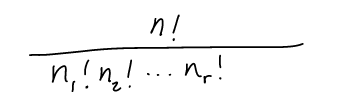

### Combinations
Given set of size n, how many ways can I choose a subset of size r?

#### Example
- out of 10 people, how to choose 5 of them
- for the first slot, there are 10 choices
- so `10*9*8*7*6` but the order doesn't matter so we should take out some permutations
- we know there are 5! such permutations so

```
= 10*9*8*7*6
  ----------
      5!
=   10!
  ------
   5!5!
```

In general, the number of subsets of size r from set of size n is:

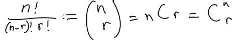

### Binominal Theorem

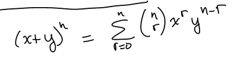

#### Binomial Theorem Example
- given a set of size n, how many subsets are there?

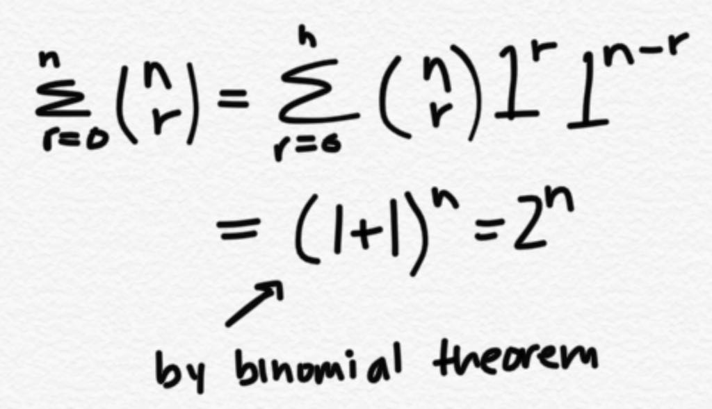

## Day 3 - Sept 9, 2019

### The Axioms of Probability
Given a random experiment with sample space S, we that an event E ⊆ S occurs if, upon the completion of the experiment the outcome is an element of E.

**Probability** is a way of assigning a measure of likelihood of to events.

Given an experiment and an event E belpngs to S, we can say n(E) is the number of times that E occurs after running the exeriment n times.


FOr mathematical reasons, we rather take a more axiomaic approach to probability.

#### Example 1 - Equally Likely Outcomes
Given a sample space with n outcomes, we can say that have "ELO" if each outcome has probability 1/n.
- flipping a coin S = {H,T}, each has probability 1/2
- rolling a die, each outcome has probabiliy 1/6
- drawing an ace in deck of cards -> 4/52 -> 1/13

#### Axioms
Given a sample space S, we define probablity to be roughly a function from the set of events (we wanna assign a probability to an event) to [0,1] (call the function P)

P satisfies the following axioms:
1. P(S) = 1
2. For any event, E ⊆ S,  0 <= P(E) <= 1
3. For any sequence of events E1, E2... such that the events are mutually exclusive,, ie for an i != j, Ei ⋂ Ej = Ø) we have that

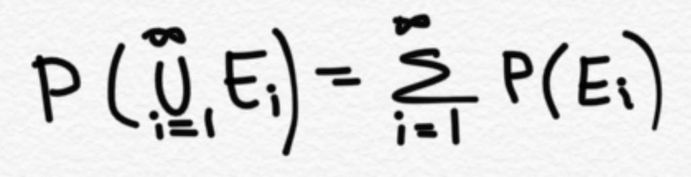

```
in particular, for E, F such that E ⋂ F = Ø, P(E U F) = P(E) + P(E)
```

If S is discrete then by axiom 3, for any E subset of S, P(E) = the sum of P({x})

##### Example Rolling a die
```
P({even roll}) = P({2}) + P({4}) + P({6})
               = 1/6 + 1/6 + 1/6 = 3/6 = 1/2
```

Proposition: Given an event E,  P(E<sup>C</sup>) = 1-P(E)

Check: E ⋂ E<sup>C</sup> = Ø and E U E<sup>C</sup> = S

By axioms 1. and 3.

```
1 = P(S) = P(E U E^C)
         = P(E) = P(E^C)
  P(E^C) = 1 - P(E)
```

Statement: In general, given E subset of F, then P(E) <= P(F) due to the following

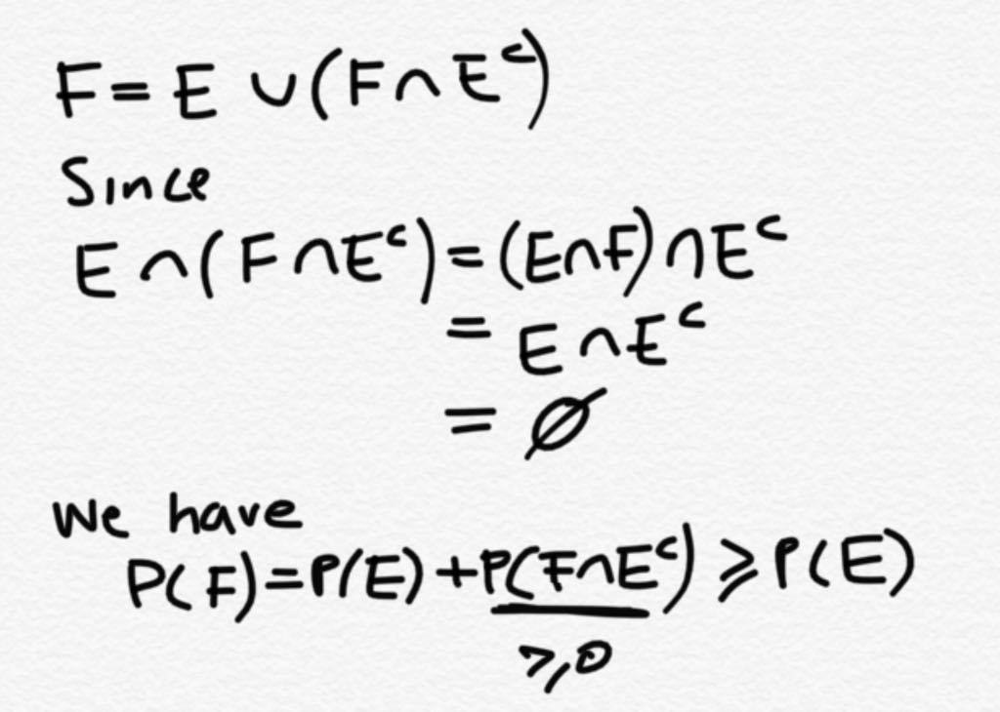

Reminder: E and F are mutually exclusive iff E ⋂ F = Ø 

Recall For mutually exlusive E,F

`P(E U F) = P(E) + P(F)`

Ex rolling a die S= {1..6}

In general, given any 2 events E,F  (mutually exclusive or not), `P(E U F) = P(E) + P(F) - P(E ⋂ F))`

##### Example - Rolling a Die

```
E={1,2,3,4}

F={3,4,5,6}

P(E) = 2/3

P(F) = 2/3

P(E U F) = 1
         =  P({1,2,3,4,5,6})
         = P({1,2,3,4}) + P({3,4,5,6}) - P({3,4})
         = 4/6 + 4/6 - 2/6
```

More general

```
P(A U B U C) = P(A) + P(B) + P(C) - P(A ⋂ B) - P(B ⋂ C) - P(A ⋂ C) + P(A ⋂ B ⋂ C)
```
#### For next time
What is the probability of a royal flush?

```
royal flush = 10,J,Q,K,A
P(royal flush) = 4/((52 5)^T)
               = around 0.00002%
```

## Day 4 - Sept 11, 2019

### Conditional Probability
- suppose you have a well shuffled deck of cards
- probability of drawing an ace is 4/52
- top card is drawn so there are 51 cards
- question: what is the probability the second card is an ace
- if the first card drawn was an ace then the probability of drawing another ace is 3/51
- if the first card was not an ace then the probability of drawing another ace is 4/51
- the idea is that the probability of one event is conditinal upon another event (that we may or may not know)
- Given events A and V, the outcome of event B may influence the probability that event A occurs
- we write P(A|B) to mean the probability of A assuming event B has occured
- Ex if A = 'second card is ace' and B = 'first card is ace then P(A|B) = 3/51
- in general, **`P(A|B) = P(A ⋂ B)/P(B)`**

```
P(A|B) = P(A ⋂ B)
        ---------
          P(B)
```

#### Experiment
- Imagine the experiment is rolling two die consecutively
- the size of sample space is 6*6 = 36
- Question: what is the probability the sum total of the 2 rolls is greater than 7 given that the first roll is a 3?
- step one name your events to isolate them
    - A = "the total is greater than 7"
    - B = "first roll is 3"
- we need to find P(A ⋂ B) and P(B)
- first, P(B) = 1/6
- second, P(A ⋂ B) = ?
- A intersect B = total is greater than 7 and first roll is 3
- outcomes of the form (m,n) then we are looking fir the outcomes of the form (3,n) so the options are where 3 + n > 7, n > 4 (3,5), (3,6)
- therefore P(A intersect B) = 2/36 = 1/18
- so P(A|B) = (1/18)/(1/6) = 6/18 = 1/3

### Intersection/Multiplication and the Laws of Total Probability
Recall that for unions we have an inclusion and exclusion principle
- P(A U B) = P(A) + P(B) - P(A intersect B)
- by rearranging the formula for conditional probability we get the following multiplication rule
    - P(A ⋂ B) = P(B|A)\*P(A) = P(A|B)*P(B)
- we use this when we know the probability of an event relative to other events


The diagram shows that
    P(B) = P(A ⋂ B) + P(A' ⋂ B)

By the multiplcation rule we can write that 

`P(B) = P(B|A)P(A) + P(B|A')P(A')`

This is the Law of Total Probability and it is very useful.

More generally, given a sequence of events E1...En, the sequence is exhaustive if E1 U ... U ,, En = S, meaning it is pairwise mutually exclusive ( Ei intersect Ej = Ø for all i != j)

Then for any B:

P(B) = P(B ⋂ E1) + P(B ⋂ E2) + ... + P(B ⋂ En)
     = P(B|E1)P(E1) + ... + P(B|En)P(En)

#### Example 1 - Law of Total Probability (LoTP): Shuffled deck

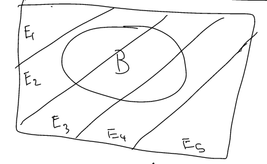

B = "the second card is an ace"

P(B) = ?

Guess: 
    
    E = "the first card is an ace"
    E' = "the first is not an ace"

By L.o.T.P

    P(B) = P(B|E)P(E) + P(B|E')P(E')
         = (3/51)(4/52) + (4/51)(48/52)
         = 4/52
         = 1/13 

#### Example 2 on LoTP
Three identical bags, each containing 10 marbles. 

    Bag 1: 2 red, 4 green, 4 blue
    Bag 2: 4 red, 5 green, 1 blue
    Bag 3: 1 red, 2 green, 7 blue

Assuming the bags are chosen randomly, what is the probability of selecting a red marble?

    R = "choose a red marble"
    Bi = "choose from the ith bag"
    P(Bi) = 1/3

By law of total probability we have 

    P(R) = P(R|B1)P(B1) + P(R|B2)P(B2) + P(R|B3)P(B3)
         = (2/10)(1/3) + (4/10)(1/3) + (1/10)(1/3)
         = (2/30) + (4/30) + (1/30)
         = 7/30


## Day 5 - Sept 12, 2019

### Independence
- In some situations the occurence of one event has no effect on the progrability that some other event occurs

#### Example - Independence
Consider a bin of 50 car parts. Suppose 3 are defective, 47 are not. Experiment is to choose 6 parts randomly, but replace each part after each choice.

Question: What is the proability that the second part you pick up is defective given that the first part is also defective.

A<sub>i</sub> = "the ith chosen part is defective"

We want to find P(A<sub>2</sub>|A<sub>1</sub>) 

P(A<sub>i</sub>) = 3/50

P(A<sub>2</sub>|A<sub>1</sub>) = 3/50

In this situation, the outcome of the first event did not do anything to the second event

P(A<sub>2</sub> ⋂ A<sub>1</sub>) = (3/50)(3/50)

#### Definition - Independence
Given 2 events, we say that A1 and A2 are indepdendent if any of the following equivalent conditions are met
1. P(A1|A2) = P(A1)
2. P(A2|A1) = P(A2)
3. P(A1 ⋂ A2) = P(A1)P(A2)
4. P(A1' ⋂ A2') = P(A1')P(A2')

**Warning**: IF A1 A2 are mutually disjoint, P(A1 U A2) = P(A1) + P(A2)

If A1 A2 are indepedent, P(A1 ⋂ A2) = P(A1)P(A2)

You can't have mutually disjoint and independent events bc of the following,

Suppose that A1 and A2 are mutually exclusive, annd that P(Ai) != 0

Then we have that 0 = P(Ø) = P(A1 ⋂ A2) != P(A1)P(A2) != 0

If you have mutually exclusive events then they are automatically not independent.

In general, events E1.. En are independent if P(E1 ⋂ ... ⋂ En) = P(E1)..P(En)

#### Example 2 - Independence

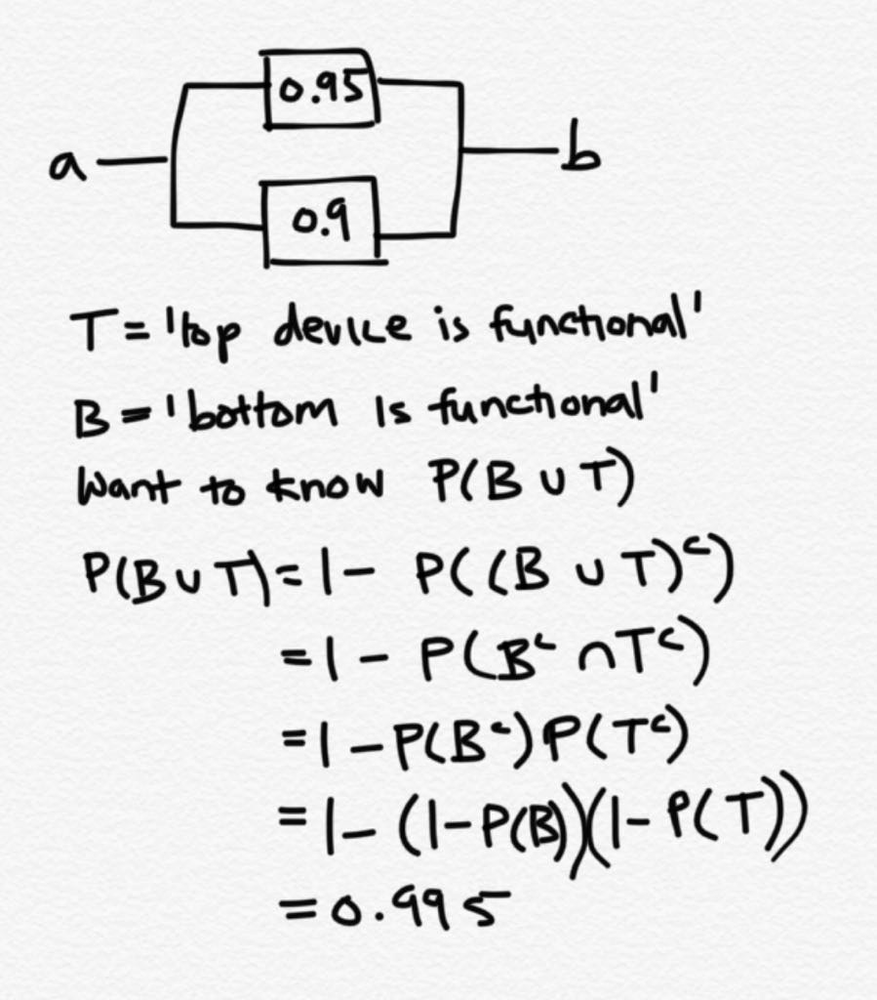

#### Example 3 - Independence

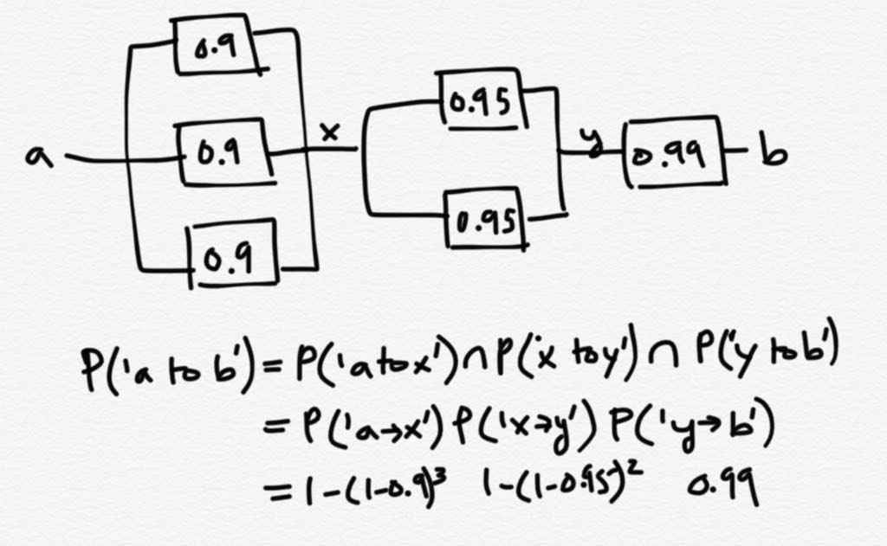

### Random Variables
Definition: Given a sample space of a random experiment, a random variable is a function that assigns a real value to each outcome (always denoted by capital letters).

Random variables can be discrete or continuous. 
- discrete: range is finite or countably infinite
- continuous: range contains a real interval

#### Example - Discrete Random Variables
- \# of heads in 1000 coin tosses
- \# of defecive parts/10000 on a production line
- \# errors perbinary string of given length

#### Example - Continuous Random Variables
- current
- temperature
- pressure

## Day 6 - Sept 16, 2019

### Discrete Random Variable
Recall: Given a sample space S for som random experiment, a discrete random variable (DRV), X, is a function that assigns real vlaues to the elements of S, such that the range of X is either finite or countably infinite.

Definition: A probability distribution for a random variabe, X, is a description of the probabilities associated to the possible values of X.

For DRV, this is often presented as just a list of possible probabilities. (more complicated is denoted by a formula)

#### DRV Example
Consider the experiemtn given by tossing a coin 3 times (sample space is 8). H= "# of heads", H is a DRV with range given by {0,1,2,3}. The probability distribution is:

```
P(H=0) = P({(t,t,t)}) = 1/8
P(H=1) = P({t,t,h), (t,h,t), (h,t,t)}) = 3/8
P(H=2) = P({(t,h,h), (h,t,h), (h,h,t)}) = 3/8
P(H=3) = P({(h,h,h)}) = 1/8
```

### Probability Mass Function
Sometimes a probability distribution is presented in terms of a function called "probability mass function":

Defn: Given a discrete random variable, X, with range {x1, x2...}, then a probability mass function f(x) is one satisfying:
1. f(x<sub>i</sub>) >= 0 forall i)]
2. the sum of all possible outcomes of f(x<sub>i</sub> = 1
3. f((x<sub>i</sub>) = P(X=(x<sub>i</sub>)

#### Probability Mass Function Example
In the previous experiment, we can say f(x) = (3Cx)/8

### Cumulative Distribution Function (cmf)
Another way to describe probability distribution is cumulative distributive functions.

For a ranom variable X, the cumulative distribution function is

```
F(x) = P(X <= x) 
     = sum of all events xi <=x of f(xi)
```

#### CMF Properties
1. 0 <= F(x) <= 1
2. x <= y =: F(x) <= F(y)

#### N.B
Given F(x) for some discrete random variable X, we can recover the probability mass function

```
f(xn) = F(xn) - F(x(n-1))
      =(f(x1) + ... + f(x(n-1)))
      = f(xn)

```

#### CMF Example
X DRV with range {1,2,3...}

```
f(x) = P(X=n) = 1/(2^n)

Then F(n) =sum of ....
```

Note: limit of n-> inf F(n) = 1

### Mean and Variance of a DRV
- Two numbers: summarize lots of info about a probability distribution.

Let's let X be DRV with probability mass function f(x)

#### Mean aka Expected Value

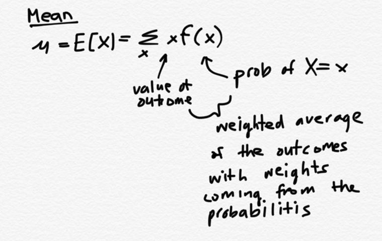

#### Variance

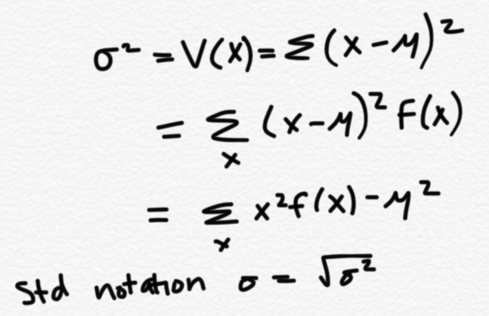

#### Example
Consider the following game.
- a fair die is rolled
- if the roll is n = 2,3,5 you win $2n
- if the roll is n=1,4,6 you get nothing

Quetion: How much would you pay to play this game?

Reasoning: Don't want to pay more than the expected value of a single game. The expected value is the average outcome of an experiment

```
Set W = "winnings" in dollars
range(W) = {0,4,6,10}

E(W) = ?

P(W=0) = 3/6 = 1/2
P(W=4) = 1/6
P(W=6) = 1/6
P(W=10) = 1/6

E(W) = 0*(3/6) + 4(1/6) + 6(1/6) +10(1/6)
     = 20/6
     = $3.33
```

## Day 7 - Sept 18, 2019

**Remark** on Functions of Discrete Random Variables, given DRV X h: R->R, h(X) := DRV

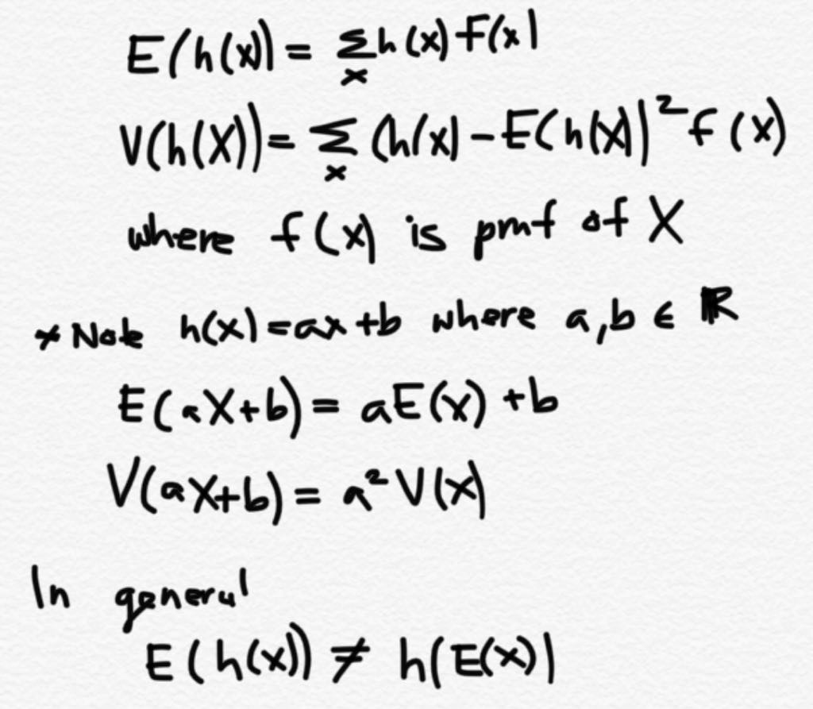

### Binomial Distribution
- suppose we have n trials i.esame experiemnt repeated n times
- for each trial we assume 2 possible outcomes
    - heads-tials, pass-fail
    - assume that outcomes are mutually exclusive
        - can't get heads tails at the same time
    - outcomes are 'success/failure'
    - assume the tials are independent and that each trial has probability 0 < p < 1 of being successful
        - it follows that each trial fails with probability 1-p
    - these trials are called Bernoulli trials
    - n bernoulli trials, each with fixed probability `p`
- we say that Bin(P,n) (we will call this X for simplicity) is calledd binomial with parameters n = 1,2,3... an 0 < p < 1 if:

X = "the number of successful trial in n many Bernoulli trials with probability p

- the probability mass function of X is f(m) = (n choose m)P<sup>m</sup>(1-p)<sup>n-m</sup>
- interpretation, given n Bernoulli trials, f(m) is the probability that you are successful m times

#### Example - Flipping a Coin 10 Times
- our parameters would be n=10 and p=0.5
- if we flip it 3 times, f(m) = (3 choose m)(.5)<sup>m</sup>(0.5)<sup>3-m</sup> = (3 choose m)(0.5)<sup>3</sup>

#### Computing Mean of Binomial Random Variable
- mean of X = Bin(p,n)
- recall that to compute the mean of a random variable is

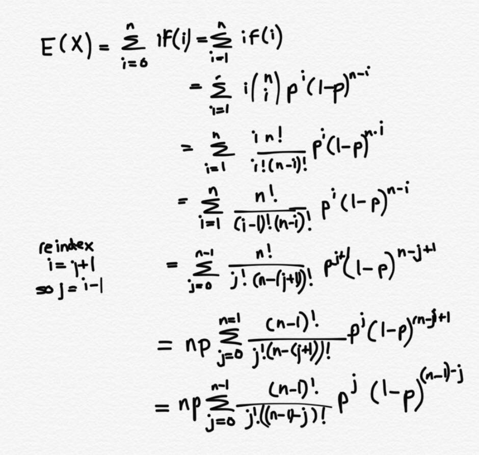

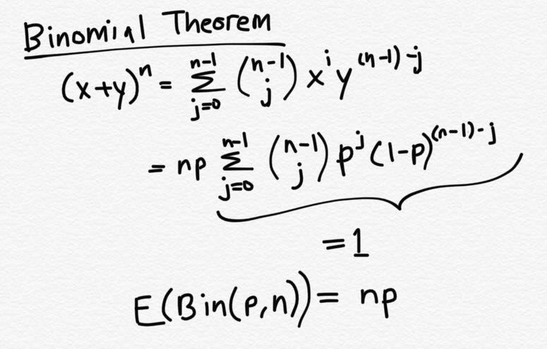

#### Example - Bernoulli Trials
- Midterm - Sept 30
- 27 multiple choice
- each wth 4 possibilities
- independent questions

Question: What is the probability of passing if you guess every question?

Each question is a Bernoulli trial with 1/4 being probability of success.

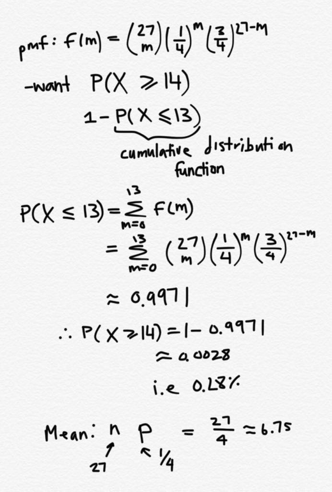

## Day 8 - Sept 19, 2019

### Geometric and Negative Binomial Distribution
Recap: A Bernoulli trial s an experiment/series of experiments where the trials are
- independent
- have 2 possible mutually exclusive outcomes i.e success/fail
- each trial has fixed probability p of success

Bin(p,n) = # of successes in n-many trials


- geometric distribution is related
- rather than some fixed n number of trials, we allow arbitrarily many
- say that DRV X is geometric with parameter 0 < p < 1
- X = # of trials untli first success
- if X is geometric with parameter p, then X has a probability mass function:
    
f(x) = (1-0)<sup>x-1</sub>p

Interpretation: f(x) = probability of failing x-1 times and then succeeding on the x-th try

#### Mean

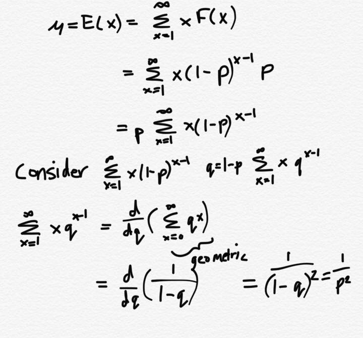

By the following:

     μ = E(x) 
       = p(1/p^2) 
       = 1/p

#### Geometric Distribution Example
- the probability of a bit transmitted through a digital channel is received on error is 0.1
- assume the transmissions are independent
- say X = "the number of bits transmitted until the first error"
-       probability of success = 1 - q = 1 - 0.1 = 0.9
- what is the probability that at least 10 bits are transmitted without error?
- i.e P(X>=10) = 1 - P(X<=9)

```
P(X>=10) = 1 - P(X<=9)
         = 1 - sum from 1 to 9 of (0.9)^(x-1)*(0.1)
         = close to 1

```
### Negative Binomial Distribution
Recall: X is geometric if X = "the number of Bernoulli trials until a success"

- negative binomial distribution isa generalization of this
- fix a positive integer r >= 1
- say a DRV X is negaive binomial with parameters p, r if X = "number of trials until r successes"
- Note if r = 1 this is exactly geometric
- if X is negative binomial with r and p, we have a probability mass function:

```
f(x) = x-1 C r-1 (1 - p)<^(x-r)(p^r)
    x = r, r+1, r+2....
```

Suppose X is a negative binomial RV with params r, p, we can write X = X1 + ... + Xr where Xi = "number of trials until the i-th success"
- each i is a geometric RV
- this implies (w/o justification for now) that the mean of x E(X) = r*E(x) = r/p and the variance V(X) = r(1-p)p^2

#### Example - Inverse Binomial Sampling
Suppose you, a redhead, want to form a club of red-haired people and suppose you want no more than 10 people. Suppose you call people at random and ask them the colour of their hair.

Q: Supposing that no more than 2% of the population has red hair, what is the probability of calling 10 redheads if 
    1. you make 50 calls?
    2. 500 calls?
    3. 1000?
    4. infinity?

```
PMF: f(x) = (x-1) choose (10-2) * (1- 0.002)^(x-10) * (0.02)^10

f(50) = 9.37 * 10^-9 9.37 * 10^-8 %

f(500) = 0.0025, 0.25%

f(1000) = 0.00005
```

You're looking to call 10 people so your probability is dependent on that

## Day 9 - Sept 23, 2019

### Hypergeometric Distribution
- handles taking samples without replacement
- suppose we have a deck of cards (well-shuffled)
- we draw 4 cards without replacement
- let x = "the number of aces in the sample"
- x = {0,1,2,3,4}
- what is the probability that x = 0?

```
P(X=0) = (48/52)(47/51)(46/50)(45/49)

P(X=1) = (4/52)(48/51)(47/50)(46/49) +
         (48/52)(4/51)(47/50)(46/49) + 
         ... +
         (48/52)(47/51)(46/50)(4/48)

P(X=2) = 4 choose 2 = 6 terms
       = (4/52)(3/51)(48/50)(47/49) +
          ... +
         (48/52)(47/51)(4/50)(3/49)

P(X=4) = (4 * 3 * 2 * 1)
         ----------------
         52 * 51 *50 * 48
        
```

This gives an example of a hypergeometric random variable.

#### Definition of Hypergeometric Random Variable
- Given N many objects (eg N=52 cards)
- define some K <= M many objects (eg K = 4 aces) to be "success" (and so N-K will be "failures")
- our experiment consists of drawing n <= M many objects without replacement
- Then, we say that X = "number of successes in the sample" is a hypergeometric random variable with parameters n, N, K (p = K/N= probability of success on first draw)

- given X, a hypergeometric RV with params n, N, K we have

        P(X=x) = f(x) = (k x) (N-K n-x)/(N n)
- given X, hypergeometric (n, N, K) we have

        E(X) = np = n(K/N)
        V(X) = np(1-p)( N-n / N-1 )
- coeffecient for variance is the variance ofa binomial distribution
- in some situations, hypergeometrics basically become binomials
    - like a small sample size for K

**Note**: If N >>> n

        N - n
        ----- ~ 1
        N - 1
        and X is approximately binomial

### Poisson Distribution
- we want to describe events which occur randomly along an interval
- examples
    - \# of flaws in a length of wire
    - \# of earthquakes over a 5 year period
        - interval concerned with is time
    - \# of buses that stop in front of your house over a week
- we want a probability mass function
    - we need the average number of events per unit length
- divide timeline 0 to T into equal intervals of delta T = T/n
- we want to reduce to a binomial situation so that the probability that delta T contains more than 1 evennt is ~ 0
- each little subinterval is a Bernoulli trial
    - each subinterval will either have and event or not
- given λ = average # if events per unit length,
- the probability that there is an event in a given subinterval is p = λ\*delta T `= λ*T/n`
- since we may assume that each subinterval has an event or does not,
- ` X ~ Bin( n, λ*T/n)`
- Bin(n, λ*T/n) has pmf (nCx)(p^x)(1-p)^(n-x)
- So P(X=x) = lim of n to infinity `(nCx)(λ*T/n)^x(1 - λ*T/n)^n-x`
- final equation<>><><>

#### Poisson Distribution Example
- a real estate agency sells an avaerage of 2 houses/day
- per week that is 14
- what is the probability that they sell 10 houses next week

```
λ = 2 houses/day
T = 7 days

pmf = f(x) = (2*7)^x
            --------- e^(-2*7)
                x!

P(x=10) = 14^10
         -------e^-14
           10!
        = 0.066
        = 6.6%
```

##### Mean/Variance Poisson Distribution
- knowing that the Posisson distribution is a limit modelled by binomial distribution, how do we figure out the mean and variance?
    - we know the mean of binomial distribution (np)
    - we know that the poisson distribution is the limit
    - so E[X] = lim n goes to infinity of np which gives us `λT`
    - V(X) = lim n gos to infinity np(1-p) which becomes `λT`

## Day 10 - Sept 25, 2019
- none of this stuff will be on Test 1

### Continuous Random Variables
Recall a random variable X is said to be continuous if range(X) is an interval of real numbers (bounded - [0,1] or unbounded [0,inf])

#### Examples of Continuous Random Variables
```
X = "length of randomly selected telephone call"
range(X) = (0, infinity)

X = "time until some machine fails"
range(X) = [0, infinity)

X = "electrical current across a wire"
```

#### More Detailed Example
- say we have a dartboard of radius R
- let X = "distance of dart from center of circle (bullseye)"
- range(X) = [0,R]
- for particular value of r, what is the probability that we land at r?
    - P(x=r) = 0
    - why? - the probability will be infintesimally small
    - insert circle diagrame xample
    - If X is a CRV, then for any particular value a, P(x=a) = 0
- Recall: If X = DRV, for any paricular a, P(X=a) = f(a)
    - f(a) = probability mass function at a
    - more generally for a <=b, P(a <= X <= B) = sum of f(x) from a to b

For a continuous random variable, we have a similar situation.

<u>Definition</u>: let X, CRV, the probability density function f(x), is a function with the following.

1. f(x) >= 0 for all x
2. integral from -inf to inf of f(x) = 1
3. P(a<= X <= b) = integral of f(x) from a to b

**Note** Since P(X=a) = 0 for any particular value, P(a <= X <= b) = P(a < X <= b) = P(a <= X < b) = P(a < X < b)

#### Uniform Distribution Example
- fix an interval [a,b] <= Real numbers
- example from ipad

##### Uniform Distributio Subexample
- suppose x = current in a piece of wire
- suppose curent range is uniformly between 3.6 and 4.1 milliAmps
- question: P(3.7 < x < 3.8) = ?
- insert example from ipad

#### Example of Non-uniform Distribution
- X = "waiting time in hours at hospital to be admitted to ER"
- range(X) = [0, inf)
- example from ipad

In general, X is a CRV with pdf f(x). How do we compute P(X <= x)?
- P(X <= x) is the cumulative distribution function.
- something about fundamentals of calculus
- the antiderivative F(X) of f(x) - if it exists, if the cumulative distribution function
- in general, given F(X), the antiderivatie of f(x);

```
P(a <= X <= b) = F(b) - F(a)
```

## Day 11 - Sept 26, 2019

Let X be a continuous random var with probabiity density funtion f(x).

How do we compute P(X <= x). From the fundamental theorem of calculus, the derivative of the integral of f(t)dt -inf to inf is f(x).

If we want to know the cmf, it is just the antiderivative of the pdf.

We call F(x) the cumuative distribution function if F(x) is the antiderivative of f(x).

P(x <= a) = F(a)

P(a <= x <= b) = F(b) - F(a)

#### Example
- suppose we have cumulative distribution function

```
F(X) = { 0 for x <= 1}
       { (1/2)(x+1)^2 for 1 < x <= 0}
       { 1 - (x-1)^2/2 for 0 < x < 1}
       { 1 for x >= 1 }

Find P(X <= 1/2)
Find P(X > 0)
What is the pdf? derive it
```
ipad

#### Mean and Variance
IF X is a CRV with pdf f(x) then the mean/expected value of X is just E[X]

```
integral of -inf to inf xf(x)dx
```

For function h(x) (continuous/integratable)

```
E[h(x)] = integral of -inf to ing h(x)f(x)dx
```

As a special case, we have the variance V(X) = E[(x-mu)^2]

### Normal Distribution
- central limit theorme: roughly average distributin tend to normal ones
- normal distribtions have the following pdf

```
f(x) = 1/sqrt(2Pi*sigma) * e ^ (-(x-mu)^2/2*sigma^2)

sigma mu are in the real numbers
sigma > 0

```

In partivular, if X is normal with parameters sigma^2 and mu, (X = N(mu, sigma^2)),

```
E[X] = mu and V(X) = sigma^2
```

- Can standardize normal distributions
- Given X=N(my, sigma^2), observe the random var Z = X-mu/sigma is normal
- just shifting it back to 0 and squishing it by standard deviation

## Day 12 - Sept 30, 2019

Recall: X = N(sigma^2, mu) is the normal distribution distribution with mean mu and variance sigma^2

- it looks like a bell curve 
- its cmf is P(X <= x)) is a long ass integral with no antiderivative
- but that is ok because there is a table with numbers we can use
- X = N(0,1) is the standard normal
- given any other normal random variable, we can standardize P(X <= x) = P(z, <= x-mu/sigma) (shift it to mean 0and then compress it by std deviation)
- look up phi (x-mu/sigma) <- look it up in textbook

#### Example
- File transfer dpeed from aserver to a computer is ormally distributed with mean = 5.75 mbps and variance sigma^2 = (0.35)^2
- Part A: what is the probability that at some given time, the speed is greater than or equal to 6.7 mbps
    - first thing we do is standardize it
- Part B: what is the probability that the speed is less than or equal to 5.5
- Part C: finding symmetric interval around the mean such that the 99% of the time the speed is within this interval
    - drawing a symmetric curve, we wanna find mu-t such that the middle portion of the curve area is 99%

```

PART A
We want P(x >= 6.7) 
    = 1 - P(x <= 6.7)
    = 1 - P(z <= (6.7 - mu/sgima)>)
    = 1 - P(z <= 6.7-5.75/0.35)
    = 1 - P(z <= 2.71) <--- look it up
    = 1 - 0.996633
    = 0.003364

PART B
We wantP(x <= 5.5) 
    = P(z <= 5.5-5.75/0.35)
    = P(z <= -0.71)
    = Phi(-0.71) <---- look it up
    = 0.238852

PART C
P(5.75 - t <= x <= 5.75 + t) = 0.88
We know that:
1 = P(x <= 5.75 - t) + P(5.65 - t <= x <= 5.75 + t) + P(x >= 5.75 + t)
By symmetry of the distribution, P(x <= 5.75 - t) = P(x >= 5.75 + t)
So
0.99 = 1 - 2P(x <= 5.75 - t)
0.005 = P(x <= 5.75 - t)
0.005 = P(z <= 5.75 - t - 5.75/0.35)
0.005 = P(z <= -t/0.35) <=== look in table
0.00508 = P(z <= -2.57) (from table)
So
-t/0.35 = -2.57
t ~= 0.8995
```

#### Normal Approximation to Binomial Distribution
- Recall that binomial distributon is rougly bell shaped and as n gets large enough, binomial(n,p) is approximated well by a normal random variable N(np, np(1-p)).
- It follows that is X=Bin(n,p) then X-np/sqrt(np(1-p)) is N(0,1)
- We can improve this approximatuon with 'continuity corection'
- P(X <= x) (counting number of successes) = P(X <= x + 0.5) ~ P(z <= x+0.5-np/sqrt(np(1-p)))
- similarly, we can approximate from above
```    
P(X >= x) = P(X >= x-0.5)
~= P((x-0.5-np)/sqrt(np(1-p)) <= Z)
```
- this approximation is good when np > 5 and n(1-p) > 5
- i.e when n is large enough

##### Example
- given multiple choice test,60 questions, 5 answers per question
- each q is bernoulli trial with p = 1/5
- x = # questions correct 
- P(10 <= x <= 20) = sum of (60 x)(1/5)^x(4/5)^60-x
- but P(10 <= x <= 20) =P(8.5 <= x <= 20.5)
- note p = 1/5, 1-p = 4/5 so np = 60/5 > 5, 60*(4/5) > 5
- e[X] = 60*(1/5) = 12
- v(x) = 9.6
- p(8.5 <= X <= 20.5) ~ p(8.5-12/SQWRT(9.6) <= Z <= 20.5-12/SQRT(9.6))
= ~0.788

## Day idk fuck statssssssss - Oct 3, 2019

#### Example
- first step: sketch the domain

- Remark Suppose R <= R^2 is same as 1 dimensional egion P((x,y) belongs to R) = 0
- basically the probability one specific event happening is 0 or rly small


### Marginal Probability Density Functions
- suppose we have 2 continuous random variables X and Y
- they are defined in a region R (i.e double integral over R f<sub>xy</sub> dxdy = 1)
- in this situation, we want to be able to study X and Y as CRVs in their own right
- in partivular we wantthis prob density functions

### Independent Random Variable
- recall: events A and B are independent if P(A and B) = P(A intersect B) = P(A)P(B)
- this motivates the following definition
    - suppose X and Y are continuoud random variables given by joint probability distribution fucntion f<sub>xy</sub>
    - then A and Y are indepndent if f<sub>xy</sub> = f<sub>x</sub>f<sub>y</sub>
- why is this a good definition
    - suppose that X and Y are defined on a rectangular region R = A x B
- fact: if X and Y are independent then they are defined on a rectagnular region
- warning the converse id not true! if there are X and Y defined on rectangular region whcih are not independent

#### Example 
```
0 <= y <= x <= 4, fxy = x+y/32 not eqal fx*fy
then x andy are dependent
```

## Covariance and COrrelation
```
let x, y beCRVs with jpdf fxy
if h(x,y) then E[h(x,y)] = double integral h(x,y)fxy dxdy
```

The covariance of X and Y is
 ipad 

The covariance of two continuous random variables detects relationshops between X and Y. It does not detedct higher order relationships

Note: If X and Y are independent, then E[xy] = double intrgal of xy*f<sub>xy</sub>dxdy = double integral xyf<sub>x</sub>f<sub>y</sub>dxdy E[X]E[Y]

So if X and Y are independent then the covariance of xy is equal to 0

## Day 15 - Oct 7, 2019

### More on Covariance and Correlation

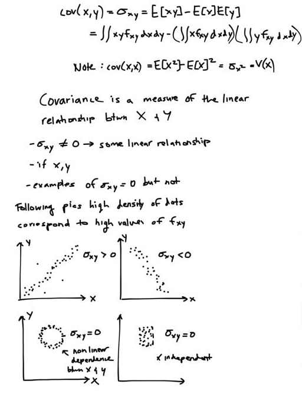

- The covariance of 2 random variables can take any real value making cov(x,y) sometimes difficult to interpret
- so we have correlation
- correlation of X and Y measures linear dependence in the same way as covariance but is sometimes a little easier to interpret
- definition: given CRVs X and Y, the correlation is defined as 

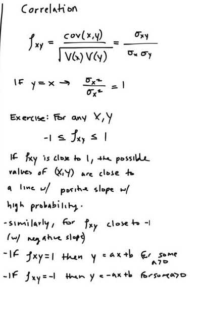

#### Reproductive Property og Normal Distribution
- suppose than X1..Xn are indepndent normal RVs with Xi = N(

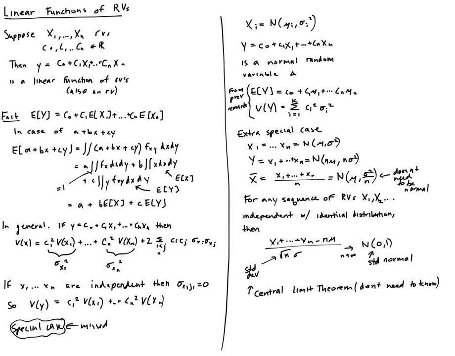

#### Example
- suppose waer bottles are filled to an avg of 591mL with std deviation 5mL
- suppose that the value of a bottle is normally distributed and that the volume of the bottles is indepndent
- question: what is the probability that given 10 bottles, the average volume is less than 585mL

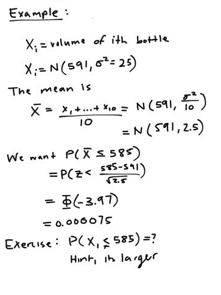

## Day 16
- skipped

## Day 17 Oct 10, 2019
- recap on last lecture
- stem and leaf plots (which are kinda useless)
    - way to visualize small sets of data {x1...xn}
- first column is cumulative frequency then stems then leaves
- stem and leaf plots are good for finding quartiles

### Quartiles, Histograms and Box Plots

#### Quartiles
- can be read off of a stem and leaf plot
- q1 = first quartile number for which ~ 25% of the date is below q1
- q2 = second quartile number for which ~ 50% of the data is below q2
    - also known as median
- q3 = third quartile number for which 75% of data is below q3
- in general - nth percentile is that  for which approx n% of the data is below
- the inter quartile range (IQR or IQRange) is defined to be q3 - q1
- looking at data and chopping off things that are sparse (near the ends)
    - usually a beter measure of spread than range

#### Frequency Distributions and Histograms
- a frequency distribution is a compact way of visualizing data
- idea: divide your data into bins/intervals/cells of equal width and then count the number of data points that appear in each bin (this is frequency)
- questions: how many bins?
    - too many bins - you lose shape of the data
    - too few - lose detail
- in general, rule of thumb is that given a data set {x1..xn} then sqrt(n) many bins is usually informative
    - not too much not too little

##### Example - Industrial Building Permits per Year
- minimum is 73, max is 213
- there are 20 data points in total
- for 20 data points, sqrt(20) data points is good = 4.7 ~ 5 bins
- if you're forced to make a choice, one more bin is better than one less so round up
- range = 213 - 73 = 140 so 5 bins will each have width of 140/5 = 28 (approx 30 so it's easier to draw)

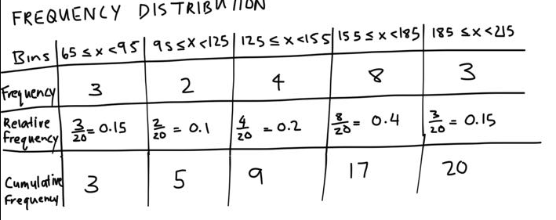

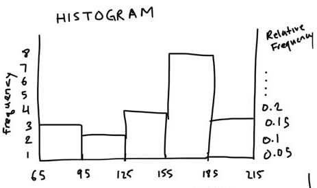

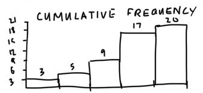

#### Box Plots (Box and Whisker Plots)
- way to visualize data that includes lots of info
- start with your range
- draw a box
- x is used for outliers
- an outlier is any data point past (1.5)IQR from the endpoitns of the box
- an extreme outlier is any data point 3IQR from the endpoints of the box
- you can use box plots to compare data sets

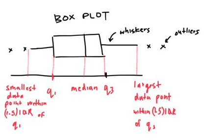

## Day 18 - Oct 21, 2019

### Probability Plots
- useful tool for visualizing data
- we are given a sample {x₁,..x</sub>n</sub>} chosen from possibly larger dataset
- we can assume that any data follows some distribution ie, our set has values of a random variable X with probability distribution function f(x)
- our hypothesis is that the data can be modelled by some distribution
- to test if our hypothesis is correct we can use probability plots

#### Steps to create a probability plot
- start with some sample
1. Reorder (n increasing order) and rename the sample
    - x1,...,xn ----> x<sub>(1)</sub> ≤  x<sub>(2)</sub> ...
    - that is, rename elements of the sample so that x<sub>(1)</sub> is the smallest
- idea: x<sub>(i)</sub> should be approximately the 100(1/n)th percentile
- so in a set of 11 values, x x<sub>(6)</sub> ~ median
2. Find values of X, say y<sub>i</sub> such that 

- found in notebook

### Chapter 7 - Point Estimation of Parameters
- first going to go through terminology
- a parameter (usually denoted by θ) is any numerical deatuer of your data set/population
- examples of parameters
    - μ mean
    - σ₂ variance
    - σ std deviation
- recall that a random sample is a particular instance of a set of independent and indetically distributed RVs
- a statistic is any function of X₁,...,X<sub>n</sub>
    - sample mean calculation is a statistic
    - sample variance, S//^2
- given a parameter, θ an estimator for θ is a statistic
    - notebook

#### Sampling Dist and Central Limit Theorem
- recall that a statistic is a function of RVs
- so a statistic is an RV
- it follows that each statistic as an associated distribution called sampling distribution
- X_bar is a sampling distribution of the mean.

## Day 32 - Nov 21, 2019

### ANOVA
- Analysis of Variance Approach to test significance of regression
- say we have a two sided test: Ho = β1 = 0, H1 = β1 != 0

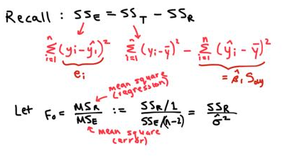

- we do SSR/1 because we are dividing thr mean square with 1 degree of freedom
- if our null hypothesis is β1 = 0 then our test stat Fo has a F<sub>1, n-2</sub> dsitribution 
- this is called the F-distribution
- we reject Ho if the test statistic we calculate is greater than the one found using a given alpha on the f-table (whichever has the alpha and n)
    - the n will be n-2

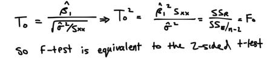

### Adequacy of the Regression Model
- regression model calls for many assumptions
- assume a linear relationship between y and x `Y = β0 + βX + ε`
    - where the error ε is normally distributed
- we needa way to actually see if ε is normally distributed
- the error between terms is the actual y - expected y
- these terms are called **residuals**
1. Probability Plots
    - for the error to be normally distributed, the residuals must be uniformly distributed
    - we order the residuals form smallest to largest
    - `let ci be such that P(z - ci) = (i - 0.5)/n`
    - the points {(ei, ci)} should roughly form a straight line
2. Standardize the residuals
    - if our assumption stands (ε is normally distributed) with mean 0 and variance σ^2 then the sample of ei can be standardized
    - `di = ei/^σ^2`
    - 95% of the di will be within (-2,2) since the probability that your z is within -2,2 is around 0.95
- one more way to measure adequacy is to compute the coefficient of determination R^2
    - `R^2 = SSreg/SStotal = 1 - (SSerror/SStotal)`
    - use equations listed above
    - the R^2 value will be between 0 and 1
    - if the R^2 is large, the model is adequate
    - should use this method with caution
        - R^2 is susceptible to artificial infection
        - we might end up "overfitting" the data

## Day 33 - Nov 25, 2019

### Single Factor Experiments and ANOVA
- a factor is a controlled variable that gives more insight on a dependent variable
- the factor can be partitioned into levels called treatments
- for example, time for cement to dry can be our dependent variable
    - temperature is a controlled variable
    - can have treatments like hot, cold, warm
- a is the number of treatments
- each treatment has a random sample of values
    - {Yi1, Yi2, Yi3} is a sample of 3 for treatment i
- we assume a linear statistical model

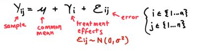

- the error is assumed to be independent and normally distributed around N(0, σ^2)
- we assume that all γi are 0 (this is our null hypothesis) because for all the means from the treatments to be the same, the treatment effect needs to be 0 for all treatments

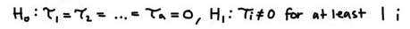

- the ANOVA table is explained in more detail in the [review](#review-1)

## Day 34 - Nov 27, 2019
- exam review notes will not be posted so come to class
- exam will be 35 MCQ

#### ANOVA for Single Factor Experiments Review
- we have a given variable (the factor) that takes a few values (the treatments) that the experimentor chooses and fixes
- there are a-many treatments
- we assume a model
- on the exam you'll get an ANOVA table with some values missing
    - ie you might know the degrees of freedom and be asked for the degrees of freedom of treatment + error

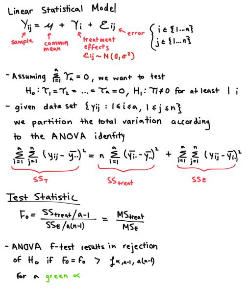

- note that if H1 is true than the F-stat will be greater than 1
- if significance levels are involved, you would reject the null hypothesis iff your test stat is greater than f at that alpha for a-1 and N-a
    - note this is one-sided

### Confidence Intervals on Treatment Mean
- recall that the treatment means are defined as μi = μ + γi for 1 ≤ i ≤ u

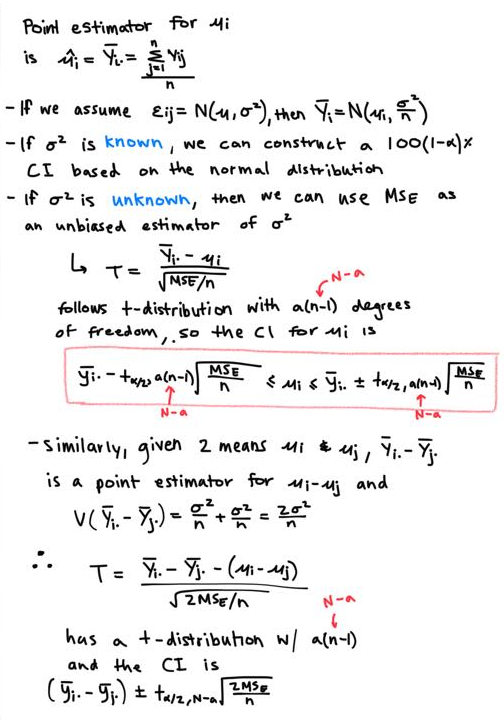

### Unbalanced Tests
- recall that we assume that for each i = {1,..,a}, the sample size for each treatment is the same
- if we all the n's to ebe different, we can adjust the ANOVA identity
- N is the total sample size
- pretty intuitive modification to SStotal and SStreat
- balanced is better because power is maximized and is less sensitive to slightly varying variances

### Fishers LSD Test
- last topic
- Least Significant Difference
- after you perform the ANOVA test and reject the null hypothesis we still don't know which γi (treatment effect) is non-zero
- this test is a method for comparing |μi = μj|
- for each i != j we create a test statistic

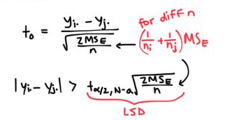

- calculate the difference between the means as well
- the difference between 2 means is significant if it is greater than the LSD

## Day 35 - Nov 28, 2019
- lecture cancelled

## Day 36 - Dec 2, 2019

### Review 1

#### Example 1 - Filling ANOVA table
- this will definitely be on the final
- might get ANOVA table with some spots missing
- note: the first 2 rows of the ANOVA table sum to the last (treatment + error = sum)
- a is the number of treatments (3 in this case)
- n is the sample size for each treatment (3 in this case)
- on the final n will be the same for each treatment

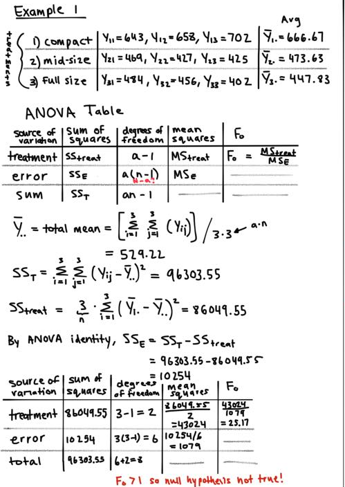

#### Example 2 - Regression
- consider data below
- it kind of models y = 2x
- step 1: plot
- step 2: organize data

x | y
--|--
1.2 | 2.5
2.8 | 4.34
3.6 | 7.5

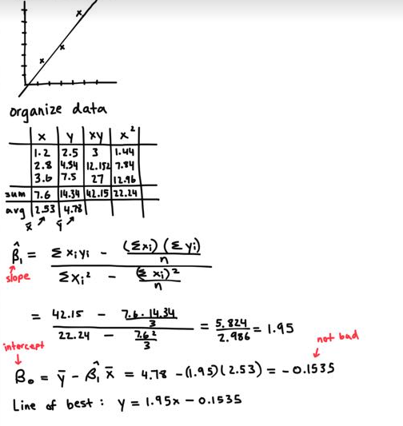

- knowing this, a question would be to predixr the value of y for x = 4

```
y = (1.95)(4) - 0.1535
  = 7.65
```

#### Example 3 - Coefficient of Determination
- given the regression model, find the coefficient of determination R^2

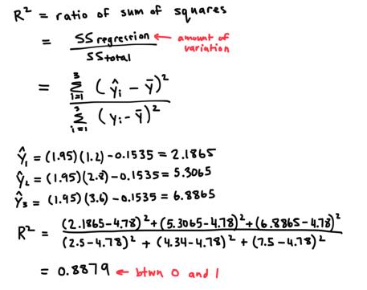

## Day 37 - Dec 4, 2019

### Review 2

#### Example 1 - Approximating the P-value for a T-test
- suppose we want to test the mean of some distribution
- we take a sample size of 10 and find that the average of x is 18.27, s = 2.5

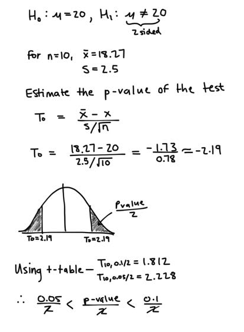

#### Example 2 - Normally Distributed Population
- suppose some population is distributed N(15, 1/5)
- find the probability that the sum of all x from the sample is greater than 77
- the variance of sum = sum of variances + covariance
    - note: if independent, the covariance = 0
- so the variance of sum = sum of variances = 5(1/5) = 1

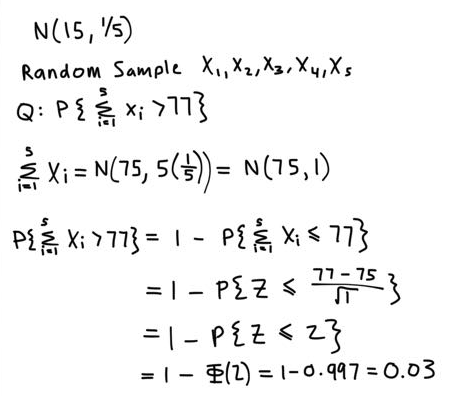

#### Example 3 - Normally Distributed Population
- same setup as previous

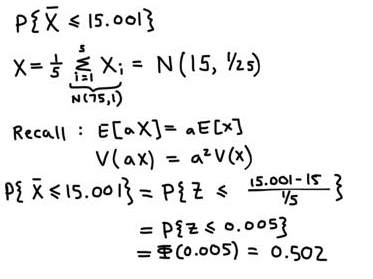

#### Example 4 - Confidence Interval
- suppose we are sampling the mean of a population normally distributed with known variance
- a 99% confidence interval on the mean as a width of 8
- QUESTION: What is the width of a 90% confidence interval on the mean?

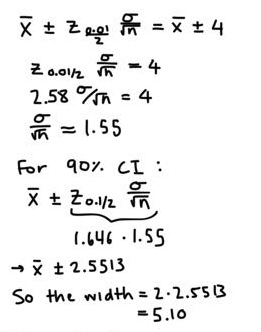

#### Example 5 - Probability
- suppose 70% of population of Canada prefers bananas over apples
- assume that we take a sample of 1000 people
- estimate the probability that exactly 700/1000 prefer bananas to apples

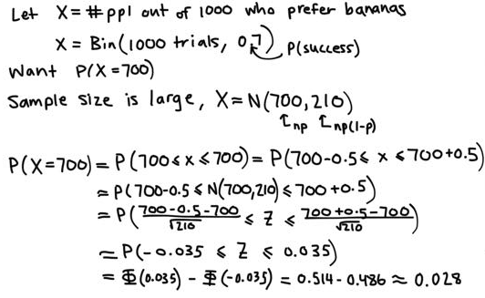

#### Example 6 - Continuous Random Variable with pdf

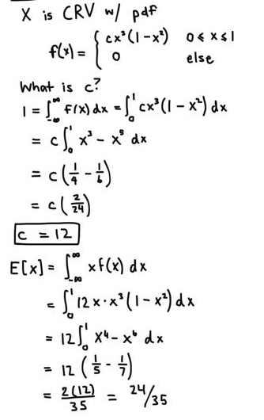

--------------------
The end :banana:
