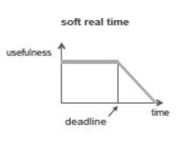
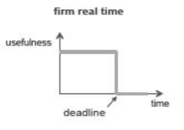
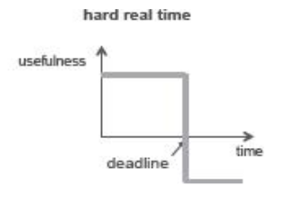

# 4AA4 Real Time Systems

## Table of Contents
- [Course Information](#course-information)
- [Grading](#grading)
- [Introduction to Real-time Systems](#introduction-to-real-time-systems)
- [Quiz 1](#quiz-1)
- [Quick Review T/F](#quick-review-t/f)
- [Real-Time Operating Systems](#real-time-operating-systems)
- [Kernel Module](#kernel-module)
- [Passing Commandline Argumnts](#passing-commandline-argumnts)
- [RTOS and Kernel Module Tutorial](#rtos-and-kernel-module-tutorial)
- [System Calls](#system-calls)
- [Makefile](#makefile)
- [Real-Time Scheduling](#real-time-scheduling)
- [Creating threads in C](#creating-threads-in-c)
- [Real Time Systems and Control Applications](#real-time-systems-and-control-applications)
- [Race Condition](#race-condition)
- [Midterm Details](#midterm-details)
- [Real-Time Tasks](#real-time-tasks)
- [How Process Knowns that an Event Occured](#how-process-knowns-that-an-event-occured)
- [Scheduling Algorithms](#scheduling-algorithms)
- [Lab 3](#lab-3)
- [Midterm Review](#midterm-review)
- [Lab 4](#lab-4)
- [Brief Review of RTS](#brief-review-of-rts)

## Day 1 - Sept 3, 2019

### Course Information

#### Prof Details
- Wenbo He
- Office: ITB124,12:30-1:30 on Tuesdays and Thursdays
- email: hew11@mcmaster.ca

#### Course Description
- will cover 2 topics
    1. desdign and analysis of real-time systems
        - scheduling algorithms and tasks in a system
        - kernel moduleprogramming
        - thread programming
        - implementing real-time tasks
    2. design and analysis of control systems
        - on digital computers
        - hands-on experience of control applications

### Grading
- midterm 1 - 15% - Sept 26
- midterm 2 - 15% - Oct 24
- midterm 3 - 15% - Nov 21
- labs - 20% - makeup lab Nov 25th week
- final - 35%
- bonus marks for quizzes + participation (not graded - for participation)

### Introduction to Real-time Systems

#### General Systems
- set of interacting or independent component parts forming a complex whole
- takes input followed by black box and gives output
- there's a delay for the reponse and this is an important characteristic of the given system
- there are first order and second order systems, which charaterize how the step response would look wtr time

#### Computing Systems
- besides the performance (accuracy, functionality, robustness, usability) the response speed (delay) is also important
- computing systems can be defined as systems where the response time or speed matters

#### Formal Definition of Real-time Computer System
- is a computer system in which the correctness of the system behaviour depends not only on logical results but also the physical instant at which these results are produced

#### Real Time Systems
- response time
    - time interval between a stimulus (inupt) and corrsponcing respone (output)
- a real time system is where a timely response to external stimuli is vital
- does not meean faster is better but that it must satisfy explicit response time contrainct otheriwse failure may occur :( 

#### Different Kinds of Real Time Systems
1. Soft RTS 
    - where performance is degraded but not destroyed by failure to meet response time constraints
    - for example network sytems/ network applications
    - TCP/IP protocols - the time constaints of packet being delivered to reciever, if it is not deliered on time then the receiver has to request for packet again from sender
    - it's tolerable
    - more examples
        - streaming videos
        - computer games
        - online chatting



2. firm RTS
    - missing a few deadlines will not lead to total failure but missing more than a few may lead to complete catasrophic system failure
    - more examples
        - manufacturing systems with robot assembly lines
        - coursework submission



3. Hard RTS
    - missing even a dingle deadline will caus a complete catastrophic system failure
    - more examples
        - mission critical systems
        - nuclear systems
        - mdeical applications such as pacemakers



#### Comments about RTS
- mutitasks
    - periodic tasks
    - aperiodic tasks
- schedulability
    - the ability of tasks to meet all deadlines
- performance
    - what happens if the system cannot schedule, if the system cannot meet the tasks to meet deadlines what should be done

##### Questions
1. what should we do if not all deadlines are met
    - there is some mechanism/control
    - you can prioritize
2. does a real time system mean a "fast system"?

### Quiz 1
- what are the major differences between a thread an a process
    - process = program in execution, completely isolated and does not share memory
    - thread = lightweight process, shares memory
- given an open loop transer G(s), what is the closed loop transfer function (with unit feedback)

```
Y(s)       G(s)
---- = ------------
X(s)    1+G(s)H(s)
```
- what do you expect to learn in this course?

## Day 2 - Sept 5, 2019

### Quick Review T/F
1. A good scheduling algorithm for hard realt time tasks must try to complete each task in the shortest time possible.
    - False, the scheduling algorithm should ensure deadlines are met
2. Soft real time systems are those which do not have any time constraint associated with them.
    - False, they can, but failure to meet may not be catastrophic

### Real-Time Operating Systems

#### Concept Review - Operating System
- software that manages hardware and software resources
- knows which task is using which computer resources
- based on the needs it does resource allocation
- does system supervision, security, communication services
- layers are as follows
    1. User
    2. Application (Broswer, Email)
    3. Operating System (Ubuntu, Windows)
    4. Hardware (Processor, keyboard, mouse, hard drive)

#### Kernel and Kernel SPace
- service provided by kernel
    - process management
    - memory management
    - file system
    - scheduling
    - interrupt handling
    - inter-proces communcaition and netowking
- kernel provides process and memory management as well as scheduling
- interprocess communciation
- there's kernel space and user space
    - kernel space is space in ememory where kernel processes run
    - user space is space in memory where user proesses run
- the kernel is a subset of the operating system (it lives in the OS)

```
vm --- RAM
    |
    disks?
```

#### User and Kernel (Supervisor) mode
- in kernel mode, all the instructions can be accessed including OS routings and unlimited hardware
- in user mode the access to instructions is limited
- in user mode you can't access hrdwre
- so if you want to access hardware in user mode you can use the system call

operation modes | kernel mode | user mode
-----------------|------------|-----------
1. | All instructions are allowed, including OS routings | Only limited instructions are allowed
2. | unlimited hardware access | direct access to hardware and memory is prohibited for security

#### How OS Delivers Services to User Process
- user process requests kernel services using system call
    - there's an elabroate procedure for each system call
    - system call is similar to the function of your user program?
- there is a **library procedure** for each system call that user processes can call
1. the procedure takes system parameter(s)/value(s) and puts them in registers - one reg per value
2. then a TRAP instruction is called
3. control is passed to kernel, which checks if parameters are valid
4. when finished, code (status value) is put in register which tells us if the operation was a success or not
5. Return from TRAP instruction is executed and control is passed back to user process
    - need a return
- generally - a TRAP instruction is a space for calling a function f(x) where x is your parameter
- in the function f(x) you can specify a set of instructions
- you get to write these yourself
- the space for user function calls is different

 ```
f(x) {
    instructions...
}
 ```
 ##### Delivering a Service to User Process - more detail
 - in a user program you call f(x), the parameter is defined by the user
- the parameter passed as a reference (x will be saved somehwere in memory)
- after the function is executed, a return is called
- that is the procedure of program call in user program
- system call is kinda similar in that the param is stored in a regsiter
- the register has a status of whether system call wa compelte successfully
- the control is passd to user process when system instruction is executed
- then its passed to kernel then back to user (return)

#### System Call and Argument Passing
- user space and kernel space are in different spaces
- if the user program needs to make a system call you need to send over stuff to the kernel process, this is achieved with registers
- after execution of system call the control is passed to kernel
- the kernel gets the arguments from the user sapce
- a user process becomes a kernel process when it is making a system call
- need defauolt value for variables


```c
static char *my_string = "string"; // (no __init_data)

module_param(my_string, charp, 0000);
MODULE_PARM_DESC(my_string, "a string");
```

#### Process Scheduling
- OS must decide which process to run first and in what order to run remaining processes should run
- what are the objectives of good scheduling algorithm (for non-real-time system)
    1. fairness - make sure each process gets fair share of CPU
    2. efficiency - keepthe CPU busy to serve as much workload as possible
    3. response time - minimize waiting ime of users to obtain results
    4. throughut - maximize the number of tasks processed per hour

#### Real-Time Operating Systems (RTOS)
- objective is to make tasks to meet deadlines
- RTOS designed for real-time tasks where logical results + time to complete them is definition of correctness
- hard or soft RTS depends on how to define cost of missing deadlines
    - high cost means it is a hard RTS
- examples of comemrcial RTOS
    - QNX
    - VxWorks
    - RTLinux
    - LynxOS
    - Windows CE
    - RTAI
- what makes OS real time?
    - guarantees that deadlines are met, if not met there is some control mechanism. the tasks get rejected if there is no guarantee to meet deadlines
    - predictability, most hard real time tasks/apps are periodic so you can tell frequency of task arrival
        - need to know what tthe maximum requests from certain tasks are so you can predict if deadlines will be met
    - not necessarily fast and may be mediocre throughputs

#### OS vs RTOS
- design philosophy: general OS based on time-sharing to provide fairness and RTOS is more event driven
- general OS - fast response and high throughput, RTOS: schedulability ad ensure that wrost-case response time still meets deadlines
- overload: OS is fair and RTOS meets critial deadlines

.     | Operating System | Real-Time Operating System
------|------------------|----------------------------
Design Philosophy | time-sharing | event driven
Design Requirement | high throughput | schedulability
Performance metric | fast average response | ensured worst-case response
Overload | fairness | meet critical deadlines

**Schedulability is the ability that tasks meet all hard deadlines**

#### Is Linux a RTOS
- no
- because kernel of linux may have exclusive access to some data 
- so if there is a RT task, it must wait for kernel to complete task to access data
- linux provides limited kernel mode pre-emption (ability for kernel to override system calls and execute its own tasks)
- so when there is a RT task, it will have to wait for completion of system calls
- sometimes, linux systems make high priority calls to wait for copletion of low priority tasks, in which case the low priority task may take up resources
- RT guarantee can not be achieved in that case
- in linux high priority pre-empts low priority so the system works more efficiently
- in order to achieve efficiency of device usage, linux reorders requests from multple oprocesses and btach operations to use hardware efficiently

#### How to Implement RTOS on Top of Linux
- two approaches
    1. we can add a new layer that will take over the contol of the processor
        - eg RTAI abd RTLinux
    2. another way is to implement necessary change to re-implement components, changes will be made in Linux Kernel
        - implement RT tasks as kernel modules
        - eg Reempt RT - it implements RT tasks as kernel modules
        - that's why module programming is gonna be part of the course
        - Preeempt RT is the OS we will be using in the course, (myRIO Texas Instruments)

**Since we will be using Preempt RT, note that Linux in NI myRIO modifies the kernel so kernel threads are also preemptable**

### Kernel Module
- can use them without rebooting system
- they extend functionality of the kernel
- can install all basic functionalities (called base kernel) at first and can always rewrite/insert to kernel module on demand
- they are essentially pieces of code that can be loaded/unloaded into kernel on demand
- this ensures memory is saved not wasted
- just need to write certain functionaliy and install specific module

#### Development Fundamentals
- related commands
    - insmod: insert module
    - rmmod: remove module
    - lsmod: list modules
    - modinfo: module information
- a real time task running as a kernel module has 3 sections
1. initializiation - function `init_module()` to initilizae module
    - invoked by insmod
    - tell the kernel what kind of resources need to be set up
    - used to declare and start tasks 
2. task specific code - instructions of module (based on POSIX API)
3. function `cleanup_module()` to clean up resources to ensure modules functions will not be called anymore
    - invoked by rmmod
    - task won't be executable and will be deleted
- in general, to run a kernel module, you need to compile it first
- to do this, run it with `gcc -o executable_name filename.c`
- if you have multiple files run first with `gcc -c file1.c file2.c` then with -o
- if you type `/sbin lsmod` you should see your module
- to load module, do `/sbin/insmod filename.ko` and to unload do `/sbin/rmmod name_of_module` without the .ko

#### Simple example
```c
#include <linux/module.h>
#include <linux/kernel.h>

int init_module(void) {
    printk(KERN_INFO "Hello World\n");
    return 0;
}

void cleanup_module(void){
    printk(KERN_INFO "gg\n");
}
```

#### Compiling Module
- after you have it programmed you can compile module by writing makefile

#### Simple Makefile
```bash
obj-m +=hello.o

all:
  make -C /lib/modules/$(shell uname -r)/build M=$(PWD) modules

clean:
  make -C /lib/modules/$(shell uname -r)/build M=$(PWD) clean

```

#### module_init() and init_module()
- if you don't want to use default methods you can use `module_init()`
- `init_module()` is the default entrance of the initialization function but you can define your own initialization function using `module_init()`
- to do that, you have to use `__init` to specify entrance and `__exit` macros for exit before the method name
- also need to use `module_init()` and `module_exit()` macros after defining these functins
- you have to include `<linux/init.h>` to require macros

#### Usage of module_init() and module_exit()

```c
#include <linux/module.h> /*Every module needs this */
#include <linux/kernel.h> /*KERN_INFO needs this */
#include <linux/init.h> /* need this for init macros */

static char *my_string __initdata = "dummy";
static int my_int __initdata = 4;
/* init function with user defined name */
static int __init hello_4_init(void) {
    printk (KERN_INFO "Hello %s world, number %d\n",my_string, my_int);
    return 0;
}
/* Exit function with user defined name */
static void __exit hello_4_exit(void) {
    printk(KERN_INFO "Goodbye cruel world 4\n");
}
/* Macros that are used after defining init and exit functions */
module_init(hello_4_init);
module_exit(hello_4_exit);
```

#### Other Examples of Macros
- `MODULE_LICENCE()` - use GPL to avoi kernel taint msg
- `MODULE_DESCRIPTION()` - tells us what module does
- `MODULE_AUTHOR()` - author of code
- `MODULE_SUPPORTED_DEVICES()` - device support from module
- to get this info from module run `/sbin/modinfo file.ko`

#### Usage of Macros

```c
#define DRIVER_AUTHOR "Suhavi Sandhu"

MODULE_AUTHOR(DRIVER_AUTHOR);
```

### Passing Commandline Argumnts
- cant use argv and argc for modules
- first you have to decalre variables that will store values
- then use module_param(name, type, permissions) to set up parameters
- then in run time use insmod to accept/fill up the variables with values

```c
static int my_int = 5; /*(initliaze defaults) */

module_param(My_int, int, S_IRUSR | S_IWUSR | S_IRGRP | S_IROTH);

MODULE_PARM_DESC(my_int, "An integer");
```
- can do `insmod hello.ko myint=10` after compiling

## Day 3 - Sept 6, 2019

### RTOS and Kernel Module Tutorial

#### Preemption
- act of temproarily interupting a currently scheduled task in favour of higher priority task
- in early versoin of linux system the kernel always preempts user space programs
- until version (2.6) the kernel itself was not preemptabke
- after that, one can enable pre-emption
- why do we learn kernel/module programming for real-time tasks?
    - in order to make your task to premept other tasks it must be implemented as a module

#### Kernel Module Programming and Makefile
- system calls are methods in a kernel module, written between the init and cleanup methods
- .ko file is kernel module
- to run, do insmod hello1.ko (will only work in lab environemnt bc you need permission to run kernel modules)
- we use static for functions and variables so we canonly allow som evariables to call a function, we make the function private to the module
- we need to keep status of resources in the static variable
- making it static allows value to be preserved
- after typing make you get a .ko file and you insert it by doing insmod helloko

#### Example of static variable
- static defines your scope, has different meaning when talking about functions and variables
    - for variables, its value can be preserved
    - for functions, it can only be seen from the file in which it was declared
- defines foo and main, main calls foo
- run script in `static_var.c` locally to see results
- what is the output?
    - a = 15, sa = 15..20..25..30
- sa is static so value is stored even after function is returned whereas a gets reinitialized each time and its value does not get saved

#### Example of static function
- would fail because you can't call function `func` in file2 since its declared in file1
- to make it work, they would have to be in the same file
- this is how the word static varies for variables vs functions

### System Calls
- write() is a system call
- printf, system.out.println all call the write() system call
- write(fd1, buf, strlen(buf));
- can you write a raw system call in your user program?
    - eg can you use write() in your c program?
    - yes, you can
    - but we don't do that, we use the API provided by c library
    - rare to make raw system callfrom user program
        - security reasons, API provides form of security/protectuin to the kernel as you are not interacting with kernel
        - the API methods are easier to use
        - API provides better portability (can run on multiple platforms)
        - API can be more efficient because it gets compiled

### Makefile
- useful for compiling

#### C Compilation Process
- start off with an idea/algorithm and write it in your text editor
- after that your code gets preprocessed
    1. remove the #include < ... > 
    2. actually inject the include file
    3. remove comments from your code
- then compiler + assembler
- object file is generated (.o)
- executabe file is created (.exe or.com?)

#### Compiling multiple files
- given file1.c and file2.c, file1.c has dependency file2.h
```bash
$ gcc -c file1.c file2.c
gives file1.o and file2.o

$ gcc file1.o file2.o
file1.c file2.h file2.c fiel1.o fie2.o a.out
```

- if you change a small peice of code, you do not have to compile everything from the beginning
- make gets it inctruction from makefile file
- instructions have a format
- final target depends n the sub_target and other source files
- if you're trying to build a certain target and it depends on a .c file. if there is a change in that .c file then you will need to recompile
- if you run make final_target, the inctruction will be run

```bash
final_target: sub_target final_target.c
        Instruction_to_create_final_target
```

## Day 4 - Sept 10, 2019

### Real-Time Scheduling

#### Process
- progra min execution
- abstraction of running program
- logical unit of work
- processes are independent, carry considerable state info, have separate address spaces and interact through system provided inter-process communication mechanism (no shared address space)

#### Program in Virtual Memory
- memory space of a process consists of 
    - stack - used to store function arguments and return address of functions that called current function
    - heap -  memory is dynamically located by system calls
    - BSS segment - used to uninitialize data
    - data segment - stores initialized data
    - text - read-only section for program instructions

#### Stack vs Heap
- in order to create object in stack, you can declare statically


. | Stack | Heap
--|-------|------
creation of object | member m; | member* m = new Member();
lifetime | functoin runs to completion | need to run delete for memory to be released
grow in size? | fixed size | more memory can be added to system
common errors | stack overflow, since you have fixed size - you can't go over | heap fragmentation, since its continuous, when memory is lost/overwritten
when to use | when you know the size of memory and it 's not very large | when you need large scale of memory

#### Multiple Processes
- an example where you need multiple processes is on the browser, the web sever's default port is 80
    - when you make an http request, it goes to port 80 and on the server side it listens on port 80
    - in this case, there is one process always listening on port 80
    - to establish a connection, another process is used (and another port)
    - one server can concurrently handle many connections this way
- we need to use fork() to break down task to subtasks
- fork() creates a child process identical to parent process
- it makes copies of the parent process and the values are copied to a separated memory space
- after fork() is evoked, the processes will execute the next instruction
- the return value of forked processes will be different
- fork() returns a value of 0 to the child process and an integer process id to parent process (to differentiate them)
- no shared memory between child and parent process
- this makes for a lot of overhead ^ as everything is duplilcated
- also hard to communicate since data space not shared
- if your pid = 0 it means you ar ein the child process, and non zero means you are in the parent process


#### Thread
- 2 different parts of memory space
- give us more efficient way to implement task
- each different thread has a specific memory space
- need to know state of thread
- with threads, multiple processes can be run in differnet data space
- in memory layout of multithreaded program, there is a single process address space with multiple thread address spaces with their own object data and status
- with threads, process is broken into 2 parts
    - program wide resources such as global data and program isntructions (process)
    - info pertaining to exwecution state of contorl system ,such as PC and stack (thread)


#### Memory Space for Multithreaded Program
- global data, code, heap is shared
- stack is not shared

#### Single thread vs multithreaded
- for single, the code, data and files are shared
- for single threaded, the registers and stack are not shared but there is only one thread
- for multithreaded, the code, data and files are shared and there are many threads

#### Advatnage of THreads
- efficient communication ince there is shared address space
- contedxt switching time is pretty short
- much faster than context time for switching between processes
- much quicker to create thread than process
- thread programming is supoted by POSIX

#### Disadvantages of threads
- need of synchronization
    - if by accident you modify some values, there will not be cross thread synchronization
    - this may give unexpected results
- many library functions are not thread safe
- lack of robustness
    - if one thread crashes, whole app crashes

#### POSIX
- portable operating system interface
- provides system calls for using threads or processes
- has real time extensions

#### Question
- do we benefit from using a multi-threaded process when t runs on a uniprocessor system?
    - it depends if it is I/O bound or CPU bound
    - if CPU bound it is hard to provce extra capacity
    - if it is I/O bound then multiple threads wil make the process more efficient

### Creating threads in C
- add includes
```
#include <pthread.h>
```
- define worker function foo 
```
void *foo(void *args) { }
```
- initalize attributes of thread
```
pthread_atr_t attr;
pthread_att_init(attr);
```
- create thread
```
pthread_t thread;
pthread_create(&thread, &attr, thread #%1d!\n", tid);
```
- exit thread
```
pthread_exit(NULL)
```

- in C, if a is an array, then a corresponds to address at index 0, a + 1 is address of index 1 and so on

- questions: why do we need kernel pgroamming for real time tasks
    - or else rt tsks will be starved while current task runs
- cpu runs in USER MODE unless sytem call

## Day 5 - Sept 12, 2019

#### Review
- tasks can be implemented as process or thread
- when you form an integer i, the value gets copied, not the address because the memory space is different when you fork
    - for dynamic memory allocation only (stored in heap)
    - if it is declared as a pointer, it is stored in the stack
    - there is no common memory space between 2 processes

### Real Time Systems and Control Applications

#### Priority
- can you set priority of a process or thread

#### Linux
- linux systems have priority levels from 0 to 139
- 1 to 99 is reserved for real time tasks
- 100 to 139 is for users
- linux allows you to use NICE value to represent prority level from 100 to 139
- the nicenes value is from [-20,19] and has a mapping to priority level 100 to 139
- the lwoer the NICE value, te higher priority a process gets
- by default niceness value is 0 (120)
- priority 100 will have higher priority than 120

#### How to Change Priority
- can do from command line
- nice -10 <aProcess>: set the process with priority which has nice value 10
- nice -n -10 <aProcess>: increase nice value of process by 10
- in linux, higher priority tasks should pre-empt lower priority tasks
- but if they have the same priority, the one which will be scheduled first depends on the scheduling policy being used
- does linux allow you to change a process priority?
    - yes, if you want to lower the priority
    - if you want to use a higher priority, you need sudo user privelege

#### Get and Set Process Priority in C
- can use `getpriority` and `setpriority`
- `int getpriority(int, id_t);`
- `int setpriority(int which, id_t who, int value);`
- trying to set prriority of speicifc process, which valuewill be `PRIO_PROCESS`, the t_id will be `pid`  (`getpid();`) and the value is the priority which you are trying to set
- value `which` is one of PRIO_PROCESS, PRIO_PGRP, or PRIO_USER

#### Alternatively call nice() in your program
- increase process prioty by calling `int nice(int inc);`

#### Creating THread with Specified Priority
- structure `sched_param` as one of the variables ihn `#include <sched.h>`
- if you already have a param, you can use set_sched param to set the priority

```c
struct sched_param param;
param.sched_priority=20;
```
- in order to create a pthread, you can either have an empty attribute or an attribute for thw thread
- functions to set priority
```
pthreadcode block on slide 8
```

#### Code Example
- initializ attribute of the pthread
- then initialize the parameter (can't directly access this attribute unless you use pthread function so we use getschedparam)
- after you get param, set priority lvl

#### Set Scheduling Policy on Linux

## Day 6 - Sept 13, 2019

#### After fork is called
- can child process live longer than parent process
    - yes, but msy cause problems 
- can child process access data created by parent process before fork()
    - before fork, yes, after fork no
    - if the parent process declares a variable the child can access before fork
- is data allocated on the on the heap (dynmicall)

#### Example

### Race Condition
- an error condition when executing paralellly in which outcome of program changes relative to scheduling of different control flow\
- happens when ordering of events affect outcome of computation
- it sucks because it is unpredicable and cannot be repeated

#### Possible Solutions
- for uniprocessor system - disable preemption when scheduling processes
    - only process itself can volunatrily relinquish CPU
- use semaphores as atomic operation (wait for completion of event to fire next)

## Day 7 - Sept 17, 2019

### Midterm Details
- 11:30-12:20PM
- location: MDCL 1105 and another one

### Real-Time Tasks
- in RTS, several tasks execute concurrently
    - each task has a real-time constraint
- task categories
    - periodic - inter-arrival time btwn task instances is same (we will be working with these)
    - sporadic - inter-arrival time btwn consecutive instances differs a lot (for hard RTS)
    - aperiodic -> inter-arrival time btwn consecutive instances differ widely (for soft RTS)

#### Preemptivity of Tasks
- higher prority task can preempt lower priority task
- task is preemptable if execution can be suspended  to allow other jobs to happen

#### Temporal Parameters
- assumed to be known at all times
- some parameters
    - number of tasks (*n*)
    - release time or arrival time (r<sub>i,j</sub>)
    - absolute deadline (d<sub>i</sub>)
    - relative deadline (D<sub>i</sub>)
    - response time (R<sub>i</sub>)
    - execution time (E<sub>>i</sub>)

##### Number of Tasks
- in most emb systems, # of tasks is fixed
- in some, # tasks could change as tasks are added or removed during execution

##### Relative Vs Absolute Deadlien
 - relative deadline is an interval when the absolute deadline is a moment in time at which the job must be completed
 - relative gives a range in which the task may complete but absolute is when it must be completed

##### Execution Time
- execution time with no other tasks sharing resources
    - depends on speed of CPU
    - depends on sotware structures (cache, pipelining, branches)
    - depends on which branch program takes
- worst case execution should be used

##### Response Time vs Execution Time
- response time spans between task activation and completion
- execution time - the actual amount of time required by a job to complete its execution
    - can find out through analysis and measurements of min and max amounts of time to complete
- respsonse time is the execution time and the wait time

#### Periods and Phases of Periodic Tasks
-  a period (p<sub>i</sub> of a periodic task T<sub>i</sub> is the minimum leanth of all time intervals between release times of consecutive tasks
- phase (Φ<sub>i</sub>) is the release time r<sub>i,j</sub> of a task is called phase of T<sub>i</sub> (Φ<sub>i</sub> = r<sub>i,j</sub>)
- relative deadline = period unless specified
- tasks are independent 
- only processing requirements matter, memory and I/O are negligible

<diagram>

#### CPU Utilization
- measure of non-idle processing
- ui = e1/pi
- U = sum of all ui = sum of ei/pi

#### Typical Task Model for Periodic Tasks
- all tasks in task set are strictly periodic
- T<sub>i</sub>  = (Φ<sub>i</sub>, P<sub>i</sub>, e<sub>i</sub>, D<sub>i</sub>) = (phase, period, execution time, relative deadline)

### How Process Knowns that an Event Occured

#### Polling and Interrupt
- polling - constantly reading a memory location to receive updates of event/input value
- interrupt - upon recveiving interrupt signal, processor interups whatever it is doing and serves request

#### Polling Pros Cons
- easy to write and debug, response time is easy to determine
- con: not sufficient for complex systems or burst events
- con: waste of CPU time to keep checking especially when event is polled infrequently

. | Interrupt | Polling
----|---------|---------
speed | fast | slow
efficiency | good | poor
CPU waste | low | high
multitasking | yes | yes
complexity | high | low
debugging | hard | easy

#### Creating Periodic Tasks
- suspend execution of calling thread until time value of clock specified by clock_id is met

```c
#include <time.h>
int clock_nanosleep (clcokid_t clock_id, int_flags,
const struct timespec *request, struct timespec *remain);

clock_nanosleep(CLOCK_MONOTONIC, TIMER_ABSTIME, &t, NULL);
```

#### Clock_nanosleep()
- takes one of the follwoing - REALTIME, MONOTONIC, PROCESS_CPUTIME_ID
- if flag is 0 then value specified in request is interpreted as interval
## Day 8 - Sept 19, 2019

#### Note
release time = arrival time and it is not equal to the complete time

### Scheduling Algorithms

#### Review of Realtime Task Representations
- how to find out required execution
- a periodic task Ti can be represented as a 4 tuple
    - phase, period, execution, deadline
- if it is a 3-tuple you get period, execution, deadline and phase = 0
- if u get a 2-tuple then you get period, execution (in this case phase=0 and deadline=period)

#### Cyclic Executive
- offline scheduling policy
- table-driven
    - you know all the hard deadlines of jobs
    - specifies exactly when each job executes
    - non-periodic tasks run during idle slots
- given a time map, you can come up with a E<sub>0</sub>
- time line would be devided into equal and fixed length sprints
- at the beginning of each sprint, a scheduling decision is made
- after you have offline table, you can just follow the table
- in this case, there is no preemption

###### Example CE
- assume you have 4 tasks in the system represented by T1, T2, T3, T4
- what is the total utilization?
- how can we construct schedule?

```
T1 = (4; 1)
T2 = (5; 1.8)
T3 = (20; 1)
T4 = (20; 2)

U = sum of all ui = sum of all ei/Pi
  = 1/4 + 1.8/5 + 1/20 + 2/20
  = 25% + 36% + 5% + 10%
  = 76%
```
- how can we construct a scheduling table?
- how long will the table be? 0 to whatev 
- interval hould be lowest common multiple from task table

#### Hyperperiod
- defined as least common multiple of the periods of all periodic tasks
- after the hyperperiod everything gets repeated
- the max numner of jobs in hyper period can be computed by summation of H/p<sub>i</sub> where p<sub>i</sub> is the period of task i

```
T1 = (4; 1)
T2 = (5; 1.8)
T3 = (20; 1)
T4 = (20; 2)

H = LCM(4,5,20,20) = 20

N = sum of all H/pi
  = 20/4 + 20/5 + 20/20 + 20/20
  = 5 + 4 + 1 + 1
  = 11
```

#### Refinement - Frames
- we want scheduling decisions to be made at regular intervals
- number of frames per hyperperiod is H/f
- timing enforced at frame boundaries
- task being executed must fit within single frame
- multiple tasks per frame is ok

#### Frame Size Constraints
- coouple of constraints we want to apply to determine size of frame
    1. it should be large enough (larger than any execution time for the tasks)
        - if possible, you don't want to divide one job into 2 frames
        - otherwise there will be overhead from switching
    2. f must evenly divide H equivalently
        - to keep cyclic schedule table size small
    3. f must be sufficiently small so that there is at least one frame between release time and deadline
        - so that you can schedule the task before missing deadline
        - 2f - gcd(Pi,f) <= Di
        - want to have one fulll frame between release time and deadline
- if a job is released in frame k, the scheduling decision is made after that time mark
- you can schedule the job in frame k + 1 if the deadline is smaller than the time left in frame

##### More Explanation for third constraint
- should satify the following
    2f - (t' - t) <= D<sub>i</sub> 

#### Example Revisited
- by constraint 1, f >= 2
- by C2, f might be 1,2,4,5,10 or 20
- by C3, only 2 works

```
forall i: 2f - gcd(pi, f) <= Di

try 2,4...
f = 4 (doesn't work)
T1 : 4 - 2  <= 4
T2: 4 - 1 < 5
T3: 4 - 2 < 20
```

#### System Call for Tasks with Frames

```c
for (  ) {
    sleep(f);
    schedule(T1 and T2);     /* <= func1(); func3(); */
    sleep(f)
    schedule(T2);
    sleep(f)
    schedule(T1);
}
```

#### Task Slices
- T = {(4,1), (5,2,7), (20,5)}
- slicing task into smaller subtasks
- by constraint 1, f >= 5
- by C3, f <= 4
- why not split T3 into T<sub>31<sub> = (20,2) and T<sub>32<sub> = (20,3) 
- T1 with a period of 4 must be scheduled in each frame of size 4
- T2 with p = 5 must be scheduled 4 out of 5 times
- this leaves only 1 frame with 3 units of time for T3, other frames have only one slot empty and cannot have a job with execution 3

## Day 8 - Sept 20, 2019

### Lab 3
- downoad C-SUpport_for_myRIO from course website
- we're gonna be using Eclipse
- Part 1
    - hello world
    - create new eclipse project and ssh into myRIOto execute
- Part 2
    - import the C_SUpport thing
    - run accelerometer executable
- Part 3
    - create real time task
    - use template on eclipse for myrio
- Part 4
    - download file and run it

#### Solving in class problem

<example>

#### Cyclic Scheduling Decision Summary
- 3 decisions
    1. choose frame size
    2. if suitable frame size is found, go to step 3 otherwise break constraint 1 to select frame size satisfying C2 and C
    3. place slices into frames
- generally, these decisions are not imdependent
- should choose feasibly largest frame size is because in that case you only need to gve smallest frames/decisions
- can you only schedule task when period has ended? no because you don't get a new instance of job release
- if you have a periodic timeline with jobs happening for one task, you have to schedule at every job 'break' to meet deadlines
- schedule same job in same frame?

#### Network Flow Problem
- graph of links
- network 

#### Flow Graph
- can have 2 layers
- number of nodes is number of frames
- to compute number of nodes, you do H/Pi, same calculation as frames
- capacity Ci is the same as execution time? e?

#### How to find a Schedule with Flow Graph
- max flow is sum of capacities

#### Job Splitting in Flow Daigram
- have 2 arrows for the job and divide the execution based on the split

#### Cyclic Execution Advantages
- cyclic executives are very simple all you need is a table
- system is predictable and finite
- no race conditions or deadlock
- dispatching task is as simple as making a function call
- lack of scheduling anomalies

#### CE Disadvantages
- they are brittle, any change means you have to redo the table
- F can become very large, implies mode changes may have log latency
- release times of tasks must be fixed
- slicing tasks is hard and error prone
- they don't deal well with change

#### Summary
- Cyclic executives is a major s/w architecture in embedded
- used a lot for safety critical systems
- simple and predictable is good
- need to do a lot of offline computation to come up with one of these bad boys

## Day 9 - Sept 24, 2019
- office hours thursday sept 26 10-11am
- Last name A-K - MDCL 1102
- Last name L-Z - MDCL 1105
- 15 MC and 9 short answer (show answers??) ( 1 bonus point)
- can bring calculator but probably won't need it

### Midterm Review

#### Sample Questions
1. which of the following about rts is correct?
    - classification of rts depends on how to define cost of missing deadline (true)
    - a good algorithm for scheduling hard real-time tasks must try to complete each task in shortest time possible (F)
    - soft rt tasks do not have any time bounds (F)
2. which of the following function is invoked by insmod to initiate modules functions, and you can use this function to allocate system resources and start tasks
    - init_module()
3. which statement is not correct
- using threads to implement multiple tasks is more efficient that using processiner
- principle objective of batch processing systems is to minimize reponse time (this statement is not corect)
- code written for linux kernel should  not have main function
- running insmod requires superusr

#### Concepts
- classification of rts
    - schedulability is the design requirement, for hard real time the deadlines have to be met or the system goes under
- usefulness function of rts
- diff btwn general purpose OS and rtos
    - the design philosophy for OS is time-sharing whereas RTOS is event-driven
    - the design requirement for OS is high throughput whereas RTOS is schedulability
    - the performance metric for OS is fastest average response were RTOS ensures worst-case response
    - when there is overload OS is fair and RTOS meets critical deadlines
- diff between user space and kernel space (how to access kernel space from user space)
- beneifts of using kernel modu,es
    - how to write kernel modules
- processes and threads
    - 
- 3 things that a real time task running as kernel module needs: 
    - init_module -> initializes and prepares module for running
    - task specific code -> 
    - cleanup_module -> cleans up resources so module can't be called
        - invoked by rmmod
##### Memory Space for processes and threads
- processes do not share any common space
- threads share common space, 

#### More Concepts
- what is race condition and why don't we like it
- difference between poll and interrupt (pro con)
- scheduling policies in linux
- concept of real time tasks and how to represent them
- so far we only did one scheduling algorithm (cyyclic executive)
- CE alg
- how to reduce CE sched problem to network flow problem

#### Using network flow to model CE scheduling
- QUestion - given 3 real time tasks
- T1(4,1); T2(5,1); T3(10,2)
    - execution time of third task is 2
- reduce to network flow problem
- can choose any frame size - we are gona use f=4
- first hav directed graph with capacity (flow graph)
    - between source and destination we have number of jobs
    - from source to given instance of task, the capcity is the execution time of task
- constructing a flow graph
    - 5 jobs from 1st task
    - 3 from second and 2 fromm third
    - T1,1 is first instance of first task
    - T1,2 is second instance of first task
    - T1,1 cannot connect to f3
- based on max flow graph, you can make a scheduling decision
    - feasible max flow = sum of all e<sub>i</sub>

- inc lass
    - given task set t1

## Day 

### Lab 4
- learn how to cerate periodic real time tasks
- blink an LED light

### Brief Review of RTS
- given set of rt tasks, you need to tell if tasks are schedulable and then come up with the schedule
- ways to make schedule
    - cyclic executive (we have covered already) - not priority based so no preemption
    - static priorities - you know the priority values of each task beforehand
    - dynamic priorities -priority may be not be fixed, it needs to be computed
        - dynamic is more flexible but less predictable

#### Static Priority Assignment
- problem in rts is that we consider al rt tasks as hard rt tasks so you can't know what is more important
- couple of ways to determine priority
    - for example you can make the priority based on period
        - shorter period tasks = higher proirtuy
        - this is called Rate monotonic (RM)
    - shorter deadline task has higher priority
        - deadline monotonic (DM)

#### RM Assumptions
- tasks are all preemptive
- tasks are running on uniprocessor system
- there is negligible OS overhead
    - switching between processes is rly small

#### Rate Monotonic (RM) Scheduling Algorithm
- at any time, the higher priority task can premept execution of lower prioity task
- if period of task i is smaller than period of task j then task i has higher priority

#### Example
- given set of 3 tasks 

```
task 1 release every 5 s
t2 at 1 5 9 13
t3 at 2 22 42 62

we can use 4 tuple representtion for each othe tasks

T1 (0,5,2,5) T2(1,4,1,4) T3(2,20,2,20)

T1 would be scheduled first
task 2 will prempt task 1
1 slot for t2 
```

ipad work

#### Diff between CE and RM
- for the first 2 frames are the same
- in CE the first deadline missed is when second instance of T1 is late
0 with RM all deadlines are met when 2nd instance of T1 is late

#### Schedulability Test
- to tell whether or not you should use a certain scheduling algorithm
- this is computed before the system starts
- this will tell us if scheduled tasks are schedulable

##### Optimal Scheduler
- may fail to meet deadline of a task only if no other scheduler can make it
- the term optimal is in terms of schedulability - not in terms of fastest avg respose or shortest avg waiting time

#### Scheudlability TEst for RM (Test 1)
- consider n periodic task that are all preemptable and idnepdnent
- assume relative deadline is larger than or equal to period
- assume tasks are integer multiples of each other
- a necessary and suffiecient condition is tha the total cpi tutilixatin ha to be smaller then or equal to 1

#### Example Sched Test
- consider set with  3 tasks T1(4,1) T2(2,1) T3(8,2) - all integer multiple periods
- p1 = 2p2 = 0.5p3
- U = 1/4 + 1/2 + 2/8 = 1
- therefore this task is RM shcedulable

#### Schedlability Tes for RM (TEst 2)
- utilixation has to be less than n(2^1/n - 1) where n is number of tasks (sufficient but not necesary condition)

#### For Different n Values
- if we consider n to be 1 and U<= 1, it is schedulable
- if n=2 we get U <= 0.824
- when n= inf, we get U <= 0.693
- so no matter how many tasks are in system, if U is less than 0.693 the tasks will always be RM schedulable

#### Proof for the limit of n goes to infinity
- converges to ln(2)

#### Schedulability Test for RM (Test 3)
- sufficient and necessary condition
- assume all tasks are n pahse (arrive at same time)
- p1 < p2 < p3 < pi
- moment T1 is released, processor will interrupt  anything else it is doing 
- therefore the only condition to satisfy to ensure that T1 can succesffuly schedule, need to havee1 <= p1
- task 2 will be executed successfully if first iteration can find enough time over [0,p2] that is not used by t1
- suppose t2 finishes at t, the total number of instances of task 1 released over [0,t] is (t/p1)
- then for t2 to finish at t we need to satisfy t = (t/p1)e1 + e2
- before t2 is scheduled you can't schedule t3,t4..
- when t2 is scheduled only t1 has been computed, but there can be multiple instances of t1
- (t/p1)*e1 is the execution time for t1 and then e2 is the first instance of t2 executing
- then we do the same for first instance of t3 when multiple instances of t1 and t2 have happened

#### General Statement for Test 3
- (t/pk)*ek <= t for all pi and ei