# 4E03 Performance Analysis of Computer Systems

## Table of Contents
- [Course Info](#course-info)
- [Crash Course in Probability](#crash-course-in-probability)
- [Distributions](#distributions)
- [Discrete-Time Markov Chains](#discrete-time-markov-chains)
- [Tutorial 1 - Sept 13, 2019](#tutorial-1---sept-13-2019)
- [Key Theorem](#key-theorem)
- [Infinite State Discrete Time Markov Chains](#infinite-state-discrete-time-markov-chains)
- [Expect Number of Jobs in System](#expect-number-of-jobs-in-system)
- [DTMCs and PageRank](#dtmcs-and-pagerank)
- [Tutorial 2 - Sept 20, 2019](#tutorial-2---sept-20-2019)
- [Operational Analysis](#operational-analysis)
- [Operational Laws 6.4 in textbook](#operational-laws-64-in-textbook)
- [Simulation](#simulation)
- [Tutorial 3 - Sept 27, 2019](#tutorial-3---sept-27-2019)
- [Discrete Case ](#discrete-case-)
- [Test 1](#test-1)
- [Caching Example](#caching-example)
- [DTMCs and Machine Learning](#dtmcs-and-machine-learning)
- [Constructing a Simulation](#constructing-a-simulation)
- [Tutorial 4 - Oct 4, 2019](#tutorial-4---oct-4-2019)
- [Putting Together a Good Simulation](#putting-together-a-good-simulation)
- [Simulation Packages](#simulation-packages)
- [Tutorial 5 - Oct 11, 2019](#tutorial-5---oct-11-2019)
- [Relationship between OA and Simulation](#relationship-between-oa-and-simulation)

## Day 1 - Sept 4, 2019

### Course Info
- weekly assignments (11 in total) 
- mark is based on best 5 assignments
- assignments will come out on mondays and TAs will do questions related to the assigment
- key points when talking about performance 
    - how long it takes to do something (response time -> computation time + waiting time)
    - reliability
    - energy consumption
- performance metrics
    - when talking about response time, some metrics we can use is the average, maximum but we can als say like 95% of the time your response time will be less than x
    - for reliability, we can use a percentage for uptime but that doesn't tell you if the system is down for long priods a a time or short
    - energy consumption measures ??
- other factors for performance
    - workloads - how do computer systems work under certain work loads
        - how often to requests arrive (arrival patterns/times)
    - failures
    - user behaviour 
        - eg google's page ranking algorithm uses user behaviour statistics

## Day 2 - Sept 6, 2019

### Crash Course in Probability
- suppose we have 3 servers A, B and C
- we check at random times which servers are working, which are failing
- sample space Ω = {(w,w,w), (w,w,f), (w,f,w)...} all possibilities

#### Events
- any subset of sample set Ω
- eg if server A fails then E1 = {(f,w,w), (f,w,f), (f,f,w), (f,f,f)}
- intersection E1 and E2 is at least 2 servers fail - {(f,w,f), (f,f,w), (w,f,f)}
- complement of E2 = at least 2 servers work 

#### Probabilities
- 0 <= P{E} <= 1
- 0 is the event never happens, 1 is that is always happens
- given a bunch of probabilities of each situation
    - P{(w,w,w)} = 0.85
    - P{(w,w,f)} = 0.05
- all the probabilities of each possible outcome will add up to one

#### Unions
- we use properties to compute probabilities more easily
- the probability of E union F (probability that both event E and F happen)

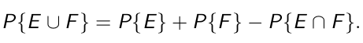

- last term is because both E and F have been counted twice in the the first 2 terms

#### Conditional Probability
- conditional robabilty of event E given event F (F is something we know has happened)
- notation: P{E|F}
- denominator renormalizes over new sample space and numerator restricts to samples in E and new space

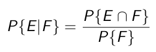

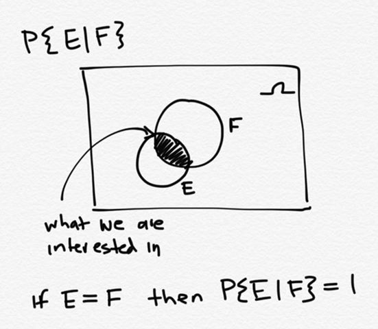

##### Conditional Probability - Example
- we want to compute probability that A is failed given that exactly one server is failed
- F = {(f,w,w), (w,f,w),(w,w,f)} = exacly one server is failed
- E = {(f,w,w),(f,f,w),(f,w,f),(f,f,f)} = A is failed
- apply conditional probability formula
    - P{E ⋂ F} = {(f,w,w)} = 0.03
    - P{F} = {(f,w,w),(w,f,w),(w,w,f)} = 0.03 + 0.06 + 0.05
- P{E|F} is 0.03/(0.03+0.06+0.05) = 0.2143
- this means A is a little less likely to fail than the others ._.

#### Independent Events
- events E and F are independent if 
- 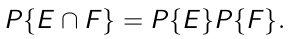
- P{E} is not affected by whether F occurs or not
- if we plug this into the conditional probabitiy equation then we would get that P{E|F} = P{E}
- an example of independent events is rolling a die twice

##### Independent Event Example 1
- are the events that server A fails (E) and B fails (F) independent?
- we can get the probabiltiies of E happensing and F happening and see if the product of the two is equal to E intersect F
- in the case provided, P{E ⋂ F} = {(f,f,w),(f,f,f)} = 0.003 + 0.001 = 0.004
- we can use this value to see if the conditional probability formula yields the same result as P{E} on its own
- P{E} = all the possibilities where server A fails, which we add up to get 0.0370
- similarly, P{F} = 0.06 + 0.003 + 0.003 + 0.001 = 0.0670
- using conditional probability formula, P{E|F} = P{E ⋂ F}/P{F} = 0.004/0.067 which gives 0.0597
- since the probability is not the same as P{E} that means that event F affects the probability of event E occuring
- usually, if the servers share a common power supply then they are not independent

##### Independent Event Example 2
- with different data, we can conclude that knowing B fails does not affect whether A fails
- these values are from knowing the probability of A working (0.9), P{B} = 0.92 and P{C} = 0.95
- usng the above we can compute the probability of everything else (assuming they are independent)
    - so when we are computing P{w,w,w} it is just P{A}\*P{B}*P{C} = 0.7866

#### Bayes Law
- suppose we know P{F|E} but we want to know P{E|F}

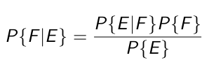

##### Bayes Law Example
- someone is tested for a rare disease. if you don't have it, the test will be negative 99% of the time and if you have it it'll be positive 99% of the time
- disease is found 1/10000 ppl          9
- what are the chances that someone testing positive actually has the disease?
- event A: one actually has disease
- event B: one tests positive
- P{A|B} = (P{A}P{B|A})/P{B}
- P{A} = 0.0001 and P{B|A} = 0.99
- to calculate we use the law of total probability
- P{B} = P{B|A}P{A} + P{B|A<sup>C</sup>}P{A<sup>C</sup>}
-      = (0.99)(0.0001) + (0.01)(0.9999)
- so P{A|B} = 0.0098
- so this test sucks if you don't have the disease

#### Random Variables
- denoted by capital letters, it is a real-valued function of the outcome of an experiment
- examples
    1. sum of rolls of 2 dice
    2. number of arrivals to a website by some time t
    3. time until ext arrival to website
    4. cpu requirement of an http request
- if we consider time to be continous then they would be continuous random variables 
- 1 and 2 are discrete, 3 and 4 continous 
- if we just define the possible outcomes of these random variables, it's a more natural method of representing information
- we want to represent the particular vaus they can take one (called distribution)

## Day 3 - Sept 9, 2019

### Distributions
- way of modelling the probability of an event
- we will use cumulative distribution function (cdf)
- any probability can be calculated given this function
- if there's only one variable, drop the subscript

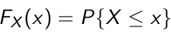
```
P{ 1 < X <= 4}
= F(4) - F(1)
```

#### Continuous Random Variables
- for quantities that take on values on a continuum - eg time
- F(x) is continuous
- integrals
- associated density function
- taking an integral of that will give you the cdf

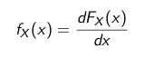

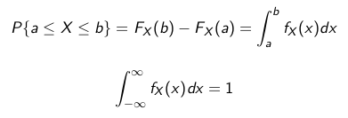


#### Discrete Random Variables
- probability mass function (pmf) gives probabilities that the random variable equals values in a discrete set
- random variable x takes on the value i and sums it


#### Summary Statistics - Mean (Expected Value)
- sometimes called average but we will use that for another purpose
- if you were measuring respnse time from db server every 5 minutes, and take the numerical average
- the expected value (mean) may be the same as the average but doesn't have to be
- the expected value does not have to be an outcome (eg dice E[X] = 3.5)

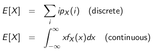

#### Higher Moments
- kth moment is raising the value to kth value to find the kth moment
- k = 2 is the second moment
- statisicians work with higher moments, we will only use 1st and s2nd moments
- different ways to compute for discrete vs continuous
- k = 1 gives us the mean, same formula as before

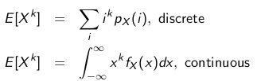

#### Variance
- an important summary statistic
- measures how spread out the distribution is
- Var(X) = expected difference from random variables from the mean squared
- squaring it makes it positive, and is actually easier to work with than absoute value
- 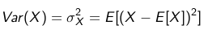
- when we talk about computing systems, knowing variance can help us get an idea ofhow the computer system performs
- if we're scheduling requests on a web server and the request are roughly the same sizes then variance is low and the requests can just be processed in order
- if we have different kind of requests with small files vs large files, the variance is high. we would have to worry about delaying the small files when there are large files
- the square root of variance, σ<sub>x</sub>

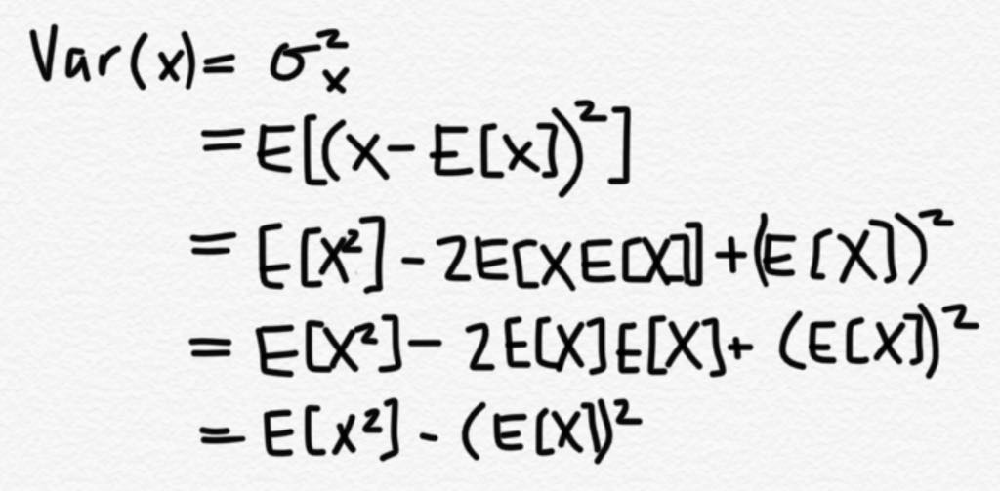

#### Example
Given the density of a a function (lifetime of a component in days)
- do we need to answer in terms of k or independent of k?
- can check integral 0 to 100 f(x) = 1

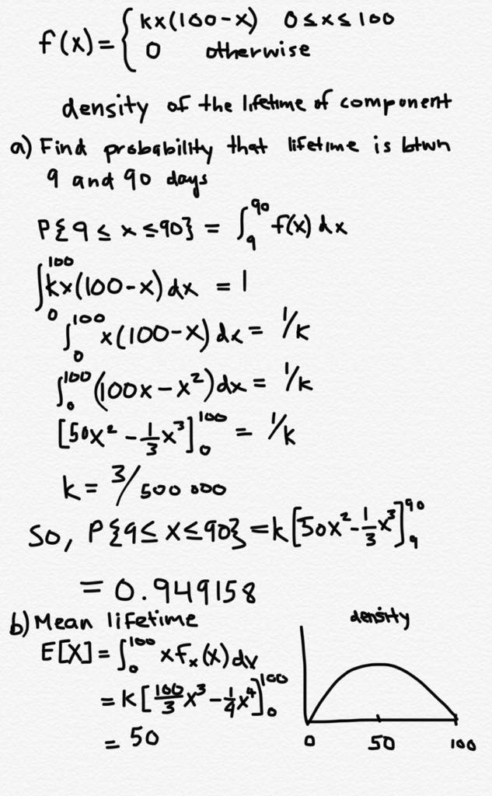

#### Some Useful Distributions

##### Geometric Distribution
- how many times do you do the same experiment where q is the probability of success, you get the kth experiment to be a success.
- 
- 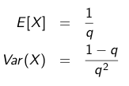
- as probablity of sucess gets lower, you have to wait longer to see a success
- variane goes up as q goes down

##### Poisson Distribution
- probabilty that random value takes on value of k :)((((()))))
- one parameter - lambda
- all the values should sum up to 1
- if you do the summation of  to infinity, e^-λ^-?? = 1
- taylor series expansion
- E[X] = mean, Var(X) = variance, both are equal to lambda
- the satistician Poisson used this to model deaths by horse kicks in the Prussian army

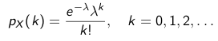


##### Uniform Distribution (continuous)
- what most people think of when we say something is completely random
- density function, denoted by U(a,b):
- 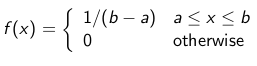
- random variable is equally likeky to take values anyuwhere between a and b
- this doesnt mean P{X = i} = P{X = j}, though it is trivially true
- U(0,1) is super popular as a random number generator

##### Exponential Distribution
- the probability that it takes on negative value should be 0 
- if you plug in 0 for x, you get 1 - 1
- when x goes to infinity, the value should equal 1

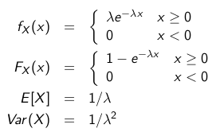

###### Exponential Distribution Example
Jobs ariving to server have CPU time (total time needed to process beginning to end). We looked at some data and foud the data exponenetially dsitributed with mean 140msec. CPU scheduling discipline is quantum-oriented so that a job not completing within 100 msec will be routed back to tail of the queue of waiting jobs. Find probability that a job has to wait for a second quantum.

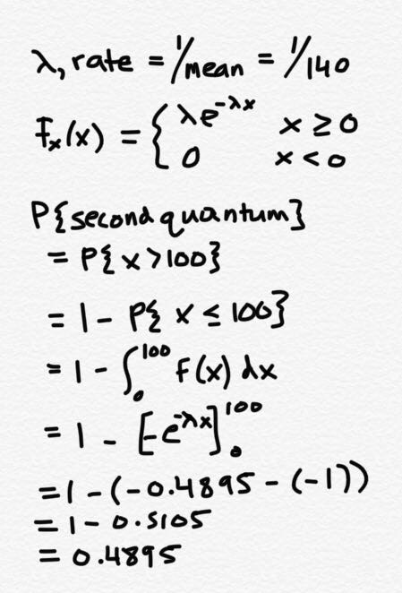

## Day 4 - Sept 11, 2019

##### Memoryless Property of Exponential Distribution
- given X ~ Exp(λ) and X > b
- X has been running for at least 6 months
- we want to calculate probability that it runs 7 months (1 more month)
- what is the probability that X > a + b
- = e<sup>-λa</sup>

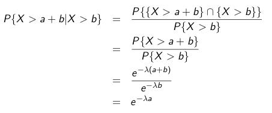

- the future is independent of the past
- knowing b gives us no real information about future
- this is the only time you can apply memoryless property
- example: if the bus is coming in 5 minutes and you get there exactly 1 minute before, you still can't say it'll come in 1 minute, we assume it's 5 minutes from when you arrive

###### Memoryless Property Example
What is the probability that a job finishs in the second quantum given it does not finish in the first quantum

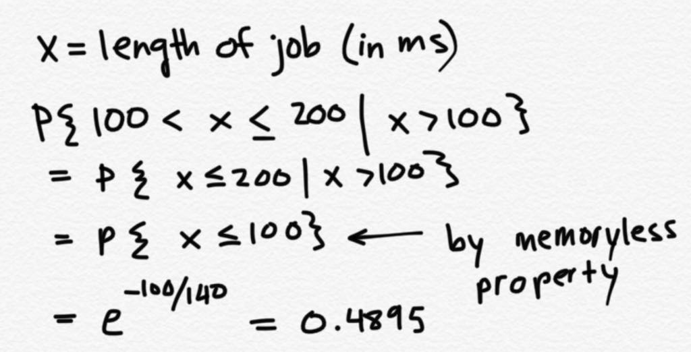

### Discrete-Time Markov Chains

#### Stochastic Model
- stochastic means random
- when we want to known how system evolves over time using dependent random variables
- discrete time markov chains are a good model
- number of places dtmc's are used
    - user web page navigation
        - google's page rank algorithm
    - cache contents and performance
    - speech recognition
    - machine learning (reinforcement learning - working with discete-time markov chains)
    - composers
    - baseball (how runs are scored)

#### Web Page Example
- 3 web pages A,B,C linked to each other
- A links to B,C
- B links to C
- C links to A and B
- 1/3 of time we go to B, 2/3 to C when you leave A
- B always to C
- C to A and C to B is 50/50
- want to know what proportion of visits are made to each of the pages
- it doesn't take into account how much time is psent on each page but rather discretly, the nth time point corresponds to nth page visited

#### Discrete Time Systems
- the example with the linked pages is discrete-time
- te nth time point is basically the nth page visited

#### Discrete Time Markov Chains Definition
- definition: a stochastic process X<sub>n</sub> which denotes the state at a discrete time step n
    - stochastic measn random
    - process means evolving through time
- the probability at step n+1, the state is equal to j, given that you know every state it's been in the past
- that probability boils down to just knowing the most recent state
- this is the Markov property
- its a form of a memoryless property
- last property is stationarity - sats of process are independent of time
- chain refers to state space being discrete, states are chained together by transitions

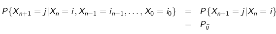

#### Markovian Property and P
- future is independent of past given the present
- more formally, the markovian property is that the conditional distribution of any future state X at n+1 given the past states X at 0,2...to n-1 as well as current state at n, the conditional distribution is independent of past states and only depends on the current state 
    1. makes analysis easy
    2. reasonable assumption for practical situations
    3. if you ever want to simulate this thing on a computer it measn you only need to store present state
- P is the transition probability matrix
    - square matrix
- can be infintely dimensional based on how mny states you have
- rows of P sum to one because the sum of the probabilities that you go somewhere has to be 1
- if it is less than 1 that means there is a state that is missing
- we are gonna allow self transitions so P<sub>ii</sub> > 0
- in general, P's entries P<sub>ij</sub> > represent the probability of moving from state i to state j in the next transition

#### Back to Webpage Example

    P = [0   1/3  2/3,
         0   0    1,
         1/2 1/2  0]

#### Umbrella Problem
- prof has 2 umbrellas that are used going home and to work
- if it rains and umbrella is at current location, umbrella is taken
- if not raining, no umbrella is taken
- probability of rain is p
- determine fraction of trips that the prof gets wet


### Tutorial 1 - Sept 13, 2019
1. Useful for Assignment 1 - constructing a sample set
    - drawing balls from a hat

    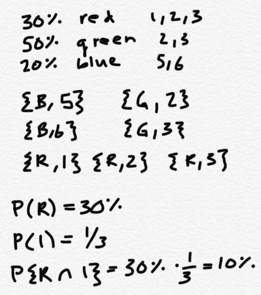

2. Mutual exclusion
    - intersection is an empty set
    - eg sunny dat or rainy day can't happen at the same time (except it can but ok sis)

3. Independence - MC question
    - P{A|B|} = P{A} if A is independent from B

4. Useful for Question 3 of assignment 1
    - Bayes law (will be on midterm)

    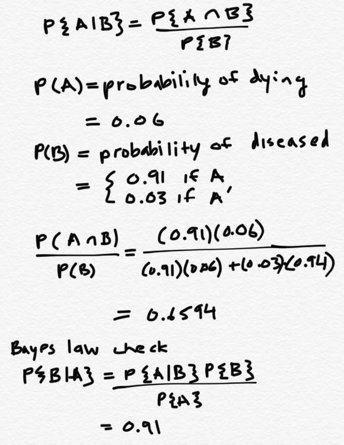

5. Helpful for Q4 of Ass 1 - Geometric Distribution
    - probability of succeeding at attempt k
    - probability of drawing card of some suit = 1/4
    - P(1 - P)<sup>k-1</sup> = P{K}

6. Useful for Q5 of Ass 1
    - PDF (PMF) - Probability Density Function
        - probability that something is happening at value x
    - CDF (CMF) - Cumulative Density Function

    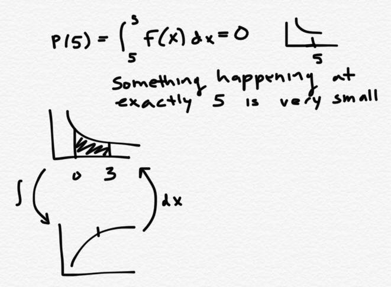

7. Memoryless Property (for last part of Q5)
    - in exponential distributions
    - regardless of start
    - given rate = 1/5, E[X] = 5
    - if something fails in 5 seconds and you wait 35 seconds, when is it going to fail?
        - 5 seconds, regardless of how long you wait

8. Example for Exponential Distribution

    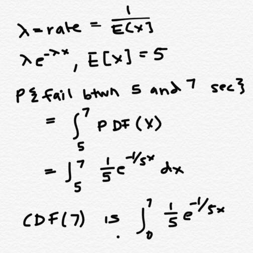

9. PDFS/CDFS
    - What is the interval of PDF from [0, inf]?
        - 1 
        - by the Law of Total Probability
    - CDF at infinity?
        - 1 (this is what y value becomes over time)
    - CDF behaviour at 0
        - 0
        - we have x function, is it a PDF or CDF?
            - cdf if it approaches  at infinity

## Day 5 - Sept 13, 2019

#### Umbrella Problem contd
- could model problem with 6 states, where state is the ordered pair consisting of number of umbrellas at home and current location

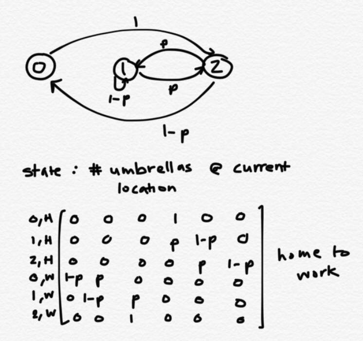

#### n-Step Transition Probabilities
- when we want to know what will happen in 5 steps
- P<sup>n</sup> = P * P *** P
    - n copies of P multiplied together
- entry at P(i,j) is what will happen the first step
- if you multiply P with P, you get what will happen in second step
- notation is 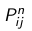
- in general, we know that (n-1) step transition probabilities are give by P<sup>n-1</sup> 

##### 2-step Transition Probabilties
- with a 3 state DTMC
- 0 to 1 is 0 -> 0 -> 1, 0 -> 1 -> 1, 0 -> 2 -> 1

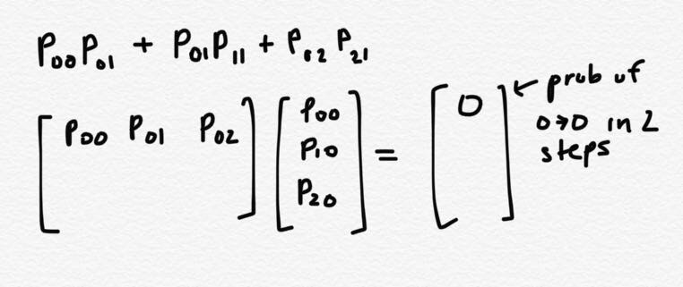

- two step formula
    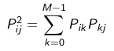

#### Limiting Probabilities
- not obvous that limit always exists
- what happens when you let the system go for a long time
- you keep multiplying the P matrix
- rows start to become the same (check webpage link example)

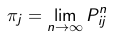

##### Revisiting Umbrella Problem
- raining P = 0.4
- p^30 has a limiting probability, the rows are all the same

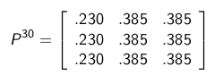

- probability that one gets wet = pπ<sub>0</sub> 0.4*0.23 = 0.092
- is there a better way to compute π<sub>i</sub>
    - yes, by stationary probabilities

#### Stationary Probabilities
- when you have more equations than unknowns
    - usually means no solution or
    - if we know there is a solution then at least one of the equations may be redundant
    - but you can't just throw away an equation t fix this
- simplest possible solution is that all π are 0, which is why we need the equation that π<sub>i</sub> summed up = 1

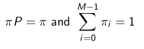

### Key Theorem
- these 2 ways of calculating the probabilities give u the same answer
- pij is the limiting probability of being in state j where pi is a 1xM matrix
- there is a proof but we won't go into it in very much detail

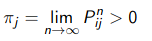

#### Steady State Probabilities Example 1
- toy model - if we look at the execution of a progam, we can track it using a DTMC
- 3 resources - cpu, storage A, storage B                             
- assume that with this programs execution it doesnt simulataneously use the resources
- you are given the probability transition matrix

```
      0.8 0.1 0.1
p =   0.1 0.9  0
      0.1  0  0.9 
```

- if you discretize time, high probability that we stay at one resource for P[0,0]
- what is the probability that given a program is initially using the CPU, it uses disk A 2 time units later?
    - wanna get P[0,1]
    - note: (P[0,0])^2 is the prob that you stay at 0,0 for 2 steps and P^2[0,0] is prob that you are at 0,0 after 2 steps
    - so for this we just do P<sup>2</sup><sub>01</sub> which is 0.17
- what is the steady state probability that disk A is being used
    - compute the limiting probability for this

 ```
[pi_0 pi_1 Pi_3][0.8 0.1 0.1, 0.1 0.9 0,0.1 0 0.9] = [pi0 pi1 ]
we are gonna throw away one of those equations

first 2 colum eqns:

0.8pi_0 + 0.1pi_1 + 0.1pi_2 = pi0
```

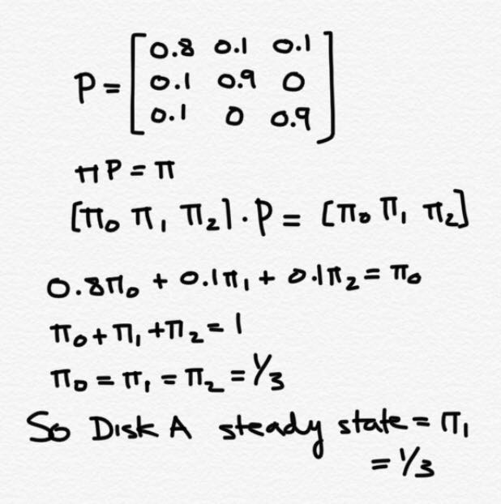

## Day 6 - Sept 16, 2019

#### Steady State Probabilities Example 2
- multiprocessor system with 2 processors and 2 memory storage with the following matrix

1. Make the P matrix
    - key questions: do we need to distinguish between 2 processes? no
    - we can't distinguish between them so we don't need to keep track of which is which
    - states of P matrix:
        1. both access memory 1
        2. both access memory 2
        3. both access different memory
    - if we were to make request probabilities the same, we wouldn't even need to distinguish between the memory modules
2. compute steady state using limiting probability

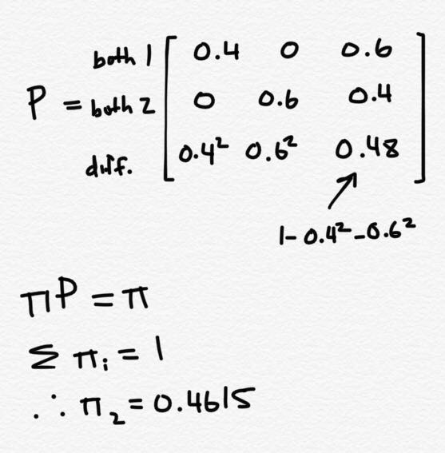

#### Calculating expected number of steps to enter a state
- example with states {0,1,2,3} and matrix P

```
     0  0.4  0.6  0
P =  0  0.4  0.6  0
     0  0.9   0  0.1
     0   0    0   1
```

- T(0,3) is the number of steps to enter state 3 given the system satrs at state 0
- E[T(0,3)] = 1 + 0.4E[T(1,3)] + 0.6E[T(2,3)]
- value on RHS: 1 because we always take step from state 0, no matter what, then add number of steps starting from the next state
- we can come up with additional equations for E[T(1,3)] and E[T(2,3)] as well
- after solving for unknowns you get that E[T(0,3)] = 26.67

#### General Result

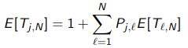

### Infinite State Discrete Time Markov Chains
- P is still square matrix but with infinite dimensions
- infinite linear equations and unknowns
- we could try truncating to make it simpler to calculate

#### Example
- jobs arrive at a probability of 0.05
- jobs depart with P = 0.1
- if there are already jobs in system, probability of inrease is r = (0.05)(1 - 0.1) = 0.045
- probability of decrease is s = (0.1)(1 - 0.05) = 0.095
- 86% of the time nothing happens (1 - s - r)

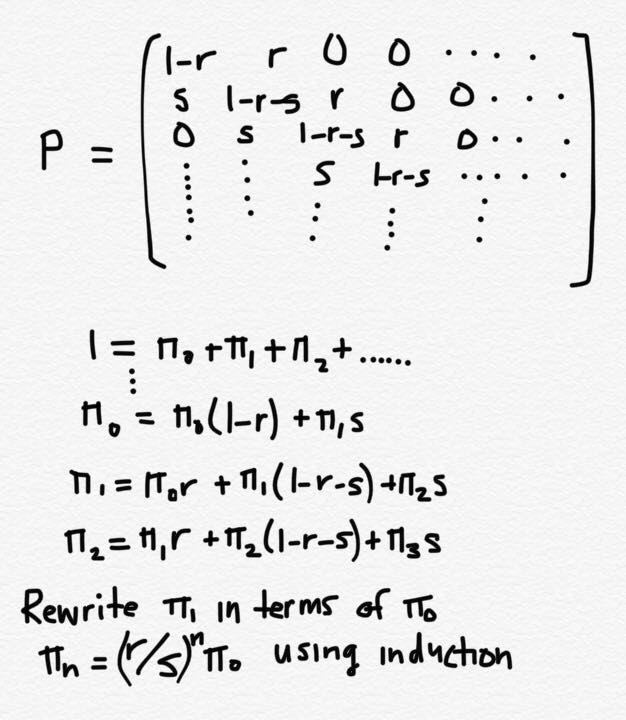

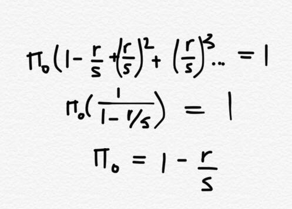

- works only when r/s is less than 1 or else the sum of all r/s will be infinite :(
- final result:

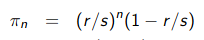

### Expect Number of Jobs in System
- the priciple of randomness degrading how the system works is an important thing to take away
- E[N] = π0\*0 + π1\*1 + π2*2 ... = (r/s) / (1 - r/s)

## Day 7 - Sept 18, 2019

### DTMCs and PageRank

#### Search Engine Goals
- search terms and ranks
- based on popularity

#### Proposal 1
- popularity of page is determined by the number of backlinks to it
- might not work well because not all links are equal
- can cheat the system by creating a bunch of pages pointing to a webpage

#### Proposal 2
- look at number of pages linked to backlinked pages
- also easy to cheat - can have all pages point to each other

#### Proposal 3
- page has high rank if sum of the ranks of its backlinks is high
- πj = sum of all πi*Pij

#### PageRank (vanilla)
1. get all pages and links between pages
2. create DTMC where state are pages and there is a transition from page i to j only if there is a link between i and j
3. if page i has a k<sub>i</sub> > 0 outgoing links, the probabilities of transition from i to j = 1/k<sub>i</sub>
4. solve dtmc for limiting probability

#### Web Proxy Caching
- cache so web clients get pages with better latency
- LRU - least recebtly used
- have probabilities of being accessed for web pages

### Tutorial 2 - Sept 20, 2019

## Day 8 - Sept 20, 2019

### Operational Analysis

#### Description of a Queuing System
- simple queue consists of buffer/queue where arriving jobs wait to be served
- depart after completion
- need to describe 
    - how arrivals work (given by probability distribution)
    - queue - size (infinite or finite)
    - how server processes jobs that arrive (number of servers, order of service, processing times)

#### Performance Indicators/Metrics
1. response time
    - average, mean, variance, if its larger than some value
2. throughput
    - number of jobs served per time unit

#### Queuing Networks
- topology of queues

#### Analysis Directions
- two possibilities
    1. exact analysis
        - equations that yield desired performance metric
        - question 2 on assignment 2
    2. simulation
        - idea is that instead of doing exact analysis, you simulate it and gather real data for response times and then compute the average
        - running the system logically

#### Operational Laws
- what analytic models rely on
- suppose we have log data of simulations
- A<sub>i</sub>(t) - number of arrivals to device i at time t
- C<sub>i</sub>(t) - number of completions from device i at time t
    - integer values
    - both functions increase, number of arrivals and number of completions
- B<sub>i</sub>(t) - busy time of device i at time t
    - time spent working on these arrivals
    - this is = t if it is busy the whole time
    - usually it's between 0 and t
    - the rest of the time the device is idle
- what can we derive from this data?
- from this we can construct a probability distribution
- arrival rate at device i = A<sub>i</sub>(t)/t
- throughput = C<sub>i</sub>(t)/t
- utilization = B<sub>i</sub>(t)/t = between 0 and 1
- average processing time = B<sub>i</sub>(t)/C<sub>i</sub>(t)
    - if we knew the real processing time, this calculated value would be overestimated because B<sub>i</sub>
    - it goes up and drops

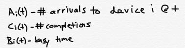

#### Simple Calculations

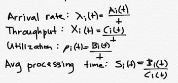

#### Ergocidity Assumptions
- assume system is ergodic (time averages lead to actual underlying means)
    - youd eventually get the means 
- assume everything converges to a fixed value as time gets large
- many situations where arrival rate changes (eg more arrivals during business hours)

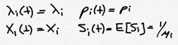

#### Utilization Law
- we're gonna do some algebraic manipulation of the quantities

- number of arrivals an derpatures is around 100 million, then we can say that arrivals are departing at some rate X
- if the 2 were not equal it would not converge? - i just made this part up he didn't really say that
- if the system was busy all the time, it would process 1 job every e[Si] time units
- otherwise departues would be happening faster than they are arriving

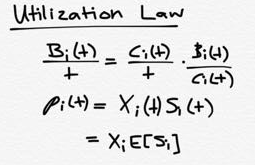

#### Forced Flow Law
- suppose A<sub>i</sub>(t) = C<sub>i</sub>(t)
- what does that tell us about the queue at time t?
    - it's 0
- system where jobs might revisit a device
- this is a common model
- control gets passed to CPU then to storage device and then passed back to CPU and then to storage device
    - program visits CPU multiple times
- given reference device, device 0, by definition te expected number f vists to device i = expected number of departures (one of these is reference device)

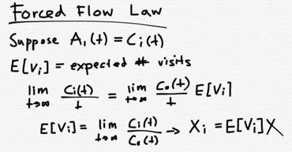

#### Device Demands
- combining utilization law and forced flow law
- throughput ro = E[Si]E[Vi]X
- ro<sub>i</sub> = E[Di]X

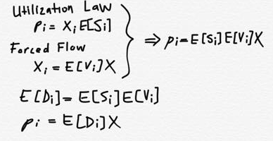

#### Little's Law
- this one is a relationship that's not very obvious
- John Little came up with this in 1950s
- N<sub>i</sub> is the avergae number of jobs that are sitting or waiting at a device including the one being processed
- that expected number paired with mean response time is related
- if we know that 2 different systems, 1 with average qeueu length of 10 and system 2 avergae q length of 20
    - it makes sense that the average waiting time for the system with twice the length has longer is twice as much as system 1
    - in a number of systems, we are almost always interested in response time, esp when deciding how long you should make your buffer
- the derivation after is used in multiple places so you should understand it

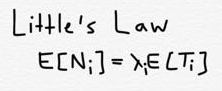

#### Users/Clients
- using relations we talked about to make design decisions
- look at the following model
    - there are n users
    - each user thinks for period of time E[Z]
    - at the end of think time the user submtis job to subsystem
    - once processing is complete at subsystem, as soon as user gets response the user starts thinking again
    - common model for behaviour of user
    - eg databases - formulate a query, submit query
    - no parallel execution

#### General Response Time Law
- subsystem has k nodes
- we are interested in mean response time E[T]
    - E[T] = time user submits request to when request is completed (total time spent during this process)
    - we want to look at mean number of jobs in the subsystem
    - if there are 10 users in total and there are 3 in the system that means there are 3 active requests
        - that would mean there are 7 users in thinking mode
    - when a request is completed there may be 8 in thinking mode and 2 active

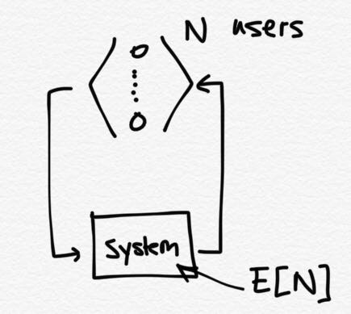

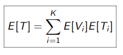

#### Interactive Reponse Time Law
- rate at which jobs are generated per time unit = total time/time that it takes for one of these things (t/(E[Z] + E[T]))
- M users, each user generateds the amount ----
- throughput = M/(E[Z] + E[T])
    - this tells us that response time and throughput are related
    - throughput = arrival rate = departure rate = X
- expected response time = number of users/(throughput - avg think time)
1. if we are given M and the think time, we can measure response time that gives throughput
2. more impotantly, we are gonna look at the end resut and fint he fundamental properties that limit performance
    - when can we get low response time and high throughput
- on average, the user generates at value (t/(E[Z] + E[T]))
- don't really need limit because t's cancel

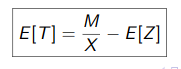

## Day 9 - Sept 23, 2019

#### Interactive Response TIme Law contd
- throughput = arrival rate = departure rate = X
- if output rate was smaller than input (0 < x) then there is some loss
- however in our assumption there is no loss
- max number you'd ever see in system is M
- the rate of things going in and going out has to be equal for our rate to stay constant
- if users were allowed to generate requests as soon as they finish (no think time) then 0 < x may hold true
- end result is E[T] = M/X - E[Z]

#### Bottleneck Analysis
- at the very least, it'll take this long to complete
-turns out we can get he following result
- x is system throghput measured at some point
- it's bounded above Dmax (max val of demands) and M/---
- Dmax = bottleneck demand
- throuhput cant get any larger than this demand DMax

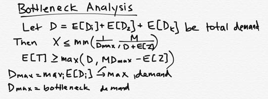

##### Proof of Bounds
- when system has its performance limited, througput is going to be 1
- min reponse time is when you are the only user of system, it would be greter than or equal to D


#### Example 1
- M clients submitting requests to 3 single-server nodes in series (visit in order and visit once)
- the mean demands at the 3 nodes at E[Da] = 2, E[Db] = 3, E[Dc] = 1
- throughput is biuded above by min(1/3,M/36)
- mean response time is bounded below by max(6, 3M-30)
- M is the same for when the upper and lower bounds are equal
- the E's need to add up to 6 (total demand stay the same)
- the best choice would be to get a balanced load  E[Da] = E[Db] = E[Dc] = 2
- then the number of supported clients will become 18 (more users)
- but there is another reason this is a better choice
    - something more direct
    - you want to get the max possible throughput
    - with Dmax being 2, you cn do 1 job every 2 times
    - max throuput increases by 50%
- bottom line is that we want to improve bottleneck demand
- almost all service based computer systems have a load balancer attached to them
    - it adjusts the demands to make them as equal as possible


#### Example 2
- system has 50 clients
- each request requires 5 reads be made on avg
- avg read time is 9ms
- each db request requires at least 15ms of CPU time
- consider 3 proposed design changes
    1. reorganize data so disk reads per access reduced from 5 to 2.5
    2. disk replaced by one 60% faster
    3. CPU speed doubled
- based on what we have discussed, the way to justify would be to calculate demands
- 2 resources - CPU and disk, which one has higher demand?
- 5 reads * 9 ms = 45 ms demand for disk
- 15 ms for CPU
- demand for disk is higher so we can just eliminate #3, since it doubles the CPU speed even though disk read is what is slowing us
- 50 clients is useless information so we can ignore that (it would be useful if we were given think time)
- #1 decreases by factor of 2 (22.5 seconds from 45)
- #2 reduces it to 28.1 so chose #1
- the disk is still at bottleneck with 1 do a second choice to be implemented would be #2

#### Example 3


## Day 10 - Sept 25, 2019

### Operational Laws 6.4 in textbook
- probability of exactly 1 visit = 50%
- probability of exactly 2 visits = 25%
- expected number of visits to CPU = 2
- expected number of visits to device i = 20

#### How to solve this question
- list all quantities
- write out laws
- which of these things do we have 2/3 things of the equation


### Simulation
- for operational analysis there are drawbacks
- all we can caculate is mean values
- if there is a question like what is the probability that there are 3 jobs at particular node
- cannot use op analysis for that
- we can't even get throughput with OA, we can onyl get bounds
- instead of equations for performance, we simulate system and get numbers from that

#### Random Number Generation
- 2 issues
    1. how do computers generate random numbers
    2. how does one generate a sample from given distribution
- eg want to generate user think times

#### Pseudo Random Number Generation
- computers can't truly generate random numbers
- Cloudflares's wall of lava lamps - uses iamges of lava lamps to generate a random number
- produce sequence of pseudo random numbers
    - something that appeears to be random but it's really
- it passes statistical tests of randomness
- many approaches for RNG
- goal is to give one primitive approach
- we don't have to know how to write a PRNG, but understand how they work

#### Multiplicative Congruential Method
- generate stream of pseudo random numbers
- x<sub>0</sub> is the seed of rng alg
- we recursively compute values x<sub>n</sub> by modding by m and multiplying by a
- xn is an int between 0 and m-1
- x<sub>n</sub>/m is a sample from uniform distribution U(0,1)
- as soon as value repeats, whole sequence will repeat
- m should be a large prime number (if it not we'll get repetitions over factors of m)
- for 32-bit word with first bit being the sign, m = 2^31 - 1 and a = 7^5 work well
- these values came from experimentation

#### PRNG - assumptions
- assume we have a good random number generator
- all it can do is generate samples from U[0,1]
- how do we make samples

### Tutorial 3 - Sept 27, 2019
- went over operational analysis problems

## Day 11 - Sept 27, 2019

#### Generating Samples from a Given Distribution
- how to generate coin flips from U[0,1]
    - if it's less than 0.5 then heads, greater than then tails

### Discrete Case 
- to generate sample given distribution


## Day 12 - Sept 30, 2019

### Test 1
- next wednesday
- covers assignments 1 to 3
- one sheet of notes, assume knowledge of distributions ie what is exponential distribution
- sample questions - go through all of them
- Max will do review in tutorials

### Caching Example
- more detailed than last time
- how people use these tools in real life

#### Introduction
- we wanna compare caching strategies
- we're gonna model system as a ranked set of pages
- suppose we have 8 pages anf the ranking is 3,7,2,6,5,1,8,4
- suppose cache covers 2 of these (top 2 - so 3 and 7)
- two caching strategies ppl have considerd
- suppose next request is for P5
    1. when you use LRU, the most recently requsted becomes highest ranked
        - this would move P5 to the front of the list, keeping everything else the same order
    2. other strategy is move ahead
        - whatever page is requested moves up on rank (so 5 and 6 would switch)
- there is a cache miss when the page requested is not in memory
- if all the pages are ranked, a dtmc is easy to make
    - however, if n is number of pages all possible states is permutations 1 through n
    - size of state pace is then n!
    - in this case we have state space 8!
    - in typical linux system, 4kb page size and 1gb memeory and 1gb swap disk, the state space would be 500000

#### Request Model
- constructing a DTMC
    - need logic of cache (in LRU and move ahead this is really easy to determine next list)
    - model for request themselves (how do requests come into system)
- we are gonna assume that each request follows same distribution
    - i.i.d - indepedent and identically distributed
        - what you choose nth time has no dependence on anything and probabailities of accessing page i don't depend on n
        - whether you request a million vs thousand, it is the same probability
- when you have those 8 pages, you wanna look at scenarios bc it is difficult to believe one algo works better than another
- assume there is one page (page A) that is more frequent than the other ones
- probabikity that we choose page A is a
- b = probability of pages that are not A
- a + (N-1)b = 1
- suppose a = 0.3 and the other b's are 0.1
- that means 70% of the time it is some other page and 30% is A
- so a > b but doesn't mean A will be chosen a lot more
- so if request is distributed arbitrarily,state space of size N!
- with this assumption, state space of size N
    - at least 7 of pages have same statistics
    - A is the only 'outlier'
    - we want state to work for LRU and move ahead
    - we only need to know the position of page PA after nth request because all other pages act the same
    - then N = 8 and state space = 8
    - Xn = position of page A after nth request

#### LRU
.| 1 | 2 | 3 | 4 | 5 | 6 | 7 | 8
-----|---|---|---|---|---|---|---|--
1| a | 7b|  0|  0|  0|  0|  0|  0
2|  a|  b|  6b| 0|  0|  0|  0|  0
3|  a|  0|  2b| 5b| 0|  0|  0|  0
4|  a|  0|  0|  3b| 4b| 0|  0|  0
5|  a|  0|  0|  0|  4b| 3b| 0|  0
6|  a|  0|  0|  0|  0|  5b| 2b| 0
7|  a|  0|  0|  0|  0|  0|  6b| b
8|  a|  0|  0|  0|  0|  0|  0|  7b


#### Move Ahead
.| 1 | 2 | 3 | 4 | 5 | 6 | 7 | 8
-----|---|---|---|---|---|---|---|--
1| a + 6b | b|  0|  0|  0|  0|  0|  0
2|  a|  6b|  b| 0|  0|  0|  0|  0
3|  0|  a|  6b| b| 0|  0|  0|  0
4|  0|  0|  a|  6b| b| 0|  0|  0
5|  0|  0|  0|  a|  6b| b| 0|  0
6|  |  |  |  |  |  | | 
7|  |  |  |  |  |  |  | 
8|  |  |  |  |  |  |  |  

Which is a better model?

- With a = 0.3 and b = 0.1, the stationary distribution for LRU shows the probability
- with move ahead and cache size one, the stationary distribution is a lot better
    - it says page A will be top ranked 2/3 of the time
- with cache size 1, LRU cache miss probability is 1


P(R<sub>n</sub> = P<sub>A</sub>) P(A not in cache) + sum of all P(R<sub>n</sub> = P<sub>i</sub>) P(i not in cache) and i != A

= 0.3*.7 + (7)\*(0.1)*(0.9) = 0.84

## Day 13 - Oct 2, 2019

- when would you prefer LRU over move ahead
    - when once you go to a certain page, some pages are more likely

### DTMCs and Machine Learning
- number of reasons why people use DTMC for machine learning
- key thing people look at is that it's a simple model that is able to capture correlations
    - 1 step probabilities for state dependent variable
- DTMCs are easy to work with and allow us to do the following
    1. sampling/simulating values
    2. learning - P{X<sub>n+1</sub> = j| X<sub>n</sub> = i} (what is the probability the next state will be j given the state before is i)
    3. inference - given the system starts at state i, what is tge probability it will be at state j after n steps P{X<sub>n</sub> = j| X<sub>0</sub> = i}
    4. stationary distribution (steady state)
    5. decoding
    6. conditional inference - what will a state be after n steps if it is at step i right now - P{X<sub>n</sub> = j | X<sub>n-1</sub> = i, X<sub>n+m</sub> = k}

#### Sampling
- to generate values for DTMC
- just need to generate a U[0,1] to generate next state
- i we look at ith row, take the most probable value in the row and keep generating states

#### Decoding
- one of the things we wanna do in machine learning 

### Constructing a Simulation
- if there's an arrival to one of the jobs in your computer system you want to be able to determine the next state
- variables and events we can use for discrete event simulation
    1. time t (elapsed time)
    2. counter variables - number of times an event happens by t
    3. state variables - state of system
    4. output variables: things we are trying to measure

#### Simulation Example
- simulating 2 single-server queues
- first one's output goes to second queue
    1. Exp(λ) = time between arrivals
    2. Exp(μ1) - processing times of server 1
    3. Exp(μ2) = processing times of server 2
    4. first come first serve processing at both servers
- 3 events
    1. arrival
    2. departure from queue 1
    3. departure from queue 2
- state = queue length at each server
- have to update time, state and time to next events
- if queue 1 is empty, simulate processing time (same for queue 2)
- also need to note departures (for response times)

```
lambda --> a node  --> node --> node 

times for each node are exponentially distributed with μ 1

we might want to know the throughput 
```

#### Code Example

```matlab
ttne(1) = Inf; // remaining time until next arrival
ttne(2) = Inf; //remaining process time at queue 1
ttne(3) = -log(rand) / lambda; // remaining process time at 2
arrivals=0;
departures=0;
while(t<simtime)

// smallest one determines what happens next
// find which event happens next, update time (advance clock by y)
// subtract y from all the entries
// if there is an arriavl (it is the smallest of the three), increment number of arrivals
// q(1) = q(1) + 1
// generate new exponential number for next arrival(?)
// if there is no scheduled event, generate a processing time at q1
// with the exponenttial, it is always log(rand)/mu1

```

### Tutorial 4 - Oct 4, 2019

#### Concepts Review
- intersect of 2 mutually exliusive
- a cdf as x approaches infinity it is 1
    - a pdf will be 1 if u integrate/take sum of -/inf to /inf

## Day 14 - Oct 4, 2019

#### Matlab Implementation
1. Run program, `two_queue(0.5, 1.0, 1.5, 100000)`
    - exit matlab
    - repeat: get exactly the same values
    - λ, μ_1, μ_2, simulated time)
    - this is because matlab uses the same seed
2. run two consecutive times
    - different values ( for throughput and avg response time)
3. `two_queue(2.0, 1.0,1.5, 100000)`
    - the throughput for this would be around 1 (smallest rate)
    - the longer you run it, the longer the avg respnse time would be 
4. Q1: what to choose for output?
    - calculate average
    - how 'confident' are we with result (confidence intervals)

```
lambda = 0.99
mu1  = 1.00
mu2 = 100

pi = lambda*E[Si]
```

#### Confidence Intervals
- given a bunch of data points with an average of 26.91
- average is not good enough, it doesn't tell us much
- we want to get the bounds of an estimate such that P(a <= E[X] <= b) = 1 - α
    - want to know the probability that the average is going to plus or minus a certain amount
- 100(1 - α) is the confidence level, given as a percentage
    - want it to be close to 100%
- α is the significance level so it will usually be around 0.1 or 0.05
- (a,b) is the confidence interval

#### How to Compute Confidence Intervals
- the t-distribution is one way to do this
- the t<sub>1-α/2;n-1</sub> is the 1 - α/2 quantile
- so if α is 0.1 then it will be the a confidence level of 90


#### Output Analysis
- transient response graph R(n) <-- response time of nth job


- response will be underestimated because it doesn't take transient response into account (not steady state yet)
- you can kill transient by keep on simulating until you get a steady state
- even if we get rid of transient, we're just reporting 1 avg value whereas we wanna report confidence values
- there is an assumpton about set of samples for confidence intervals
    - these samples are independent samples from underlying distribution
- if we take conseuctive values and we wanna claim they are indepndent from reposne time distribution, you can't claim they are independent
- they follow a trend
- so we can try to take samples far apart from each other so tey appear indepndent
- problem with that is that we would have to throw out a lot of data
- in practice, the simulation is repeated with a different seed for PRNG (called independent replica)

## Day 15 - Oct 7, 2019

### Putting Together a Good Simulation
1. computation of confidence intervals - appropriate way to present output/results
2. transient removal - remove bias from results
    - let the system run for a peroid of time (10%) and then start collecting data
3. independent replicas
    - outer loop tracking the number of replications at the top
    - at the end, for each replication, get throughput and avg response time
        - eg if we un it 30 times we would get a vector of size 30

### Simulation Packages
- would be nice if this was automated - one of these packages is CSIM
- developing schedules of next events
- storing state

#### CSIM
- has no front-end, just provides support
- notion of a 'process'
- CSIM schedule processes

```c
#include "csim.h" // includes all the routines and data structures
// csim always has a process named sim with a create statement
void sim() {
    int cnt=1;
    create("sim"); /* required */
    facility_set(facs, "facs", K); // initalize facility
    while (cnt<NOARRS) {
        cust();
        hold()
    }>)
}

// cancreate custom jobs
// comes with built in rng
void cust()
{
    create("cust");
    use(facs[0], exponential(SVTM1)) // use first node
    use(facs[1], exponential(SVTM2)) // use second node
}

// use(fac, time) schedules when job departs from facility
// it suspends process until it can be processed
// kind of like clock time but on simulator
// create("cust") allows multiple copies to be created for every job comign into the system
// main process is
```

`ssh macid@moore.cs.mcmaster.ca`

#### Useful Resources
- `www.mesquite.com` for information on C/C++ version of CSIM
- `SimPy` for python queues and RNG
- commercial
    - Arena
    - Simul8
    - Opnet

#### CSIM
- CSIM doesn't do transient removal
- reporting confidence intervals can be implemented
- CSIM also does run length control
- example at beginning
    - run n replications
    - produce CI for desired metric
    - suppose we ge 3.02 +- 0.02 with 30 replications, each for 100,000 simulated time, 90% confidence)
    - what is the result was 3.00 +- 1.00
        - can increase the number of replications or increase simulated time to make it better
        - can also decrease the confidence
    - width of CI be 5-10% the average
- run length control
    - before: run replication and compute confidence interval
    - we can put computation of CI (confidene interval) inside the loop
    - instead of fixed nuber of replications, keep running until CI is narrow enough
        - dangerous because it could run for a loong time so you should have a timeout after a while
- CSIM uses something called "batch means" rather than independent replicas to do run length control
    - the idea is that you have a resposne that is super trasnient-y
    - goal is to get a bunch of traces and remove transient
    - in batch means, you divide up the response into batches and use this to calculate Y1 Y2 Y3 Y4 (avg resposne time for each batch) and THEN do a confidence interval
    - the responses are not independent from each other but if we make the batches large enough they can appear independent

    - accurately identify which movie is playing based on video input

## Oct 9, 2019
- Test Day

### Tutorial 5 - Oct 11, 2019

## Oct 11, 2019
- rip

### Relationship between OA and Simulation


#### Exponential Distribution Properties
- x is measuring time between arrivals
- when you have 2 random variables, you can make one of them equal to something
- if you add condition that X2 = x then you can calculate it
- probability that X is less than or equal to x = 1 - Exp(-λ*x)

## Day 17 - Oct 21, 2019
- last time we talked about exponential distribution and derived some properties (all relied on memoryless)
- today we woll go over single event expoenentials
- squence of events: arrials to a systm (called the workload)
- want it to be easy to analyze
- reasonable approximation to reality

#### Counting Process
- N(t) is a counting process that is nondecreasing and N(t) = 1,2,..
- it counts events basically

#### Independent Increments

#### Poisson Process
- rate //lambda
- N(0) = 0
- independent increments

## Day ? - Nov 6, 2019


## Day ? - Nov 8, 2019


## Day ? - Nov 11, 2019


## Day ? - Nov 13, 2019


### Tutorial - Nov 15, 2019


## Day ? - Nov 15, 2019


