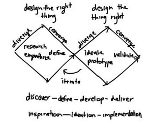

# 4HC3 Human Compute Interaction

## Table of Contents
- [Elm Architecture](#elm-architecture)
- [Assignment 1](#assignment-1)
- [Communication](#communication)
- [Elm](#elm)
- [Design Thinking](#design-thinking)
- [Activity Centered Design](#activity-centered-design)
- [Marking](#marking)
- [Don Norman](#don-norman)
- [Discoverability](#discoverability)
- [What is Design](#what-is-design)
- [Interaction Design](#interaction-design)
- [Experience Design](#experience-design)
- [Counter Example for Good Design](#counter-example-for-good-design)
- [Design Vocabulary](#design-vocabulary)
- [Paradox of technology](#paradox-of-technology)
- [Preview of Design Principles](#preview-of-design-principles)
- [Tutorial Assignment 3](#tutorial-assignment-3)
- [The Psychology of Everyday Actions](#the-psychology-of-everyday-actions)
- [Human Thought](#human-thought)
- [Learned Helplessness](#learned-helplessness)
- [Positive Psychology](#positive-psychology)
- [Three Layers of Cognition](#three-layers-of-cognition)
- [Goal to World](#goal-to-world)
- [Norman's Advice on Failure](#normans-advice-on-failure)
- [More Advice from Norman](#more-advice-from-norman)
- [Memory in the Brain and in the World](#memory-in-the-brain-and-in-the-world)
- [Longterm Memory](#longterm-memory)
- [Why Elm](#why-elm)
- [Design Thinking](#design-thinking)
- [Double Diamond](#double-diamond)
- [Design Thinking continued](#design-thinking-continued)
- [Testing](#testing)
- [Activity-Centered Design vs Human Centered](#activity-centered-design-vs-human-centered)
- [Iterative Design](#iterative-design)
- [Presentation 1](#presentation-1)
- [Presentation 2](#presentation-2)
- [Bonus Marks](#bonus-marks)
- [Design Thinking continued](#design-thinking-continued)
- [Standardization](#standardization)
- [Anti-Affordances](#anti-affordances)
- [Knowing What to Do:  Constraints, Discoverability and Feedback](#knowing-what-to-do:--constraints-discoverability-and-feedback)
- [Constraints](#constraints)
- [Logical Constraints](#logical-constraints)
- [Applying Affordances, Signifiers and Constraints to Everyday Objects](#applying-affordances-signifiers-and-constraints-to-everyday-objects)
- [Midterm Prep](#midterm-prep)
- [Applying Affordances, Signifiers and Constraints to Everyday Objects continued](#applying-affordances-signifiers-and-constraints-to-everyday-objects-continued)
- [Forcing Functions](#forcing-functions)
- [Conventions are Cultural Constraints](#conventions-are-cultural-constraints)
- [Sound](#sound)
- [Human Error, No Bad Design](#human-error-no-bad-design)

## Tutorial 1 - Sept 3, 2019

### Elm Architecture
- kinda works like react
- interact with the DOM

### Assignment 1
- create a button that clears the stopwatch timer app
- https://github.com/christopheranand/HC3_2019/blob/master/Assignments/Assignment1.elm

## Day 1 - Sept 4, 2019
- interface
    - between 2 faces
    - not the skin of the application
- interaction
    - dynamic
- task based inteface design
    - think: "what does the user need to do"
- book: The Design of Everyday Things by Don Norman

### Communication
- interaction is about communication
- know what your message is & find out what your user understands
- simple information is harder to display since there is an expectation to understand the information easily
- should design intuitively
- need to communicate to user what things they can do
    - communicate in way that user will pay attention to it

#### Exercises
- chapter 1-6
- good to say that you know design thinking :hushed:
- default project: go find a user who has problems with math

### Elm
- compiles into javascript
- fully functional
- safe

### Design Thinking
- double diamond (insert diagram)
- there are 2 different kind of processes
- need a divergent phase where we generate different ideas
- some people like coming up with multiple ways of doing something and others want to find one right way
- it's good to be in a team that has both of the above
- need to research 
- understand things in others POV (empathy)

### Activity Centered Design
- design for "a person who wants to X"
- don't add features, add capabilities

## Day 2 - Sept 5, 2019

### Marking
- 1% for tutorial assignment 1
- n = 9 tutorial assignments (2-5)
- 10 bonus, oct 2 - reflection
- midterm - one essay question - oct 21
- free tool - mural.co - for design thinking presentation (Oct 28) - 10%
- 14-n suprise avenue quizzes
- 30% for project pitch + backup report
- 20% for final exam + short essays
- finite state diagrams
    - https://macoutreach.rocks/paldraw/
    - http://www.cas.mcmaster.ca/~anand/ShapeCreate2.html
    - escape math game

## Day 3 - Sept 9, 2019

### Don Norman
- helped define what human computer interfaces/interaction is
- Norman doors - not apparent how to open/close them

### Discoverability
- can you figure out what actions are possible?
    - if its not something obvious, need to add signifiers

### What is Design
Design is people deciding how something should be and a way of communicating with the user

Instead of calling it philosophy he called it design of every day things. Users didn't understand what the book was about. the publisher told him to put design in the title but users don't want to read a book that says philosophy in the title. It gives them an appraoch to design their house, lives, etc

The Escape Math Island game uses this philosophy of design. The kids who develooped it followed a design thinking approach.

Sometimes you will wish you could just get started, if you are close to the deadline. But its almost guaranteed that you will deisgn something that will not work well if you dont iterate and think of many possibilities. It almost never works out the way you thought.

### Interaction Design
- what we will learn in this course
- its how people interact with technology
- good design makes clear
    - what can be done
    - what is happening
    - what just happened

### Experience Design
- design focused on total experience
- measured by value and enjoyment people receive from it (i.e. do they want to experience it)


### Counter Example for Good Design
A counter example is CRUD - create read update destroy, a software interface, API operations. Lots of ways a user could get to a point and say 'I don't know what to do now'. It's bad because we're focusing on low-leve tasks, not the high-level tasks that the user needs to accomplish. It means we need to memorize all the commands. For a dev it's straight to the point.

Human entric design is about the experience, if it's easy to do and can we do it. It is highy subective and cannot tell if we are doing it right.

There are principles that people have come up with for this stuff. 
- the science of how the brain works
- the double diamond

### Design Vocabulary
- different languages have different definitions but it is esy to talk about things when there is one agreed upon definition
- a lot of our vocab will come from Norman
- he didn't invent these words, except maybe human centric design

#### Affordance
- a design vocab term from Norman
- taking 2 ideas and putting it into one term
- no one can talk about why something failed when there are 2 reasons
- affordance is the relationship between physical object and person
- eg handle on a coffee cup
- the chair affords sitting
- a high chair affords sitting for infants
- a cup handle is not an affordance
- relationship between handle and person creates an affordance
- an affordance doesn't have to be something you have to see, it is a relationship

#### Signifier
- comes from philosophy
- this is what many UI designers think an affordance is
- eg a sign on a web interface (something visible) is a signifier
- when you press a button at a crosswalk, the beep beep noise is a signifier for when you will be able to walk
- signifier is a percievable indicator (can be seen, heard, touched, etc)
- controls for adjusting a seat (that you can feel)
- the affordances that you feel can be more important to blind people
- buttons are the most common and obvious signifier
- eg a rectangle with words is commonly thought to be a button
- software bookmarks/physical bookmark

## Day 4 - Sept 11, 2019

- Norman doors lack signifiers
- things that aren't signifiers can be considered to be signiiers
- anti-affordances show where not to go
    - eg there is a barrier with gaps can be anti-affordances where cars can't go through but people can
    - grayed out button can be anti-affordance (means somtimes there is an affordance but there isn't one now)

#### Mapping
- function from one set to another
- natural mapping 
    - based on spatial relationship
    - means someone can come and look at your controls and not have to memorize them
- can't always use mapping if it doesn't exist

#### Feedback
- tell user what you are doing
- many users abandon tasks for lack of feedback
- if you give too much feedback you just overload 
- they will not know which signals are important and which can be ignored
- avoid giving feedback that you don't need
- kind of like the boy who cried wolf
- we can only process so many things at a time
- hospital rooms and cockpits are archetypical examples
    - many dials and buttons and things
    - if they all start beeping at once you will be panic

## Day 5 - Sept 12, 2019 

#### Conceptual Models
- example: files, folders, icons
- good: allows us to guess what will happen if we do something
- bad: using local storage model for cloud-based storage
    - weird to think that things are stored in clouds
- designers have to pay attention to the users conceptual model
- can be a cultural thing
- in a system
    - product + documentation
    - conceptual models are cognitive condtructions for prediction
    - user builds model as a result of their knowledge and interaction with the system
    - designer must communicate with user
- bayesian learning
    - prior probability - user is expecting the product to behave like their probable idea of the world around them

### Paradox of technology
- increase in tech is overwhelming
- there are a lot of 'probable ideas' (ref: bayesian learning)
- people propose more technology to make everything simpler
    - eg auditory interfaces
    - AI butlers
    - google glass
    - ubiquitous surface (AR/VR?)
- these ideas could fail or take away human agency
- can have acivity based interfaces or just not develop these things

##### The Design Challenge
- great design requires great teams and teams need great management
    - marketing
    - sales
    - hardware
    - manufacturing
    - software
    - designers

### Preview of Design Principles
1. Discoverability
    - if we can see what actions are available
    - perceivable state transitions
2. Feedback
    - state diagram: all transitions signal to user
3. conceptual model
    - makes model apparent (steering wheel will change direction of front wheel)
    - force on joystick of 777 planes?
    - enhances discoverability and feedback
4. affordances
    - ways of doing what wants to be done
5. signifiers
    - making it easy to discover affordances
6. mapping
    - spatial layout of interface
    - temporal layout (timeline)
    - makes controls easier to learn
7. constraints
    - physical
    - logical - makes sense
    - semantic - similar to logical
    - cultural - writing left to right

### Tutorial Assignment 3
- 7 points in backup report + presentation for 2 of the points (1 good 1 bad)
- due monday 
- feeback, mapping, affordance, signifier
- discoverability, conceptual model, constraints

## Day 6 - Sept 16, 2019

### The Psychology of Everyday Actions
- basic psychology is that our brain has a lil scientist that is doing experiments to figure out life
- when we can't open a jar we run the jar lid with hot water and the jar part with cold water
    - because we know materials expand when heated
1. form a model
2. make a hypothesis
3. take actions
4. observe results
5. revise model and start over

#### Gulfs of Execution and Evaluation
- we need reasons to run experiments
- most of the time we are just curious or want to achieve a goal
- goal vs world
- execution - first we formulate goal (what to do and how to do it)
- evaluation - we try to make sense of what happened in the world
    - is it right/wrong

#### Seven Stages of Action
- this is how we analyze interfaces and errors
- components
    1. goal
    2. plan
    3. specify
    4. perform
    5. perceive
    6. interpret (perceived changes)
    7. compare (expectation vs actual changes)
- can be goal driven (based on internal goal) or event driven (reaction to environment)

### Human Thought
- mostly subconcious
- memory
    - long term
        - declarative
        - procedural
    - short term
        - cpu with 7 registers

## Sept 18, 2019
- Class cancelled

## Day 7 - Sept 19, 2019

conscious | unconscious
----------|-------------
slow | fast
controlled | automatic
7 registers | multiple resources
for first times | skilled behaviour

- conscious
    - narrator of your life
    - one step at a time
- unconscius
    - internalized

### Learned Helplessness

### Positive Psychology
- make sure your app is giving user a sense of success
- reinforce success
- people learn from their mistakes
- turn failure into learning experience
    - IDEO: design company, slogan is fail often, fail fast

## Day 8 - Sept 19, 2019

### Three Layers of Cognition
- reflective
    - deep, analytical, slow
- behavioural
    - can be unconcious
- visceral
    - unconcious
    - lizard brain
    - instinctual response to world around

### Goal to World
- diagram

```
goal----> plan-------> specify-----> perform --> world
          (refelctive)   (behavioural)   (visceral)
world---> perceive---> interpret---> compare --> goal

```
## Day 9 - Sept 23, 2019

### Norman's Advice on Failure
- don't force user to learn your machine
    - instead of just an error message, give instructions on how to solve issues
- make errors low-cost
    - allow users to undo if they mess up
    - do not exit without saving or giving warning
- tell the user what their choices are using signifiers
    - don't expect users to memorize
- who remembers the 3 layers (goal)
    - simplification of layers of our brain
    - visceral/lizard - bottom layer (red) 
        - emotions, sensory perceptions
        - can have closed loop (doesn't need to reach higher levels of cognition)
        - non-animal name for lizard brain = visceral
        - visceral comes from 'in the flesh' 
    - reflective - top layer (purple) - instincts - concious
    - behavioural - middle layer (pink) - can work unconciously
- we start with the goal
    - questions at refelctive level
        - are there alternatives
        - anything in the layer is expensive, a lot slower
        - also learned behaviours
    - affordance is at behavioral level
    - signifiers are a higher level thing because people have to think about that
        - but if the signifier is really good and is the same on multiple applications, you don't really have to think about it --> can be moved down to behavioural layer
    - midterm q?: what layer does affordance belong in
    - the lower things are on the layers, the quicker
    - second layer: what are the possibilties
    - third (bottom): how to do it
    - is it ok
    - what does it mean
        - example when you do a google search
    - what happened: analysis/did the goal get accomplished
- each q above is for the designer
- they are the seven stages of action

### More Advice from Norman
- when you find bad design
    - don't moan but figure out why the problem happened
    - understand that there might have been a reason
    - do root-cause analysis
- end of first chapter!!!! 

### Memory in the Brain and in the World
- writing is a way to store knowledge in the world
- we also organize our world so it implicitly encodes knowledge (data)
- we rely on partial knowledge ( enough to distinguish between possibilities)
    - ex. don't know exactly what each coin looks like but know enough to pull out change when needed
    - have trouble when a change affects partial knowledge
- constraints - lmits that turn imprecise knowledge to precise knowledge
    - reduces what needs to be remembered
    - ex. knowing where your kitchen is within your house (2nd door on left <-- 2 constraints) rather than exact coordinates
- natural constraints
    - ex. seatbelts only slot into correct buckle (won't fit in others)
    - ex. scissors fit naturally one way in the hand (right vs. left handed)
- cultural constraints
    - ex. clocks go clockwise
    - ex. green means go
- procedural knowledge
    - how to do things
    - not concious
    - linked to cultural constraints
    - often hard to think about it
    - ex. playing guitar
    - ex. typing on keyboard without looking
        - facilitated by standard keyboard layout but new users can learn b/c keys labeled
- evidence that people use natural mappings
    - ex. putting your keys in a specific place each time
    - ex. organizing papers spatially according to importance
- designers should make it easy to find knowledge in world by:
    - including signifiers
    - adding physical constraints
    - using natural mappings
- working memory
    - computation in brain is like CPU with 7 registers
    - context switching is disruptive - requires transferring knowledge to long-term memory but that is hard
    - best option - make checklist of what you're doing
    - okay option - compartmentalize 
        - working mem has 3 components (auditory, visual scratchpad, register file)

## Day 10 - Sept 25, 2019
- tutotial presentation on tuesday
- assignment due oct 28

### Longterm Memory
- not very detailed
- easy to override by questioning
- sleep is good for forming longterm memories
- types
    - declarative memory
    - procedural memory
- conceptual models should use memory aids
- anticipate what will be forgotten

#### Prospective Memory
- rememebring to do things in the future
- in design - calendars, alarms, timers, reminders

Knowledge in the world | Knowledge in the head
---------------------------|----
perceived | from memory
interpreted | learned
slow | fast
for beginners | for pros
can be ugly | sleek

#### Memory in Multiple Heads
- collective knowledge can enhance team output
- in design - crowdsourcing

#### Natural Mapping


## Day 11 - Sept 26, 2019

### Why Elm
- app asset size is very small compaired to Vue, React, Angular
- 29kb

### Design Thinking
- like root-cause analysis
- engineers solve problems but designers discover the real problem
- involves listning to customer
- human centered design - listen to the people
- iteration
    - observation
    - ideation
    - prototyping
    - testing

### Double Diamond


## Day 12 - Sept 30, 2019

### Design Thinking continued
- is not A/B testing
- not marketing research

#### Ideation
- don't settle on idea too early
- get to know user
- says thinks does feel (empathy map)
- ask open-ended questions

#### Prototyping
- low fidelity
- only way to know product works is by testing so we need to make one
- don't finalize on an idea too early
- how might we ___ (do something)
- add artificial constraints

### Testing
- in small groups
- iterate - test, prototype a couple of times
- get feedback from 1-5 people
    - users like/change/question/ideas

### Activity-Centered Design vs Human Centered
- activity = when there is more than one customer
- human centerd = for one specific person
- activities vs tasks
    - activities are high level, drive satisfaction
    - tasks are low level
- Carver and Schier hierarchy of goals
    - be-goals
        - about you, your image
        - abstract
    - do-geals
        - action based, tasks
    - motor-goals
        - operations
- ipod is a good example for activity design
    - people like the activity of listening to music

### Iterative Design
- waterfall is not good for design thinking
- big companies let you do design thinking
- better to prototype and find problems early on

## Day 13 - Oct 2, 2019

### Presentation 1
- double diamond
- designing weed puller for elderly (short) woman
- empathize, define, ideate, prototype, test

## Day 14 - Oct 3, 2019

### Presentation 2
1. Overview of Challenge
2. What do we Hope to Learn
3. Empathy Map
- say, think, do, feel
4. Ethnographic Observations
- get different opinions
5. Themes and Insights
6. User Profile
7. As-Is Scenarios (kinda like empathy maps)
8. HILLS/POV Statement
9. How Might We
    - variations and pespectives
10. Reflection

#### First Prototype
1. Description
2. What We Wanna Learn
3. Testing
4. Feedback
    - reflection/action

### Bonus Marks
- 1 group use mural 1 doesn't
- disadvatnage and advantags of using mural
- what signifiers
- constraints

midterm: why emptathy tables are important?

### Design Thinking continued

#### Design Challenge
- great product = great team
- how can we make the best use of every team? - use parallelism
    - sales, manufacturing, marketing, etc

#### Multiple Stakehodlers
- a lot of products aren't chosen by users but by companies
- for example education is a collective effort from parents, politicians
- appliances bought by developers/property managers

### Standardization
- people agreeing on common choice
    - web protocols
- good because
    - users get expected behaviour
    - it's cheaper
    - products can work together better
- bad because
    - users might prefer bad system just because they know it (qwerty keyboard whereas colemak might be better)

### Anti-Affordances
- trying to make something hard
- for people with dementia so they do not leave the house alone

## Day 15 - Oct 7, 2019

### Knowing What to Do:  Constraints, Discoverability and Feedback
- when you start using a new device, approach with various types of knowledge
- knowledge in the world
    - signifiers
    - perceived affordances
- knowledge in the head
    - conceptual model
    - cultural, logical and semantic constraints
    - analogies that link to previous knowledge
- the part that the designer can do is put knowledge in the world
- taking 15 LEgo pieces example
    - many ways to build something
    - constrained by how they can be attached (physical contraint), which color goes where (cultural)
- we are going to be talking about some of these constraints

### Constraints

#### Physical Constraints
- "goes together like lego"
- should be able to tell how something should be used (physically)
- it used to be hard to tell which side up a USB type A should go but the type C fixed this

#### Cultural Constraints
- restaurant etiquette
- road etiquette

#### Semantic Constraints
- choices depend on knowing use
- driver is going to sit behind the windshield not the front because of how a car works and based on what windshields purpose is

### Logical Constraints
- pieon-hole principle
- give one obvious option to do something

### Applying Affordances, Signifiers and Constraints to Everyday Objects
- doors
- public transit

## Day 16 - Oct 9, 2019

### Midterm Prep
- practice exam on Avenue
- one page of writing and labelling diagram - 50 minutes

### Applying Affordances, Signifiers and Constraints to Everyday Objects continued

#### Switches and How to Make them Understandable
- mapping is Norman's fave principle
- should place switch where the object (light fixture) is placed
- switches with similar functions should be put together

##### Task Analysis
- to make a switch better, you should figure out what your users want and do
    - interview and observe them
- one button model is simple but there is no way we can cover all use cases this way

##### Use Mapping
- for controls, use spatial or timeline-based mapping

##### Wireless Control
- would get rid of physical househol switches

### Forcing Functions
- another constraint, physical one that prevents bad(unsafe) behaviour

#### Interlocks
- prevent dangerous actions that are ongoing
- microwave has an interlock mechanism so it doesn't keep radiating when you open it
- oven doors lock when it gets super hot
- OG interlock example - dead man's switch
    - trains are automatic but we needed to make sure the engineer is still alive overlooking
    - so there was a pedal with a spring that ensured the engineer is present
- still figuring out how we are going to do this for a smart car (Tesla)

#### Lockins
- prevent an action from stopping
- when you're about to close Word Doc it asks you to save
- business purpose
    - Bell device will not work with Rogers SIM
    - data usage

#### Lockouts
- prevent dangerous thing from happening
- pin in fire extinguisher needs to be removed before using it
- gates on stairs don't let people into the basement
- password systems need to do this properly
    - too many restrictions will make users override them
    - too many password change prompts make users just add number

### Conventions are Cultural Constraints
- it saves time to use conventions because they are defined and easy to re-implemenent
- in software this is harder to do since capabilities are different
- common practice for building layouts
- faucets
    - can be clockwise
    - can be mirrored (clockwise for cold, ccw for hot) but this sucks for one hand

### Sound
- good for feedback for people who can't see
- in general sound is good feedback, unless you can't hear
- lots of psychology behind these sounds
- useful to use skeuomorphism (making the object sound like how it seems it would sound)
    - phone camera makes a shutter sound
    - hands on a smartwatch
    - telephone icon for smartphones

## Day 17 - Oct 10, 2019

### Human Error, No Bad Design

## Oct 21, 2019
- midterm day

## Day 18 - Oct 23, 2019

### Human Error, No Bad Design continued

#### Slips and Mistakes
- mistakes are in reflevtive layer
- slips in behavioural and visceral
    - common when you're distracted

#### Types of Mistakes
- skill-based?
- rule-based
    - not using the right rule
- knowledge-based
    - incomplete/incorrect inkowledge
- memory lapse
    - forgetting a step


### Types of Slips
- capture clips
    - 2 activities have a common step and you do the wrong one
- desription-similarity slips
    - based on internal compression
    - when things are confusing to understand

#### What can we do to avoid mistakes/slips
- designers can solve this by making thingd ==s look at work differently
- use forcing function
- create uncluttered interface with focus on things
- same control different state different results
- mitigating factor - orthogonality
    - there is no overlap in controls

#### Fixing Types of mistaes
- rule based
    - in imperative programming - ifs and whiles
    - can be caused by faulty rules


## Day ?? - Oct 24, 2019

### Guest Speaker 
- lesson 1: internet is the most popular OS :|
- shutterstock ad campaign that used stock photos to recreate fire festival video
- how aairbnb is the second largest hotel chain and their interface tackles the design challenge of making 2 strangers trust each other
- lesson 2: you will make mistakes
- lesson 3: can't predict the future because it's not constant
- lesson 4: estimating work is the hardest thing
    - figure out if you should take on a challenge
- leson 5: team building

## Day ?? - Oct 28

### Human Error, No Bad Design contd
- memory lapse mistakes
    - designers should make interfaces clean and focus-based
- social and institutional pressure
- error reporting
- jidoka - automation w/ human touch
- poka-joke
- NASA voluntary accident reporting (anonymous reporting)
- error detection
    - capture slip?
- if user asks to do something thta's not posible, shohw them what is possible
- dont interrupt user for no reason
- add distancde to commands, controls, shortcuts - don;t put delete beside copy/paste ?
- minimize consequences for slip

## OCt 30

- signifier good
- open ended question good
- but also closed question
- non verbal clues
    - 

## Oct 31

### How Might We

- bottom left - things we dont want but might do them anyesy
- top -right - things we want
- top left - things we want but we don't know how to do
- bottom right - no desire (we can do but ppl don't want them)

## Nov 13, 2019

### Guest Speaker - Chris Feher
- worked at indellient, boltmade, shopify, google, faire
- used websockets with go kafka apache server
- cocoa touch, uikit, foundation are libraries for native ios dev
    - modern and strict typed
- swift vs objective-c
    - obj-c is outdated and used for legacy systems
    - swift infers types
- immutability
    - swift let statements will always contain the type that it is associated with
- optionals (swift feature)
    - define values at compile time to be optionsl
    - lets compiler know a value may be nil
    - can force unwrap using '!' operator
    - can force casting usin 'as!'
- type safety
    - swift has an any type
- enums
    - swift enums have payloads :O
    - can also implement protocols like codable
    - can use codable wen getting json data from server

## Nov 18, 2019
- paper prototype
- submit picture of TA using it?