# 2E03 Planetary Astronomy

## Table of Contents
- [Inventory of the Solar System](#inventory-of-the-solar-system)
- [Small Bodies](#small-bodies)
- [Relative to Sun](#relative-to-sun)
- [Four lil planets](#four-lil-planets)
- [Tracking planets orbit](#tracking-planets-orbit)
- [Heliosphere](#heliosphere)
- [Voyager 1 and 2](#voyager-1-and-2)
- [Question 1.2](#question-12)
- [Planetary Properties](#planetary-properties)
- [Notes on Solar System Bodies](#notes-on-solar-system-bodies)
- [Exoplanets](#exoplanets)
- [Quesion](#quesion)
- [1.3 Planet Formation](#13-planet-formation)
- [1.4 Life on Other Worlds](#14-life-on-other-worlds)
- [Chapter 2: Gravity and Angular Momentum](#chapter-2-gravity-and-angular-momentum)
- [Tycho Brahe's Arc Minute](#tycho-brahes-arc-minute)
- [A Good Telescope](#a-good-telescope)
- [Radial Telescopes](#radial-telescopes)
- [Galileo](#galileo)
- [Kepler](#kepler)
- [Newton](#newton)
- [Newton cont'd](#newton-contd)
- [Newton's Dynamics](#newtons-dynamics)
- [Gravity](#gravity)
- [Ellipse](#ellipse)
- [Elliptical Motion](#elliptical-motion)
- [Kepler's First Law](#keplers-first-law)
- [Keplers Second Law](#keplers-second-law)
- [Energetics](#energetics)
- [Gravitational Potential Energy](#gravitational-potential-energy)
- [Two Body Problem](#two-body-problem)
- [Reduction to 1 body problem](#reduction-to-1-body-problem)
- [Applications](#applications)
- [Satellitle speed in terms of v_in and V](#satellitle-speed-in-terms-of-v_in-and-v)
- [Topic 3 - Dynamics](#topic-3---dynamics)
- [Dynamics - 3 Body Problem](#dynamics---3-body-problem)
- [Assignment 1 solutions](#assignment-1-solutions)
- [Chapter 3 - Dynamics - Tides](#chapter-3---dynamics---tides)
- [Larry Niven's Neutron Star](#larry-nivens-neutron-star)
- [Moon Planet Orbit](#moon-planet-orbit)
- [Tidal Heating](#tidal-heating)
- [Chapter 4 Heating and Cooling A](#chapter-4-heating-and-cooling-a)
- [Chapter 4 - Heating and Cooling Processes B](#chapter-4---heating-and-cooling-processes-b)
- [Midterm Details](#midterm-details)
- [Heating and Cooling cont'd](#heating-and-cooling-contd)
- [Radioactive Heating](#radioactive-heating)
- [Chapter 5 Planetary Atmospheres](#chapter-5-planetary-atmospheres)
- [Pressure and Density Structure](#pressure-and-density-structure)
- [Thermal Structure Temperature Profile of Earth](#thermal-structure-temperature-profile-of-earth)
- [Comparative Atmospheres](#comparative-atmospheres)
- [Meteorology](#meteorology)
- [Coriolis Forces](#coriolis-forces)
- [Atmospheric Escape](#atmospheric-escape)
- [Escape Speed contd](#escape-speed-contd)
- [The Giant Planets: Jupiter, Saturn, Uranus, Neptune](#the-giant-planets:-jupiter-saturn-uranus-neptune)
- [Summary of Chapter 5 Atmospheres](#summary-of-chapter-5-atmospheres)
- [Chapter 6A Interior of Earth](#chapter-6a-interior-of-earth)
- [Interiors A Earth contd](#interiors-a-earth-contd)
- [Chapter 6 Interiors B Terrestrial Planets](#chapter-6-interiors-b-terrestrial-planets)
- [Moment of Inertia](#moment-of-inertia)
- [Chapter 6 C Interiors of Giant Planets](#chapter-6-c-interiors-of-giant-planets)
- [Interior of Giant Planets contd](#interior-of-giant-planets-contd)
- [Chapter 7A Exoplanet Detection Methods](#chapter-7a-exoplanet-detection-methods)
- [Finding Exoplanets through the Transit Method](#finding-exoplanets-through-the-transit-method)
- [Combining Results](#combining-results)
- [Chapter 7B Exoplanetary Populations](#chapter-7b-exoplanetary-populations)
- [Mass vs Semi-major axis diagram](#mass-vs-semi-major-axis-diagram)
- [Orbital Eccentricity](#orbital-eccentricity)
- [Exoplanetary Systems](#exoplanetary-systems)
- [Completeness](#completeness)
- [Exoplanetary Atmospheres](#exoplanetary-atmospheres)
- [Mass-Radius Relations for Planets Observed in Transit](#mass-radius-relations-for-planets-observed-in-transit)
- [Habitable Planets](#habitable-planets)
- [Final Exam (Instructions and Review)](#final-exam-instructions-and-review)

## Day 1 - Jan 6, 2020

### Inventory of the Solar System
- sun -- terrestrial planets --- jovian planets ---- ice giants
- 1 sun
- 4 terrestrial (rocky)
    - Mercury
    - Venus
    - Mars
    - Earth
- 2 jovian (gas giants)
    - Jupiter (roman name for Zeus)
    - Saturn
    - rocky core
- 2 ice giants
    - Uranus
    - Neptune
    - resemble gases in the sun
    - methane, ammonia
- satellites (moons) and ring systems
    - our moon is actually pretty thicc :moon:
    - most planets have moons
- minor bodies
    - dwarf planets eg Pluto, Eris
    - comets (Kuiper belt) - billions of these
    - more comets (oort cloud) - trillions of these
        - creation of jupitr pushed them to the edge of our solar system
- asteroids
    - asteroid belt between terrestrial and jovian planets

#### Satellites
- Jupiter's 4 moons are what Galileo observed
- Titan is the only moon that has an atmosphere
    - 90 degrees K
    - hydrogen cyanide (super dense)

## Day 2 - Jan 8, 2020

### Small Bodies
- comets and asteroids
- inner parts of the solar system where we see asteroids are warmer since they are condensed
- different bodies have different temperatures
- icy bodies are further out in solar system
- leftovers from planet formation
- oceans of earth were prbbly formed in a drier part of the solar system where it cant be condensed into ice

### Relative to Sun
- sun derives its energy from nuclear fusion
- typical stars in our galaxy are smaller than the sun
    - stars arent' always bigger than planets ()
- 99.8% of the mas of solar syste is in the sun
- most abundent element is hydrogen, then helium, then oxygen or carbon?
- Jupiter is 318 earths big
    - the jupiter red eye thing is as big as earth


### Four lil planets
- venus is much hotter than it should be (kinda like me)
- mars
    - in the earlier ages of solar system, jup and sat may have been closer to the lil planets and kinda pushed a lot of the smaller planets
    - that's why mars grew up in really bad conditions

### Tracking planets orbit
- jupiter and mars are easy
- all the planets orbit on the same plane
- pluto's orbit is significantly out of plane
- ecliptic plane
    - contains earths orbit around the sun
    - if you draw the angular momentum vector pointing up, the ecliptic plae is perpendicular
- pluto is a body that has ben perturbed by neptune
- resonance
    - compatibility between the forcing and oscillation period that allows energy to b eeficnently transferred
- gas dust disk from which the planets formed (that's why they have similar orbital plane)

### Heliosphere
- solar wind creates heliosphere
- sun launches eruptions into solar wind
- therefore the solar system is not just empty space
- nececary for planetary atmosphere
- 
### Voyager 1 and 2
- have left the solar system

### Question 1.2
- main physical difference between stars and planets
    - stars produce energy by fusion reactions, planets don't
- stars do produce energy by gravitational contraction
    - jupiter also does this, it puts out 2x the energy it receives
- if you have a body and you shrink it by delta r, you would have to release graviatioal energy that is released as heat
- contraction => graviationl potential energy release => heat => radiates away
- the sun is 1000 Jupiter masses
- sun has 10^8 times the luminosity of jupiter
- minimum mass star you can have to produce heating reaction (hydrogen fusion - when you take 4 Hydrogen to get helium and 2 electrons with positive charge (2e+) and 2 neutrinos (2ve) + 2 gamma ray photons
- M<sub>min,H</sub> ~ 0.075Msun = 80 M<sub>J</sub>
- 2nd fuel (low mass stars)
    - deuterium (heavy water, one proton and one neutron) - D
- D + H ==> He+ + gamma
- minimum mass for deuterium fusion is around 13 M<sub>J</sub>
- so it's 80 Jupiter masses which is greater than the mass of a brown dwarf (baby star) whcih is greater than the mass of 13 jupiter masses 

```
80 Mj >= Mbd >= 13 Mj
```

### Planetary Properties
- sidenote: if you know a stars mass and chemical composition, then you can compute all the properties of the stars (how it evolves)
1. orbit (a - semi-major axis)
2. mass M
3. radius R
4. chemical composition [carbon, oxygen, nitrogen, Fe (iron)..]
5. rotation (horshoe symbol)
6. temperature T
    - largely determined by presence of star unless there is internal heat being producd (jupiter)
7. magnetic field B
8. structure of the planet
9. structure of surface
10. structure of atmosphere

#### How the Properties relate to Exoplanets
- M-a diagram
- M-R diagram
    - given the mass of a panet, we can try to predict the radius
- chemical comp is currently researched
    - useds spectroscopy
- we know a little bit about magnetic fields
- 8,9,10 are hard to measure so we don't know much about this.

## Day 3 - Jan 9, 2020
- shape and velocity of the orbit tells us a lot about planets
- orbits can be circular, eliptic but if they are hperbolic then they are unbound
- hyperbolic systems have higher energy since they are unbound
    - higher escape speed from solar system
- there are planets in interstellar space that have been kicked out of their place

### Notes on Solar System Bodies

#### Mass
- how to we measure a planet's mass?
    - we look at the moons and use kepler's third law
- to use kepler's law for a small body you jus need the mass of one body
- if there are no observable moons, we loo at perturbations
- if it doens't have a circular orbit that means there may be another pkanet perturbing it (tidal/graviational forces)
- we also have voyager missions whose flybys tell us the mass of planets they go by

#### Temperatures
- the radiation from a star (such as the sun) heats the surface of a planet
    - called irrradiation
    - this is how terrestrial planets are heated
- when the earth as formed it was super hot
- the temperature of the surface of earth is a combination of the atmosphere of earth + irradiation
- the surface of Venus temperature is 37 K and eath's is around 288 K
    - caused by CO2 greenhouse effect

#### Atmospheres

. | Composition | Pressure
-----|------|------
Venus | CO2 | 90 bars
Earth | N2 (78%), O2 (21%) | 1 bar
Mars | tenuous CO2 | like standing on peak of Mt Everest
Titan and Pluto | N2 | ??

- it's hard to send a lander to venus because it'll melt and aso be crushed
- the reason VEnus and Earth are different even though they were formed similarly and have similar mass is because there is water on earth
- water allows the calcium carbonate (limestone) on our planet to not be gassified

### Exoplanets
- the first key aspect is the semi major axis which is measured in astronomical units (earth's is 1) - i think it's a distance?
- there are 4000 known planets but still thousands of candidates
- diagram of mass vs semi-major axis has plotted all known planets
- in order to see jupiter we can look at the sun and see its reflection?
    - need to cancel out the light from the sun itself by using some specal technique that shifts the wavelength up and down so they cancel out and you can see jupiter or jupiter-like planets on the sun or stars
- second key aspect of a planet is its radius
    - transit method - block out light or sm??
    - fit he planet has a doppler effect on a star you can get the mass
    - if you take sm with the density of rock and mix it with iron it has a charactersitic density and you'd make an object of certain  size
- a number of planets lie on the 'earth-like' line
    - water worlds which are mostly ocean
- by knowing density (mass and radius) then you can predict the planet;s properties
    - we can come up with a possible structure for the planet

## Day 4 - Jan 13, 2020

### Quesion
0rock isnt compressioible, rocky planets hve a density simlar to earths
- the relationship we find is that mass is proportional to radius<sup>3</sup>
1. density = M/V
2. V(Sphere) = 4pi/3R<sup>3</sup> which is R<sup>3</sup>
- so density = M/R<sup>3</sup>
- so radius is proportional to M^1/3

### 1.3 Planet Formation
- each dish is aout 12 metres in size
- made in part by canada
- 55 telescopes can be hooked up electronically
    - just spread them out and sync them up with phase
- this tech fist became available around 30 years ago
- this scale allos us to see maybe 20 astronomical units
- disks of gas around stars that are just forming (nebulae)


### 1.4 Life on Other Worlds
- earth 2.0
- orbiting at 1 astronomical unit in a solar system around sm like our sun
- 1 candidate - the trappist
    - solar system iwth star 84x jupiter

### Chapter 2: Gravity and Angular Momentum
- history lesson of how gravity was discovered and plantary dyanmics
- basic newtonian/keplerian dynamics
- advanced concept: energetics
- brief explanation of modern solar system
    - how satellites work

#### History
- greek history
    - Aristachus of Samos (310-230 BC) develops correct heliocentric model (minus neptune/uranus)
    - other peopl favoured ideas that put earth in the center (geocentric)
    - ptolemy (~100AD) 
- orbit
    - kepler speed Vk is sqrt(GM<sub>Q</sub>/r)
    - the problem of the heliocentric model was that it was hard to explain that mars' orbit is slower than earths (retograde motion)
    - ptolemy's model put earth in the centre and mars orbiting earth
        - but assumed mars has its ownepicycle (it's orbiting around something while orbiting around earth)
        - each planet got its own epiycle
        - also became ingrained in society and religion (christian theology)
- middle ages realized he simplest explanation is probably the most correct one

#### The First Golden Age of Astronomy
- dark ages
- italian renaissance reopened greek thinking
- copernicus (church canon?) visits italy from north poland since he was sent as a bishop
    - was sent there about 10 years
    - he picks up on heliocentric model and proves it in a life's work
    - gathered data
    - observations were kinda bad tho
- tycho brahe gives good observations on planetary motion
- galileo observes jupiters moons
- kepler is the first to device the modern solar system
- newton's laws on gravity give a good explanation
- 1500-1700
    - things going on in society
    - europe is in turmoil?
    - colombus discovered new land
    - shakespeare was also doing his art thing
    - davinci was doing his engineering and art thing

#### Copernican Revolution
- copernicus gets the order, size of planets correct but couldnt get rid of idea of epicycles
- copernicus wrote a book but didn't wanna publish it so some german scholar published it when coperniuc died

#### Tycho Brahe
- nobleman
- built an astronoimcal observatory
- good at naked eye observatory
    - accuracy - 1 arc minute
- hybrid model
- gets into a fight where his nose is cut off (replaced with gold/silver nose)
- goes to Prague
- hires Kepler as imperial mathematician

## Day 5 - Jan 15, 2020

### Tycho Brahe's Arc Minute
- a circle is 360 degrees
    - 1 degree is 60' (1 arc min)
    - 1 arcminute is 60 arc seconds
- moons diameter in the sky is about .5 to 1 degree
    - so the moon'sangular size is about 1 degree (60 arc-minutes)

### A Good Telescope
- average seeing -> 1'' (arc seconds)
- twinkling - due to turbulence in atmosphere when obseving stars through telescope
    - a solution would be to place telescope on high mountaintop so the air is drier and most of the atmosphere is beneath you
    - example: Mauma Kea volcano on big island in Hawaii (about 14000 feet high up)
    - alps, himalayas is a bad solution
    - anything close to the ocean is good, so the andes in chile would be a good site for making observations
        - will bring the accuracy to 0.2 arc seconds

#### Hubble Space Telescope
- built above atmosphere so we're only limited by the specs of our optics (diffraction limit)
- operates at "diffraction limit of instrument"
- can achieve 1/20 of arc second (0.05'')
- tycho brahe - 60 arc-seconds
- can do even better with radial telescopes
- though tof in 1970 and became a thing in 1990s

#### 30 metre optical telesope
- canada was involved in designing this
- uses adaptive optics
- the air changes its qualities so the wavefronts become distorted
- if you put like a primary and secondary mirror in the telescope and deform the mirror at the rate the wavefront is deformed, we can cancel out the twinkling distortion
    - the mirror transforms adaptively
- is not built yet
- will probably be done in late 2020s

#### 4 metre Canada Frama Hawaii Telescope
- used for planet-hunting

### Radial Telescopes
- have a bunch of 12m telescopes that are in an array
- they take in radio waves (which are pretty big) and encounter phase lags
- if you account for the phase lags with a correlator then you can put all the telescopes together to make a big one
- Very Large Array (VLA)
- angular reolsution theta is wavelength/diameter

### Galileo
- 1564 - 1642 (from when shakespeare was alive to when newton was born) - Italy
- did experiments for intertia and motion
- 1609 - the first telescope appeared as a toy
    - galileo got one and modified it a little
    - saw moons revolving around jupiter
    - shattered non-helioscentric models
    - found sun spots
    - phases of venus
    - and more stars
- because of protestant reolvution, the church felt threatened by galileos suggestions
- some guy named bruno was burned at the stake for saying space was boundless and for being an advocate of copernicus model
- was put under house arrest so he wouldn't get burnt at the stake until he passed away

### Kepler
- hired as mathematician by brahe
- created a model
- 5 regular polyhedra from greek stuff
    - but instead of circles he saw ellipses
- against his intuition (believing greek history stuff) he does a lot of math to derive accurate model
- comes up with principles/laws of planetary motion
1. orbits are ellipses
2. a planet's orbit sweeps out equal areas in equal

### Newton
- laws of dynamics
- came from reasonably well off family
- cambridge uni
- when plague broke out he went back to his family's farm and did a lot of math

## Day 6 - Jan 16, 2020
- assignments will be given out mondays and due the following monday

### Newton cont'd
- rivarly between Newton and Linus
- not a good dude
- developed calculus, laws of gravity (but not written up yet) 
- invented a reflecting telescope
    - bottom of tray has a concave mirror
- optical work
- became a prof at Cambridge in 1669
- some comet Edmund Halley is working on appears every 76 years 
    - Halley goes to Newton to try to explain the comet's motion
    - Newton's work predicted that gracity ~ 1/r^2 
    - says 1/r^2 forces would explain the elliptical orbit but there isn't any proof

### Newton's Dynamics
- applied to circular motion
1. inertia: velocity vector is constant when force is 0
2. F = m*a
3. action/reaction: force of A on B = - force of B on A
- a = v^2/r

### Gravity

    F = GMmm/r^2

- precession of Mercury
    - Mercury's eliptical orbit propagates across space by a little
    - Newton's law doesn't give right answer, Einstein's does

#### Kepler's 3rd Law
- force vector pointing towawrd sun
- we don't know v so we can take the circumference and divide by T, the period
```
F = ma
gravity = dynamics
GMm/r^2 = m(v^2/r)
cancel out m
GM/r^2 = v^2/r
(big M is mass of sun)
substitute 2πr/T for v
GM/r^2 = 4π^2*r^2/T^2*r
GM/r^3 = 4π^2/T^2
```

- T^2/(r^3*(AU)) = 1
- Jupiter is 5 AU, Mars is around 1.5
- period of Jupiter = around 12 years (sqrt(5^3)) - 11.2 years
- T^2/r^3(AU) = 1

#### Galilean Moons
- substitute Jupiter's mass for big M
- if we want to measure r in AU and T in years
    - you would have to scale the ratio of the masses

```
T^2 = 4π^2/GM*r^3*M/Mj
```
- Msun/Mj ~ 1000

Given 10^-3 AU, 10^-1 AU, 10AU, 10^3 AU
- should choose 10^-1 AU for Mercury?

### Ellipse
- radius + angle of departure to describe motion (both are dynamic)
- but the semi-major axis is fixed (from the focus point to the centre of ellipse) - denoted by ae
- a is the distance form centre of ellipse to the long end
- Halley's comet was on an elliptical orbit
    - tail lightsup near sun and dies down as it recedes

## Day 7 - Jan 20, 2020

### Elliptical Motion
- a and eccentricity e are constant
- r and θ change 
- e lies between 0 and 1, 0 meaning the orbit is circular
- r = a(1-e^2)/(1+ecosθ)

### Kepler's First Law
- orbits around the sun have elliptical shapes, with the sun being a focus of the ellipse

#### Perihelion Question
- given e = 0.3
- cosθ = 1 (semi major axis?)
- when θ = 0, we get the perihelion
- when θ = 180, we get the aphelion
- r = a(1-e^2)/(1+e)
- factor out 1 + e
- r = a(1-e) = 1(1-0.3) = 0.7
- and for the aphelion: factor out 1-e)
- (mars) so cold i think im done with ice BRR

### Keplers Second Law
- a radius vector sweeps equal areas in equal times
- total amount of area swept is the same (dependent on the radius and circumference being SWEPT)
- area of an ellopse = π a b = π a^2 (1 - e^2)^1/2
- area/period = constant

#### Angular Momentum
- gravity is a central force
- gravity rly do be actin on everything
- angular momentum of a circle is the highest possible angular momentum (set e to 0)
- the cross product of 2 vectors that are the same is 0 -.-

### Energetics
- circular orbits speed
- shpeed
shpeeeed
fast _as_ fuk bois.jpg
- proportional to the sqruit of GM/r

#### Eenergy Conservation
- E = K + U
- E = 1/2mv^2 - GMm/r
- rate of change of energy = 0 (an thats on PEIROD)

## Day 8 - Jan 22, 2020

### Gravitational Potential Energy
- GMm/r^2

#### Energy Conservation
- proof that generally dE/dt = 0
- lookn through camera roll for proof (or ask shab)
- also written notes

#### Cases
- E > 0
    - unbound
- E < 0
    - bound
- E = 0
    - condition for escape 
    - E = 0 = 1/2 mv<sub>escape</sub>^2 - GMm/R = 0
    - escape speed v^2 = 2GM/R
    - escape speed v = sqrt(2GM/R) 
        - similar to kepler speed except it has a factor of 2

## Day 9 - Jan 23, 2020

- under mutual ravitational force of sun and jupiter, each body pulls on the other
- solution for motion of 2 bodies in a system (jupiter and the sun)
- how does a 2 body system behave?
    - can be reduced to a modified 1 body system
- we will go over how to deduce that a 2 body system can be solved as a 1 body problem
- 3 body problem in general is unsolveable (unless you do computer simulation) but we can do a reduced 3 body problem
- many body problem (all bodies are influenced by gravity of all other bodies) - n-body simulations
    - highly nonlinear
    - relevent sci-fi book: three body problem

### Two Body Problem
- jupiter and sun
- 2 mutually gravitating bodies
- derived in written notes

### Reduction to 1 body problem
- period of both bodies is the same
- we wont have to derive this

### Applications
- spacecraft voyages through solar system
- gravitational slignshot effect
- as the spacecraft enters gravitational field of another planet
- if its energy wrt planet is sufficient, it wont be captured in orbit but itll just pass by closely enough
- rn we have a satellite flaoting through kuiper belt
- ot make the energy of spacecraft sufficinet, it needs a boost
- elastic collision is a gravitational encounter
    - redraw in pont of view of planet
    - body appraches at speed v(in)
    - then it movies away at speed v(out)
    - the mass of the body is smaller than planet


### Satellitle speed in terms of v_in and V
- v-out = v_in + 2V
- diagram in notes (satellite speed v_out)

#### Cassini vvejga
- satellite gets a 'kick' everytime it's near a planet because of its gravitational pull
- don't need big rockets because gravitational encounters give a boost
- cassini spacecract loaunched oct 1997 and reached saturn orbit july 2004 (7 years total)
    - it got 4 gravitational boosts
    - gets slower as it goes further away from sun
    - got caught in saturns orbit


### Topic 3 - Dynamics
- resonances
- three bodies
- tides
- moon is continuosly pulling away from earth due to tidal effect

#### Resonances

##### Asteroid History
- biggest one was 1% mass of moon (that's pretty big?)

## Day 10 - Jan 27, 2020

#### Gaps in Asteroid Distribution

Gaps found in asteroid belt that we call Kirkwood gaps. Caused primarily by orbital resonance from Jupiter. **Mean motion resonance** occurs when two bodies have periods that are small-integer multiples of one another.

#### Example

If an asteroid has a 2:1 orbital resonance with Jupiter this means its period is 1/2 of Jupiter's period. Every second time the asteroid orbits the Sun, it will encounter Jupiter at the same spot. This consistent pull from Jupiter gives it more orbital eccentricity. Due to this higher eccentricity, the asteroid will eventually bump into something else and either get shattered or shatter something. So if something is in orbital resonance with Jupiter, it won't stay there for long.

When we look at data, the biggest Kirkwood gap is exactly where asteroids with 1/2 Jupiter's period would be (3.28 AU). Also at 1/3P<sub>jup</sub> and at 5:2 and 7:3.

## Day 11 - Jan 29, 2020
- semi-major axis 
- asteroidP = 2*jupiterP/3 
- P^2 = a^3

#### Vesta Asteroid
- big boi

#### Chicxulub Impact
- 65 milly years
- froze over he earth
- maybe caused the dino death
- hit gulf of mexico

### Dynamics - 3 Body Problem
- one mass orbiting another can be solved using Kepler and Newton's laws (2 body problem)
- however, solar system has many objects with differnt gravitational fields
    - ie sun + planet + asteroid
- are their motions predictable?
- 3 body problem has no known accurate solution

#### History of Dynamics (Laplace's demon 1814)
- newton - mid 1700s
- a century later, it was thought in principle:
    - if you could get position and velocity of all particles - the future can be determined
- but that was wrong becasue quantum mechanics makes this impossible since you cant get particle info instantaneously (at the same time)
- also chaos theory nullifies this principle
    - small differences in initial conditions grows exponentially over time (butterfly effect)
- Henon and Hoiles computer simulation on particles in 1973 looks at stars in an assymetric galactic gravitational potential
    - this led to discovery of chaotic orbits

#### 3 body problem broken down
- an example is when you consider hubble as a body
    - want to put wst (hubble 2.0) a bit farther from earth's orbit so that they are more stable
- you can park bodies and they will be stable

#### x y coordinate system
- m1 , m2 and test particle
- particle oeprated under effect of both m1 and m2 gravitational fields
- need to add centrifugal force

#### Centrifugal Force
- angular velocity ω = v/r = 2π/P (points outward?)
- tension of string (points inward)
- gravity pulls in, centrifugal force pulls outward
- ω = v^2/r
- v = ω*r = 2π/P\*r
- so //omegs = v^2/r = ω^2\*r^2/r
    - = ω^2\*r

#### Coriolis Force
- hurricane matthew 
- effect of potential is φ_eff = 

## Day 12 - Jan 30, 2020
- skipped

## Day 13 - Feb 3, 2020 

#### Assignment 1 solutions
- question 1: 
    - i) smallest object that can be resolved on mars
        - - 54500 m (taking average distance)
    - ii) 65.2 ly is the max radius
- question 2
    - earths speed assuming circular orbit using d/t
- easy to work with distance in au and period in years

## Day 14 - Feb 5, 2020
- guest lecturer?

- small orbits are tadpoles, if it gets bigger it's a horseshoe
    - stable due to corilioles forces
- by keplers third law, the tadpole orbits bottom side is always leading because it;s slightly faster

#### Horseshow orbit
- discovered early 80s
- 2 small moons of Saturn - Janus and ?
- orbital radii are less than 50 km apart but they never collide

#### Diagram 1
- tracing of parts of orbit of Janus and Eputhmesusu
- J are Janus, E are the other one
- bd of keplers law, the inside orbit is faster than the outer one
- breifly they are side b y side
- epemsueusus pulls ahead at one point and they switch orbits
- they are like 60km wide and 50km apart so why don't they collide?

#### Diagram 2
- epemetheuus on inside 
- orbits are 2/3 of an earth day
- 4 yr period to swap orbits
- like 3 body problem with 2 small bodies + one big (saturn)

#### Diagram 3
- janus is blue
- epipen is the red line
- takes 4is years forw epimoose to go to the inner orbit
- both orbits are elliptical
- variations for epemethicc are larger than janus
- janus is pulling epipen forward
- when a body feels a forward pull, its total energy is changing
- if you add energy to something, the orbit increases
- total energy is negative
- they swap because of an energy tradeoff
- jans is 4 times heavier so the distance they move is different

#### Diagram 4 (the one with big black circle for staurn)
- M2 in this case is the centre of mass of both moons

#### The Hill Square
- region bounded by L1 and L2
- lagrange point
- Hill spehere equation for approx radius of hill sphere
    - wont have to memorize or derive
    - M = M1 + M2
    - m = M2
- inside hill sphere obj belogns to M2, outside, M1
- roche limit - where solid object can hold itself and not be torn parat by gravitationl opull
    - rings are inside the roche limit because theyve 


#### Bar chart
- we don't care about hill sphers of mercury and venus because they don't have moons
- for earth, the hill sphere radius well over 1 million km
- if things are at around half that radius, they are stable (moon is 400k km)
    - so it can't be disturbed
- neptune's hill sphere radius is much higher than jupiter's because it's further from the sun
- they mass ratio of the planet is not that siginfiicant because it only counts at ratio 1/3 (power)

#### Irregular Satellites of Saturn
- lots of asteroid captured in orbit but they will probably go away soon after the hill sphere

## Day 15 - Feb 6, 2020 

### Chapter 3 - Dynamics - Tides

#### Back in the day

Records show that 79 million years ago, the day was 32 minutes shorter and the Moon was twice as close to Earth (so a month was around 10 days). But the numbers might be wrong lmao

The Moon gets further away at a rate of around 4cm/yr

#### Tides on Earth

High tide comes twice daily and affect our oceans and coastlines

There are two forces, F1 and F2, F1 is caused by the 'moon' wrt planet when it is closer to the planet. F2 is when the moon is a bit further. The resulting equation becomes F2 = F1 + (dF/dr)dr where F1 = GmM/r^2.

Taking the differential of this, we get -2GmM/r^3 dr, which is the **tidal force**. This results in the Earth being flexed and stretched two have 2 bulges (two high tides), 2 every 25 hours. One bulge is always facing the moon. Since the Earth is moving forward, it drags the bulges ahead. There is almost a net cancellation since, as teh Earth drags the bulge ahead, the Moon slows it down. Between the two, there is an exhcange of angular momentum. In the end, the Earth's rotation is slowed down a bit and the Moon gains some orbital speed (making it go further from the earth).

## Day 16 - Feb 10, 2020

### Larry Niven's Neutron Star
- have very large gravitational force
- 8 times the mass of the sun
- very compact
- small radius (~10km)
- composed of packed neutrons
- gravitational acceleration ratio 

#### Gravitational Acceleration of Neutron Star vs Earth
- ratio of gravitataional acceleration 
- g = G(M/R^2)
- 10^11 (100 billion)

#### Tidal Acceleration
- g<sub>tidal</sub> = G(M/R^2) * (h/r)
- h = 0.002km/10km (0.002 = avg human height)
- R = 10^-4
- at 3000km

#### Tidal Locking
- total angular momentum of system = spin + orbit
- if the spin of earth decreases, the angular momentum goes into orbit of moon, thereby increasing its orbital radius and the moon moves outward
- moon tugs on leading earth bulge
- wtf is a bulge
- as more angular momentum is dragged out, the moon moves further away
- end state = having the same orbital period
    - this would tal 50 billion years asuming nothing disturbs system

## Day 17 - Feb 12, 2020

### Moon Planet Orbit
- prograde orbt
    - mars and phobos
        - both small bodies but haven't reached a synchronous orbit
    - moon moves inwards
- retrograde orbit
    - neptune and triton
    - the 2 have opposing orbits

### Tidal Heating
- not all eneryg goes into orbit
- some of it becomes heat and warms the system
- Jupiter's moons
    - can see the big ones (io, europa) with binoculars
    - europa has an ice shell (means there's water)
    - are not subject to kirkwood gaps because unlike asteroids, the moons are deformable bodies and get tidally locked (so they don't get kicked out)
- io and europa are not tidally locked due to perturbations 
- tidal heating drives volcansim in io

## Day 18 - Feb 13, 2020

#### TopHat Q - Synchronous Orbital Period around Moon
- about a month

### Chapter 4 Heating and Cooling A

#### Blackbody Radiation

The colour black absorbs all the colours of light. In physics, a blackbody absorbs all wavelengths and radiates at all wavelengths. 

Electromagentic radiation emitted by a body depends on the temperature of the emitting body. Hotter objects are more luminous. Visible light has a high intensity and small wavelength

In 1900, Planck proposed the existence of a photon, which was then re-proposed by Einstein in 1905. In 1921, the **photoelectric effect** was published, with the given energy per photon to be **E = hf = hc/\\λ**.

These photons' energy levels are quantized. The probability of having a higher energy photon at a high temperature is rare.

The blackbody curve is the relation between wavelength and energy flux. It is calculated using the Planck function.

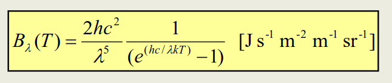

In units energy per unit time per unit wavelength per unit solid angle.

#### Wien's Law

The wavelength that gives the maximum energy flux. Also known as λpeak.


The formula for the peak is pretty simple

```
λpeak = .29/T in cm/K
```

#### Stefan's Law

Total power output integrated over all wavelengths.

The flux (energy radiated per unit time)

```
f = σT^4 where = 5.67e-8 W/m^2/K^4
```

#### Blackbody Curve Peak for Human

Using Wien's law and the average temperature of a human, we can calculate the peak to be 0.29/310 = 9.55 μm

#### Radiation Absorbed from Sun

Luminosity is a measure of energy emitted per second. It is emitted in all directions pointing out from a body, at a radius `a`, encompassed in a sphere of surface area 4πr<sup>2</sup>.

The luminosity of the Sun is 3.86 x 10<sup>26</sup> W.

#### Solar Constant

The solar constant So is the radiation absorbed from the Sun at a body that is _a_ metres away from the Sun.

```
So = Lsun/4πr^2 = 1362 W/m^2 
```

If we look at the direct sunlight hitting the Earth, we can treat the earth as a disk. The sunlight directly hits an area of πr^2, yeilding the energy incoming to be:

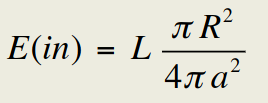

But a fraction of this is actually absorbed due to cloud cover and such atmospheric conditions so the energy absorbed is:

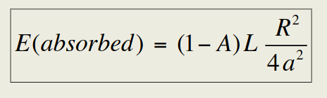

The energy absorbed warms the surface of our planet to T<sub>s</sub>. The surface in turn radiates the heat in all directions.

The energy radiated per unit area is given by Stefan's law (σT^4)

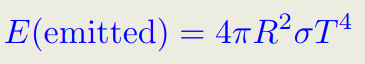

The reason it is 4pi is because we assume that the planet rotates and this creates a uniformly distibuted temperature.

In equilibrium:


## Day 19 - Feb 24, 2020

#### Characterisitics of Terrestrial Planets

Venus has a big atmosphere and shows higher temperatures since it is closer to the Sun. Mercury and Mars barely have an atmosphere and so their temperature calculated without atmosphere considerations is very close to the observed one.

#### Mechanisms for Heating
- solar radiation
- radioactivity
- tidal heating
- gravitational infall (prevalent during formation)

In equilibrium you balance the heating and cooling

#### Mechanisms for Cooling

This is primarily done through radiation from the surface since the Earth loses its heat.

#### Cooling Time

Under the assumption that there are no sources of heat introduced to the planet, it will eventually cool off and reach a **geological death**.

The total heat energy is proportional to the mass and as we know, mass is relational to volume. And since heat is radiated through the surface, we can say it is proportional to the surface area of a body. Given the relation to volume and surface area, we can see that cooling time is proportional to R<sup>3</sup>/R<sup>2</sup> which is just R.

#### Radioactive Decay Heating
- apart from rocky material there are also other elements - Potassium and stuff
- radioactive elements have a half life
- after that time, that source of heat is gone and the planet becomes inactive
- since radioactive heating is resposnbile for molten interior and drives plate tectonics
- mars has the biggest nonactive volcano of our solar system, it used to be active but since mars is small the volcano died out
- radio active heating is proportional to volume
- mars became inactive in 3 billion years
- 3 bill proportional to volume
- volume is 3/4pi r ^3

### Chapter 4 - Heating and Cooling Processes B

#### The Greenhouse Effect

> The greenhouse effect is a naturally occuring process that makes the surface of the Earth warmer. Once it reaches our atmosphere, some of the Sun's energy is reflected back and rest is absorbed and re-radiated by greenhouse gases. These gases trap the Sun's heat, making the Earth much warmer.

A planet with no atmosphere has a temperature 


Solar flux is the energy radiated in a given area, it is measured in W/m<sup>2</sup> and denoted with S<sub>0</sub>. The sunlight absorbed at the surface of the Earth can then be calculated, treating the Earth has a flat disk with radius R. Finally, we can calculate the energy absorbed per unit area since the energy is distributed across the earth's entire area.


#### Simple Model of Planet with Single Layer of Atmosphere


There are two sources of radiation on the Earth's surface.
- heating
- blackbody radiation from cooling

To solve for temperature at surface Ts, we have the following equations.

1. In equilibrium, we set total heating rate = total cooling rate.


2. Balance of energy for atmosphere


Finally, 


At equilbrium, given the equations above, the temperature of the Earth's surface is 1.19 or 2<sup>1/4</sup> times higher than no atmosphere.


## Day 20 - Feb 26, 2020

### Midterm Details

The midterm will be on Monday March 2, 2020 during class time at UH 213. It will cover everything to the end of Chapter 4B Heating and Cooling. To study, review lecture notes, slides and Tophat questions. There will not be a formula sheet provided but we will have constants available. The midterm will have around 4 or 5 questions.

#### Surface Temperature vs Atmosphereic Temperature

Previously we found that the Earth's surface temperature is around 1.19 times warmer than the temperature of the atmosphere. We can show this mathematically.


The incoming energy is equal to the outgoing energy. Specifically, `the incoming optical energy = reflected optical + infrared radiation`


#### Adding More Layers

If we add one more layer to our simple model, we get a temperature at layer 2 and one at layer 1. At the surface, we have:


and at layer 1:


and at layer 2:


If we isolate Ts in these equations, we get:


If we generalize to n layers, we get Ts = 


#### Temperature of Mars

If we calculate the temperature at Mars surface assuming 0 layers of atmosphere, we get Ts = -58 C. The actual mean is near -63 C, which means Mars almost has no atmosphere.

#### Venus's Atmosphere
- very heavy cloud deck
- 70% of radiation is scattered out
- more than twice the albedo of earth
- flux is almost the same as Earths (So = 2614) since the distance is similar

Given a solar flux of 2614 W/m^2 and albedo of 0.67

```
n = 0   -  Ts = 248 K
n = 1   -  Ts = 295 K
 ...          ...
n = 78  - Ts = 737 K (near actual mean)
```

Venus has almost 80 layers of gas so there is a big greenhouse effect. Its atmosphere is 94x more massive than Earth's

#### Peak of Earth's Radiation

The radiation at Eath's surface is highest when it is in the infrared section, being transmitted up


## Day 21 - Feb 27, 2020

#### Assignment 2 Answers


### Heating and Cooling cont'd

#### Difference Between Earth and Venus Atmosphere

H2O and CO2 are greenhouse gases. On Earth, they come in the form of oceans and rocks. If you increase the temperature by a little, the water evaporates into atmosphere and exposes more rock, which releases CO2. The temperature goes up as more water and carbon diozide are released. This process has run to completion on Venus and is called the **runaway greenhouse effect**.

Earth is slightly different because it's far enough from the Sun that the atmosphere, ocean and rock interior is connected by the **carbon-silicate cycle**, keeping us at equilibrium.

_However_, too much CO2 in the atmosphere will break the equilibrium and the Earth will also have a runaway greenhouse effect.


### Radioactive Heating

When rocks decay, they release energy. The amount depends on some factors.
1. amount of the isotope
2. half-life of the isotope

When the Earth is forming, the short-lived isotopes are important, like Aluminum.

4 important isotopes **today**
1. <sup>235</sup>uranium - 0.7 billion years
2. <sup>40</sup>potassium - 1.28 billy
3. <sup>238</sup>uranium - 4.47 billy
4. <sup>232</sup>thalium 14 billy

#### Tidal Heating

This is important for the satelites of Jupiter and Saturn.

When there is a tidal pull on a satellite, it gets 'squeezed' and 'flexed' by the planet. If it's in an elliptical orbit. Io has a similar size and distance to our Moon. Its orbital period is small and it is highly volcanic due to steady input of heat from Jupiter's gravitational field.

Europa is a similar size but has an icy surface with suspected ocean underneath.

#### Gravitational Infall

Meteors and sometimes comets/asteroids collide with planets from time to time, which creates kintetic energy but large collisions don't happen anymore (sadface)

Back in the day (4-4.5 billion years ago) there were a bunch of collisions that turned planets/moons into what they are today.

The total gravitational potential energy of a final spherical planet is:


where M is the mass of the spherical body and R is its radius. And G is the gravitational constant

The rest of the energy is dissipated as heat. Heat capacity, C, is the energy required to heat a unit of mass by a temperature change.

_For example, it takes 4.2 J/g to heat water by 1 degree K_

If all of the potential energy from a spehre is converted to heat, then it would result in the following formula:


In reality, not all of the gravitational potential energy is converted to heat and stored. **Half** of it goes into **pressure** and the rest is radiated away from surface.

#### Virial Theorem

Internal Kinetic Energy = (1/2) Gravitational Potential Energy

Basically you half the equation above so instead of 3/5 it is 3/10

#### Last Notes on the chapter

Bodies with greater mass have a greater internal temperature and take longer to cool!

## Day (21.5) Mar 2, 2020
- midterm

## Day 22 Mar 4, 2020

### Chapter 5 Planetary Atmospheres
(went up to slide 13)

Planet | Mars | Venus | Earth
-------|------|-------|-------
atmosphere | very thin, CO2, some N2, Ar, wind | very thick, CO2, some N2, sulfuric acid | mostly N2, O2, some H2O, water clouds

Molecular substances that are volttaile (low vaporization temp) such as H2O, CO2, CH4, NH3 are common. For the formation of planets, the surface temperature must be around 150K if the planet is 4-5AU away. This allows gases to turn solid/liquid.

### Pressure and Density Structure

In this section we will discuss how pressure and density vary with atmospheric temperature. We assume **hydrostatic equilibrium** - the gravity at each layer of the atmosphere is balanced by the pressure gradient force. Pressure depends on the gas and its chemical composition - at low pressures we can use the **ideal gas law**. 

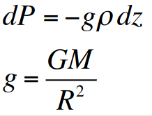


Putting the above two together, we can come up with the Barotropic law that uses Scale height to quantize pressure at different layers of the atmosphere.


and scale height is:

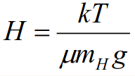

From lecture:

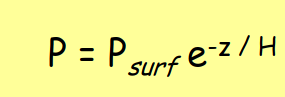

#### Some Values for Reference

. | Venus | Earth | Mars | Titan
---|------|-------|------|-------
T<sub>eq</sub> | 232 | 255 | 209 | 84
T<sub>surf</sub> | 735 | 288 | 215 | 94
P<sub>surf</sub> bars | 92 | 1.1013 | 0.006 | 1.467
//rho<sub>surf</sub> kg/m^3 | 65 | 1.2 | 0.017 | 5.4
H (km) | 15.7 | 8.3 | 11 | 20.6
M<sub>atm</sub> | 5.3e20 | 4.8e19 | 2.6e16 | 9.2e15  

#### Physical Structure
- as we go up in altitude, the pressure decreases - that's why we get lightheaded on a big mountain :smirk:
- density also goes down, since there are less molecules

It's valuable to know some of the molecular weights of popular molecules as well as their ratios for the terrestrial planets.

- Earth - 78% N2, 22% O2
- Venus - 96.5% CO2, 3.5%N2
- Mars - 95.3% CO2, 2.7% N2, 1.6% Ar
- Titan - 98.4% N2, 1.6% CH4

## Day 23 Mar 5, 2020
(went up to slide 19?)

### Thermal Structure Temperature Profile of Earth

Heating on Earth comes from the ground and from solar flux. Convection from troposphere, conduction from upper part of atmosphere and radiation from the middle layers. Earth's lower atmosphere is opaque in the infrared spectrum.

**Troposphere** is where temperature decreases with altitude. A good chunk of the heat moes around here. **Convection** occurs in this layer - circulation of air cells transports heat and forms clouds. This convection stops at the top of the troposphere, where we see clouds (condension endpoint).

**Stratosphere** is where temperature starts to increase with height. The presense of ozone in this layer absorbs UV. There is an equilibrium here in which there are gamma particles and O2 which collide and separate the O:O bond. If the wavelength is less than 240nm (UV spectrum) then a lone oxygen will bond with an O2. The cycle continues since the gamma particles also collides with O3.

Ozone basically absorbs energy and heats atmosphere and is found around 50 km into atmosphere

The wavelengths seen here are between 200 and 310 nm, which is what allows gamma particles to do their thing. Ozone can be depleted by pollution - this is why we had the Montreal Protocol in 1989.

**Mesosphere** is where temperature decreases with altitude due to CO2 cooling. There is no UV absorption since there is no ozone.

**Thermosphere** is where temperature increases with altitude due to O2 absorbing UV from the Sun and lack of atoms letting the heat from the Sun in. During the day, T=1200K and 800K at night. There is O and NO in this layer but they don't have a lot of emmision/absorption bands.

#### Convection
As we mentioned before, this happens in the troposphere. There is a **temperature gradient** in which air gets cooler as we go upward. Warm air begins to rise and since the pressure decreases, the air begins to expand. If this air becomes cool enough, it goes back down. Or it can continue to rise. The change in temperature can be related to pressure through the following relation.

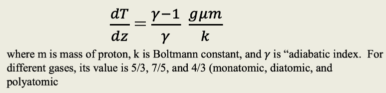

Convection is dependent on something called the **lapse rate**, wich is the change in temperature with altitude.  A value of 9 K/km is for dry air on Earth's surface. For vapour, there is a wet adiabatic lapse rate.

## Day 24 Mar 9, 2020
- went over midterm answers

## Day 25 Mar 11, 2020

### Comparative Atmospheres

#### Mars
- thin atmosphere
- clear CO2 air
- 3 K/km lapse rate
    - if it were greater than 5, convection would start (this is the **adiabatic lapse rate**)
- not enough oxygen to form ozone layer
- lots of dust storms
- in 1 mars year, a third of the CO2 freezes then **sublimes** (solid to gas)
    - possible due to low pressure

#### Venus
- toxic atmosphere
- thick CO2 air
- lapse rate and adiabatic lapse rate of 8 K/km
    - able to perform convection
- ALL troposphere

#### Exploration of Venus
This is hard to accomplish since the clouds are opauqe and it has no moons. So we use landing probes to find out more. But since the surface temperature is 740K and surface pressure is 92 atm, the probes either melt or get crushed.

The Venera 13 and 14 were able to get images of the surface and observed rocky terrain and a dim reddish light since only 2.5% of the sunlight at Venus actually reaches the surface. The temperature across is pretty uniform due to slow circulation.

#### Titan
- largest moon of Saturn
- nitrogen filled atmosphere and liquid on surface - like Earth
- Cassini spacecraft dropped the Huygen probe, which landed into atmosphere

#### Atmospheric Profile
- N2 rich
- little greenhouse effect
- cold surface temp(since it's 9.2 AU)
- lots of hydrocarbons

#### Tophat Question 5.5
If one moves 3 scale height up a planet, by what factor does the pressure change? The equation for P is given below by the barotropic law.


and scale height is:


Using this relation replace the numerator of equation 1 with -3H. We get e^(-3) as the factor it changes by.

### Meteorology
Hot air rises up and cool air sinks. This creates an equator to pole motion called Hadley's cell. Due to Venus' slow rotation, this circulation does not occur.


The concept of Hadley's cell does not explain Earth's chaotic temperature because of a phenomenon called **Corolis force**.

### Coriolis Forces

Fictitious forces that explain the chaotic weather we see on Earth (such as hurricanes). Acceleration caused by a rotating body's reference frame. The faster the Earth rotates, the more acceleration is applied to projectile deflected on Earth. 

If v is the velocity of of the projectile and ω is the angular speed of the planet's rotation.

THe acceleration caused by Coriolis force takes the form = a<sub>Cor</sub> = -2v x ω

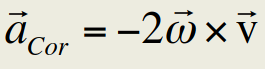

The crossproduct creates a circular motion, creating things like hurricanes. The radius of the circular motion (vortex) depends on how fast particles are moving. Air cells moving from the pole to equator end up **circulating**.

Venus does not have a big Coriolis force because it rotates at 0.06 degrees/hr whereas Earth rotates at 360deg/24hr = 15 degrees/hr

The Coriolis effect on Earth divides each hemisphere into 3 cells.

1. hadley cell with air ascending/descending at equator at 30 deg latitude
2. ferrel cell with air descending 30 deg and ascending at 60 deg latitude
3. polar cell with air ascending at 60 deg latitude and descending at pole

## Day 26 - Mar 12, 2020
- watched a video on Huygen's descent to Titan

### Atmospheric Escape
Atmospheres on planets leak away into space over time. Moleculaes that have a high enough escape velocity will be yeeted into space :basketball:

**Escape Velocity** - 

From the equation modelling the motion of a molecule E = 1/2mv^2 - GMm/R = 0


where R is the distance from the center of a planet with mass M.

For reference, Earth's escape velcity at its surface is 11.2km/s.

We shoot our spacecrafts in the east direction and nearest to equator because the Earth is rotating the fastest there. So the escape velocity gets some help.

**Temperature**

Given a gas at some temperature, the average random motion of that particle is (3/2)kT.

Boltzmann re-introduced the idea of atoms in science. The idea was originally from the Greek. He proposed that we had individual atoms with range of velocities.

We can model the distribution of speeds of particles using the Maxwell-Boltzmann distribution. 

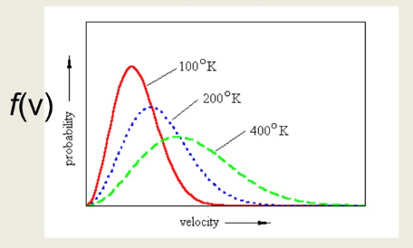


If we assume the average particle is at its escape velocity, we would equate 3/2kT = 0.5mv_avg^2. This would give us the following relation:


We can easily forgo the k constant and having to convert our molecule mass by simple doing //sqrt(3RT/m) where m is in kg/mol and R is the gas constant, 8.314.

#### Examples for Earth
- escape speed of Earth is 11.2 km/s
- using the surface temperature of 290K we can find the average escape velocity of particles such as CO2, H2
- we get 0.4km/s for CO2 and 1.9km/s for H2

This suggests that Earth can hold both the particles, though they sometimes escape. How is this possible?

This is because the bulk of particles are trapped but some are at escape speed, since we calculated the average. The ones at escape speed will (over time) leak away.

#### Jeans Escape Process

At the very top, we have the **exosphere**, which allows for particles to escape without collisions. The lower boundary of this layer is called the **exobase**. There's a place in the atmosphere where we have a thin layer of atmosphere, where the mean free path is equal to one scale height, At the exosphere it is unlikely that particles will collide, so thermodynamic equilibrium will be harder to maintain since particles collide and share their energy at the exobase.

**Mean free path** is avergae distance a particle can go without colliding with something else. 

In an engineering perspective, if you are within the exobase you need to worry about air drag and make things aerodynamic. At the exosphere, however, things can look like whatever.

#### Mean Free Path

Effective collision area is A = πd^2 where d is the diameter of the particle

Over time, the particle traverses a certain distance within its collision area, which is a cylindrical path.

In a time t, the volume sweeped out is V = πd^2vt.

In this volume there are nV other molecules so taking the average distance we get:


After plugging in values, this is 0.14e-6m or 42 x spacing

## Day 27 - Mar 16, 2020 
- first online lecture

### Escape Speed contd
The temperature at the **surface** is around **25 degrees** and as we go higher into the **troposphere**, the temperature drops. It gets a little higher in the **stratosphere** due to heating from the ozone layer. Then in the **mesosphere** the temperature **drops by a lot** as we lose our ozone. Then the temperature  just gets **super high** in the **thermosphere**. This high temperature at the exobase is what we are looking to plug into our escape formula (1000-1500K for Earth)

The criterion for escape is compared to be 5 times average speed. Average speed is given by the following:


where m = μm<sub>H</sub>

We can rewrite the relation of escape velcity as: 

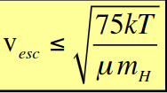

and compare with the proper formula,


Generally, Helium and Hydrogen are able to escpae from Earth, Mars, even Titan while H2O and CO2 stay trapped. Neptune traps pretty much all of them.

UV breaks up H2O so the escape increases even more since they will be H2 and O. 

The dry riverbeds on Mars suggests that early Mars probably had water and was much warmer. Now, the atmosphere is very low density - not warm enough to have liquid water.

Water has 3 phases - solid, liquid, vapor and a unique spot called a triple point, in which we can have all 3 phases. There were probably higher pressures for this to happen (much denser atmosphere).

#### Proving Method 1 - Nitrogen
We can check our prediction by proving the escape of molecules like water. We can look at Nitrogen isotopes. It's harder for heavier molecules to escape. We can calculate the ratio of Nitrogen 14 and 15's escape speed to prove this, which is 1.04.

```
v14/v15 = //sqrt(3kT/14)///sqrt(3kT/15)
        = //sqrt(15/14)
        = 1.04 
```

We have found evidence that there is more N15 than N14 on Mars, indicating that it loses the N14 more easily. Which means Mars used to have more pressure?

#### Proving Method 2 - C-N
- asssume C and N ratio started out same as Earths

#### Proving Method 3 - Heavy Water
- deuterium vs hydrogen measurement

All the measurement methods tell us that Mars used to have a heaver atmosphere and warmer temperature. 

#### Tophat Question
Mars today has a temperature of 209K with no atmosphere. For it to be warm like ours - 288K, how many layers would its atmosphere need?

```
Ta = Ts*(n + 1)^(1/4)
288 = 209(n+1)^(1/4)
n = 2.6
n = 3
```

### The Giant Planets: Jupiter, Saturn, Uranus, Neptune
- the higher cloud layers show us surface features like the spots on jupiter
- one residual ring around uranus

#### Atmospheres of the Giants
- Uranus has a bit of temperature inversion due to the molecules on it
- Neptune, Saturn, Jupiter have a typical atmosphere
- Jupiter has zones (lighter regions with warm material rising) and belts (dark areas with cool material sinking)
- east-west motions on jupiter caused by stronger coriolis force with belts and zones going opposite ways
- Uranus and Neptune have a blue color mecause of methane

### Summary of Chapter 5 Atmospheres
1. how high is the sky?
2. tmperatures
3. circulation and hadley cells
4. atmosphere particle escape
5. primary and secondary atmospheres
6. giant planets atmospheres

## Day 28 - Mar 18, 2020

### Chapter 6A Interior of Earth

#### Plate Techtonics

This theory of plate techtonics was proposed in 1915 by Alfred Wegener but was not accepted until 1960. Today, we are well aware of plate techtonics and continental plates. The idea of continental drift is due to heat in earth's interior. There are 2 reasons for this.

1. leftover heat from formation
2. radioactivity caused by rocks in mantle/core

From a diagram of the plates, we can see that the pacific plate pushes on the North american plate due to **subduction** and that the Indian plate moved upwards to form the Himalayas. In the region where the plates border, there are many chances of earthquakes and collisions. This also explains the existence of many mountain ranges like the Rocky Mountains.

collisions = energy

#### Subduction
Motion of a plate moving as a denser plate overrides it. The plate being overridden dissolves between the mantle layer and the overriding plate tilts upwards 

#### Internal Structure of Earth

This structure is deduced from seismology.

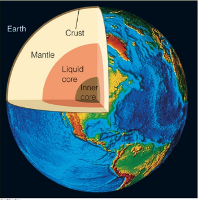

#### Composition of Earth
- **crust** composed of silicates, thin layer
- **mantle** composed of Mg, Fe, Al, Si, O (pyrolite) - main contributor to the composition
    - this material is brought up to the surface by volcanic activity
- **outer core** composed of heavy material like Fe, S
- **inner core** also composed of Fe

#### Magnetic Fields
It shields us from solar wind and indicates that we have a molten, rapidly rotating _metallic_ core -- **dynamo effect**.

#### Role of Seismology

Vibrations send sound waves through interior. There are two kinds, **pressure waves** (P-waves) and **shear waves** (S-waves).

When we are going through a liquid region, there is no propagation of shear waves (zero velocity), only propagates through solid material.

Pressure waves travel faster through solids and slower in liquid.

Pressure waves are faster in general.

#### Shadow Zone
The **shadow zone** is where no P or S waves are detected. We have recording stations all around. They can detect speeds and types of waves. The speed of wave tells us the material it moved through.

In data collected by recording stations, we see some stations record both S and P waves, some with none. If there are no shear waves but pressure waves, we know that they have been blocked by a fluid.

The earthquake epicentre is the northern tip and at the southern tip, there is no propagation of S waves. Around that area, there is a slight P-wave shadow zone as well where neither P or S waves can reach.


#### Explanation for no P or S waves
We see that once they move into the fluid, pressure pulses are deflected and refracted so much that there is no more propagation.

The mantle can be divided into 2 parts

1. upper - which is divided into 2 more parts
    - **lithosphere** - top of upper mantle
    - **asthenosphere** - plastic layer of upper mantle
2. lower mantle

The crust can be oceanic or continental.

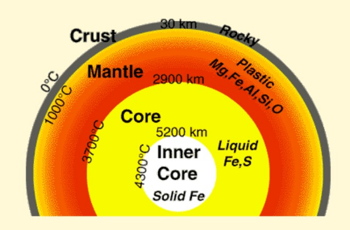

## Day 29 - Mar 19, 2020

### Interiors A Earth contd

#### Study of Seismology
So there are S waves, which don't propagate in fluid and P waves, which trfavel thropugh liquid and rock at different velocities - faster in solid material.

Since S waves are only detected on just about half the Earth's surface, we can say that an inner, molten core exists.

#### Layer of Earth
- mantle is mostly plastics, Mg, Fe, Al, Si, O


#### Tophat Question
Seismic waves from earthquake found originating from northern Alaska end up on the Southern tip of Chile. What kind of waves are they? - P waves for sure, no S waves because the liquid core gets in the way. There is a shadow zone that prevents S-waves that we saw earlier.

#### Heat Transport of Earth
Internal heat is transported first through the core by **convection**, when hot rock rises up and cools. Second, through **conduction**, after the convection process, when the heat is carried through the heat and thirdly, through **radiation** at the surface into space. 

### Chapter 6 Interiors B Terrestrial Planets

The basic relation we need to know is density, calculated as ρ = 3M/4πR^3, which gives us the average composition.

Firstly, we need mass. We can use Kepler's third law since most planets have moons which we can observe. If we know the moon's radius and orbital period, we can employ following formula and solve for M.


#### Densities of common rocky material
- carbonaceous chondrites (meterorites) have a denisty of 2.5 g/cm<sup>3</sup>
- liquid water is 1 g/cm<sup>3</sup>
    - ice is a bit lower at 0.94 g/cm<sup>3</sup>
- iron is 7.9 g/cm<sup>3</sup>

#### Simple Model knowing low mass planet properties
Generalization that low mass planets have constant density. Then the mass-radius relation would be M -> R<sup>3</sup>. This seems to work for planets a little over 2 Earth masses.

#### Tophat Question
If R is proportional to M<sup>1/2</sup>, density is proportional to R<sup>?</sup>. The exponent would be -1, work shown below.

```
R ~ M^1/2
R^2 ~ M

ρ = M/(4/3πR^3)
  ~ R^2/R^3
  ~ R^-1
```

## Day 30 - Mar 23, 2020

#### Recap of last lecture
We looked at terrestrial planets in a 2 part model

### Moment of Inertia
Moment of intertia tells us a lot about the planet. It is a measure of how malleable an object is. It is given by the following:

**I = k M R^2**

It depends a lot on the constant k, which is different for each object. 
Would just be 0.4 for a homogeneous (one density) sphere, 0.67 for a hollow shell and just 0 for a point mass. Check slide 12 for values of k.

We will be discussing the kind of exterior experiments we can perform to learn about the interor of a planet.

#### Flattening by Rotation
Venus rotates really slowly and is almost in tidal lock with the Sun.

Earth is very slighly flattened (1/300). It is flattened by a distance of 21km.

The moment of intertia can tell us about the interior mass distribution if we integrate the intertia equation with respect to r<sub>perp</sub>

There are two moments of intertia, C and A.

1. **C** - calculation measures with respect to rotation axis
2. **A** - measured perpendicular to rotation axis (centre axis to equator)

C > A unless it's an exact sphere and C - A is determined from flattening. below is the equation for the gravitational field of a satellite/planet + terms that account for deformities (latitude-wise).

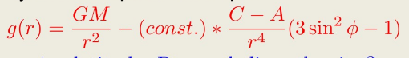

φ is latitude.

#### Tophat question
The moment of intertia when calculated from the centre of mass to the pole is less than that calculated from the centre to the equator because the first calculation is the A calculation and the second is C. Ra < Rc by 21km for Earth. 

#### Moment of Inertia Factor
A uniform sphere's inertia factor I/MR^2 = 2/5 = 0.4.

Earth's deviation is 0.3307. It can be deduced that small things are closer to perfect spheres.

**First order flattening of the earth** dependent on angular momentum - J2 = (C - A)/MR^2 = 1.08e-3

The Earth's pressure is extremely high - at the core the pressure is much higher because the density of iron is higher, since it gets compressed.

#### Some Densities and Properties

Planet | Radius (km) | Density (kg/m<sup>3</sup>) | Uncompressed | Central P (GPa) | Central T
-------|-------------|-----------------|--------------|--------------|------
Mercury | 2440 | 5427 | 5300 | ~40 | ~2000
Venus | 6052 | 5204 | 4300 | ~300 | ~5000
Earth | 6378 | 5515 | 4400 | 360 | 6000
Moon | 1738 | 3340 | 3300 | 4.5 | ~1800
Mars | 3396 | 3933 | 3740 | ~40 | ~2000

#### Calculation of Interior Pressure
Apply the equation of hydrostatic balance to the interior to find internal pressure. Assume constant density. First we have pressure with respect to radius:

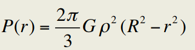

And pressure at r=0:

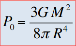

In the case of terrestrial planets we can ignore the pressure being contributed by the atmosphere but later on, when we look at exoplanets that are considered superearths, we would have to make adjustments to the radius since they have a large contributing atmosphere.

Not important: there is a way to find how compressible a metal is by using the Bulk Modulus relation, where you take the change in volume as pressure is applied.

## Day 31 - Mar 25, 2020

### Chapter 6 C Interiors of Giant Planets

#### Densities of Giants
- Jupiter - 1.33 g/cm<sup>3</sup>
- Saturn - 0.69 g/cm<sup>3</sup>
- **indicates gaseous material**

The gas composition of Jupiter is because it's mass went up to around 10 earth masses, which gave it enough gravitational force to attract gaseous material from the protoplanetary disk.

If we have a uniform density and we add more layers, we gain more mass. Because of the uniformity, our radius would increase at a proportional rate of R ~ M^(1/3) - from density formula.

However, you can't just keep adding more mass and expect radius to increase. In the case of iron, adding enough will increase the pressure and the body will actually start to be compressed. 

When we start looking at giants, the total gravity will cause the planets composition to reconfigure to something more dense. 

Gases are very compressible (ie. a soda drink) so we will see this a lot for gas giants.

If we add how compressible a gas is in the hydrostatic balance equation we will get something more accurate (we will not be learning that in this course).

A body made of pure zero-temperature hydrogen has a maximum radius, after which it compresses due to gravity - becoming denser but smaller. Therefore, we need both the radius and mass to measure density.

#### Mass vs Radius for polytropic sphere
- polytropic means that the pressure is dependent on the density
- there was a study done that shows how spheres of different gases behave at T=0 when more mass is added
- Hydrogen has the highest peak, it reaches a large radius at one point and starts to go down
- when plotted, Jupiter lies just under the Hydrogen line - indicating its composition is most likely Hydrogen with some others (Helium)
- there was also a peak for a sphere of 75% H 25% He, where Saturn lies
- Helium, C, Mg, Fe follow in decreasing order

This model shows that if you add as much mass as the Sun, the radius would go to zero. This is because the study was done at T=0, when there is no fusion or anything happening (which is what pumps heat for the Sun).

#### Sizes for reference
- earth is 1 earth mass (duh)
- Jupiter's core may be about 10 earth masses
- a brown dwarf is about 15 jupiter masses
- a typical star is called a low mass star, about 1/10th of our star
- stars produce energy through fusion, planets do not (brown dwarfs turn into stars as they currently burn deuterium)

#### Hydrogen
- at high pressures, can come in 2 forms
    1. solid metallic (low T, high P)
    2. liquid metallic (high T, high P)
- this is due to electrons being free to move and having conductive properties

After constructing a phase diagram of hydrogen wrt pressure and temperature, we can draw Jupiter's adiabat. An **adiabat** is a line of connecting solution in which we relate the pressure and temperature of a model.

## Day 32 - Mar 26, 2020

### Interior of Giant Planets contd


There is a lot of high pressure in the larger planets, with more chances of having metallic hydrogen.

#### How to map the interior of a planet using satellites
The Juno orbital satellite gathered data on the interior of the planet.

With this data, we can model the gravity of the spacecraft as a function of Jupiter's gravitational potential. 

```
U(r, θ, φ) = -GM/r { 1 + distortion sums }
```

The first order effect is due to the planet being a sphere (GM/r term) and we account for deviations from the planet by adding other terms such as θ. They are angular dependent cosine polynomials. There are also latitude and longitude dependent terms. The simplest case of this equation is when l=2 (l being the number of nodes). This would indicate an 'oblate' planet. We are not expected to memorize/apply this equation.

#### Satellites monitoring Earth
These are used to map gravitational anomalies on Earth. A lot more deviation around poles. The equation from the previous chapter can be applied here with l=2.

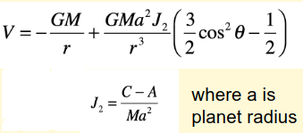

If we used l=6 then we woiuld have a J6 term and a more sphere-fitting model.

The crust in North America, mostly Canada has been depressed from the weight of the ice meltiing fro massive glaciers.

#### Juno Mission
The Juno's orbot goes from pole to pole, making it easier to observe lateral anomalies. The Juno measured J4 and J6 values and were comapred to the theoretical model. The Juno made a lot of measurements on gravity, atmosphere, wind etc. Using this data we are able to confirm that Jupiter has a core that is a minimum of 6 Earth masses. This backs the theory that a rocky interior core is needed to attract gasses that make up a Jovian planet.

We can also come up with a relation between pressure and temperature using the Juno's results.

#### Internal Heating of Planets
- earth basically emits what is absorbs (same ratio) - emission is mostly from radioisotope decay
- Jupiter and Saturn both emit more than twice as much as they absorb
    - Jupiter because of its ongoing contraction
    - Saturn isn't massive enough to be contracting, it just has helium rain
- Uranus does not emit as much
- Neptune emits almost 3 times as much as it absorbs

These values tell us a lot about the interiors of these planets

#### Tophat question
Why is Uranus different from giant planets in how much energy it releases. - due to its chemical composition or something that prevents convection from flowing from the center of Uranus (heat trapped in the core)

#### Helium
To explain why helium rain is making Saturn emit all this energy, we have to go back to the formation of our solar system. It is safe to assume that when our solar system was forming, there was an equal ratio of Helium - that means that Jupiter and Saturn both had Helium relative to the Sun.

Saturn is colder at all pressures, because it's further from the Sun but because of it's chemical composition. Helium at cooler temperatures with Hydrogen is like water and oil. So it separates as little droplets - thus the ongoing helium rain. This process is called **differentiation** - when a material condenses and rains out. In the earth's core this happened with iron.

So in reality, Saturn's excess emission is due to gravitation infall due to helium depletion. The droplets go into the mass, causing more gravitational potential.

## Day 33 - Mar 30, 2020

### Chapter 7A Exoplanet Detection Methods

#### Radial Velocity Method
This method works by observing a star (source of light) and monitoring the changes in the spectrum. This change in frequency of the wave causes a Doppler effect, allowing us to calculate radial velocity.

#### The Transit Method
Change in luminosity due to a body crossing a star. All wavelengths of the optical spectrum are blocked due to this body crossing a star.

We can also deduce the spectrum of the planet with this technique. We observe one setting where the planet and star spectrum is noted and a while later, when the planet goes behind the star. This lets us isolate the planet's spectrum by subtracting the second observation from the first. This is due to the planet's emission. Similarly, when we observe a planet + star duo transit, the planet might transmit radiation so we would subtract the first observation from the second (I think).


#### Direct Imaging
Direct imagees, only really works for really bright 'young' Jupiters. You can cancel out the light of its star and if we're lucky, be left with little dots around the image that indicate planets. You just take the spectrum of the individual planets

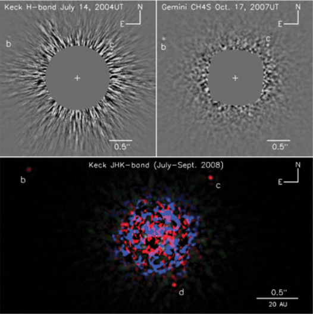

#### Gravitational Microlensing
- relatively new technology
- based on Einstein's theory of relativity
- the idea that gravitational fields bend light travelling through, thereby letting us see more light coming from a distant star

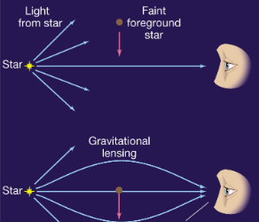

We can extend this theory, what if the faint star that causes light to bend has a planet orbiting it? 
Then the planet orbiting the faint star has a microlensing effect of its own and will amplify the light coming from the distant star for the observer, Earth.

From the amplification of light, we can estimate the mass of the planet.

We won't be asked to calculate anything from this but we should be able to explain nd argue how the method works

#### History of Detections
- started out in 1995
- since then, radial velocity was the predominant method until the Kepler observatory in 2009
- then there were a lot more transit observation, with over 800 made using transit method in 2014

#### Radial Velocities - the Doppler Shift
- change in motion around common centre of mass
- v<sub>observed</sub> = vsin(i)

If we look at a model with a star M and a planet m, we can derive a relation between the two based on their centre of mass.

`Ma1 = ma2`

We directly measure the orbital speed of the star and that period of the orbit (same between star and planet)

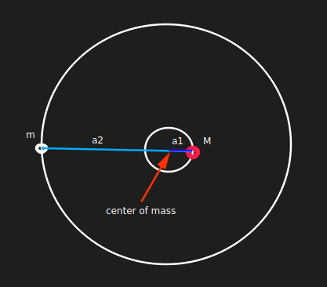

We can use this relation to calculate the velocity of the star (which by the way is the only thing we can observe). We use the basic equation F = ma. The left hand side if the gravitational force acting between the star and the planet and the right hand side is from the acceleration due to the star.

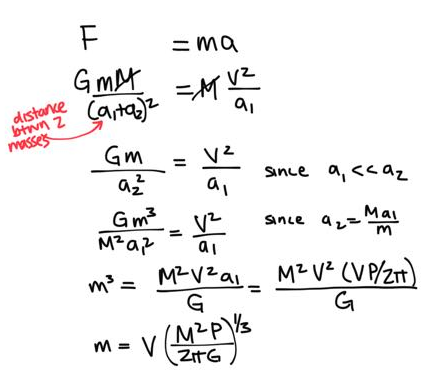

This is without eccentricity.

Using the above derivation, we can isolate V to get the following:

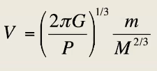

A lot of the times the observed velocity is denoted by K. A lot of the times we are given observations in which the mass of the  star is given in solar masses and the planet is given in Jupiter masses. To make life easier, here is a useful way of calculating V (or K):

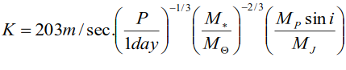

#### Method Biases
- RV method is really good for big planets close to their star
- there is a limit for how many m/s we can measure with a telescope (right now it's 1 m/s)
- we can only see 'edge-on' orbits (when angle of inclination is around 90 degrees)

#### Detecting Multiple Planets
- we can use the same methods but instead of one sinusoid we would get a combination in which you have one overarching sinusoid that has individual dips
- this needs lots of datapoints

## Day 34 Apr 1, 2020

In this lecture we will be discussing the transit method. 

### Finding Exoplanets through the Transit Method

There is a fractional change of luminosity due to bodies crossing each other. The mathematical correlation is given below.


The length of the transit relies mainly on the radius of the star: 2Rstar/2πa = ΔtP

We can apply this strategy to Venus. The radius of Venus is 6051km and the Sun's is 695500km. This gives a fraction of 0.000076 decrease.

When a body crosses the Sun, we see a dark spot on the Sun, thereby decreasing luminosity. 

#### How these measurements are made

The Kepler spacecraft mission has made some successful measurements. A satellite stares at a field of stars continuously for over 4 years. It monitors the detectable light. Solar array is a mechanism that keeps the satellite going. Thuryst module lets it get into orbiot. High gain antenna to transmit information back to earth. It was launched around 2009. Its search space was around 3000 light years away from us.


The spacecraft's strategy is to look for sun-like stars and earth-like planets so it could be monitored on a periodic/yearly basis - so the planet candidates were dismissed if their period was more than 4/3 year since we need 3 transits oberserved to make any actual measurements.

#### Tophat question
An astronomer finds that the largest planet in our solar system is transitting the sun. Find the fractional decrease in the Sun's luminosity.

```
sun r = 695500
jupiter = 69911 km
the decrease in luminosity = (Rj/Rs)^2
= 0.0101
```
#### Some Constraints on Measurements
Detection bias includes:
- big planets
- planets with a shorter period
- angle of inclination is 90 degress (requirement)

### Combining Results

We can use transit data and radial velocity data together. If we know the period P and mass M p of the star, and predict the eccentricity, we can obtain the mass of the planet. In the case of transits, the angle of inclination is 90 degrees so V<sub>obs</sub> = Vsin(i). The mathematical relation is shown below:

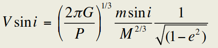

From transit data, we can find the planet's radius and by putting it all together, we can calculate the planet's density.

#### TopHat Question
We find the Sun's period to be 11.9 years. We know it's mass, as well.

There is a convenient formula to solve this. 

```
V = (2πG/P)^(1/3) * msin(i)/M^(2/3) * 1/sqrt(1-e^2)
  = 203 * (P in days)^(-1/3) * (# solar masses)^(-2/3) * (# Jupiter masses)sini
  = 203 * (11.9 * 365)^(-1/3) * 1^(-2/3) * 1
  = 12.44 m/s
```

## Day 35 Apr 2, 2020

#### Feedback for Assignment 3

#### Question 7 - Titan's atmosphere
- for earth, optical radiation heats our surface
- infrared on the other hand, is absorbed by the higher levels of the atmospher
- UV is captured by ozone and increases temperature of stratosphere, which is above troposphere
- troposphere is heated by convection not conduction

### Chapter 7B Exoplanetary Populations

### Mass vs Semi-major axis diagram

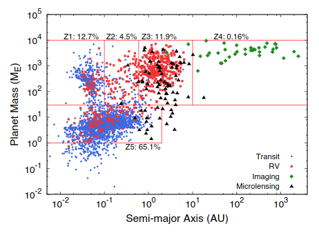

The data suggests that SuperEarths, exoplanets with a mass of 1-10 times the mass of Earth, are most common. Hot Jupiters are those which have an orbit similar to Mercury's and Warm Jupiter's orbit is 1AU. 

There also exists an exoplanet (Keplet 16B) that is orbiting 2 stars (binary-star system). Both stars are smaller than our Sun and the period is 0.63 years. Also called a circumbinary planet.

### Orbital Eccentricity

The two things we need to know about a planet's orbit are its **semi-major axis** and **eccentricity**. Giant orbit planets are more eccentric in their orbits.

#### Tophat Point and Click Question
- find Jupiter on M-a diagram
- Jupiter mass = 318xM<sub>E</sub>
- Jupiter semi-major axis = 5 AU

### Exoplanetary Systems
- earlier we learned about orbital resonance in our solar system, especially in the asteriod belt which causes the Kirkwood gaps
- there are a number of planetary systems at a 2:1 resonance
- data indicates that there are jumps corresponding to resonance
- we have seen that there are Jupiter-like exoplanets at around Mercury's orbit, which is impossible due to how hot it would be

Looking back at the mass vs semi-major axis diagram, we can say that giant planets formed further away but migrated closer to their orbiting star. This process was very strong while the planets were still forming because they likely got angular momentum through exchange with their gaseous disk. The gas moves outward as the planet moved inward.

The exchange of gas is usualyl so good that the eccentricity of the planet is not affected. Planets will keep moving around until they are in resonance with each other but usually, their orbit stays pretty circular.

To explain why the eccentricities are so high, we have to consider the idea that the gas froom the system is completely driven out in 3-10 million years. Now, planets start perturbing one another, thereby going to more eccentric orbits (or getting kicked out). This is especially for giant planets.

Takeaway: high eccentricity = lots of perturbation

#### Formation Model Summary
1. Planets move in disks - we know this
2. Gas circularizes/circulates in the planet
3. The planet has resonance due to gas
4. Gas goes away
5. No more damping process from gas so planets interact a lot gravitationally
6. Planet systems reorganize (move to larger radii or get booted) and we're left with planets with a high eccentricity orbit

#### Theoretical Work on Seperation of Planet Pairs in Unstable Simulation
High mass planets with adjacent period ratios follow Kepler observations quite closely. Going back to when we learned about Hill radii, the separation between planets eventually settles down to reflect a mutual Hill radius.

#### System Architecture
We have observed that 42% of sun-like stars have almost fully co-planar systems with 7 or more planets. So our solar system is quite typical. The most densly packed system is Kepler 11 with 6 planets around 2-13 times the mass of Earth and orbits less than that of Venus. Almost a third of these solar systems are densly packed and their existence can be explained by their near-resonant behaviour.

#### Going back to our own solar system
After the gas is gone, there are still things floating around in space - small objects to Mars sized objects. These objects help form the terrestrial planets, which continue to form 100 million years after the gas is gone and the massive planets are done forming. 

#### Nice model
Ratio of Jupiter, Saturn, Uranus, Neptune is 9:6:4:3 before instability. After interacting with small bodies in the solar system, Jupiter moves around a bit, Saturn a little bit while Neptune and Uranus move very far away. Look at below diagram to see what happens to these planets. The Nice model has its own predictions on where the 4 planets were before instability

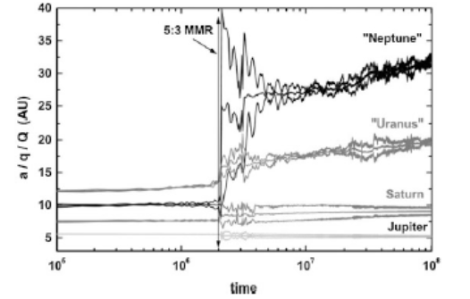

### Completeness
There is a slight observation bias in the models we discussed due to the radial velocity imaging method
- RV method cannot detect a lot if an exoplanet is small and further away
- RV method cannot detect a lot if the planet is very small and has a period larger than 50 days 

Graph below shows the completeness scale associated with measurements - how likely planets in a region are to be detected. Yellow dot is Earth.

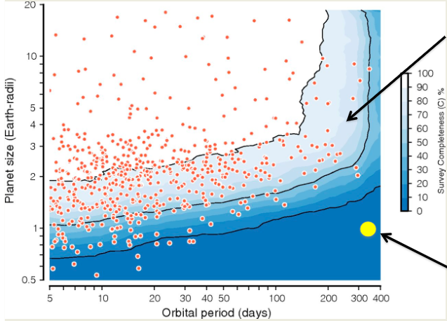

#### Assignment 4 Help Session

##### Question 1
- find minimum mass needed of a planet so that moledular hydrogen is found right down to its very centre. any higher and it would turn to metallic
- need to get rid of radius in solution (clue in part b)

##### Question 2
- explore eccentricity on exoplanets.org
- to find out if a planets orbital radii is within another planet, check which orbits are in apehlion you calculated

##### Question 3
- assume a circular orbit
- for part b, use formula developed in slides
    - given mass of both things, velocity, solve for a1 and then a2

##### Question 4
- look for similar size planet and cite it
- for reference: an m type is a dwarf star that is 10th to 2/10ths of typical star
- look at graph of mass vs semi-major axis discussed earlier
- poke around for data on exoplanet site to find what the radius for such a planet might be

##### Question 5
- assume the period of both bodies is identical (only way to do this problem)
    - not possible in our solar system
- no atmosphere = no greenhouse effect so choose small albedo

## Day 36 - Apr 6, 2020

#### How many earth like planets are out there
Based on existing data, we can extrapolate the trendline to say that there are many earth like planets out there. Data suggests that 6% of sun-like stars might have an earth-like planet.

### Exoplanetary Atmospheres
- 3 types 
    1. cyan line is an irradiated planet
    2. red line is highly irradiated
    3. gray is poorly irradiated

#### Water and Methane Abundance
Methane molecules on the curve show that as the planet mass increases, the amount of methane decreases.

Many of these observations are made by transmission. However, these measurements, from the Hubble spacecraft, have big error bars.

#### Tophat Question
What is a transmission spectrum? - The spectrum of a planetary spectrum when star light passes through it

### Mass-Radius Relations for Planets Observed in Transit
There is a lot of data that suggests rocky super-earths behave much differently than Jupiter-like models. This comes from infrarerd (by Spitzer) and optical (by Hubble) observations.

Planets up to 2 Earth masses have a rocky composition and their radius is approximately M^(1/3).

### Habitable Planets
Plotting the planet's mass and stellar flux can tell us more than the semi-major axis. This is the condition for water to remain liquid. There aren't a lot of planets residing in that zone.

#### Tophat Question
- Solar flux of Venus / solar flux of Earth = 1/0.723^2 = 1.91

That is why Venus is not habitable, it's too hot.

There is a third slideset that we can look at but it will not be testable.

Important point on formation of planets: In order to understand the m-a diagram, we must assume that planets have migrated from formation.

### Final Exam (Instructions and Review)

#### Instructions
- the exam is on Apr 8, 2020 at 10am to 12:30pm (2.5 hours long)
- it will be made available on Avenue under Contents -> Final Exam Download at 9:55am
- the format is a .docx file you can print and write on OR write numbered answers to on a blank sheet of paper (in pen!)
- the exam is open-book
- we will get 20 minutes after 12:30 to upload a pdf of our answers to Avenue under Assignments -> Exam Submission
- Use an app like CamScan to take a scan of your paper
- the exam will be 60% after-midterm content
- exam will include conceptual questions and quantitative problems
