# 2E03 Planetary Astronomy

## Day 1 - Jan 6, 2020

### Inventory of the Solar System
- sun -- terrestrial planets --- jovian planets ---- ice giants
- 1 sun
- 4 terrestrial (rocky)
    - Mercury
    - Venus
    - Mars
    - Earth
- 2 jovian (gas giants)
    - Jupiter (roman name for Zeus)
    - Saturn
    - rocky core
- 2 ice giants
    - Uranus
    - Neptune
    - resemble gases in the sun
    - methane, ammonia
- satellites (moons) and ring systems
    - our moon is actually pretty thicc :moon:
    - most planets have moons
- minor bodies
    - dwarf planets eg Pluto, Eris
    - comets (Kuiper belt) - billions of these
    - more comets (oort cloud) - trillions of these
        - creation of jupitr pushed them to the edge of our solar system
- asteroids
    - asteroid belt between terrestrial and jovian planets

#### Satellites
- Jupiter's 4 moons are what Galileo observed
- Titan is the only moon that has an atmosphere
    - 90 degrees K
    - hydrogen cyanide (super dense)

## Day 2 - Jan 8, 2020

### Small Bodies
- comets and asteroids
- inner parts of the solar system where we see asteroids are warmer since they are condensed
- different bodies have different temperatures
- icy bodies are further out in solar system
- leftovers from planet formation
- oceans of earth were prbbly formed in a drier part of the solar system where it cant be condensed into ice

### Relative to Sun
- sun derives its energy from nuclear fusion
- typical stars in our galaxy are smaller than the sun
    - stars arent' always bigger than planets ()
- 99.8% of the mas of solar syste is in the sun
- most abundent element is hydrogen, then helium, then oxygen or carbon?
- Jupiter is 318 earths big
    - the jupiter red eye thing is as big as earth


### Four lil planets
- venus is much hotter than it should be (kinda like me)
- mars
    - in the earlier ages of solar system, jup and sat may have been closer to the lil planets and kinda pushed a lot of the smaller planets
    - that's why mars grew up in really bad conditions

### Tracking planets orbit
- jupiter and mars are easy
- all the planets orbit on the same plane
- pluto's orbit is significantly out of plane
- ecliptic plane
    - contains earths orbit around the sun
    - if you draw the angular momentum vector pointing up, the ecliptic plae is perpendicular
- pluto is a body that has ben perturbed by neptune
- resonance
    - compatibility between the forcing and oscillation period that allows energy to b eeficnently transferred
- gas dust disk from which the planets formed (that's why they have similar orbital plane)

### Heliosphere
- solar wind creates heliosphere
- sun launches eruptions into solar wind
- therefore the solar system is not just empty space
- nececary for planetary atmosphere
- 
### Voyager 1 and 2
- have left the solar system

### Question 1.2
- main physical difference between stars and planets
    - stars produce energy by fusion reactions, planets don't
- stars do produce energy by gravitational contraction
    - jupiter also does this, it puts out 2x the energy it receives
- if you have a body and you shrink it by delta r, you would have to release graviatioal energy that is released as heat
- contraction => graviationl potential energy release => heat => radiates away
- the sun is 1000 Jupiter masses
- sun has 10^8 times the luminosity of jupiter
- minimum mass star you can have to produce heating reaction (hydrogen fusion - when you take 4 Hydrogen to get helium and 2 electrons with positive charge (2e+) and 2 neutrinos (2ve) + 2 gamma ray photons
- M<sub>min,H</sub> ~ 0.075Msun = 80 M<sub>J</sub>
- 2nd fuel (low mass stars)
    - deuterium (heavy water, one proton and one neutron) - D
- D + H ==> He+ + gamma
- minimum mass for deuterium fusion is around 13 M<sub>J</sub>
- so it's 80 Jupiter masses which is greater than the mass of a brown dwarf (baby star) whcih is greater than the mass of 13 jupiter masses 

```
80 Mj >= Mbd >= 13 Mj
```

### Planetary Properties
- sidenote: if you know a stars mass and chemical composition, then you can compute all the properties of the stars (how it evolves)
1. orbit (a - semi-major axis)
2. mass M
3. radius R
4. chemical composition [carbon, oxygen, nitrogen, Fe (iron)..]
5. rotation (horshoe symbol)
6. temperature T
    - largely determined by presence of star unless there is internal heat being producd (jupiter)
7. magnetic field B
8. structure of the planet
9. structure of surface
10. structure of atmosphere

#### How the Properties relate to Exoplanets
- M-a diagram
- M-R diagram
    - given the mass of a panet, we can try to predict the radius
- chemical comp is currently researched
    - useds spectroscopy
- we know a little bit about magnetic fields
- 8,9,10 are hard to measure so we don't know much about this.

## Day 3 - Jan 9, 2020
- shape and velocity of the orbit tells us a lot about planets
- orbits can be circular, eliptic but if they are hperbolic then they are unbound
- hyperbolic systems have higher energy since they are unbound
    - higher escape speed from solar system
- there are planets in interstellar space that have been kicked out of their place

### Notes on Solar System Bodies

#### Mass
- how to we measure a planet's mass?
    - we look at the moons and use kepler's third law
- to use kepler's law for a small body you jus need the mass of one body
- if there are no observable moons, we loo at perturbations
- if it doens't have a circular orbit that means there may be another pkanet perturbing it (tidal/graviational forces)
- we also have voyager missions whose flybys tell us the mass of planets they go by

#### Temperatures
- the radiation from a star (such as the sun) heats the surface of a planet
    - called irrradiation
    - this is how terrestrial planets are heated
- when the earth as formed it was super hot
- the temperature of the surface of earth is a combination of the atmosphere of earth + irradiation
- the surface of Venus temperature is 37 K and eath's is around 288 K
    - caused by CO2 greenhouse effect

#### Atmospheres

. | Composition | Pressure
-----|------|------
Venus | CO2 | 90 bars
Earth | N2 (78%), O2 (21%) | 1 bar
Mars | tenuous CO2 | like standing on peak of Mt Everest
Titan and Pluto | N2 | ??

- it's hard to send a lander to venus because it'll melt and aso be crushed
- the reason VEnus and Earth are different even though they were formed similarly and have similar mass is because there is water on earth
- water allows the calcium carbonate (limestone) on our planet to not be gassified

### Exoplanets
- the first key aspect is the semi major axis which is measured in astronomical units (earth's is 1) - i think it's a distance?
- there are 4000 known planets but still thousands of candidates
- diagram of mass vs semi-major axis has plotted all known planets
- in order to see jupiter we can look at the sun and see its reflection?
    - need to cancel out the light from the sun itself by using some specal technique that shifts the wavelength up and down so they cancel out and you can see jupiter or jupiter-like planets on the sun or stars
- second key aspect of a planet is its radius
    - transit method - block out light or sm??
    - fit he planet has a doppler effect on a star you can get the mass
    - if you take sm with the density of rock and mix it with iron it has a charactersitic density and you'd make an object of certain  size
- a number of planets lie on the 'earth-like' line
    - water worlds which are mostly ocean
- by knowing density (mass and radius) then you can predict the planet;s properties
    - we can come up with a possible structure for the planet

## Day 4 - Jan 13, 2020

### Quesion
0rock isnt compressioible, rocky planets hve a density simlar to earths
- the relationship we find is that mass is proportional to radius^3
1. density = M/V
2. V(Sphere) = 4pi/3R^3 which is R^3
- so density = M/R^3
- so radius is proportional to M^1/3

### 1.3 Planet Formation
- each dish is aout 12 metres in size
- made in part by canada
- 55 telescopes can be hooked up electronically
    - just spread them out and sync them up with phase
- this tech fist became available around 30 years ago
- this scale allos us to see maybe 20 astronomical units
- disks of gas around stars that are just forming (nebulae)


### 1.4 Life on Other Worlds
- earth 2.0
- orbiting at 1 astronomical unit in a solar system around sm like our sun
- 1 candidate - the trappist
    - solar system iwth star 84x jupiter

### Chapter 2: Gravity and Angular Momentum
- history lesson of how gravity was discovered and plantary dyanmics
- basic newtonian/keplerian dynamics
- advanced concept: energetics
- brief explanation of modern solar system
    - how satellites work

#### History
- greek history
    - Aristachus of Samos (310-230 BC) develops correct heliocentric model (minus neptune/uranus)
    - other peopl favoured ideas that put earth in the center (geocentric)
    - ptolemy (~100AD) 
- orbit
    - kepler speed Vk is sqrt(GM<sub>Q</sub>/r)
    - the problem of the heliocentric model was that it was hard to explain that mars' orbit is slower than earths (retograde motion)
    - ptolemy's model put earth in the centre and mars orbiting earth
        - but assumed mars has its ownepicycle (it's orbiting around something while orbiting around earth)
        - each planet got its own epiycle
        - also became ingrained in society and religion (christian theology)
- middle ages realized he simplest explanation is probably the most correct one

#### The First Golden Age of Astronomy
- dark ages
- italian renaissance reopened greek thinking
- copernicus (church canon?) visits italy from north poland since he was sent as a bishop
    - was sent there about 10 years
    - he picks up on heliocentric model and proves it in a life's work
    - gathered data
    - observations were kinda bad tho
- tycho brahe gives good observations on planetary motion
- galileo observes jupiters moons
- kepler is the first to device the modern solar system
- newton's laws on gravity give a good explanation
- 1500-1700
    - things going on in society
    - europe is in turmoil?
    - colombus discovered new land
    - shakespeare was also doing his art thing
    - davinci was doing his engineering and art thing

#### Copernican Revolution
- copernicus gets the order, size of planets correct but couldnt get rid of idea of epicycles
- copernicus wrote a book but didn't wanna publish it so some german scholar published it when coperniuc died

#### Tycho Brahe
- nobleman
- built an astronoimcal observatory
- good at naked eye observatory
    - accuracy - 1 arc minute
- hybrid model
- gets into a fight where his nose is cut off (replaced with gold/silver nose)
- goes to Prague
- hires Kepler as imperial mathematician

## Day 5 - Jan 15, 2020

### Tycho Brahe's Arc Minute
- a circle is 360 degrees
    - 1 degree is 60' (1 arc min)
    - 1 arcminute is 60 arc seconds
- moons diameter in the sky is about .5 to 1 degree
    - so the moon'sangular size is about 1 degree (60 arc-minutes)

### A Good Telescope
- average seeing -> 1'' (arc seconds)
- twinkling - due to turbulence in atmosphere when obseving stars through telescope
    - a solution would be to place telescope on high mountaintop so the air is drier and most of the atmosphere is beneath you
    - example: Mauma Kea volcano on big island in Hawaii (about 14000 feet high up)
    - alps, himalayas is a bad solution
    - anything close to the ocean is good, so the andes in chile would be a good site for making observations
        - will bring the accuracy to 0.2 arc seconds

#### Hubble Space Telescope
- built above atmosphere so we're only limited by the specs of our optics (diffraction limit)
- operates at "diffraction limit of instrument"
- can achieve 1/20 of arc second (0.05'')
- tycho brahe - 60 arc-seconds
- can do even better with radial telescopes
- though tof in 1970 and became a thing in 1990s

#### 30 metre optical telesope
- canada was involved in designing this
- uses adaptive optics
- the air changes its qualities so the wavefronts become distorted
- if you put like a primary and secondary mirror in the telescope and deform the mirror at the rate the wavefront is deformed, we can cancel out the twinkling distortion
    - the mirror transforms adaptively
- is not built yet
- will probably be done in late 2020s

#### 4 metre Canada Frama Hawaii Telescope
- used for planet-hunting

### Radial Telescopes
- have a bunch of 12m telescopes that are in an array
- they take in radio waves (which are pretty big) and encounter phase lags
- if you account for the phase lags with a correlator then you can put all the telescopes together to make a big one
- Very Large Array (VLA)
- angular reolsution theta is wavelength/diameter

### Galileo
- 1564 - 1642 (from when shakespeare was alive to when newton was born) - Italy
- did experiments for intertia and motion
- 1609 - the first telescope appeared as a toy
    - galileo got one and modified it a little
    - saw moons revolving around jupiter
    - shattered non-helioscentric models
    - found sun spots
    - phases of venus
    - and more stars
- because of protestant reolvution, the church felt threatened by galileos suggestions
- some guy named bruno was burned at the stake for saying space was boundless and for being an advocate of copernicus model
- was put under house arrest so he wouldn't get burnt at the stake until he passed away

### Kepler
- hired as mathematician by brahe
- created a model
- 5 regular polyhedra from greek stuff
    - but instead of circles he saw ellipses
- against his intuition (believing greek history stuff) he does a lot of math to derive accurate model
- comes up with principles/laws of planetary motion
1. orbits are ellipses
2. a planet's orbit sweeps out equal areas in equal

### Newton
- laws of dynamics
- came from reasonably well off family
- cambridge uni
- when plague broke out he went back to his family's farm and did a lot of math

## Day 6 - Jan 16, 2020
- assignments will be given out mondays and due the following monday

### Newton cont'd
- rivarly between Newton and Linus
- not a good dude
- developed calculus, laws of gravity (but not written up yet) 
- invented a reflecting telescope
    - bottom of tray has a concave mirror
- optical work
- became a prof at Cambridge in 1669
- some comet Edmund Halley is working on appears every 76 years 
    - Halley goes to Newton to try to explain the comet's motion
    - Newton's work predicted that gracity ~ 1/r^2 
    - says 1/r^2 forces would explain the elliptical orbit but there isn't any proof

### Newton's Dynamics
- applied to circular motion
1. inertia: velocity vector is constant when force is 0
2. F = m*a
3. action/reaction: force of A on B = - force of B on A
- a = v^2/r

### Gravity

    F = GMmm/r^2

- precession of Mercury
    - Mercury's eliptical orbit propagates across space by a little
    - Newton's law doesn't give right answer, Einstein's does

#### Kepler's 3rd Law
- force vector pointing towawrd sun
- we don't know v so we can take the circumference and divide by T, the period
```
F = ma
gravity = dynamics
GMm/r^2 = m(v^2/r)
cancel out m
GM/r^2 = v^2/r
(big M is mass of sun)
substitute 2πr/T for v
GM/r^2 = 4π^2*r^2/T^2*r
GM/r^3 = 4π^2/T^2
```

- T^2/(r^3*(AU)) = 1
- Jupiter is 5 AU, Mars is around 1.5
- period of Jupiter = around 12 years (sqrt(5^3)) - 11.2 years
- T^2/r^3(AU) = 1

#### Galilean Moons
- substitute Jupiter's mass for big M
- if we want to measure r in AU and T in years
    - you would have to scale the ratio of the masses

```
T^2 = 4π^2/GM*r^3*M/Mj
```
- Msun/Mj ~ 1000

Given 10^-3 AU, 10^-1 AU, 10AU, 10^3 AU
- should choose 10^-1 AU for Mercury?

### Ellipse
- radius + angle of departure to describe motion (both are dynamic)
- but the semi-major axis is fixed (from the focus point to the centre of ellipse) - denoted by ae
- a is the distance form centre of ellipse to the long end
- Halley's comet was on an elliptical orbit
    - tail lightsup near sun and dies down as it recedes

## Day 7 - Jan 20, 2020

### Elliptical Motion
- a and eccentricity e are constant
- r and θ change 
- e lies between 0 and 1, 0 meaning the orbit is circular
- r = a(1-e^2)/(1+ecosθ)

### Kepler's First Law
- orbits around the sun have elliptical shapes, with the sun being a focus of the ellipse

#### Perihelion Question
- given e = 0.3
- cosθ = 1 (semi major axis?)
- when θ = 0, we get the perihelion
- when θ = 180, we get the aphelion
- r = a(1-e^2)/(1+e)
- factor out 1 + e
- r = a(1-e) = 1(1-0.3) = 0.7
- and for the aphelion: factor out 1-e)
- (mars) so cold i think im done with ice BRR

### Keplers Second Law
- a radius vector sweeps equal areas in equal times
- total amount of area swept is the same (dependent on the radius and circumference being SWEPT)
- area of an ellopse = π a b = π a^2 (1 - e^2)^1/2
- area/period = constant

#### Angular Momentum
- gravity is a central force
- gravity rly do be actin on everything
- angular momentum of a circle is the highest possible angular momentum (set e to 0)
- the cross product of 2 vectors that are the same is 0 -.-

### Energetics
- circular orbits speed
- shpeed
shpeeeed
fast _as_ fuk bois.jpg
- proportional to the sqruit of GM/r

#### Eenergy Conservation
- E = K + U
- E = 1/2mv^2 - GMm/r
- rate of change of energy = 0 (an thats on PEIROD)

## Day 8 - Jan 22, 2020

### Gravitational Potential Energy
- GMm/r^2

#### Energy Conservation
- proof that generally dE/dt = 0
- lookn through camera roll for proof (or ask shab)
- also written notes

#### Cases
- E > 0
    - unbound
- E < 0
    - bound
- E = 0
    - condition for escape 
    - E = 0 = 1/2 mv<sub>escape</sub>^2 - GMm/R = 0
    - escape speed v^2 = 2GM/R
    - escape speed v = sqrt(2GM/R) 
        - similar to kepler speed except it has a factor of 2

## Day 9 - Jan 23, 2020

- under mutual ravitational force of sun and jupiter, each body pulls on the other
- solution for motion of 2 bodies in a system (jupiter and the sun)
- how does a 2 body system behave?
    - can be reduced to a modified 1 body system
- we will go over how to deduce that a 2 body system can be solved as a 1 body problem
- 3 body problem in general is unsolveable (unless you do computer simulation) but we can do a reduced 3 body problem
- many body problem (all bodies are influenced by gravity of all other bodies) - n-body simulations
    - highly nonlinear
    - relevent sci-fi book: three body problem

### Two Body Problem
- jupiter and sun
- 2 mutually gravitating bodies
- derived in written notes

### Reduction to 1 body problem
- period of both bodies is the same
- we wont have to derive this

### Applications
- spacecraft voyages through solar system
- gravitational slignshot effect
- as the spacecraft enters gravitational field of another planet
- if its energy wrt planet is sufficient, it wont be captured in orbit but itll just pass by closely enough
- rn we have a satellite flaoting through kuiper belt
- ot make the energy of spacecraft sufficinet, it needs a boost
- elastic collision is a gravitational encounter
    - redraw in pont of view of planet
    - body appraches at speed v(in)
    - then it movies away at speed v(out)
    - the mass of the body is smaller than planet


### Satellitle speed in terms of v_in and V
- v-out = v_in + 2V
- diagram in notes (satellite speed v_out)

#### Cassini vvejga
- satellite gets a 'kick' everytime it's near a planet because of its gravitational pull
- don't need big rockets because gravitational encounters give a boost
- cassini spacecract loaunched oct 1997 and reached saturn orbit july 2004 (7 years total)
    - it got 4 gravitational boosts
    - gets slower as it goes further away from sun
    - got caught in saturns orbit


### Topic 3 - Dynamics
- resonances
- three bodies
- tides
- moon is continuosly pulling away from earth due to tidal effect

#### Resonances

##### Asteroid History
- biggest one was 1% mass of moon (that's pretty big?)

## Day 10 - Jan 27, 2020

#### Gaps in Asteroid Distribution

## Day 11 - Jan 29, 2020
- semi-major axis 
- asteroidP = 2*jupiterP/3 
- P^2 = a^3

#### Vesta Asteroid
- big boi


#### Chicxulub Impact
- 65 milly years
- froze over he earth
- maybe caused the dino death
- hit gulf of mexico

### Dynamics - 3 Body Problem
- one mass orbiting another can be solved using Kepler and Newton's laws (2 body problem)
- however, solar system has many objects with differnt gravitational fields
    - ie sun + planet + asteroid
- are their motions predictable?
- 3 body problem has no known accurate solution

#### History of Dynamics (Laplace's demon 1814)
- newton - mid 1700s
- a century later, it was thought in principle:
    - if you could get position and velocity of all particles - the future can be determined
- but that was wrong becasue quantum mechanics makes this impossible since you cant get particle info instantaneously (at the same time)
- also chaos theory nullifies this principle
    - small differences in initial conditions grows exponentially over time (butterfly effect)
- Henon and Hoiles computer simulation on particles in 1973 looks at stars in an assymetric galactic gravitational potential
    - this led to discovery of chaotic orbits

#### 3 body problem broken down
- an example is when you consider hubble as a body
    - want to put wst (hubble 2.0) a bit farther from earth's orbit so that they are more stable
- you can park bodies and they will be stable

#### x y coordinate system
- m1 , m2 and test particle
- particle oeprated under effect of both m1 and m2 gravitational fields
- need to add centrifugal force

#### Centrifugal Force
- angular velocity ω = v/r = 2π/P (points outward?)
- tension of string (points inward)
- gravity pulls in, centrifugal force pulls outward
- ω = v^2/r
- v = ω*r = 2π/P\*r
- so //omegs = v^2/r = ω^2\*r^2/r
    - = ω^2\*r

#### Coriolis Force
- hurricane matthew 
- effect of potential is φ_eff = 

## Day 12 - Jan 30, 2020
- skipped

## Day 13 - Feb 3, 2020 

### Assignment 1 solutions
- question 1: 
    - i) smallest object that can be resolved on mars
        - - 54500 m (taking average distance)
    - ii) 65.2 ly is the max radius
- question 2
    - earths speed assuming circular orbit using d/t
- easy to work with distance in au and period in years

## Day 14 - Feb 5, 2020
- guest lecturer?

- small orbits are tadpoles, if it gets bigger it's a horseshoe
    - stable due to corilioles forces
- by keplers third law, the tadpole orbits bottom side is always leading because it;s slightly faster

#### Horseshow orbit
- discovered early 80s
- 2 small moons of Saturn - Janus and ?
- orbital radii are less than 50 km apart but they never collide

#### Diagram 1
- tracing of parts of orbit of Janus and Eputhmesusu
- J are Janus, E are the other one
- bd of keplers law, the inside orbit is faster than the outer one
- breifly they are side b y side
- epemsueusus pulls ahead at one point and they switch orbits
- they are like 60km wide and 50km apart so why don't they collide?

#### Diagram 2
- epemetheuus on inside 
- orbits are 2/3 of an earth day
- 4 yr period to swap orbits
- like 3 body problem with 2 small bodies + one big (saturn)

#### Diagram 3
- janus is blue
- epipen is the red line
- takes 4is years forw epimoose to go to the inner orbit
- both orbits are elliptical
- variations for epemethicc are larger than janus
- janus is pulling epipen forward
- when a body feels a forward pull, its total energy is changing
- if you add energy to something, the orbit increases
- total energy is negative
- they swap because of an energy tradeoff
- jans is 4 times heavier so the distance they move is different

#### Diagram 4 (the one with big black circle for staurn)
- M2 in this case is the centre of mass of both moons

#### The Hill Square
- region bounded by L1 and L2
- lagrange point
- Hill spehere equation for approx radius of hill sphere
    - wont have to memorize or derive
    - M = M1 + M2
    - m = M2
- inside hill sphere obj belogns to M2, outside, M1
- roche limit - where solid object can hold itself and not be torn parat by gravitationl opull
    - rings are inside the roche limit because theyve 


#### Bar chart
- we don't care about hill sphers of mercury and venus because they don't have moons
- for earth, the hill sphere radius well over 1 million km
- if things are at around half that radius, they are stable (moon is 400k km)
    - so it can't be disturbed
- neptune's hill sphere radius is much higher than jupiter's because it's further from the sun
- they mass ratio of the planet is not that siginfiicant because it only counts at ratio 1/3 (power)

#### Irregular Satellites of Saturn
- lots of asteroid captured in orbit but they will probably go away soon after the hill sphere

#### Tides on Earth
- high tides come twice a day

## Day 15 - Feb 6, 2020 
- skipped

## Day 16 - Feb 10, 2020

### Larry Niven's Neutron Star
- have very large gravitational force
- 8 times the mass of the sun
- very compact
- small radius (~10km)
- composed of packed neutrons
- gravitational acceleration ratio 

#### Gravitational Acceleration of Neutron Star vs Earth
- ratio of gravitataional acceleration 
- g = G(M/R^2)
- 10^11 (100 billion)

#### Tidal Acceleration
- g<sub>tidal</sub> = G(M/R^2) * (h/r)
- h = 0.002km/10km (0.002 = avg human height)
- R = 10^-4
- at 3000km

#### Tidal Locking
- total angular momentum of system = spin + orbit
- if the spin of earth decreases, the angular momentum goes into orbit of moon, thereby increasing its orbital radius and the moon moves outward
- moon tugs on leading earth bulge
- wtf is a bulge
- as more angular momentum is dragged out, the moon moves further away
- end state = having the same orbital period
    - this would tal 50 billion years asuming nothing disturbs system

## Day 17 - Feb 12, 2020

### Moon Planet Orbit
- prograde orbt
    - mars and phobos
        - both small bodies but haven't reached a synchronous orbit
    - moon moves inwards
- retrograde orbit
    - neptune and triton
    - the 2 have opposing orbits

### Tidal Heating
- not all eneryg goes into orbit
- some of it becomes heat and warms the system
- Jupiter's moons
    - can see the big ones (io, europa) with binoculars
    - europa has an ice shell (means there's water)
    - are not subject to kirkwood gaps because unlike asteroids, the moons are deformable bodies and get tidally locked (so they don't get kicked out)
- io and europa are not tidally locked due to perturbations 
- tidal heating drives volcansim in io

#### Blackbody Radiation
- electromagentic radiation emitted by a body depends on the temperature of the emitting body

## Day 18 - Feb 13, 2020

#### Synchronous Orbital Period around Moon
- about a month

#### Important formula
- L  = FA (flux)
- L = σT^4 * 4πR^2

#### Using the Spectrum to get Composition of a Body
- temperature tells us a lot about the composition
- hotter object -> peak shifts to shorter wavelengths
- radiation from sun of earth ??
    - solar constant = Luminosity of sun/4piR^2
    - solar constant = 1362 W/m^2 at Earth
    - radius cancels out2
- blackbody = bodies that re-emit everything they see

## Day 19 - Feb 24, 2020

#### Characterisitics of Terrestrial Planets
- Venus- very little atmosphere
    - higher temperature because they are closer to the usun
- mercury doesn't have much of an atmosphere at all
- mars has very little atmosphere as well

#### Mechanisms for heating
- solar radiation
- radioactivity
- tidal heating
- gravitational infall

In equilibrium you balance the heating and cooling

#### Cooling time
- For terrestrial planets, the mass to cool is R^3
- rate of heating is the area (4piR^2)
- cooling time = (total heat energy)/(heat of emission) = R^3/R^2 = R
- so larger objects for a same amount of heat will tak a longer time to cool off since thye only radiate through surface

#### Radioactive Decay Heating
- apart from rocky material there are alo other elements - Potassium and stuff
- radioactive elements have a half life
- after that time, that source of heat is gone and the planet becomes inactive
- since radioactive heating is resposnbile for molten interior and drives plate tectonics
- mars has the biggest nonactive volcano of our solar system, it used to be activ but since mars is small the volcano died out
- radio active heating is proportional to volume
- mars became inactive in 3 billion years
- 3 bill proportional to volume
- volume is 3/4pi r ^3

### Chapter 4 - Heating and Cooling Processes B

#### The Greenhouse Effect

> The greenhouse effect is a naturally occuring process that makes the surface of the Earth warmer. Once it reaches our atmosphere, some of the Sun's energy is reflected back and rest is absorbed and re-radiated by greenhouse gases. These gases trap the Sun's heat, making the Earth much warmer.

A planet with no atmosphere has a temperature 

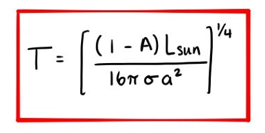

Solar flux is the energy radiated in a given area, it is measured in W/m<sup>2</sup> and denoted with S<sub>0</sub>. The sunlight absorbed at the surface of the Earth can then be calculated, treating the Earth has a flat disk with radius R. Finally, we can calculate the energy absorbed per unit area since the energy is distributed across the earth's entire area.

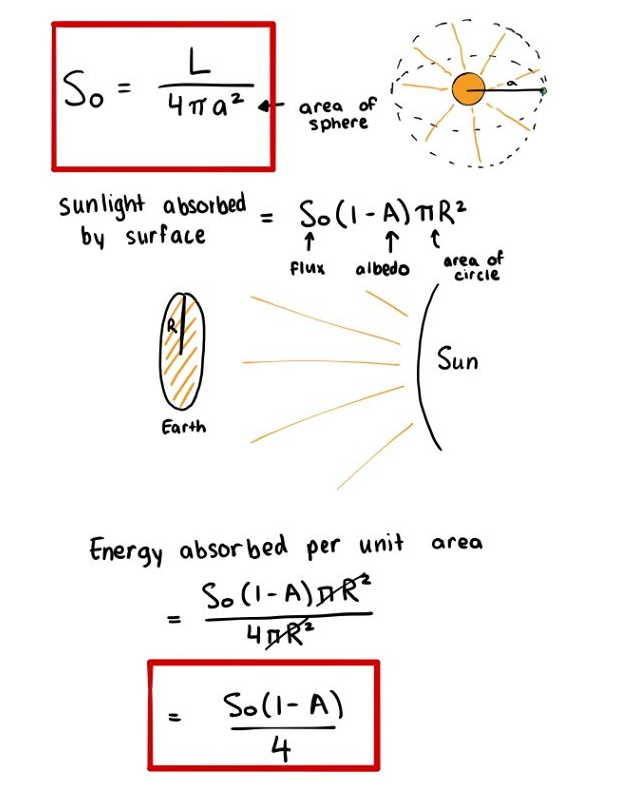

#### Simple Model of Planet with Single Layer of Atmosphere

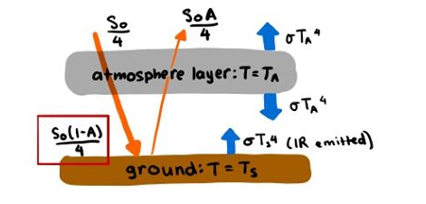

There are two sources of radiation on the Earth's surface.
- heating
- blackbody radiation from cooling

To solve for temperature at surface Ts, we have the following equations.

1. In equilibrium, we set total heating rate = total cooling rate.

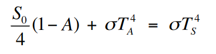

2. Balance of energy for atmosphere

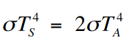

Finally, 

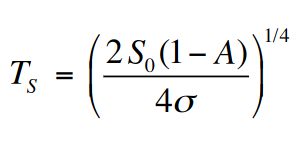

At equilbrium, given the equations above, the temperature of the Earth's surface is 1.19 or 2<sup>1/4</sup> times higher than no atmosphere.

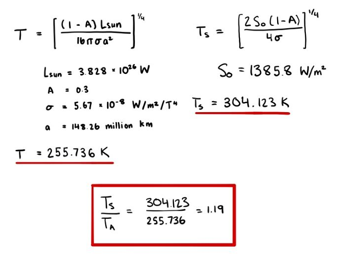

## Day 20 - Feb 26, 2020

### Midterm Details

The midterm will be on Monday March 2, 2020 during class time at UH 213. It will cover everything to the end of Chapter 4B Heating and Cooling. To study, review lecture notes, slides and Tophat questions. There will not be a formula sheet provided but we will have constants available. The midterm will have around 4 or 5 questions.

#### Surface Temperature vs Atmosphereic Temperature

Previously we found that the Earth's surface temperature is around 1.19 times warmer than the temperature of the atmosphere. We can show this mathematically.

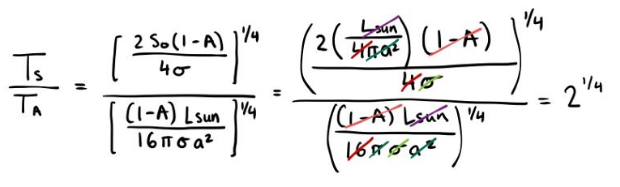


The incoming energy is equal to the outgoing energy. Specifically, `the incoming optical energy = reflected optical + infrared radiation`

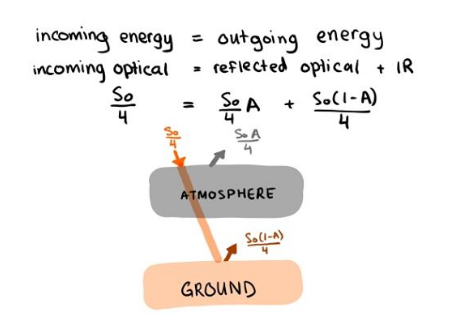

#### Adding More Layers

If we add one more layer to our simple model, we get a temperature at layer 2 and one at layer 1. At the surface, we have:

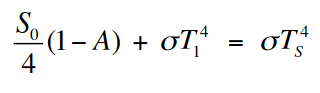d

and at layer 1:

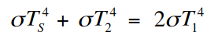

and at layer 2:

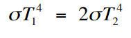

If we isolate Ts in these equations, we get:

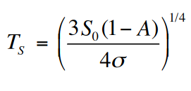

If we generalize to n layers, we get Ts = 

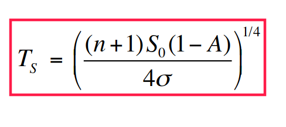

#### Temperature of Mars

If we calculate the temperature at Mars surface assuming 0 layers of atmosphere, we get Ts = -58 C. The actual mean is near -63 C, which means Mars almost has no atmosphere.

#### Venus's Atmosphere
- very heavy cloud deck
- 70% of radiation is scattered out
- more than twice the albedo of earth
- flux is almost the same as Earths (So = 2614) since the distance is similar

Given a solar flux of 2614 W/m^2 and albedo of 0.67

```
n = 0   -  Ts = 248 K
n = 1   -  Ts = 295 K
 ...          ...
n = 78  - Ts = 737 K (near actual mean)
```

Venus has almost 80 layers of gas so there is a big greenhouse effect. Its atmosphere is 94x more massive than Earth's

#### Peak of Earth's Radiation

The radiation at Eath's surface is highest when it is in the infrared section, being transmitted up

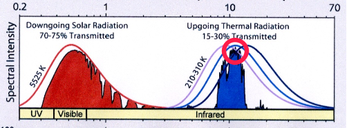

## Day 21 - Feb 27, 2020

### Assignment 2 Answers

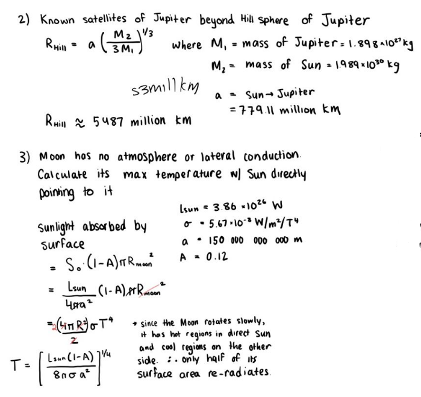

### Heating and Cooling cont'd

#### Difference Between Earth and Venus Atmosphere

H2O and CO2 are greenhouse gases. On Earth,, they come in the form of oceans and rocks. If you increase the temperature by a little, the water evaporates into atmosphere and exposes more rock, which releases CO2. The temperature goes up as more water and carbon diozide are released. This process has run to completion on Venus and is called the **runaway greenhouse effect**.

Earth is slightly different because it's far enough from the Sun that the atmosphere, ocean and rock interior is connected by the **carbon-silicate cycle**, keeping us at equilibrium.

_However_, too much CO2 in the atmosphere will break the equilibrium and the Earth will also have a runaway greenhouse effect.

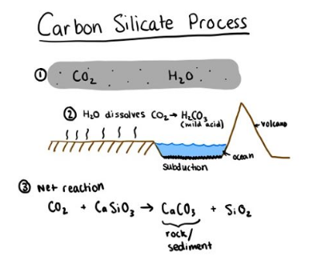

### Radioactive Heating

When rocks decay, they release energy. The amount depends on some factors.
1. amount of the isotope
2. half-life of the isotope

When the Earth is forming, the short-lived isotopes are important, like Aluminum.

4 important isotopes **today**
1. <sup>235</sup>uranium - 0.7 billion years
2. <sup>40</sup>potassium - 1.28 billy
3. <sup>238</sup>uranium - 4.47 billy
4. <sup>232</sup>thalium 14 billy

#### Tidal Heating

This is important for the satelites of Jupiter and Saturn.

When there is a tidal pull on a satellite, it gets 'squeezed' and 'flexed' by the planet. If it's in an elliptical orbit. Io has a similar size and distance to our Moon. Its orbital period is small and it is highly volcanic due to steady input of heat from Jupiter's gravitational field.

Europa is a similar size but has an icy surface with suspected ocean underneath.

#### Gravitational Infall

Meteors and sometimes comets/asteroids collide with planets from time to time, which creates kintetic energy but large collisions don't happen anymore (sadface)

Back in the day (4-4.5 billion years ago) there were a bunch of collisions that turned planets/moons into what they are today.

The total gravitational potential energy of a final spherical planet is:

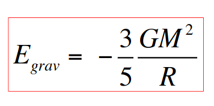

where M is the mass of the spherical body and R is its radius. And G is the gravitational constant

The rest of the energy is dissipated as heat. Heat capacity, C, is the energy required to heat a unit of mass by a temperature change.

_For example, it takes 4.2 J/g to heat water by 1 degree K_

If all of the potential energy from a spehre is converted to heat, then it would result in the following formula:

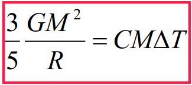

In reality, not all of the gravitational potential energy is converted to heat and stored. **Half** of it goes into **pressure** and the rest is radiated away from surface.

#### Virial Theorem

Internal Kinetic Energy = (1/2) Gravitational Potential Energy

Basically you half the equation above so instead of 3/5 it is 3/10

