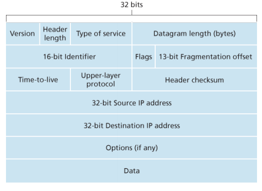
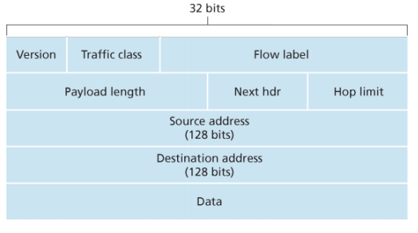
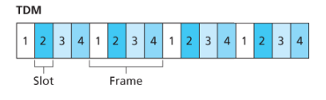
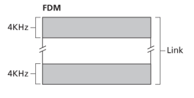
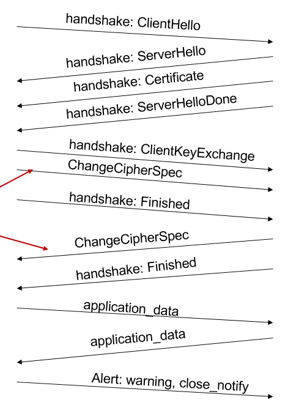
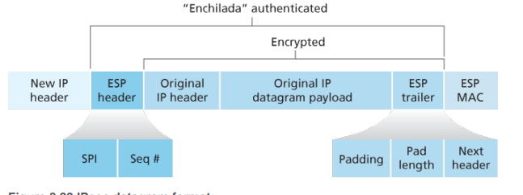

# 4C03 Computer Networks and Security

## Table of Contents
- [1.1 What is the Internet](#11-what-is-the-internet)
- [1.2 The Network Edge](#12-the-network-edge)
- [1.3 Network core](#13-network-core)
- [Alternative Core - Circuit Switching](#alternative-core---circuit-switching)
- [Delay, Loss, Throughput in Packet Switched Networks](#delay-loss-throughput-in-packet-switched-networks)
- [1.5 Protocol Layers](#15-protocol-layers)
- [2.1 Principles of Network Applications](#21-principles-of-network-applications)
- [Processing COmmunicating](#processing-communicating)
- [2.2 Web and HTTP](#22-web-and-http)
- [HTTP Status Codes](#http-status-codes)
- [Web Caches (Proxy Server)](#web-caches-proxy-server)
- [Electronic Mail](#electronic-mail)
- [DNS](#dns)
- [Client Server vs P2P](#client-server-vs-p2p)
- [Chapter 3 - Transport Layer](#chapter-3---transport-layer)
- [Sequence of Execution](#sequence-of-execution)
- [Tunnel Vision](#tunnel-vision)
- [ UDP Segment Header](#-udp-segment-header)
- [Principles of Reliable Data Transfer](#principles-of-reliable-data-transfer)
- [rdt2.0 fatal flaw](#rdt20-fatal-flaw)
- [Pipeline Protocols](#pipeline-protocols)
- [COntinuation of reliable data transfer](#continuation-of-reliable-data-transfer)
- [TCP Overview](#tcp-overview)
- [TCP seq numbers, ACKS](#tcp-seq-numbers-acks)
- [](#)
- [Connection Management](#connection-management)
- [Quiz Overview](#quiz-overview)
- [Chapter 4 The Network Layer - Data Plane](#chapter-4-the-network-layer---data-plane)
- [How IP Addressing Works](#how-ip-addressing-works)

## Day 1 - Jan 6, 2020
- biweekly labs
- mark breakdown
    - 36 % labs (6 each)
    - 24% midterms (12 each)
    - 40% final exam
- do assignments at home and demo during lab time
- textbook: [Computer Networking : A top down Approach](https://github.com/QSCTech/zju-icicles/blob/master/%E8%AE%A1%E7%AE%97%E6%9C%BA%E7%BD%91%E7%BB%9C%E5%9F%BA%E7%A1%80/%E6%95%99%E6%9D%90/Computer%20Networking%20-%20A%20Top%20Down%20Approach%2C%207th%2C%20converted.pdf)

### 1.1 What is the Internet

#### Nuts and Bolt View (Hardware)
- billions of connected computing devices
    - hosts/end systems running network apps
- communication links - connect end systems together
    - physical media
        - coaxial cable
        - optical fiber
        - copper wire
        - radio spectrum
        - satellite
    - different links transmit data at different rates (bits/s)
- packet switches - connect end systems together
    - forward packets of data
    - routers
    - switches
- internet = network of networks
    - interconnected ISPs
- protocols for sending/receiving msgs
    - TCP
    - IP
    - HTTP
- internet standards
    - RPC
    - IETF
    - IEEE
    - more strict because physical constraints are resrictive

#### Service View
- internet as an infrastructure that provides services to (distributed) applications
    - web
    - VoIP
    - email
    - games
- distributed apps because they involve multiple systems exchanging data

#### What is a protocol
- define format, order of messages sent and received among network entities and actions taken on message transmission/receipt
- example between client and server
- client initiates TCP connection request, server gives ok response, client sends get request for webpage, server responds with contents

### 1.2 The Network Edge
- where the end-systems sit
- includes desktops, servers, mobile devices, IoT stuff
- also referred to as hosts because they run applications
    - hosts can be clients or servers

#### Network Structure
- client and server, client requests, server provides
- servers usually in data centers

#### Access Networks
- the closest connection to edge of system - first router
    - aka edge router
- wired and wireless

#### Read at Home
- access networks
    - home access connections: DSL, cable, FTTH, dial-up, satellite
    - 2 most prevalent for broadband residential access
        1. Digital Subscriber Line (DSL)
            - built on existing telephone line
            - dedicated line
            - < 2.5 Mbps upload (typocally < 1)
            - < 24 Mbps download (typically < 10)
            - different transmission rates set by DSL standards to make it assymetric (non-interfering)
            - max rate limited by gauge of twisty wire, distance from home to central office, congestion, cheap plan
        2. Cable
            - built on existing cable television infra
            - since both fibre optic and coaxial are used, it's called hybrid fiber coax (HFC)
                - assymetric
                - 30 Mbps download
                - 2 Mbps upload
            - shared not dedicated
    - shared vs dedicated access
    - DSL is thinner than coaxial
        - coaxial has more bandwidth
    - tv can be transmitted over DSL
- frequency division multiplexing
    - send signals with diff frequency through same wire and they wont interfere as long as there is a considerable difference between the signal frequencies

## Day 2 - Jan 8, 2020

#### Access Networks: Home Network cont'd
- digital subscriber line (DSL) or cable hybrid fiber coaxial (HFC)
- older cable network was a shared service whereas these days they're not shared (dedicated) services
- the term shared/dedidcated can be for the service or the channel
- consists of a bunch of devices, access point, wired ethernet, router + firewall, connect to cable/DSL and then ISPs central office
- router connects the cable/DSL modem and access point

#### Enterprise access networks
- additional switches on site for a huge number of ndoes
- need to split them into smaller groups to manage using ethernet switches
- ethernet uses twisted-pair copper wire
- we can't have a single device connecting to the network
- have different transmission rates availble

#### Wireless access networks
- shared wireless access network connects user to router from a base station (access point)
- in wireless access we have
    - small scale wireless networ
        - home wifi/router since range is smaller (must be within 10-30 metres depending on enterprise vs home)
    - wide area wireless netowrk
        - smartphones belong here since the range is greater (10km)
        - 3G/4G/LTE/5G
- the data which is sent to transmit internet vs telephonic vs mobile has the same udnerlying technology
    - the way this information is converted depends
- example
    - how voice signals are transmitted (audio waves)
        - how does a sound wave get converted to electromagnetic wave
- signal processing
    - convert data into numbers, then send numbers over the network as numbers

#### Host and Data
- host sends packets of data
- host machine takes application message, breaks it into chunks called packets, thre is an upper limit on the size but based on the task the size of packets differs, packet size is length L in bits
    - if you have more data it gets split to multiple packets
- transmition rate (sometimes bandwidth) is denoted by R
    - range of frequencies you can transmit over a medium
    - the medium (wireless or wired) has a range of frequency it can travel
    - the wireless medium has no upper limit for max frequency
    - copper wire has a range
        - this is the bandwidth (min and max frequency that can be transmitted)
    - wireless transmission rates are usually in gigahertz
- to increase the capcity of wired mediums you can make the wire thicccccer (coaxial is thiccccer than DSL)
- transmission rate is about producing the signal, the second part is sending the signal across the wire
- the second part is called propagation (when the signal is travelling towards its destination)
- packet transmission delay = L/R where L is the bits and R is the bits/second -= the time needed to transmit L-bit packet into link

#### Physical Media
- bit - propagates between transmitter and receiver pairs
- when the frequency is higher, the waves can reflect from physical medium (maybe)
- physical link - what lies between transmittr and receiver
- guided media - signals propagate in solid media (copper, fiber, coaxial)
- unguided media - (in wireless) the signals propagate in any direction, also radio
- twister pair
    - two insulated copper wires

##### Coax, Fiber
- coaxial 
    - 2 concentric copper conductors
    - bidrectional
    - used for cable TV snd cable internet
    - can achieve higher transmission rate than twised wire (10s of megabits/s)
    - guided
    - shared
- fiber optic cable
    - glass fiber carrying light pulses, each pulse is a bit
    - high speed (10-100 gigabits/s)
    - low error since repeaters are far apart
    - immune to electromagnetic noise, hard to tap, low attenuation signal up to 100km
    - good for overseas/long distance calls
    - standard link speeds range = 51.8mbps to 39.8gbps
- unidrectional (half duplex)
- bidirectional (full duplex)

##### Radio
- exclusively use electromagentic spectrume
- no wire
- bidirectional
- can go through walls
- signal depends on propagation environment
- radio link types
    - terrestrial micorwave (45 mbps)
    - LAN (WiFi) - 54 mbps
    - wide-area (cellular) - 10 mbps for 4G
    - satellite - kbps to 45 mbps + delay

### 1.3 Network core
- mesh of interconnected routers (packet switches + links)
- packet switching - hosts break app-layer msgs into packets and forward them from one router to the next
- special purpose devices (linklayer switch and router)
    - one common job they both do is packet switching
    - they recieve the packets and forward them using a certain algorithm
    - they take decision based on the content of the packet
    - if there are 10 packes being transmitted between A and B, they will all be considered independently
- the devices in the mesh have to decide which path/route to take
    - swtiching time is based on which path is taken
- packets are transmitted over link at rate = full transmission of link

#### Packet Switching - store and forward
- when a packets bits are received, the packet switch will collect the complete packet (store) and then transmit it on the next hop (forward)
- a hop is a step
- another fundamental principle is that thedevices in the middle (routers) perform a store and forward
- they also verify that the content is correct
- a router has many links and its job is to take packet from input link and send it to the appropriate output link
- if you have N hops the end to end delay is NL/R
    - here we ignore propagation delay
- given it takes L/R to transmit packet to the store, it will take another L/R to forward it
- so the total delay is 2L/R
- if there was no store, it would just be L/R delay but we kinda need to store

##### Example of Packet Switching

```
Length = 7.5 mb
Rate = 1.5 mbps
1 hop transmission delay = L/R = 7.5/1.5 - 5 sec
```

#### Packet Switching - queuing and delay
- a packet switch has an output buffer for every attached link (since links are bidirectional every link has this)
- if arrival rate to link exceeds transmission rate of link for a period of time
    - packets will queueu and wait to be transmitted by link
    - useful if the link is busy tranmitting another packet
    - packets can be dropped if memory buffer fill ups (either the arriving one or an already queued one)
- so apart from transmission delay, there is also a queuing delay

#### Two Key Network Core Functions
- routing - determine source-destination route of packets
    - if the destination of packet is X then it should be transmitted on links 1, 2, 3 for example
- forwarding
    - move packet from routers input to appropriate output
- forwarding tables that use IP addresses
    - each router has its own forwarfing table
    - based on packet destination value, the router will pass onto adjacent router based on that IP
    - maps destination address to router's outbound links
    - forwarding tables are set based on routing protocols

### Alternative Core - Circuit Switching
- end to end resources allocated between source and destination
- kind of like restaurant that takes reservations only
- in circuit switching there is no delay except the constraints provided by bandwidth
- circuit switching says the decision should be based on the end source
    - the path of packets is the same
        - dedicated resources
- packet swtiching says that the swtiching decision will be independent since they are all in chunks
- common for traditional telephone
- circuit segment is idle if it is not used by call (no sharing)
- when network establishes circuit, the transmission rate is also reserved and is guaranteed
- first, end-to-end connection must be established (reservation)
- if you have 4 circuit switches each able to have 4 simultaneous circuits, the transmission rate would be 1/4th of the link's total transmission

#### Circuit Switching- FDM vs TDM
- also possible in packet switching
- in fdm there are 4 signals with 4 different frequencies
    - all hosts don't get a lot of bandwidth
    - horizontal split 
- in tdm we split the time dedicated to transmiting data
    - for time slot 1 you transmit data for host A
    - if the size of the slot is too big then the users will feel a long delay so the trick is to make the time slots as small as possible (like in millisecs)
    - vertical split

## Day 3 - Jan 9, 2020

#### Packet Switching vs Circuit Switching
- packet is for internet
    - allows more users
    - eg 1mbps means each user gets 100kbs when active (probabilistically active 10% of the time)
- circuit is more for telephonic
- packet switching pros
    - good for bursty data because you can change up your path
    - simpler since there is no setup
- packet switching cons
    - excssive congestion possible (leads to delay/packet loss)

#### 1.3.3 A Network of Network
- internet users connect to the internet using ISPs
- we want ISPs to be interconnected so packets can be sent across
- this is a very complex structure
- option 1: 
    - connecting each ISP to every ISP would be O(N^2)
- option 2: Network Structure 1
    - conecting each ISP to one global transmit ISP would allow customer and provider to have economic agreement
    - user pays customer ISP and customer ISP pays provider - global transit ISP
    - con: if one company can make a global ISP then others will too
- option 3: Network Structure 2
    - multiple global ISPs that interconnect
    - two tier hierarchy with global trnsit providers at top tier and access ISPs at bottom tier
- option 4: Network Strcture 3
    - multi-tier hierarchy
    - access ISP pays regonal ISP pays teir-1 ISP
    - there are internet exchange points that connect tier-1 ISPs as well as peering links
    - points of presence exists in all lvls of hierarchy except lowest level
        - group of routers where customer ISPs connecy
- bigger companies like GOogle have their own dedicated connections to the backbone so they run their own network to bring content closer to users
    - act as tier 1 ISPs in hierarchy

### Delay, Loss, Throughput in Packet Switched Networks

#### How does delay occur?
- packes queue in buffers when arrival rate to link exceeds output link capacity

#### Four sources of packet delay
1. processing delay
    - if the contents of the packet were succesffuly received
    - check bit errors
    - determine output link - < a couple ms
2. queueing delay   
    - depends on hw much work the node has to do
    - time waiting at output link
    - error checking?
    - depends traffic
    - similar to processing delay
    - if there the buffer gets filled the packet gets dropped
3. transmission delay
    - L/R
4. propagation delay
    - depends on lenght of link (wire length)
    - based on speed of light (2-3 x10^8 m/s)
- the network of routers and switches is designed so that there is as less overhead and delay as possible
- basic principle
    - routers and switches keep on fowarding packages and if something doesn't work out the package is dropped

#### Queuing Delay in more detail
- R: link bandwidth (bps)
- L: packet lenggth (bits)
- a: average packet arrival rate
- La/R ~ 0: avg queing delay is really small
- if La = R then the the avg queuing delay is large
- if La/R > 1 then more work arriving than can be serviced
- this ratio is called traffic intensity

#### Real Internet Delays and Routes
- traceroute for delay measurement from source to router
- send 3 packets to each router 
- router returns packets to sender
- for N-1 routers, the end-to-end delay is N(d_proc + d_trans + d_prop) for uncongested network
- when you get \*** from traceroute it means the probe was lost and router stopped replying

#### Packet Loss
- finite capcity buffers
- packet arriving to full queue is lost
- routers and switches have buffers for incoming and outgoing queues
    - every link has a queue
    - every router has more than one link and every link has more than 1 queue
- if the incoming queue is full then the packet is dropped
- the sending host then somehow realizes that the package was dropped and resends the packet
- internet provides 'best effort' service
- there are protocols that can be implemented to guarantee packet delivery

#### Throughput
- rate (bits/time unit) at which bits are transferred between sender/reciever
- instantaneous - rate at a single point
- average - rate over period of time
- throughput can be calculated for a single link or between sender/reciever
- throughput would be equivalent to transmission rate if there is no delay/loss of data
- if there are multiple hops with different transmission rates, the end to end throughput from sending host to recieving host changes
- the throughput can not be more than the throughput of the bottleneck
    - bottleneck link = path that constrains the end-to-end throughput

#### Throughput: Internet Scenrario
- all servers have a capcity Rs and clients have a capcity Rc
- 10 connections sharing the links
- it is possible that we can fairly share and get a equal bandwidth R/10

### 1.5 Protocol Layers
- network is comprised of
    - hosts
    - routers
    - links (switches)
    - different applciations
    - audio/text/video --> bits gets transmitted
    - protocols (decides a formt for 2 devices to communicate)
    - hardware
    - software
- basic approach: sender initializes msg, converted to bits, signal to router, router signals sm else..
- idea of layering is to breakdown the process into smaller tasks an execute as steps
    - combination of protocols that pass info forward
- 2 layering models
    1. ISO/OSI model
    2. internet protocol stack

#### ISO/OSI reference model
- job should be plit into 7 steps
- there isn't a separate protocol for every activity
- evolved to 5 layer model because presentation and session can be implemented in application layer
1. applciation layer
    - communication initiaites from application by sender host
2. presentation
    - allow apps to interpret and understand data by encryption/decryption/compression
3. session
    - synchronization checkpoint
    - recovery of data exchange
4. transport
5. network
6. link
7. physical

#### Internet Protocol Stack
- evolution of ISO/OSI
- 5 layers
1. application layer protocols
    - FTP, SMTP, HTTP
    - this is a guideline
    - the software implemenents these guidelines
    - where dns gets IP from domain
    - packet of information is a message
2. transport
    - transports messages between app endpoints
    - TCP, UDP
    - TCP is more common
    - message created by applciation layer is passed to one of the above protocols
    - TCP/UDP are APIs implemented by your OS
    - need to make a system call to use TCP or UDP
    - process-process data transfer
    - transport layer packet = segment
3. network
    - IP, routing protocols
    - also OS driven
    - once your host app has produced a msg using HTTP and passes it using TCP, it is in control of your OS
    - sends datagrams from source to destination
4. link layer
    - also OS driven
    - slightly hardware dependent
    - in order to have hardware compatibility across manufacturers we have protocols (called standards) laid out by IEEE
        - Ethernet, 802.11 (WiFi standard)
    - at each node, network layer relies on this layer to deliver the datagram to next route
5. physical layer
    - the actual wire
    - receieves msg from Ip laye via link layer
    - converts it to a suitable format for the node
    - the jobs of this layer is to transmit the bits
    - half ofthe job of the link layer is perofrmed b ynetowrk inteface card
    - eg ethernet physical layer -> twisted pair or coaxial or fiber
- when wiriting an app, we only have to worry about implementing the application layer
- merges some parts of OSI ISO ref model
    - the acitivities of the omited layers are grouped together
- layers are numbered bottom up so physical is 1
- if you hear layer 2.5 protocol it means there are some tasks from layer 2 and some from 3
- each layer resturctures information based on its rules
- on the receiver end, the reverse proces is performed
    - end receiver msg goes from physical and back up to the application layer

#### Encapsulation
- transport layer adds a header to the message sent by the application layer
- when referring to transport layer protocols, we refer to the message + header as a TCP segment or UDP segment
- network layer does the same thing and calls the msg + header + another header as datagram
- link calls it a frame???
- basically every layer adds some more information to the original message so the end receiver knows how to unpackage it
- switches
    - have 2 layers
        1. link
        2. physical
    - so you can't send raw messags to the switch bc it won't be able to decode it
- router
    - has 3 layers
        1. network
        2. link
        3. physical
    - so it can decode the datagram
    - routers provide security so your data can't be sniffed
- ISPs have a layer for security that lets them see what users are doign
    - these can look into the data you're sending
- https guarantees the applciation layer is encrypting your message
    - so if there is a layer that can open it, it still won't be able to read it

#### 1.6 Network Security
- denial of service attack (DoS)
    - a lot of attackers send useless traffic
    - server cannot handle all the traffic and can't serve actual users

## Day 4 - Jan 13, 2020

### 2.1 Principles of Network Applications

#### Creating network app
- write programs that run on different end systems
- just focus on application layer
- if the application inteacts with some third-party hosts then you need some extra protocols?
- we will be workng on generic structure application layer programs
- network core devices don't run user apps
    - each layer provides a generic interface to the neighbouring layer (in API form)
- 2 architectures
    - client-server
    - P2P

#### Client Server
- one node requests for a service and the other provides a service
- communication is inititated by client
- server has a permanent IP address
- if a huge number of nodes are being serviced, need multiple copies of server node (data centers)
- client has dynamic IP addresses and do not talk to each other

#### P2P architecture
- no fixed role
- both devices are switching roles (either can initiate and either can respond to requests)
- usually there is a server which holds a list of nodes which can participate in communication
    - each 'peer' needs to register itself to the server to be added to the list
- there is no 'always-on' servicing node
- useful for file-sharing, content-sharing

### Processing COmmunicating
- process: program running on a host machine
- process comuncation between same host uses OS defined interprocess communcation (not what we are interested in)
- network communication is communcation between a process running on one machine and a process running on another
    - these processes communicate by exchanging messages
- dealt with by OS
- both architectures have client process (initiator) and server (waiter)

#### Socket
- the communcation point through which communciation(app?) layer sends messages to transport layer
- a socket is a software interface that allows processes to send and recieve messages
- usually every socket is bound to some port
- OS provides multiple sockets to communicate with trasnport layer
- circuit programming
    - process controlled by app developer

#### Addressing Processes
- every app is identified by 2 things
    1. IP address (destination host)
    2. port number (connection between trasnort and applicatio layer)
- when using client-server, the server needs a fixed address so clients can easily access the service
- also need to fix port number
- for HTTP servers the default port number is 80
    - for SMTP servers its 25

#### App-layer protocol
- defines what messages will be sent (their contents) and sequence of messages (response)
- error handling is also done at this layer
- can add variations that allow you to bypass layers (eg go straight from app layer to network layer)

#### Transport Layer
- udp or tcp
- qualities of a good trasport layer
    - data integrity (need 100% for file transfer but not audio)
    - security - want to make sure data is securely and successfully transferred
    - timing - delay constraints
    - throughput - min rate for effectiveness bandwidth sensitivity) vs best effort (elastic apps)
- different requirements for different types of applications

#### TCP service vs UDP service
- TCP
    - connection oriented
    - for reliable data transfer
    - establish connection before exchanging information (handshake)
    - includes congestion control and flow control
    - guarantees that data will reach the other end
        - udp doesn't do that
    - buffering: start to download data but don't service it until there is enough data to service
- UDP
    - unreliable data trasnfer (no guarantees)
    - does not require connection setup
    - good solution for a "no frills attached" app
    - no flow/congestion control
    - if you want to send a huge amount of data as quickly as possible and not care about congestion then UDP is your best bet
    - will only work if there is not a lot of traffic
- neither protocol provides min throughput, timing, security
    - solutionL appp dev has to add additional sources
    - for video streaming apps, there is additional code that guarantees min throughput and min delay
- most apps use TCP (mail, remote access, web, file tranfer) and some use either (streaming, video/online call)

#### Securing TCP
- tcp and udp have no encryption
- SSL sits between app layer and transport layer
    - takes info from HTTP and secuely sends it to tcp layer
    - encrypts data
    - denoted by lock sign in browser window (HTTPS = HTTP + SSL)
    - ssl socket API encrypts pwasswords to be sent

### 2.2 Web and HTTP
- web is a network of computers with specialzed web service available
- http is the protocol that makes this service possible (defines rules for www)
- webpage consists of objects
    - html file, jpeg, java applets, audio files..
    - webpage is identified by URL (server host + path to obejct)

#### HTTP overview
- hyppertext transfer protocol
- client - browser requesting onjects, server respsonds with objects
- communication is initated by client who sends HTTP request (requesting document they wanna open)
- request reaches server and server responds with contents
- http request is FOooOrrr an html page
- THe Google.com gets a TCP connection on port 80 from some client and accepts the TCP connection 
- http is stateless
    - servers don't store info on requests made
- if you want the server/client to maintain state you can add code for that
    - common technique is saving cookies on client-side
    - client can say they dont want to store cookies

## Day 5 - Jan 15, 2020

#### HTTP Overview cont'd
- websites provide content through webserver
- the port numbers through which service is provided is known
    - i.e HTTP uses port 80
    - TCP socket connection on port

#### Types of HTTP

##### Non-Persistant HTTP
- when you requeest a new document, a new TCP connection is made
- all audio/video/image files are independent objects
- separate requests are made for each object
- new TCP connection for each object

##### Persistent HTTP
- keeps TCP connection open
- multiple objects can be sent over one TCP connection
- this is the default in the current model of HTTP but canconfigure to use non-persistent

#### Response Time for Non-persistent HTTP
- RTT (round tripe time)
    - time for a small packet to travel from client to server and back (round trip time)
    - can never be preciely measured because factors such as network congestion affects the value
- RTT = time from TCP request initiation to file request
- RTT = time from file request to when the file is received
- the two steps above are assumed to have the same RTT
- depending on file size, the RTT will vary
- 2RTT + file transmission time = non-persistant HTTP response time
    - 2RTT means more overhead
- 2RTT would be fo every object

#### Persistent vs Non-persistent
- persistent is obviously better because you have an open connection and the client can send requests as soon as it encounters referenced objects
    - as little as 1 RTT for all referenced objects

#### HTTP request message
- two types
    - request (written in ASCII text)
    - response
- \r\n is after every line, it is the carriage return and linefeed to indicate where header lines start and end
    - 2 at once = message end
- format is request line + header lines
- if connection type is close then it means you don't want to keep the connection open (you want non-persistent)

```
GET /index.html HTTP/1.1\r\n (method path protocol)
Host: host_url\r\n
User-Agent: browser\r\n
Accept: text/html,...\r\n
Accept-Language: en-us\r\n
Accept-ENcoding: gzip\r\n
Accept-Charset: utf-8\r\n
Keep-Alive: ##\r\n <----- how long you want to try before just dropping packet
Connection: keep-alive\r\n

\r\n
```

#### General Format
- method path version cr lf
- header field name: value cr lf
    - can have multiple of this or none
- cr lf (blank line)
- entitiy body (for post requests)

#### Form Input
- post method
    - input uploaded to server
- url/get
    - input in path field of request line

#### Method Types
- HTTP/1.0
    - get
    - post
    - head (used for debugging, leaves object out of resposne)
- HTTP/1.1
    - get
    - post
    - head
    - put (uploads file to path specified)
    - delete

#### HTTP Response MEssage
- status line has protocol, status code and status phrase
- bunch of header lines (date,server, last modified), content-length, keep-alive, content-type
- blank line
- data you requested (HTML file maybe)

### HTTP Status Codes
- 1st line in server-to-client response message
- 200 - OK
- 301 - moved permanently
    - new location specified later in msg
    - sometimes do automatic redirection
- 400 - bad request
- 404 - not found
- 505 - HTTP version not supported
- 304 not modified
- 418 - i'm a teapot :tea:

#### Trying out HTTP
1. Telnet
    - command prompt utility (network based)
    - allows remote connection to machines
    - `telnet url port_number`
    - one of the default original services of internet
2. type in a GET HTTP request
    - `GET /page HTTP/1.1 Host: base_url`

#### Cookies
- small text-based pieces of info stored on the client side in a small file
- server sends client a message saying they want to store cookies
- the browser checks to see if client has cookies enabled
- if yes then some information is stored in some text file locally
- next time you visit the same url the browser will look for a cookie file
- 4 parts
    1. cookie header line in HTTP response (true/false?)
    2. cookie header line in next HTTP request (cookie file/say yes/no)
    3. cookie file on user side managed by browser
    4. backend database access to return appropriate data based on cookie file
- line in header = Set-cookie: user_id which creates the file
- subsequent requests will have a header cookie: user_id 

### Web Caches (Proxy Server)
- doesn't have anything to do with web service
- proxy server is any server working behind the scene for some service (FTP, mail, web, etc)
    - works to satisfy client request without using origin server
- most browsers maintain their own web cache
- browser sends request to cache, if it finds it, the contents are returned else it goes to the origin server
- used to immeditwly service user through local means
- most of the time we're not able to tell the difference since generic websites don't usually have big changes
    - if you refresh this forces the HTTP request to go to the origin server
    - if that doesn't work, clear cache
- proxy servers fetch new copies behind the scenes so the content is updated
    - more frequent for ISP caches
    - not that frequent for local
- hitting refresh adds an extra parameter in the header to specify tha the user wants a fresh copy
- pros
    - reduces response time
    - reduces traffic to origin server
- cons
    - if you're trying to access a website in which the content frequently updates, web caching is not that useful
- application can add a refresh rate to ensure the user is getting a fresh copy every time

#### Caching Example
- assumptions
    - avg object = 100Kb
    - avg reqest rate = 15/s
    - avg data rate = 1.5 Mbps (15 * 100)
    - RTT = 2 sec
    - access link rate = 1.54 Mbps
- consequences
    - if all the requests are forwarded to origin server, there will be 1.5 Mbps traffic (99% usage)
    - can improve if you change access link rate to 154 Mbps but that might be expensive
    - another solution would be local web caching
        - 40% requests can be serviced though cache
        - 60% need to go to the origin service
        - therefore data rate to browser over access link = 0.6\*1.5 Mbps = 0.9
        - so utilixation = .9/1.54 = 0.8
        - total delay = ?

### Electronic Mail
- SMTP, POP3, IMAP
- when you want to send a message to another user
- 3 major components
    1. user agents 
        - email clients like browser, Outlook, email apps
        - produce and receive
    2. mail servers
        - receive or send emails
    3. simple mail transfer protocol
        - smtp and others
- uses TCP on port 25
- 3 phases
    1. handshake
    2. transfer msg
    3. closure

#### User Agents
- mail-reader
- smtp
    - client uses TCP to send mail to mail server (ie McMaster)
    - mail server then uses smtp protocol to send mail to recipeient mail server (ie GMAIL)
    - tcp uses port 25
- tcp is the only protocol that guarantees your message will be sent

#### Mail Servers
- mailbox
- has a msg queue of outgoing messages to be sent

#### SMTP [RFC 2821]
- 3 phases of transfer
    - handshaking (greeting)
    - trasnfer of messages
    - closure
- kind of like a chat between your mail server and recipient mail server?
- commands - ASCII
- response - status code + phrase
- msgs must be in 7-bit ASCII
- need another protocol to actually pull the email form recipeient sever to recipient user agent

## Day 6 - Jan 16, 2020

#### Electronic Mail servers
- client sends a request and server responds
- message format has a 'to:' 'from:' and 'subject:' followed by a blank line and then the body (ASCII only)
- this is different from SMTP MAIL FROM, RCPT TO:

#### Mail Access Protocols
- SMTP
- mail access protocol
    - IMAP (INternet Mail Access Protocol to manipulate stored messages on server)
    - POP (Post office Protocol for authorization and downloadin)
    - HTTP (browser email - gmail, Hotmail)
- tunneling
    - messages of one protocol can be sent through another protocol

#### POP3
- pull new mail messages every 10 seconds
- authorization
    - asks for username and password
    - server responds with ok or err
- transaction
    - list - list message numbers
    - retr - retrieve message b ynumber
    - dele - delete
    - quit
- stateless

#### IMAP
- allows user folders 
- can split and organize emails

#### Browser Based (HTTP)
- allows splitting and roganizng too

### DNS - The Internet's Directory Service

Internet hosts can be identified with their hostname, such as google.com but these names don't hold much information on the location of the host. So hosts are defined by IP addresses. 

THe port number and IP address of a server is fixed. The IP address consists of 4 bytes where each byte can be expressed in decimal from 0 to 255

- domain name system
- port number is fixed
- IP address of servers is also fixed
- internet hosts and routers convert word urls to the IP address
- before TCP connectionis created, the domain name getsresolved into IP address
    - happens before message is sent
- gmail gay
- yahoo good

#### Hierarchial Database
- each url ending has its own DNS server (.com, .org, .ca)
- then each root url has its own DNS server (yahoo.com, amazon.com, pbs.org)

#### Top Level Domain Servers
- all top-levl country domains

#### Authoritative DNS server
- ??

#### Local DNS nameserver
- doesn't belond to hierarchy
- each ISP has one
- also can be called a proxy DNS server
- works like a cache for DNS servers to reduce traffic to root DNS servers

#### DNS name resolution example
- 2 ways
    1. iterative query
    2. recursive query
        - not good for load balancing since it sends more traffic to root and TLD servers

#### DNS Caching, Uploading Records
- records
- tuple of 4 values (name, value, type, ttl)
- type can have 4 values
    - A
        - direct mapping between host name and IP address
    - NS
        - domain name that is mapped to another domain name
        - ie if you type www.google.com it might actually be www.abc.google.com
        - split into multiple subdomain names
        - this info is stored in the authoritative name server, not the root or TLD server
    - CNAME
        - name is alias for real name
        - ie ib.com is really servereat.backup2.ibm.com
    - MX
        - sm to do with mailservers

#### DNS protocol, messages
- width is always 4 bytes, 32 bits
- message header includs identification (2 bytes) + flags (2 bytes)
- have to set the bit to specify if you want to do an iterative or recrusive query in the flags

#### How to register your domain name
- ICAN holds authority over all domain names
- godaddy, domain.com commericialize the domain names on behalf of ICAN
- first they ask if you have a name server
- if you're a big or small company
- if you have a name server, you have to give them your IP address
- if you're a small business you need to buy hosting from godaddy or whatever

## Day 7 - Jan 20, 2020

### Client Server vs P2P

#### File Distribution Time: Client Server
- server transmission = size of file x number of copies being sent / upload speed u
    - NF/u
- client - F/dmin where dmin is the minimum client download rate
- bottleneck will either be the client's download rate or the smallest client's download rate

#### File Distribution TIme: P2P
- server transmission - F/u
- client - F/dmin
- clients also contribute file content
- therefore, the max upload rate is us + sum of all u from other clients

#### P2P BitTOrrent
- file divided into 256Kb chunks
- cant set priorities of what peer you want to download from
    - only want file from peers who have complete file

#### Mulitmedia - Video
- one single second consists of 25-30 still images
- the images are then shown to us at a constant rate
- for every pixel, store the pixel number + colour values
- 1 second content = 25 Mb if each image takes 1 Mb
- to save space and time, usually store changing pixels (temporal coding example)
- another method is to send a pattern (i.e 42 black pixels, followed by n #???? pixels) but it's not as efficient

#### Content Distribution Networks
- storing multiple datas

#### Socket Programming
- lets you communicate with TCP or UDP
- A2 - basic socket python API

### Chapter 3 - Transport Layer

#### Transport services and protocols
- all OS by default implement UDP and TCP code provided by RFCs
- just like the app layer, the trasport layer assumes that we're connected directly
- sgement = app messages broken down into smaller parts that gets passed to netwrok layer after doing some processing
- one segment goes into 1 netwrok layer message

#### Transport vs network layer
- network layer takes care of logical communication between hosts

#### Internet transport layer protocols
- tcp or udp

#### Multiplexing/demultiplexing
- mulitplexing at sender: handle data from ultiple sockets, add transport header
- one entitiy, provide multiple doors (sockets) to handle mulitple inputs
- demultiplexing at receiver: user header to deilver recieved segments
- also sends port number of client in the msg so server can reply back

## Day 8 - Jan 22, 2020

### Sequence of Execution
- run proxy server
    - check if it's accepting connections on some port
- run client
- enter command at client: `ftp ftp.cdc.gov`
    - harcode proxy server port

#### Commands to implement
- list is given
    - USER, PASS, PWD, CWD, HELP

### Tunnel Vision
- encapsultion ftp commands inside http

###  UDP Segment Header
- checksum (16 bit number) based on content of msg
- during deliverry, if a certain bit is flipped, the checksum computed will be different
- reciever can recover from this 

### Principles of Reliable Data Transfer
- network layer provides no reliability

## Day 9 - Jan 23, 2020

### rdt2.0 fatal flaw
- the next packet is delivered upon acknowledgement that the packet before was successfully delivered
- if it's not delivered the sender gets a negative acknowledgement and you try sending the packet again
- if the ack/nak is corrupted you can retransmit current packet
- to know if its a duplicate you need to send a sequence number with the packet
- if you get a duplicate then resend acknowledgement and drop duplicate
- 2 sequence numbers are sufficient (2 bits) because you're only dealing with 1 packet at a time
- max bits for internet protocols is generally 16 bits
- when the data packet is receieved there are 3 possibilities
    - it's corrupt so u send the nak
    - it's not corrupt so u send an ack
    - you get a duplicate by checking sequence number (most likely due to lost acknowledgement) 
        - action: resend ack
        - sequence number is either 0 or 1 (stop and wait)

#### Parts of the Message
- checksum verified bit error
- sequence number is to check for duplicate
- acknowledgemt = confirmation
- retransmission is to see if we have to resend

#### Channels with errors and loss
- need to wait reasonable amount of time to wait for ACK
- negative ackonwledgement - when you get a sequence number you were't expecting

### Pipeline Protocols
- used to save overhead time from RTT
- allow you to send multiple packets
- allows time L/R to account for multiplr packets
- each packet needs unique sequence numbers so we can't use 0 and 1 anymore
    - number of sequence numbers for both depends on N

#### Go-back-N
- receiver only sends cumuative acknowledgements
- sender has timer for oldest unacked packet
- it sends N packets (each takes L/R time) 
    - timer is only started for the first packet
- receiver has to put out of sequene packets in a buffer and keep track of how many packets have been recieved
- sender has to track how many packets are out there
- less overhead but more retrasnmissions

##### Sender
- how many bits is N? - 2^k?? 
- once the window is completely transmitted (N packets in buffer) you send the cumulative acknowledgement
- send-bae = smallest sequence number
- nextseqnum = next packet that has not yet been transmitted

##### Receiver
- send one acknowledgment for the highest in-order sequence numbers successfully received

#### Selective Repeat
- sender can have up to N unacked packets in pipeline
- sender sends individual acknowledgements
- have the ability to selectively repeat packets
- timer for every packet
- less retransmissions and more overhead

## Day 10 - Jan 27, 2020

### COntinuation of reliable data transfer

#### GNB or whatver
- no buffer to store discarded packets
- when acks for packet 0 and 1 are recieved, new packets 

#### Selective repeat: sneder, reciever, windows
- yellow are transmitted
- blue have yet to be transmitted
- when the packet in gray on the left (first one after dotted line) is recieved, it skips 3
- basically, the window slides to the next gay packet

#### Selective Repeat Sender
- if n is the smallest unacknowledged packet, slide window to next unacknowledges sequence number

#### Selective Reapeat Reciever
- because of bit error, the sequence number can be unexpected
    - in this case, the packet is discarded

#### Sequence Example iwth 4 packets
- when sender recieves ack3, it marks (records) it
- reciever moves the winodw and delivers packet 2,3,4,5

#### Selective repeat dillema example
- we are sing 4 different sequene numbrs 0 1 2 3 (range is 4)
- size of window is 3
- note difference between range and window size^
- packet 1 is delivered, packet 2 has no acknowledgment, packet 3 is lost and then packet 0 is transmitted
- 0, 1, 2 si trasnmitted but acks for all are lost
- sender will retransmit all 3 since they all hit timeout
- reciever successfully recieves all 3 packets so it slies the window
- so the reciever is expected new packets starting fom 0 1 2 while the sender is still trying to send the old 0 1 2
- cant distinguish between old and new zero
    - solution: make a reasonable gap
    - thus size of window and range should be different
- what is the optimal difference
- want to add more numbers between 3 and 0 so 0 and 1 dont enter into the window
- the problem can be avoided by adding 
    - if we had 4 or 5 it'll be sufficient
    - size of window should be half of sequence number range so you can distinguish betwen old and new and they dont overlap

### TCP Overview
- tcp uses a smilar approach to selective repeat
    - it waits a bit and fills up the buffer to send packets in order
- full duplex - data travels in both directions
    - so far all the algirhtms we discussed have a snder and reciver (sender transmits msg and reciever sends acknowledgement)
    - TCP is like 2 parallel copies of the algorithm because it's bidrectional (sender transmits and also sends acnowledgements, vice versa)
- before startig to transmit data, it establishes connection and decides on some basic variables
- flow controlled
    - the rate at which data is coming through is fixd
- congestion control 
    - when tcp observes congestion it slows down speed

#### TCP segment structure
- similar to udp
- every segment has source port number and destination port number
- squence number is 32 bits
- so max sequence number would be 2^32 -1
- since its a sliding protocol, size of window should be half of the sequence number
- also has acknowlegdement number
- all tcp segments have the same header
    - the difference is in the acknowledgemnt number
- when you create a string of bits, there's no way to distinguis empty bits because 0000.. is a valid number
- no length field like udp but it has a header length field (which udp doesnt have)
- this means n udp the size of segment is variable but the size of the header is fixed
- in tcp the size is based on the link layer
- the tcp segment is picked in a way that a tcp segment can be fitted in the link layer
- tcp identifies whcih link the data will be transmitted through (wifi, wired network)
- both link layers have different size
- this means the same msg sent over wifi vs wired network will have a different number of tcp segments
- we dont have a length field because its based on link layer

### TCP seq numbers, ACKS
- zoned out

## Day 11 - Jan 29, 2020

### 
- sequence number + bit = 43

## Day 12 - Jan 30, 2020

### Connection Management
- handshake
    - agree on parameters (sequence numbers and value of recipient buffer)
- issues
    - first request is successfully recueved but the client side reaches timeout
    - if retransmitted request is really delayed, the client will stop waiting for it

#### TCP 3 way handshake
- synbit -> denotes if packet to establish connection has been sent
- syn recvd -> denotes if packet to establish connection has been recieved


#### Closing a tcp connection
- fin_wait
- fin_bit
    - 1 or 0
    - if the packet to close connection has been sent

#### Congestion Control
- initiated by reciever side basd on reciever window
- in 1 RTT, 1 data segment is sent
- additive increase
    - if it is successfully sent, it doubles the size of cwnd by 1 MSS (
        - MSS = frame size - data link layer header - more headers
        - max bound is reciever window thingy
        - cwnd is current window
- multiplicative decrease

#### Slow Start

#### Slow Start to CA
- in order to accomodate/avoid congestion, it slows down speed (as soon as cwindow touches ssthreth)
- linear congestion instead of exponential
- if there is a timeout error, the congestion window segments goes down to 1 in the next RTT

## Day 13 - Feb 3, 2020

### Quiz Overview
- 10-12 questions, 21 marks
- ch 1 - ch 2.2
- ignore security section in chapter 1

### Chapter 4 The Network Layer - Data Plane

#### NEtwork layer
- packets are called datagrams
- router examines header fields of every datagram passing through

#### Major Functions
1. forwarding
    - moves packets from router's input to appropriate output ports
2. routing
    - router decides wheich port a packet should be sent to
- router has at least 2 ports (incoming and outgoing)
- all ports work as incoming and outgoing (bidirectional)

#### Data Plane
- where actoins are performed
- determines how datagram is forwarded

#### Control Plane
- where router runs algorithms to decided mapping

#### Router Architecture Overview
- 

## Day 14 - Feb 5, 2020

#### Internet Network Layer
- when the packet is forwarded from transport layer to application layer, IP address is coming from the DNS server 
- at application layer - we have our domain name (google.com)
- transport layer ensures the IP address is available before transporting packets
- forwarding table
- IP protcol
    - governs how packet should be constructed (header + data)
- ICMP protocol - its job is to report errors
- IP protocols are impemented at routers but every host as its own lil forwarding table that forwards packets to gateway router
- a couple protocols that IP protocol requires help from (between IP and link layer)

#### IP Datagram Format
- 32 bits length for each row
- ip protocol version number (4 or 6)
- min IP header lenght = 20 bits
- length = total datgram length + data
- 16 bit identifier - sequence number (unique and random)
- time to live - after a certain number of hops, the datagram will be dropped
    - helps in terms of routing
    - if there is a loop in routing table then the datagram might keep travelling forever
    - if the router sees a 0 in this one, it'll automatically be dropped
- checksun - if the checksum doesn't match up, datagram is dropped (no acknowledgment will be provided)
- source and destination ip address (both 32 bit)
- 20 bytes of TCP
    - desination + source port number
- 20 bytes of IP header
- therefore 20 + 20 = 40 bytes of overhead + extra overhead

#### IP Fragmentation
- one datagram cant fit into one segment/fragment
- the datagram is split into fragments
- when an IP datagram goes to an ATM router, it is split into smaller fragments and theyll be encapsulated by the ATM datagram
- eg length 4000 and id x is split into 3 each with length 1500(1480), 1500(1480), 1040, each with id x 
    - the fragments will have an offset and all but the last one will have a fragflag indicating there are more fragments after this
- the offset is in bytes/8 (so the first has 1480/8) so 185 and the next will be 185 + 1480/8 = 370
- offset in bytes/8 because we don't have enough space to store it in bytes, so length has to be 
- each fragment is whatever bytes + 20 bytes?
- tcp header is only in the first fragment? <--- 

### How IP Addressing Works
- fixed and dynamic
- 32 bit number split into 4 8 bit numbers
- every link of a router will have its own IP address
- ethernet switch in the middle between devices and router
- higher order bits is the subnet part and then the host poart (lower order bits) identifies the device itself
- so every device in a network requires unique IP address (only in subnet)
- bigger enterprise system is divided into multiple subnets

#### How addressing is assigned
- in the beginning they were distinuished by classes (A, B, C)
- class A had 8 bits in the subnet part and the rest for host, B had 16 bits for subnet and rest for host (depended on devices in network)
    - rigid system
- modern appraoch
    - classless interdomain routing (CIDR)
        - any number of bits for subnet (23 bits for subnet and the rest 9 for host part)

### Midterm Glossary - Keywords and Definitions

#### 1.1 What is the Internet

##### 1.1.1 - nuts and bolts
- hosts/end systems
    - end users that are internet users, invluces PCs,laptops, smartphones, tablets, TVs, home appliances, smart watches, etc
- communication links
    - physical method through which data is transmitted
    - coaxial cable, copper wire, optic fiber, radio spectrum
- transmission rate
     - rate at which data ins transmitted
     - measured in bits/s
- packets
    - packages of information, segments of data with header bytes which are sent through the network to the destination and reassembled into original data
- packet switches
    - takes packet arriving from incoming communication link and forwards it to outgoing communication link
    - two types, router and link-layer switches 
- routers
    - forward packets to ultimate destination
    - typically for network core
    - route = ssequence of links and switches router takes to send data
- link-layer switches
    - forward packets to destination
    - typically for access networks
    - path = sequence of links and switches link-layer switch takes to send data
- Internet Service Providers (ISP)
    - how end systems access internt
    - is a network of packet switches and communication links
    - provide residential broadband access (cable modem/DSL), high-speed LAN access, mobile wireless access
    - ISPs are also interconnected
- Transmission Control Protocol (TCP)
- Internet Protocol (IP)
    - specifies format of packets sent and received among routers and end systems
- Internet Standards
    - agreement on what each protocol does
    - developed by Internet Engineering Task Force
- Request for comments (RFC)
    - standard documents written up by IETF
    - technical and detailed
    - define protocols TCP, IP, HTTP, SMTP
    - currently 7000 RFCs
- IEEE 802 LAN/MAN standards committee
    - define standards for Ethernet and WiFi

##### 1.1.2 - services description
- distributed application
    - applications that involve multiple systems exhacning data
- socket interface
    - specifies how program running on one end system will ask internet infrastructure to deliver data to destination
    - programming interface for hooks so apps can send and recieve using connection to internet

#### 1.2 Network Edge
- client
    - a type of end-system/host
    - tend to be desktops and moble PCs
- server
    - type of end-system/host
    - tend to be more powerful machines that store and distribute web pages, stream video, relay email
- data centers
    - where most servers reside and dstribute web pages, email, videos
    - google has 50-100, 15 of them with more than 100k servers

##### 1.2.1 Access Networks
- digital subscriber line (DSL)
    - type of broadband residential access
    - usually obtained from same company that does wired local phone
    - when DSL is used, ISP = telco
    - uses existing phone line (twisted-pair copper wire) to exchange data with digital access subscriber line acess multiplexor (DSLAM)
    - DSL modem on user end takes digital data and transates it to high frequency tones for transmission over telephone wire
    - go from analog signal at house to digital format at DSLAM
    - line can carry both data and phone signal simultaneously because of different frequency encoding
        - 0-4kHz band for phone (ordinary channel)
            - this is why phone is bad quality (big wavelength - lose data)
        - 4-50kHz band for upload (medium speed)
        - 50 kHz to 1MHz band for download (high speed)
- cable internet access
    - type of residential network access
    - makes use of cable televisoin company's existing infrastructure
    - fiber optics connect cable head end (cable modem termination system - CMTS) to neighbourhood junction (500-5000 homes), then coaxial cable connects homes to everything
    - since both fibre optic and coaxial are used, it's called hybrid fiber coax (HFC)
    - requires modem like DSL, but connects home PC through Ethernet port
    - CMTS is similar to DSLAM, turning analog signal from modem to digital
    - shared broadcase medium - every packet sent by head travels downstream on every link to every home 
    - so if multiple users are downloading same video, actual rate will be lower than aggregate cable downstream rate
    - upload is also shared so a distributd multiple access protocol is needed to avoid collisions
    - avg speed is 42.8 mbps down and 30.7 mbps up
- fiber to home (FTTH)
    - type of residential broadband access gaining popularity
    - provides higher speeds than DSL and cable
    - provides optical fiber path from CO directly to home
    - one fiber from CO to home (actually CO to homes but fibre splits)
    - two competing network architectures that do the splitting
        1. active optical networks (swithes ethernet)
        2. passive optical networks
    - each home has an ONT - optical network terminator, connected by optical fiber to neighbourhood splitter
    - fibre then goes from optical splitter to OLT (optical line terminator) - which provides conversion between optical and electric signals
    - average download is 20 mbps and 13 mbps up
- dial-up/satellite link
    - also residential
    - for rural areas - around 1mbps
    - dial-up = dsl but slower
- Internet of Things
    - devices that connect to internet wirelessly
    - in enterprise network, they transmit/receive packets to/from access point that is connected to wired ethernet, making it a wireless LAN setting
- 3G/LTE
    - for wide area access
    - mobile phones

##### 1.2.2 Phyical Media
- bit
    - propagates between transmiter/receiver pairs
- physical link
    - transmitter/receiver pairs
- guided media
    - signals propagate in solid media (copper, fiber, coaxial)
- unguided media
    - signals propagate freely
- unshielded twisted pair (UTP)
    - for LANs, frequently used for computer networks in a building
    - data rate depends on thiccness and distance between transmitter/reciever
- shared medium
    - number of end-systems connected to cable with each end system recieving whatever is sent
- geostationary satellites

- low-earth orbiting satellites

#### 1.3 Network Core

##### 1.3.1 Packet Switching
- messages - information in the form of data/ control function
- packet switches
- routers
- link-layer switches
- store-and-forward transmission
    - packet switch waits for entire packet to be transmitted, stores it until its done and then forwards
- output buffer/queue
- queuing delays
- packet loss
- forwarding table
- routing protocols
    - what sts the forwarding table values (automatically)
    - determines shortest path from each router destination 

##### 1.3.2 Circuit Switching
- circuit switching
- packet switching
- circuit
- end-to-end connection
- frequency-division multiplexing (FDM)
- time-division multiplexing (TDM)
- bandwidth
- silent periods
- customer
- provider
- regional ISP
- tier-1 ISPs
- PoP
- multi-home
- peer
- Internet Exchange Point (IXP)
- content-provider networks

- network archiecture - 5 layer model (fixed)

#### Chapter 2 - APplication Layer
- application architecture
    - dictates how application is structured over end system
- client-server architecture
    - always-on host called server with fixed address which services requests from clients
- P2P architecture
    - minimal or no reliance on servers
    - clients act as both server and client
    - hosts intermittently connected 'peers'
    - good for traffic intensive
- process
    - prgram running within end system
- client
    - process that initiates communication
- server
    - waits to be contacted to begin session
- socket
    - interface for processes to send and receive messages
- IP address
    - 32 bit number that is sent as part of process identifier
- port number
    - number to identify rocess running on host machine
    - also part of process identifier
- reliable data trasnfer
    - something that TCP does, UDP does not
- loss-tolerant applications
    - audio/video
    - not file sharing
- bandwdith sensitive apps
    - multimedia aps
    - telephone apps (32-36 kbps)
- elastic apps
    - not bandwidth sensitive
    - file sharing
    - email
    - messages?
    - web trasnfers 
- timing, throughput, security, data integrity = good protocol
- application layer protcol
    - defines how app's processs communicate

#### 2.2 Web and HTTP
- webpage
    - consists of object
- object
    - a file (html ,jpeg)
- base HTML file
    - primary page with references to other objects
- web browsers
    - implement client side of HTTP
- web server
    - implement server side of HTTP
    - apache, nginx
- stateless protocol
    - HTTP
- non-persistent connection
- persistent connection
- round trip time (RTT)
    - time for small packet to travel from client to server and abck to client
- request line
    - first line of HTTP request msg
- header lines
    - subsequent lines of HTTP request/response msg
- status line
    - first line of HTTP response msg
- entity body
    - contains requested object or post 
- cookie
    1. cookie header line in response from server
    2. cookie header line in request
    3. file containing cookie
    4. backend connection to db
- web cache/proxy server
    - satisfies HTTP requests on behalf of origin server
    - 40% hit this
- Content Dsitribution NEtworks (CDNs)
    - make it easier to use caches on internet and localize traffic
- conditional get
    - look at if-modified-since header line and only refresh cached copy is the last-modified date is more recent
    - else 304 not modified

#### 2.3 Electronic Mail
- user agent
    - allow users to ead, reply, forward, save, compose emails
- mail server
    - where messages go to be sent (queue)
- Simple Mail Transfer Protocol (SMTP)
    - application layer protocol for email
    - uses tcp
- mailbox
    - spot dedicated for each user agent in mail server
- message queue
    - where emails get put before they can be sent off
- pull protocol
    - HTTP, users pull info from server
- push protocol
    - primarily SMTP - mail server pushes mail to user agent (initiation by side who wants to send, not receive)
- Post Office Protocol Version 3 (POP3)
    - short and readable protocol that begins when user agent opens a TCP connection to mail server
    - does authorization, transactions (list, retr, dele, quit) and updates
- Internal Mail Access Protocol (IMAP)
    - associates each message with a folder
    - allows users to move messages around, delete them
    - keeps state

## Feb 6, 2020
- midterm

## Day 15 - Feb 10, 2020

### IP Addressing
- every end of a router is considered as a independent network
- IP address has 2 portions: network (LHS) and host (RHS)
- depends on how big the subnet is going to be
    - host portion depends on how many computers will be on that network (8 bits = 2^8 computers)
    - first few bits for those computers will be common (subnet address)
    - address of network itself = subnet address + all 0s
    - all 1s = broadcat address
    - therefore with 8 bits you can really only have 2^8 - 2

#### Subnets
- 
- /24 = 255.255.255.0 (first 24 are 1s)
- 23 bits: 255.255.254.0 (11111111 11111111 11111110 00000000)

##### CIDR
- classless interdomain routing
- class A - first 8 bits fixed
- class B - first 16 bits fixed
- 192.168 (class b reserved ranfe) and 10.x.x.x (class a reserved range)

#### DHCP
- dynamic host configuration protocol
- messages transmitted using UDP
- UDP is used by DNS and DHCP (discovery services)
    - because tcp requires connection establishment but to do that you need sufficient information
- goal: allow host to dynamically obtain its IP address from network server when it joins network

#### DHCP client server scenario
- temporary ientification for client
- permanent identification for server
- must know which port to reply to
    - 68 ?
- mac address = 48 bit
- ip address = 32 bit
- all 0s = unknown or network address
- how does network get subnet part of ip?
    - allocatd portion from ISP address spaces

## Day 17 - Feb 12, 2020

#### NAT Routers

### IPv6
- inreased range of IP addresses (128 bit)
- datagrams havea fixed length
- no optional fields
- no checksum since the transport layer does a checksum calculation
- in IPv4 routers, ipv6 datagrams are treated as the payload (tunneling)


#### Tunneling

Popular apprach that allows system to support multiple protocols.

### 4.4 Generalized Forward and SDN
- how a routing table is computed
- common apprach: router computes based on pre-programmed table set up by ISP
- new approach: centralized administrative authority that has the network topology and pushes the routing tables to the router
    - less work for router

#### OpenFlow data plane abstraction

### Chapter 4 Network Layer
The network layer is divided into 2 parts - data plane and control plane. Data plane takes care of forwarding and control plane takes care of network logic and routing.

#### Forwarding and Routing
**Forwarding** is the act of taking a packet at a router's input link and moving it to the appropriate output link. **Routing** is when the network determines the route or path that will be taken by packets as they flow through. Forwarding is router-local and routing is network-wide.

A **forwarding table** is what tells us which output link to forward a packet to. Traditionally, the approach is to have a routing function in every router. There is another approach, **software-defined networking (SDN)**, in which a remote controller computes and distributed the forwarding tables. 

Next, let's discuss the **network service model**, which defines the characteristics of the end-to-end delivery of packets. A good network layer can provide guaranteed delivery, with or without bounded delay, in order paket delivery, guaranteed minimal bandwidth and security.

The Internet's network service layer provides a **best effort service**, which doesn't really guarantee anything.

### 4.3 The Internet Protocol: IPv4, Addressing, IPv6

Here is an IPv4 datagram format:



- version number - 4 bits for IP protocol
- header length - determine where the the payload is
- type of service - IP, FTP, etc
- datagram length - the entire length, header + data
    - measured in bytes
    - 16 bits long so 2^16 bytes
    - though rarely larger than 1500 bytes since that is ethernet frame
- identifier
- flags
- fragmentation offset (which IPv6 does not allow)
- time to live (decremented until 0, then dropped)
- protocol - 6 = TCP, 17 = UDP
- header checksum, computed by adding 2 byte sequences and doing 1s complement
    - recomputed at each router since fields change (TTL, options?)
- source and dest IPs
- data

Normally, IP datagram has 20 bytes of header + 20 bytes of TCP header + data (assuming no options)


Next we'll move on to fragmentation , which is based on the **maximum transmission unit (MTU)**. 1500 bytes is for Ethernet but some wide area access frames can only do 576 bytes. Identification of fragments is the same to denote they are the same packet. Flag denotes which one is last, with its flag being set to 0 and the rest 1. The fragmentation offset then denotes how much over the next fragment should go when put back together.

Moving on to addressing, we know that an IP address is 32 bits long written in dotted decimal. A subnet has x many bits the same on the left. A subnet mask is denoted with a /x, which means x bits are the subnet address. Each interface (host or router) have an IP. This assignment strategy is called **Classless Interdomain Routing (CIDR)** where a.b.c.d/x means x bits re fixed. This is the network **prefix**. We used to have **classful addressing**, the subnets could only be fixed at 8, 16 or 24 bits (class A, B, C), which meant you either have 2^8 - 2 or 2^16 - 2, no in between.

An important IP is the broadcast address, 255.255.255.255. When a host sends a datagram with this address, the message is delivered to all hosts on the subet.

Next we will look at how to obtain a block of addresses. IP address blockas are managed by the Internet Corporation for Assigned Names and Numbers (ICANN). They also manage DNS root servers. Note that to actually go about obtaining these IPs, you would go to your ISP, who would go to ICANN. 

One you have these addresses, they are manually configured by a system administrator. They can also be configurd through the **dynamic host configuration protocol (DHCP)**. Automatically, the host gets either the same IP or a **temporary IP address**. DHCP is sometimes called **plug and play** or **zeroconf** because of its easy setup. It is a client server protocol and in ach subnet, there is usually one DHCP server, or at least a DHCP relay agent.

Here are the 4 steps when you are a new host to a network.

1. DHCP server discovery - via DHCP disover message, sent using UDP to port 67 with broadcast address 255.255.255.255 and source IP od 0.0.0.0. The link layer broadcasts this messae to all nodes on subnet.
2. DHCP server offer(s) - DHCP server broadcasts back with a transaction ID, proposed IP network mask and IP **address lease time**. Might be multiple offers if there are multiple DHCP servers in subnet
3. DHCP request - the client chooses from the offers and responds with DHCP request message (echoing config params)
4. DHCP ACK - server responds by confirming requested params

The DHCP server also lets client renew IP.

### NAT Network Address Translation
Devices within a network can have the address space 10.0.0.0/24 with 10.0.0.0/8 reserved for a private network. Devices within this network can send packets to each other using that address but not to the outside internet. So addressing is handled using a NAT table where there is a WAN side corresponding to the LAN side. To the public internet, the home internet is 1 IP (single device). Once a packet reaches the router, the NAT table tells us which specific host to send it to. This is possible because the NAT table has port mappings as well. The host can be some port and the NAT will have it map to some other port that is not currently in use (there are 2^16 options).

Since port numbers are not meant for addresing hosts but for processes, this can cause an issue. It is solved by **NAT traversal** tools.

### IPv6 
The initiative for this was because the 32 bit address space was being used up.

Following is the format of an IPv6 datagram.



- expanded addressing capabilities (32 to 128 bit)
    - **anycast** address, which allows datagram to be dlivered to any host group
- a streamlined 40 byte header - fixed length unlike IPv4
- flow labeling
- version (=6)
- traffic class - gives priority to some datagrams (8 bits)
- flow label - 20 bits to identify 1 flow of datagrams
- payload length - 16 bits, unsigned int gving number of bytes following 40 byte header
- next header - protocol to be delivered to
- hop limit - decremented by 1 each time
- source/dest adddresses
- data - payload

There is no fragmentation. If the packet is too big, an ICMP msg is sent back and packet is dropped. No checksum since TCP and UDP do this and it was too expensive to compute each time.

The method of transitioning IPv4 to IPv6 is **tunneling**. if the protocol number in a IPv4 datagram is 41 it means that the IPv4 payload is an IPv6 datagram.

### Chapter 5 The Network Layer's Control Plane

The control plane is responsible for the routing function, which is defined through algorithms. 

Thinking of a network as an undirected graph of routers, an edge may be the physical distance of the link, the link speed or the cost of passing through it. There are 2 types of algorithms to get the **least-cost path**, a **centralized** algo that has the topology of the network. This is a **link-state algorithm**. A **decentralized** routing algorithm is iterative and distributed among routers. Each node only knows its neighbours and its neighbours know its neighbours. This is a **distance vector algorithm**.

Another way to classify is static vs dynamic routing algorithms - based on how quick they respond to changes in topology. A third way to classify is according to **load sensitivity**, which is when costs change dynamically to reflect congestion on a link. Today's algos don't do this.

### Link State Routing Algorithm
All nodes have node information by broadcasting link-state packets to all other nodes. This algo is known as Dijkstra's.

D(v) = cost of least path

p(v) = previous node along current least cost path

N' = subset of notes, v is in N' if its leas-cost path is known

Following is the pseudocode

```python
Initialization:
N’ = {u}
for all nodes v
    if v is a neighbor of u
        then D(v) = c(u, v)
    else D(v) = ∞

Loop
find w not in N’ such that D(w) is a minimum
add w to N’
update D(v) for each neighbor v of w and not in N’:
D(v) = min(D(v), D(w)+ c(w, v) )
/* new cost to v is either old cost to v or known
least path cost to w plus cost from w to v */
until N’= N
```

The table stores, fof every destination, the next link you should take to move closer.

The total number of iterations is n(n+1)/2 = O(n^2)

### Distance Vector Routing Algorithm
Aynchronous, distributed and iterative algorithm using Bellman-Ford equation

d<sub>x</sub>(y) = min<sub>v</sub>{c(x,v), d<sub>v</sub>(y)}

### Intra-AS Routing in the Internet
- aka interior gateway protocols (IGP)
- ospf
- RIP: routing info protocol
- IGRP

Routers are orgnized into autonomous systems and each independent system has a routing algo called an intra-autonomous system routing protocol.

OSPF - open shortest path first - it provides security, multiple same-cost paths, unicast and multicast, hierarch within AS

BGP - border gateway protocol - inter-AS

eBGP - subnet reachibility from neighbours

iBGP - propagate reachability to other networks

allowd getting prefixes fom neighbour ASs and determine best routes to them

messages: OPEN, UPDATE, KEEPALIVE, NOTIFICATION


### Chapter 6 The Link Layer and LANS

Two main types of link-layer channels to transmit frames over a single link - broadcast and point-to-point.

### 6.1 Intro to the Link Layer
- **node** - any device that runs a link layer protocol
    - hosts, routers, switches, access points
- **links** - communication channels that connect nodes along path
- **lnk-layer frame** - this is what a node encapsulates a datagram in

#### 6.1.1 Services Provided by Link Layer
-**framing** - encapsumlating datagrams into a frame, which consists of a data field and some header fields. Specific structure of frame is alaid out by the protocol
- **link access** - a medium access control (MAC) protocol that  lays down rules for when a frame can be transmitted across a link
    - for point-to-point links wit single node at each end this is simple, the link is available whenever it is idle
    - tricky when it comes to broadcast links since there are multiple nodes
- **reliability** - just like TCP, there are acknowledgements and retransmissions to ensure the frame is transmitted succssfully
    - this service is not that necessary for low bit-error links like fiber, coax and twisted pair, it's mostly for wireless links since they are prone to error
- **error detection and correction** - to combat bit errors caused by signal attenuation and electromagentic noise, the link layer does something imilar to a checksum to detect errors
- **flow control** - related to link access
- half-duplex vs full duplex
    - in half, nodes at both ends cannot transmit at the same time

#### 6.1.2 Where is the Link Layer Implemented
- in every host and router
- implemented in a **network adaptor**, aka **network interface card**
    - adaptor has a link-layer controller implemented in the chip that provides all the services we mentioned earlier
    - much of this functionality is hardware
    - ethernet card, 802.11 car and ethernet chipset implement link, physical layer
- on the host side, the computer has a controller that can access the CPU/memory and send it onto a transmission link
    - sending side: encapsulate datagram into frame, do some error checking
    - receiving side: look for errors, extract datagram and pass to upper layer
    - this part is hardware + software

### 6.3 Multiple Access Links and Protocols

We mentioned earlier that there are two types of links, point to point and broadcast.

For point to point there is a single sender at the end of a link and a single reciever at the other end. The protocols for this are the point to point protocol (PPP) and the high-level data link control protocol (HDLC).

For broadcast you ca have multiple sending and receiving nodes on the same channel. When a node transmits a frame, all other nodes get a copy. First we will tackle the **multiple access problem** before discussing protocols.

Broadcast channels are found in LANs, geographcally concentrated networks or like a university campus.

When nodes broadcast at the same time, there can be collisions of the frames, which makes the signal get tangled and hard to distinguish. The multiple access protocol tries to avoid this. A MAC protcol can belong to 1 of 3 categories.

1. **channel partitioning protocol**
2. **random access protocol**
3. **taking-turns protocols**

Before discussing each protocol, the following are characteristics of a good one, assuming a broadcast channel of R bits/s

1. when only one node is sending, its throughput should be R bps
2. when M nodes have data to send, their throughput is R/M bps on average
3. decentralized - no master node
4. simple to implement (inexpensive)

#### Channel Partitioning Protocols

Recall time/frequency division mulitplexing (TDM/FDM). These techniques can be applied to partition bandwidth among nodes on a broadcast channel. 

TDM divides time into **time frames** and each time frame into N **time slots**. Each time slot is assigned to one of the N nodes. When a node wants to transmit, it can do so during its time slot. A slot size is usually big enough for 1 packet. This eliminates the chance of collisions and each node gets R/N bps. HOWEVER, it doesn't satisfy our first requirement - when only one node wants to send it should get all the throughput, in fact, it would have to wait its turn in the sequence.



FDM divides the channel into different freuqncies, each with a bandwidth of R/N and assigns them to one of the N nodes. This has the same advantages and disadvantages of TDM



A third channel partitioning protocol is **code division multiple access (CDMA)**, CDMA assigns a different code to each node. Each node encodes its bits using its unique code. This allows simultaneous transmission.

#### Random Access Protocols

When a node has packets to send, it transmits them at rate R. In the event of a colliion, each node involved retransmits its frame (packet) until it gets through without a collision. Instad of retransmitting right away it wait s a randome delay. Each node involved in the collision chooses a random delay and we just hope for the best.

The most common random access protocols are the ALOHA protocols and the carrier sense multiple access protocols (CSMA).

#### Slotted ALOHA
- some assumptions are made
    - all frames consist of L bits
    - time is divided into slots of L/R seconds (slot = time to transmit 1 frame)
    - nodes transmit at the beginning of slots
    - nodes are synchronized so they are aware of where slots begin
    - if 2 or more frams collide in 1 slot, all nodes detect this collision before the slot ends

When a node has a frame to send, it waits until the beginning of the next slot and transmits the entire frame in 1 slot. If no collision, then we are done. If there is a collision, the node detects it and retransmits the fram in the next frame with probability p between 0 and , which basically says whether to retransmit in the next frame or not (this is our delay).

This apprach allows a single active node to transmit at full capacity, is highly centralized and detects collisions. But, in the presence of multiple nodes, it's not super efficient since the slots that have colliions are wasted and there will be empty slots if the probabilities of both frames say to not send in the next slot. 

The **efficiency** is calculated based on the number of successful frames (not empty or collision). If we assume the probability of a fresh frame transmitting in the next frame is also p, the probability of a node having success is then p(1-p)^(N-1). Probability of any node being successful is Np(1-p)^(N-1). Max efficiency is the limit as N goes to infinity = 1/e = 37%

#### Pure Unslotted ALOHA
This one does not require the nodes to be synchronized to the beginning of the slot. As soon as a node has a frame to transmit it does so on the broadcast channel. If there is a collision then the frame gets retransmitted with probability p. The probability of no other node transmitting is (1-p)^(N-1) and the probility that no other node begins transmission while node i is transmitting is also (1-p)^(N-1). Thus, the total probability of success is p(1-p)^2(N-1). This gives an efficiency of 1/(2e) = 18%, even lower than slotted.

#### Carrier Sense Multiple Access (CSMA)
- adds two important rules that ALOHA does not
    1. listen before speaking, **carrier sensing**, if a node is currently being transmitted, wait for it to finish
    2. if someone else begins talking at the same time, stop talking - **collision detection**

#### Carrier Sense Multiple Access with Collision Detection
When a node performs collision detection and senses a collision, it will stop transmitting. This ensures that a damaged fram is not fully transmitted. So the frame will be transmitted when it setect no signal energy and if it starts to detect signal energy from the channel, it wil abort and retransmit after a random amount of time.

We want an interval of time to be short when the number of colliding nodes is small but large when there are more collisons .

The **binary exponential backoff** algorithm used in Ethernet solves this problem. It counts the number of nodes involved in the collision (n) and chooses a K value from {0,1,2...2^n-1} to come up with the interval. The actual amoun of time waited is K*(amount of time for 512 bits). The more collisions that occur the higher your n becomes, with n being capped at 10.

The efficiency is the long-run fraction of time during which framed are transmited without collision. In order to present a closed-form approximation, dprop is the max time for singal to propagate between 2 adaptors. dtrans is the  time to transmit a max-size frame. The efficiency = 1/1 + 5dprop/dtrans

Yields better performance than ALOHA and it is decentalized

#### Taking-Turns Protocols
In channel partitioning we found that the bandwidth is fairly allocated even when there is only 1 active node. In random access we found that high loads cause a lot of collision overhead. Taking turns takes the good points of both.

It uses polling by having a master node invite slave nodes to transmit. But polling has latency and overhead and a single point of failure.

Token passing has a control token that goes sequentially from node to node but again, has overhead, latency issues and a a single node failing will cause the entire system to fail.

#### DOCSIS The Link Layer Protocol for Cable Internet Access
The Data-Over-Cable Service Interface Specifications specifies the cable data network architecture and protocols. It uses FDM to divide upstream and downstream segments. 

- downstream broadcast channels - 6 MHz wide and 40Mbps throughput
- upstream broadcast channels - 6.4 MHz wide and 30Mbps throughput

Upstream has a multiple access problem because many channels send up (all residential) to CMTS cable head end.

TDM for upstream, some slots assigned, some have contentsion. The CMTS grants permission to transmit based on a control message called MAP which is sent downsteam.

### 6.4 Switched Local Area Networks

#### MAC Addresses
Hosts amd routers don't have link layer addresses, there adaptors do. An adaptor is the interface by which the network communicates. An actual link layer switch is just to transport the datagram so it doesn't have a link layer address. A link layer address can be called a **LAN address**, a **physical address** or more commonly, a **MAC address**. For most LANs it is 6 bytes, yileding 2^(48) possibilities. It's denoted in hex, with each byte being a hex number. They can be changed via software but we will assume they are fixed.

No 2 adaptors have the same MAC address because the IEEE manages the MAC address space. Companies manufacturing adaptors buy chunks of addresses around 2^24 for a fee. The first 24 bits are fixed and the rest can be uniquely assigned.

The MAC address doesn't change no matter where the device goes. An adaptor checks the destination MAC address of framed being received and if it is not its own MAC address, it will discard the frame. UNLESS the MAC address is a special broadcast address (FF-FF-FF-FF-FF-FF).

#### Address Resolution Protocol (ARP)
This protocol translates between IP addresses and MAC addresses. It allows sending hosts to resolve the detination host's MAC address. This works like DNS but it can onlu resolve IP addresses for hosts and routers on the same subnet. The mappings of an ARP table are stored in a router/host. Each mapping has a TTL value indicating when the mapping will be deleted from the table. A typical expiry is 20 minutes from placement.

First, an ARP packet is contructed with several fields - including the src/dest IP and MAC addresses. The ARP message is sent as a broadcat but the response is sent as a standard frame. ARP is between network and link layer, not fitting into either.

When the destination is not in the same subnet, the sender sends the packet addressed to the MAC address of its first hop router using an ARP, which then uses a forwarding table to forward it to the correct IP. Once it's in the right subnet, the ARP is once again used to bring the packet from the router on subnet to the destination.

#### Ethernet 
- the dominant wired LAN technology
- single chip, multiple speeds
- simple
- cheap
- keeps up with speed (10 Mbps - 10Gbps)
- physical topology
    - bus - same collision domain
    - star - newer, switch in centre, hosts connected around, no collisions

##### Ethernet Frame Structure
- preamble - 8 bytes total
    - 7 bytes with 101010 pattern followed by 1 byte with pattern 10101011
    - for synchronizing receiver and sender clock rates
- destination address
    - 6 bytes
- source address
    - 6 bytes
- type - indicates higher layer protocol such as IP (2bytes)
- data (payload) - 46 to 1500 bytes, beyond that it needs fragmenting
- CRC - cyclic redundancy check (4 bytes)

Ethernet, generally, is known to be unreliable since the NIC doesn't send acks or nacks so dropped data is essentially lost. It is connectionless since no handshaking is required between 2 entities. It uses an unslottedr CSMA/CD with binary backoff.

The naming standard for ethernet is the sped, followed by BASE for baseband ethernet, and then the physical medium: 10BASE-T is 10 Mbps baseband over twisted-pair copper wires. Fiber is FX, SX or BX.

#### Link-Layer Switches
- focus on sending frames
- rate of forwarding can sometimes exceed link rate so we have buffers

#### VLANs

### Chapter 8 Security in Computer Networks

There are many types of attacks that can result on the Internet.

- malware
- denial of service
- sniffing (eavesdropping)
- source masquerading/impersonation
- message modification and deletion

We will be studying how to secure communication on the internet using the example of Alice and Bob, which is a popular example for security.

In the first part of the chapter we will go through cryptography techniques that allow encryption, authentication and the second part will be about using these crypto principles to create secure networking protocols.

### 8.1 What is Network Security

We will start by outlining some desireable properties of secure communication.

- confidentiality
- message integrity
- end-point authentication
- availability
    - operational security (firewalls and stuff)

### 8.2 Principles of Cryptography

This section will focus on the use of cryptography algorithms for confidentiality. A sender writes their message in **plaintext** or **cleartext**. It gets encrypted using an **encryption algorithmn** into **ciphertext**.

Alice has a **key**, K<sub>A</sub>, which is given as an input to the encrption algorithm. K<sub>A</sub>(m) is the ciphertext. Bob has a key too, K<sub>B</sub>, which will be provided to the decryption algorithm, so that he can compute m = K<sub>B</sub>(K<sub>A</sub>(m)). 

There are two key systems: 
- **symmetric key** in which the keys are identical and secret
- **public key** in which there is a public and private key

Usually, keys are 128 bits so they are hard to hack.
 
### 8.2.1 Symmetric Key Cryptography

A very old symmetric key algoithm is the **Caesar cipher**, each letter is shifted k letter over, wrapping z to a. k is a key.

An improvement to this would be the **monoalphabetic cipher**, which switches up letters of the alphabet, yuleding 10^26 possibe pairings since a letter can be any letter. (a maps to m, b maps to x..). But this is not a that hard to decrypty using statistical analysis.

This can lead to 3 different scenarios
- ciphertext-only attack
- known-plaintext attack
- chosen-plaintext attack

Ancient techniques improved on monoalphabetic encryption by coming up with **polyalphabetic encryption** , which pairs different encodings.

Today, there are two big symmetric encyrption techniques
1. **stream ciphers**
2. **block ciphers**

Block ciphers are commonly used in internet protocols, like PGP for emil, SSL for TCP, and IPsec. 

#### How Block Cipher Works

The message is split into blocks of k bits. There is a one to one mapping for each sequence of k bits. For example, a 3 bit block with contents 000 can be enctyrypted as 111, 100, .. with a total of (2^3)! possibilities. Larger block means it is harder to brute force an attack.

Block ciphers use functions that compute randomized tables instead of actually storing them. The key is the number of permutation tables that are generated.

Popular block cipher algorithms
- DES - 64 bit block with 56 bit key
    - can be brute-forced in less than a day
- 3DES - 3 time encyrption with 3 different kets
- AES - 128 bit blocks with 128, 192, 256 bit keys
    - if DES brute forcing was 1 second, this one would be 149 trillion years


#### Cipher Block Chaining

If m(i) is the ith plaintext block, and c(i) is the ith ciphertext block, this method adds a random k-bit number r(i) and performs m(i) XOR r(i) for the block before encyrpting it with the key. This ensures that the same plaintext does not have an identical ciphertext encyrption. Ie. "Suhavi" will not always have the same ecnrypted value.

The receiver would get the c(i) and r(i) but already has the key so he/she is able to decipher the message. 

However, this means the sender has to transmit twice as much data. To combat this, block ciphers use **Cipher Block Chaining**, where you send 1 random value at the beginning of a message and the rest gets computed.

1. sender generates random k-bit string called the **Initialization Vector**. This is c(0). This is sent in cleartext.
2. For the first block, the sender sends c(1) = Ks(m(1) XOR c(0))
3. For the ith block, the sender does c(i) = Ks(m(i) XOR c(i-1))

### 8.2.2 Public Key Encryption
A message is encoded using a person's public key (KB+) and they can decode it using their private key (KB-).

When sending a message to Bob, Alice comes up with c = KB+(m) and Bob is able to decrypt using m = KB-(c).

Requirements for Public Key System
1. KB-(KB+(m)) = m
2. The private key cannot be computed from the public key

Anyone can thus, send Bob a message using his public key. So public key systems use a digital signature to bind a sender to a message.

#### RSA Algorithm

Named after its founders, Rivest, Shamir and Adelson, this popular encryption algorithm uses the modulo-n arithmetic operation. The message we send is comprised of bits which can be uniquely represented by an integer. By performing some operations on this 'number', we get a new number. The number is computed by doing a mod d a bunch of times. It is hard to break this because we would need to find the factors p and q of a big number. This is why RSA requires more computation and is thus, slower.

In practice, both assymetric and symmetric key encryption are used in combination. First you use public key cryptography to share symmetric key. After which you can simply use symmetric key cryptography.

###  8.3 Message Integrity and Digital Signatures

**Authentication** is the act of proving your identity. Simply saying who you are, even with proof of your IP adress isn't enough as an attacker can use spoofing to have the same IP. Even if you have a secret password to confirm, an attacker can find out that password through playback and impersonate you.

In order to avoid this type of attack, we can use a nonce value, a number R that is used to prove Alice's identity. Bob sends Alice the nonce and Alice must return R with an encryption. If Alice sends KA-(R) and Bob is able to decipher it using R = KA+(KA-(R)) then we have succeeded in using nonce + public key cyrptography to authenticate Alice.

This approach is still susceptible to man-in-the-middle attacks.

#### Digital Signatures

Another use case for cryptography, to maintain confidentiality and integrity of a message. A recipient wants to verify if the sender of a message is genuine.

Due to the secrecy of the private key, if Bob encrypts something with his private key, the only way to decipher the message is using the public key. If the message is deciphered then Bob's identity must be true. This process is just for authenticating Bob because anyone would be able to decipher the message since you just need his public key.

#### Message Digests

Uses hash functions to convert a large message into a smaller hash code - making it imposible to get back the original message. A use case would be like a checksum. The output from a hash function is a fixed size message digest and it is computationally impossible to find m given the message digest x, computed from H(m).

The checksum method we learned is a bad hash function since it can easily be the same for different messages. That is, given a hash value, it is easy to find another message with the same hash value.

Message digests can be used for digital signatures. Message gets hashed and then the ditgital signature encrypts it. Checks if hash of message is same on both sides. - H(m) = KB+(KB-(H(m)))

#### Popular Hash Functions
- MD5 
    - computes 128 bit msg digest in 4 steps
- SHA-1
    - 160 bit msg digest


#### Public Key Certification

The next topic in this section falls under digital signatures. If Bob wants to be authenticated and uses his private key to encrypt a message, it can only be decrypted by his public key. But what if Trudy posing as Bob encrypts a message using HER private key and it is encrypted using HER public key. We would need a way to confirm whether the public key is indeed Bob's or some fake. Public key certification is used in SSL and IPsec.

Binding public keys to entitities is done by a **Certification Authority**, who verifies identities and creates a **certificate**. You might be familiar with an SSL certificate for your website.

### 8.4 Securing Email
Alice wants to send an email to Bob. She uses a symmetric priavte key to encrypt the message and sends it to Bob. However, Bob needs the symmetric private key as well. In order to send this, Alice encrypts it using Bob's public key, knowing it will only be decrypted by Bob's private key. This method uses both assymetric and symmetric key systems.

Bob verifies Alice's identity through her digital signature. She signs a message by computing a hash of it and encrypting it using her private key. KA-(H(m)) and m are sent. Bob gets the 2 and computes a hash of the message and also computes KA+(KA-(H(m))) to check if they are the same.

Putting the two scenarios together, we get sender authentication, message integrity and confidentiality. Alice uses 3 keys in the end, her private key, Bob's public key and the symmetric key.

#### PGP
Stands for **Pretty GOod Privacy** and it's an email encryption scheme, basically implements what we have talked about.

### 8.5 Securing TCP connections: SSL

SSL stands for Secure Sockets Layer. It's a popular security protocol that allows billions of dollars to be handled across the world. A variation is TLS - transport layer security. 

Provides the 3 requirements
1. confidentiality
2. integrity
3. authentication

SSL is a layer added between the application and TCP. It provides an API that can be implemented in C or Java. It was originally designed by Netscape. 

3 phases of SSL
1. handshake
2. key derivation
3. data transfer

Alice (server - such as an e-commerce site) has a public key, private key as well as a CA certificate binding her identity.

#### Handshake
- Bob establishes TCP connection with Alice
    - Bob sends TCP SYN
    - Alice sends TCP SYNACK
    - Bob sends TCP ACK
- verifies that Alice is who she claims to be
    - Bob sends SSL hello
    - Alice replies with certificate
- sends Alice a master secret key to be used as symmetric key
    - Bob sends encyrpted master secret EMS = KA+(MS)
    - Alice decrypts using KA-

#### Key Derivation
The shared secret is used to derive a set of keys, for integrity checking (message authentication code - MAC) as well as encryption since it's bad practice to use the same. 

4 keys generated:
- EB - session encryption key for Bob to Alice
- MB - session MAC key for Bob to Alice
- EA - session encryption key for Alice to Bob
- MA - session MAC key for Alice to Bob

#### Data Transfer
Data is transferred is broken into chunks (records), with each data having the MAC appended to it to check for integrity. This is done so we can check integrity as we go, not just at the end of the data stream. The MAC is created by taking the data and MAC key and throwing it into a hash function. Then the record + MAC are encrypted using the encryption key.

#### Connection Closure
Finally at some point the message to securely close the connection is sent out.

We can make use of sequence numbers for the MAC to avoid an attacker's attempt to capture and replay/reorder records.

We can use a none to avoid an attacker's attempt to replay all records.

To avoid a truncation attack, have different record types to indicate when there is a closure and compare with the TCP FIN.

Message will then consist of length, type, data and MAC. This will get encrypted and sent over the TCP channel. Type 0 can indicate a regular back and forth and type 1 indicates closure.

#### SSL in more detail
In reality, the handshake consists of many more steps

1. the client sends a list of all the crypto algorithms it supports + a nonce
2. server chooses a symmetric algorithm, a public key algorithm and a MAC algorithm + CA certificate + nonce
    - these 3 algorithms make up a **cipher suite**
3. client verifies certificate, gets server's public key using certificate and CA public key and sends an encrypted "pre-master secert" (PMS)
4. the 4 keys mentioned before are derived from the MS (which you get from the PMS + nonces) + initialization vectors for the cipher algorithm
5. client sends a MAC of all handshake msgs
6. server sends a MAC of all handshake msgs

If there is an inconsistency between 5 and 6, the server can terminate the connection. This protects from man-in-the-middle attacks, in case some Trudy deletes strong algorithms from the list.

The nonce values are required so that the same records are not sent at a later time, they are always unique.

#### SSL record protocol
The standard for the SSL protocol contains the following
- record header
    - content type (1 byte)
    - version (2 bytes)
    - length (3 bytes)
- MAC
    - sequence number 
    - MAC key Mx
- fragment
    - 2^14 bytes or 16 Kbytes

Past the handshake, everything is encrypted.



### 8.6 Network Layer Security: IPsec

The IP security protocol provides security at the network layer. Between two components in a network, it encrypts the datagram payload (TCP/UDP/ICMP/OSPF) - providing **blanket coverage**.

Many organizations use IPsec to create VPNs for security reasons. Private networks in general are expensive to implement due to separate routers and links so companies turn to VPN, which run over the existing public Internet. In VPNs, traffic within the office is sent over public internet, which requires it to be encrypted.

VPN works by sending around datagrams with traditional IPv4 headers as well as IPsec header and a secure payload that requires decryption.

IPsec provides **data integrity**, **origin authentication**, **replay attack prevention** and **confidentiality**. It can be implemented through 2 different models:

The **Authentication Header (AH)** protocol and the **Encapsulated Security Payload (ESP)** protocol, which are used to send secure datagrams. AH provides source authentication and data integrity but _not_ confidentiality. ESP prvides source authenticatio, data integrity _and_ confidentiality. So it makes sense that ESP is more frequently used. 

In order to sened IPsec datagrams, first, a **security association** needs to be established between 2 entities. It is a simplex logical connection (unidirectioanl). For bidirectionaly, 2 SAs would need to be made in either direction. An SA has the following

- a 32 bit identifier called the **Security Parameter Index (SPI)**
- a source and a desination interface
- the type of encryption (DES?)
- the encryption key
- the type of integrity check (MD5?)
- authentication key

The state information for IPsec entities is stored in a Security Association Database (all 2 + 2n SAs), where they are indexed by their SPI.

The datagram can come in 2 forms, **tunnel mode** and **transport mode**. Tunnel mode is better suited for VPN.

You can have one of the 4 combos
1. host mode with AH
2. host mode with ESP
3. tunnel mode with AH
4. tunnel mode with ESP (**most common**)

#### IPsec fields
- ESP trailer field appended to the back of original IPv4 datagram
    - padding (to make it a block for ciphers)
    - pad length (to know how much padding to remove)
    - next header (type of data - UDP/TCP/etc)
- result is encyrpted using algorithm and key from SA
- ESP header appended to the front, package is called 'enchilada'
    - SPI (to know which SA)
    - sequence number (to defend against replay attacks) - initialized to 0 at first, incremented by sender
- authentication MAC is created over whole enchilada using algo and key from SA
- payload = enchilada + MAC
- new IP header with IPv4 header foelds appended before payload



The protocol field in the left-most IP header = 50 indicates that ESP is being used. To unpackage a datagram, the SPI is used to find which SA it belongs to. Then it calculates the MAC of the enchilada to verify it is the same as the ESP MAC field. 

To know which datagrams should be constructed as IPsecs, the IPsec entity maintains a **Security Policy Database (SPD)** which indicates what datagrams should be IPsec processed and which SA to use.

SPD - what to do with datagram

SAD - how to do it

#### Summary on IPsec
Using this service, an intruder would not be able to view the contents of a datagram sent from R1 to R2 since the protocol number and IPs are all hidden. If sent over an SA, an intruder can figure out that the datagram originated at some host in the IP subnet and is destined to a host within another subnet. If the bits are tampered with (flipped/modified) then that datagram will fail its integrity check using the MAC.

#### IKE Internet Key Exchange
It is infeasible to manually enter SA information into the SADs at endpoints so there needs to be some automated mechanism. IPsec does this via the IKE protocol. It is similar to the handshake performed for SSL but it has two entities exchange certificates and negotiate algorithms. Unlike SSL, IKE does this in 2 phases.

##### Example of an SA
```
SPI: 12345
Source IP:
Dest IP:
Protocol: ESP
Encryption Alg: 3DES-cbc
HMAC algo: MD5
Encryption key: 0x39e3ue2
HMAC key: 0x38e43u2
```

To prove who you are, authentication is performed with either a pre-shared secret (PSK) or a public/private key certificate (PKI). For PSK, both sides have the secret and run IKE to authenticate each other and generate SAs + keys. In PKI, both sides start with public/private key pair and run IKE to authenticate each other (similar to SSL handshake).

IKE itself has 2 phases.

1. establish bidreictional IKE SA (not the same as IPsec SA)
2. ISAKMP is used to negotiate IPsec SA pairs

Phase 1 can either be aggressive mode or main mode. Aggresive mode has less messages and main mode provides identity protection and flexibility

Overall, IKE is used to negotiate algos, set up keys and SAs. Then, AH or ESP or both are used. 

We see this being used for 2 end systems, 2 routers/firewalls, router/firweall and end system.

### 8.8 Operational Security: Firewalls and IDS

A **firewall** isolates an organization's internal net from the public internet, allowing some packets to pass and blocking others

They are necessary for a number of reasons.
- preventing denial of service attacks
- preventing illegal access/modification to internal data
- allowing only authorized people

There are 3 types of firewalls
1. stateless packet filters
2. stateful packet filters
3. application gateways

#### Stateless packet filtering
- router firewall filters packet by packet
- forwarding/dropping is based on
    - source/dest IP
    - TCP/UDP source/dest port numbers
    - ICMP msg type
    - TCP SYN and ACK bits


Different policies can be implemented with differentn firewall settings

**Access Control Lists** let you apply rules, from top to bottom, to incoming packets. The format is as follows

action | source address | dst address | protocol | source port | dest port | flag bit
-----|-----|-----|-----|-----|-----|------
allow | 222.22/16 | outside 222.22/16 | TCP | > 1023 | 80 | any

#### Stateful packet filtering
- stateless can allow packets that don't make sense
- stateful keeps track of status of every TCP connection
- track SYN, FIN 
- if connection is inactive, times them out
- extra column from stateless - **check connection**

#### Application gateways
- filters packets based on application data as well as IP/TCP/UDP fields
- eg only some users can connect to telnet
- need access to speicific gateway

#### Limitations of firewalls and gateways
- IP spoofing
- multiple apps needing special treatment = multiple gateways
- need to know how to contact gateway (with proxy)
- degree of communication with outside world limited

#### Intrusion Detection Systems
- packet filtering operates on TCP/IP only
- IDS does deep packet inspection, looking at contents
- examines correlation among packets
    - port scanning
    - network mapping
    - DoS attack
- multiple sensors perform the detection at multiple locations