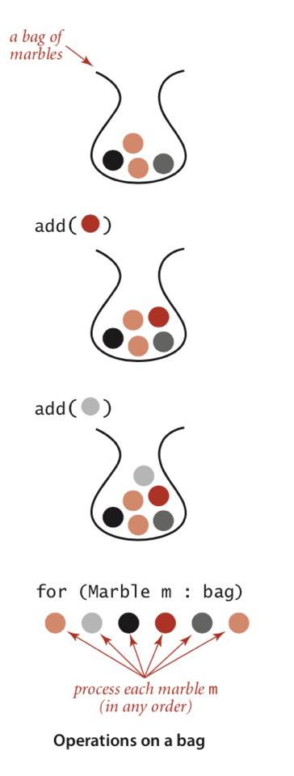
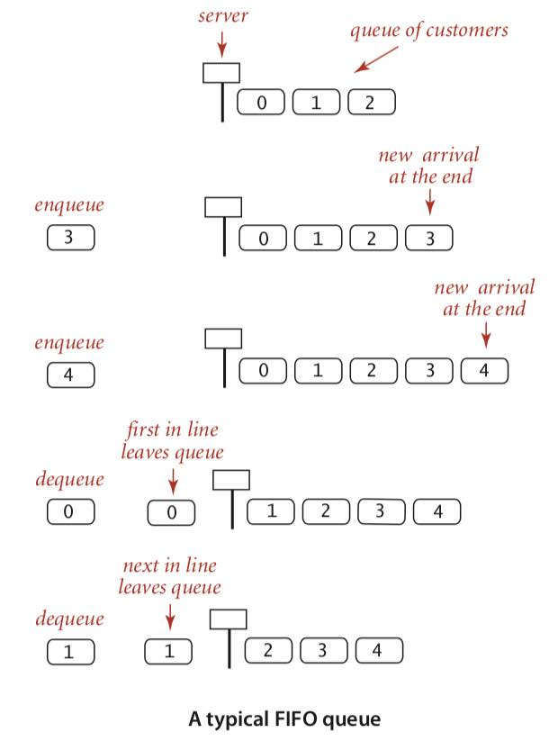
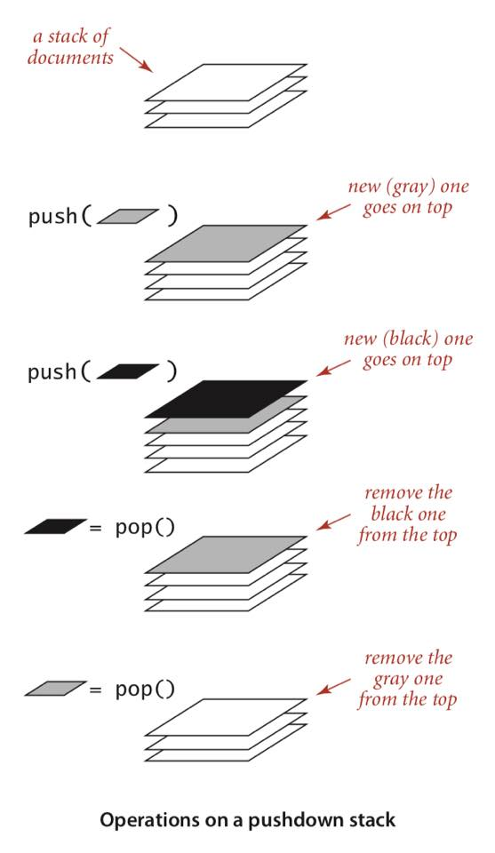

# Algorithms and Data Structures

## Table of Contents
- [Bags, Queues, and Stacks](#bags-queues-and-stacks)

## Fundamentals

### Bags, Queues, and Stacks
- abstract data types that are used as collections

#### APIs

**Bag**

```
public class Bag<Item> implements Iterable<Item>
        Bag()               // create an empty bag
   void add(Item item)      // add an item
boolean isEmpty()           // is the bag empty?
    int size()              // number of items in the bag
```

**FIFO queue**

```
public class Queue<Item> implemens Iterable<Item>
        Queue()             // create an empty queue
   void enqueue(Item item)  // add an item
   Item dequeue()           // remove the least recently added item
boolean isEmpty()           // is the bag empty?
    int size()              // number of items in the bag
```

**Pushdown LIFO stack**

```
public class Stack<Item> implemens Iterable<Item>
        Queue()             // create an empty queue
   void enqueue(Item item)  // add an item
   Item dequeue()           // remove the least recently added item
boolean isEmpty()           // is the bag empty?
    int size()  
```

##### Generics
- collection ADTs can be used for any data type
- `<Item>` is a type parameter, a placeholder for a reference to a data type such as String, Date, or Integer

##### Autoboxing and Unboxing
- Java has special mechanisms to allow generic code to be used with primitive types
- Java wrapper types are reference types that correspond to primitive types (Boolean vs boolean)
- Java automatically converts between reference types and their correponding primitive types
- **autoboxing** - automatically casting primitive type to wrapper type
- **unboxing** - automatically casting wrapper type to primitive type

```
Stack<Integer> stack = new Stack<Integer>();
stack.push(17) // autoboxing int to Integer
int i = stack.pop(); // unboxing Integer to int
```

##### Iterable Collections
- clients requirements involving processing items or iterating thought them
- therefore, we need clear and compact code that is not dependent on the collection's implementation
- the **foreach** statement below does not know anything about the collection's implementation 

```
for(Transaction t : collection)
{   StdOut.println(t)   }
```

##### Bags
- a bag is a collection where removing items is not supported
- its purpose is to allow clients to collect item and iterate through them
- the order of iteration is unspecified
- think of a marble collector that puts marbles in a bag in no particular order but might want to process them by colour



##### FIFO queues
- a FIFO queue is a collection based on the first-in-first-out policy
- doing tasks in the same order that the arrive, thereby allowing us to preserve relative order



##### Pushdown stacks
- a stack is a collection based on the last-in-first-out policy
- think of a stack of plates, the most recently placed plate will be the first one to be used



##### Arithmetic expression evaluation

```
( 1 + ( ( 2 + 3 ) * ( 4 * 5 ) ) )
```

- an arithmetic expression is either a number, or a left parenthesis followed by an arithmetic expression followed by an arithmetic operator followed by another arithmetic expression follwed by a right parenthesis
- this recursive definition holds for fully parenthesized arithmetic expressions
- a simple algorithm developed by E.W. Dijkstra uses 2 stacks (one for operands and one for operators)
- proceeding left to right, there are 4 possible cases
    - push operands onto operand stack
    - push operators onto operator stack
    - ignore left parenthesis
    - on encountering a right parenthesis, pop an operator, pop the requisite number of operands, and push onto the operanf stack the result of applying that operator to those operands

#### Implementing collections

##### Fixed-capacity stack
- representation is an array of generic values
- need to specify capacity
- array a[] holds items in the stack and integer N counts number of items in stack
- to remove, decrement N and return a[N]
- to insert, set a[N] equal to new item and increment N

```
public class FixedCapcityStack<Item>

a = (Item[]) new Object[cap]; // casting Object to Item
```

##### Array Resizing
- in Java, we can't change the size of an array so the stack always uses space proportional to max
- risking overflow
- we rewrite ```push()```  and ```pop()``` to test if the stack is too small or too big and add ```resize()``` to change size
- push() doubles the max once the current max is reached and pop() halves size once array is 1/4 full

##### Loitering
- garbage collection policy is to reclaim memory associated with objects that can no longer be accesed
- in pop(), references to pooped items become orphans since they can't be accessed
- java has no way of knowing this and we call this loitering
- we avoid this by setting popped items to null so they do not take up space

```
private void resize(int max) { 
    // Move stack of size N <= max to a new array of size max
    Item[] temp = (Item[]) new Object[max];
    for (int i = 0; i < N; i++)
        temp[i] = a[i];
    a = temp;
}

public void push(String item) {
    // Add item to the top of the stack
    if (N == a.length) resize(2*a.length);
    a[N++] = item;
}

public String pop() {
    // Remove itme from top of stack
    String item = a[--N];
    a[N] = null; // Avoid loitering
    if (N > 0 && N == a.length/4) resize(a.length/2);
    return item;
}
```

##### Iteration
